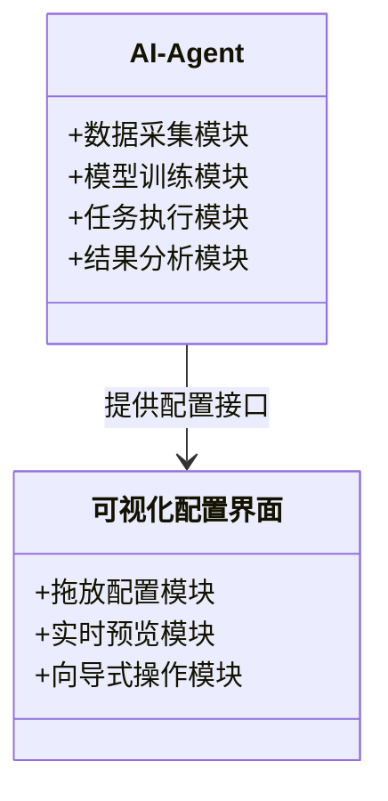
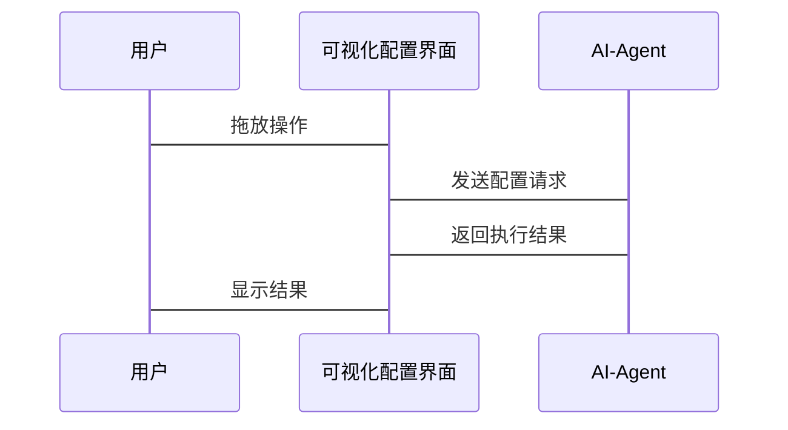

                 


# 企业AI Agent的可视化配置界面：降低使用门槛

## 关键词：企业AI Agent，可视化配置界面，降低使用门槛，技术实现，用户交互，系统架构，项目实战

## 摘要：  
随着人工智能技术的快速发展，企业AI Agent的应用越来越广泛。然而，复杂的配置过程和技术门槛限制了其在企业中的普及。本文通过分析企业AI Agent的可视化配置界面的设计与实现，探讨如何降低使用门槛，提升用户体验。文章从背景介绍、核心概念、算法原理、系统架构、项目实战等多个方面展开，结合具体案例和代码实现，为企业AI Agent的可视化配置提供全面的技术解析。

---

## 第1章：问题背景与需求分析

### 1.1 问题背景

#### 1.1.1 传统AI Agent的使用门槛
传统AI Agent的配置过程通常需要较高的技术背景，涉及复杂的参数设置、算法调优和代码编写，这对企业用户来说是一个巨大的挑战。

#### 1.1.2 企业用户的技术能力限制
大多数企业用户对AI技术的了解有限，缺乏专业的技术团队，难以独立完成AI Agent的配置和部署。

#### 1.1.3 可视化配置界面的必要性
可视化配置界面通过图形化操作和友好的交互设计，降低了技术门槛，使企业用户能够轻松完成AI Agent的配置。

### 1.2 问题描述

#### 1.2.1 AI Agent配置的复杂性
AI Agent的配置涉及多步骤的参数调整和算法选择，需要用户具备一定的技术知识。

#### 1.2.2 企业用户对技术细节的不熟悉
企业用户通常缺乏技术背景，无法理解复杂的配置流程，导致AI Agent的使用效率低下。

#### 1.2.3 现有解决方案的不足
现有的AI Agent配置工具多为命令行或代码形式，难以满足企业用户的直观操作需求。

### 1.3 问题解决思路

#### 1.3.1 可视化配置的核心理念
通过图形化界面和拖放操作，简化配置流程，降低技术门槛。

#### 1.3.2 界面设计的目标与原则
设计直观、易用的界面，确保用户能够快速上手，同时提供足够的灵活性以满足不同需求。

#### 1.3.3 降低使用门槛的具体措施
通过向导式操作、实时反馈和预设模板等方式，减少用户的学习成本。

### 1.4 问题的边界与外延

#### 1.4.1 可视化配置的适用范围
适用于企业用户，尤其是缺乏技术背景的用户，同时也能满足技术人员的高级配置需求。

#### 1.4.2 与其他技术的界限
可视化配置界面与传统的命令行配置工具在功能上存在交集，但在使用方式上形成互补。

#### 1.4.3 未来发展的可能性
随着技术的进步，可视化配置界面将更加智能化和自动化，进一步降低用户的使用门槛。

### 1.5 概念结构与核心要素

#### 1.5.1 可视化配置的核心要素
- 图形化的操作界面
- 拖放式配置功能
- 实时反馈与预览
- 预设模板与向导式操作

#### 1.5.2 AI Agent的主要功能模块
- 数据采集与处理
- 模型训练与部署
- 任务调度与执行
- 结果分析与反馈

#### 1.5.3 界面设计的关键因素
- 用户体验（UX）设计
- 可视化元素的选择与布局
- 交互逻辑的优化

---

## 第2章：核心概念与联系

### 2.1 AI Agent的核心概念

#### 2.1.1 AI Agent的基本定义
AI Agent是一种能够感知环境、自主决策并执行任务的智能实体，广泛应用于自动化处理、数据分析等领域。

#### 2.1.2 AI Agent的主要功能
- 数据处理与分析
- 任务执行与反馈
- 自适应与优化

#### 2.1.3 AI Agent的分类与特点
- 分为基于规则的AI Agent和基于模型的AI Agent
- 具有自主性、反应性、目标性等特点

### 2.2 可视化配置界面的核心概念

#### 2.2.1 可视化配置的基本原理
通过图形化界面和交互操作，将复杂的配置过程转化为简单的拖放和点击操作。

#### 2.2.2 界面设计的关键要素
- 可视化元素的设计
- 交互逻辑的实现
- 用户反馈与实时预览

#### 2.2.3 用户交互的核心流程
- 用户输入操作
- 系统解析并执行
- 系统反馈结果

### 2.3 核心概念的联系与对比

#### 2.3.1 AI Agent与可视化配置界面的关系
可视化配置界面是AI Agent与用户交互的桥梁，通过界面实现AI Agent的配置与控制。

#### 2.3.2 不同配置方式的对比分析
| 配置方式 | 优点 | 缺点 |
|----------|------|------|
| 命令行配置 | 灵活性高 | 学习成本高 |
| 图形化配置 | 易用性强 | 功能相对受限 |

#### 2.3.3 可视化配置的优势与劣势
- 优势：降低使用门槛，提升用户体验。
- 劣势：功能相对简化，难以满足复杂需求。

---

## 第3章：核心概念的原理与实现

### 3.1 AI Agent的核心算法原理

#### 3.1.1 AI Agent的基本算法
AI Agent的核心算法包括决策树、支持向量机（SVM）、神经网络等，这些算法用于实现数据处理和任务执行。

#### 3.1.2 算法的实现流程
1. 数据采集与预处理
2. 模型训练与优化
3. 任务执行与反馈

#### 3.1.3 算法的优化与改进
通过参数调优、模型压缩等方法，提升算法的性能和效率。

### 3.2 可视化配置界面的实现原理

#### 3.2.1 界面设计的基本原理
- 使用图形库（如Tkinter、QT）构建界面
- 通过事件驱动实现用户交互

#### 3.2.2 用户交互的核心机制
- 拖放操作
- 点击事件
- 实时反馈

#### 3.2.3 界面功能的实现流程
1. 用户操作触发事件
2. 系统解析操作并执行
3. 系统反馈结果

### 3.3 核心概念的数学模型与公式

#### 3.3.1 AI Agent的决策树模型
决策树是一种常用的分类和回归算法，其数学模型如下：
$$
决策树 = \text{基于特征的分裂规则构建树结构}
$$

#### 3.3.2 可视化配置的交互模型
交互模型描述了用户与界面之间的操作流程：
$$
用户输入 \rightarrow 系统解析 \rightarrow 系统执行 \rightarrow 系统反馈
$$

---

## 第4章：系统分析与架构设计

### 4.1 项目场景介绍

#### 4.1.1 项目背景
一个企业级的AI Agent系统，需要通过可视化配置界面实现任务调度和执行。

#### 4.1.2 项目目标
降低AI Agent的使用门槛，提升用户体验，实现高效的配置与管理。

### 4.2 系统功能设计

#### 4.2.1 领域模型（Mermaid类图）


#### 4.2.2 系统架构设计（Mermaid架构图）
```mermaid
client --> 可视化配置界面
可视化配置界面 --> AI-Agent
AI-Agent --> 数据源
AI-Agent --> 执行引擎
```

### 4.3 系统接口设计

#### 4.3.1 系统接口描述
- 用户通过可视化界面进行操作
- 系统通过API与AI-Agent交互

#### 4.3.2 系统交互（Mermaid序列图）


---

## 第5章：项目实战

### 5.1 环境安装

#### 5.1.1 系统要求
- Python 3.8+
- 安装必要的库（如Flask、Dash）

#### 5.1.2 安装步骤
```bash
pip install flask dash plotly
```

### 5.2 系统核心实现源代码

#### 5.2.1 可视化配置界面的实现
```python
import dash
from dash import dcc, html, Input, Output

app = dash.Dash(__name__)

app.layout = html.Div([
    html.H1("AI Agent可视化配置界面"),
    dcc.Dropdown(
        id='config-type',
        options=[
            {'label': '数据处理', 'value': 'data'},
            {'label': '任务调度', 'value': 'task'}
        ],
        placeholder="请选择配置类型"
    ),
    html.Div(id='output')
])

@app.callback(
    Output('output', 'children'),
    Input('config-type', 'value')
)
def update_output(config_type):
    if config_type == 'data':
        return "数据处理配置已选择"
    elif config_type == 'task':
        return "任务调度配置已选择"
    else:
        return "请先选择配置类型"

if __name__ == '__main__':
    app.run_server(debug=True)
```

#### 5.2.2 AI Agent的核心算法实现
```python
import numpy as np
from sklearn.tree import DecisionTreeClassifier

# 示例数据
X = np.array([[2, 3], [5, 6]])
y = np.array([0, 1])

# 训练决策树模型
model = DecisionTreeClassifier()
model.fit(X, y)

# 预测新数据
new_data = np.array([[4, 5]])
prediction = model.predict(new_data)
print("预测结果:", prediction)
```

### 5.3 案例分析与详细讲解

#### 5.3.1 案例分析
通过可视化配置界面，用户可以轻松选择配置类型（如数据处理或任务调度），系统根据选择执行相应的操作。

#### 5.3.2 实际应用
以数据处理为例，用户通过拖放操作选择数据源和目标字段，系统自动生成数据处理逻辑并执行。

### 5.4 项目小结

#### 5.4.1 核心实现总结
可视化配置界面通过友好的交互设计，简化了AI Agent的配置过程。

#### 5.4.2 成功经验总结
- 使用图形化界面降低技术门槛
- 提供实时反馈提升用户体验
- 通过向导式操作减少用户学习成本

---

## 第6章：最佳实践与总结

### 6.1 小结

#### 6.1.1 核心内容回顾
本文详细介绍了企业AI Agent可视化配置界面的设计与实现，探讨了如何通过图形化界面降低使用门槛。

#### 6.1.2 关键技术总结
- 可视化配置界面的设计原则
- AI Agent的核心算法与实现
- 系统架构与交互设计

### 6.2 注意事项

#### 6.2.1 使用可视化配置界面时的注意事项
- 确保界面设计简洁直观
- 提供足够的实时反馈
- 支持多种配置方式（可视化与代码结合）

#### 6.2.2 技术实现中的注意事项
- 优化算法性能
- 提升系统的稳定性
- 加强系统的可扩展性

### 6.3 拓展阅读

#### 6.3.1 推荐书籍
- 《Python机器学习实战》
- 《用户为中心的设计》

#### 6.3.2 推荐博客与资源
- Towards Data Science
- Medium上的AI相关文章

---

## 总结

企业AI Agent的可视化配置界面通过降低技术门槛，使企业用户能够轻松完成配置与管理。本文从背景、概念、算法、系统架构、项目实战等多个方面进行了详细探讨，为企业AI Agent的可视化配置提供了全面的技术解析。未来，随着技术的进一步发展，可视化配置界面将更加智能化和自动化，为企业用户提供更加便捷的使用体验。

