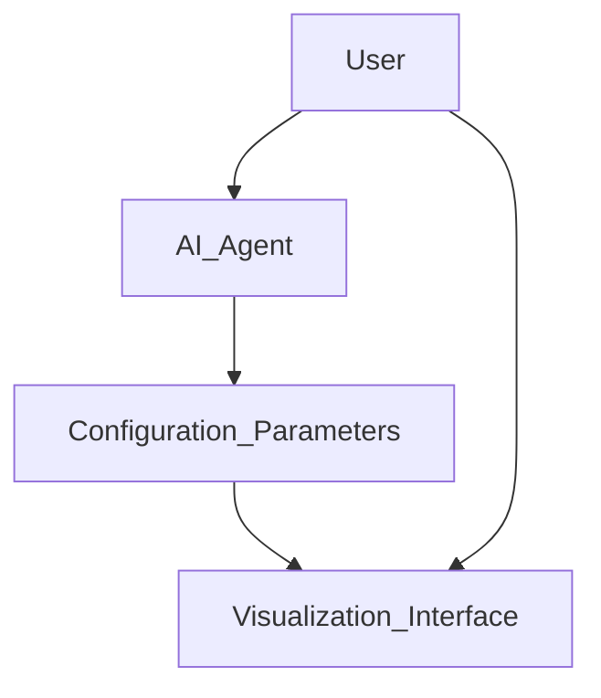
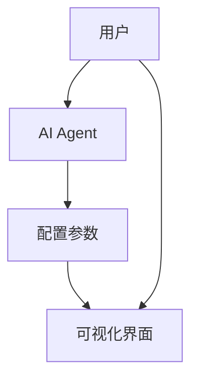
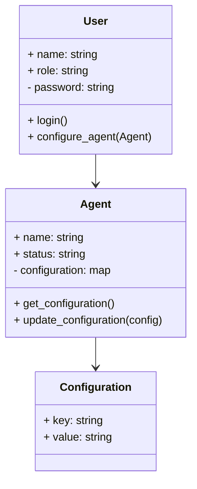
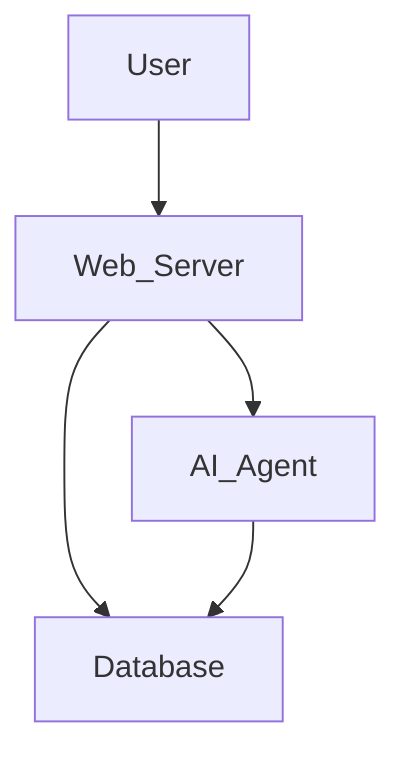
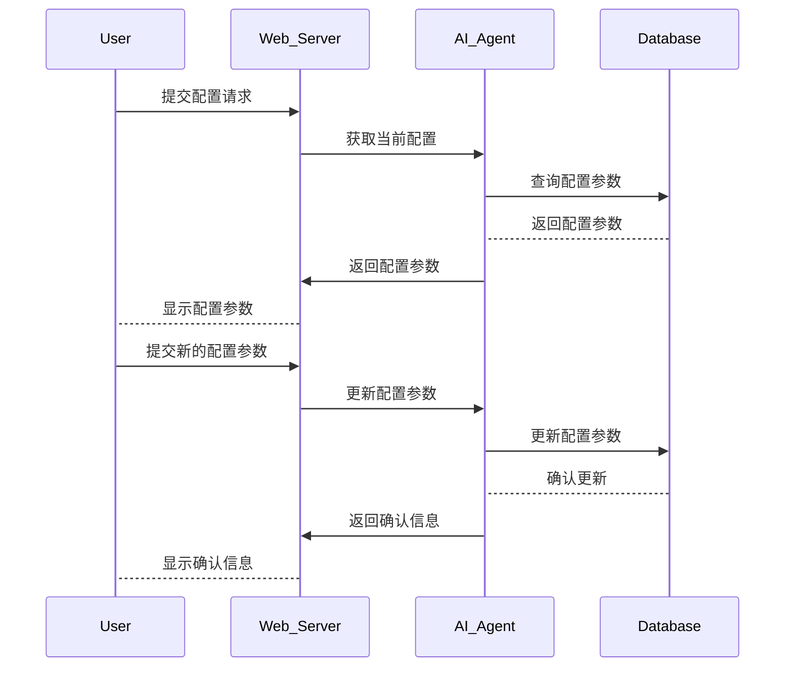

                 


# 企业AI Agent的可视化配置界面：降低技术门槛

## 关键词：企业AI Agent、可视化配置界面、技术门槛、系统架构、用户交互

## 摘要：本文深入探讨了企业AI Agent的可视化配置界面设计，通过分析其背景、核心概念、算法原理、系统架构以及项目实战，详细阐述了如何通过可视化界面降低技术门槛，使非技术人员也能轻松配置和管理AI Agent。文章结合理论与实践，提供了丰富的图表和代码示例，帮助读者全面理解并掌握相关技术。

---

# 第一部分: 企业AI Agent的背景与概念

## 第1章: 企业AI Agent的背景与概念

### 1.1 问题背景

#### 1.1.1 AI Agent的定义与特点
AI Agent（人工智能代理）是指能够感知环境、自主决策并执行任务的智能体。它通常具备以下特点：
- **自主性**：能够独立运作，无需人工干预。
- **反应性**：能够实时感知环境并做出响应。
- **目标导向**：以实现特定目标为导向执行任务。
- **学习能力**：能够通过数据和经验优化自身行为。

#### 1.1.2 可视化配置界面的必要性
随着AI技术的普及，企业对AI Agent的需求日益增加。然而，AI Agent的配置和管理通常需要较高的技术门槛，非技术人员难以直接操作。可视化配置界面的引入，能够将复杂的配置过程简化为图形化的操作，降低技术门槛，使企业能够更广泛地应用AI技术。

#### 1.1.3 企业级应用中的技术门槛
企业在引入AI Agent时，通常面临以下技术门槛：
- **复杂性**：AI Agent的配置涉及多个参数和模块，非技术人员难以掌握。
- **学习曲线**：传统命令行或脚本配置方式需要较高的编程能力。
- **维护成本**：复杂的配置过程可能导致误操作，增加维护成本。

### 1.2 问题描述

#### 1.2.1 AI Agent在企业中的应用场景
AI Agent在企业中的应用场景广泛，包括：
- **自动化任务处理**：如自动回复客户咨询、自动处理订单等。
- **数据分析与决策支持**：通过分析数据为企业提供决策支持。
- **流程优化**：通过自动化流程提高企业效率。

#### 1.2.2 可视化配置界面的需求分析
企业在引入AI Agent时，通常需要：
- **直观的配置界面**：方便非技术人员进行配置。
- **实时反馈**：配置过程中的错误提示和结果反馈。
- **可扩展性**：支持不同场景和复杂度的配置需求。

#### 1.2.3 技术门槛对企业的影响
技术门槛的高低直接影响企业引入AI Agent的难度。高技术门槛可能导致以下问题：
- **引入成本高**：需要大量技术人才进行配置和维护。
- **效率低下**：复杂的配置过程可能导致效率下降。
- **限制应用范围**：仅限于技术团队能够处理的任务。

### 1.3 问题解决

#### 1.3.1 可视化配置界面的核心作用
可视化配置界面通过将复杂的配置过程简化为图形化的操作，降低了技术门槛。其核心作用包括：
- **简化操作**：通过图形化操作，使非技术人员能够轻松配置AI Agent。
- **提高效率**：减少配置错误，提高配置效率。
- **扩展应用**：使企业能够更广泛地应用AI Agent技术。

#### 1.3.2 降低技术门槛的实现路径
降低技术门槛的实现路径包括：
- **图形化界面设计**：将复杂的配置过程可视化。
- **模块化设计**：将AI Agent的功能模块化，便于配置和管理。
- **智能化提示**：通过智能化提示减少配置错误。

#### 1.3.3 企业AI Agent的未来发展
随着技术的进步，企业AI Agent的可视化配置界面将更加智能化和用户友好。未来的发展趋势包括：
- **智能化配置**：AI Agent能够根据需求自动优化配置。
- **多平台支持**：支持多种设备和平台的配置需求。
- **协作式配置**：支持多人协作配置，提高配置效率。

### 1.4 边界与外延

#### 1.4.1 可视化配置界面的边界
可视化配置界面的边界包括：
- **输入范围**：仅支持图形化输入，不支持命令行或其他非图形化输入。
- **功能范围**：仅限于配置和管理AI Agent，不涉及其他功能。

#### 1.4.2 企业AI Agent的外延
企业AI Agent的外延包括：
- **扩展功能**：如数据采集、存储和分析。
- **应用场景**：如客户关系管理、供应链管理等。

#### 1.4.3 技术与业务的平衡点
在设计可视化配置界面时，需要在技术实现和业务需求之间找到平衡点。过于复杂的技术实现可能增加配置难度，而过于简化的技术实现可能无法满足复杂业务需求。

### 1.5 概念结构与核心要素

#### 1.5.1 核心概念的层次结构
AI Agent的可视化配置界面的层次结构包括：
- **用户**：操作界面的最终使用者。
- **AI Agent**：核心智能体，负责执行任务。
- **配置参数**：用于定义AI Agent的行为和功能。
- **可视化界面**：用户与AI Agent之间的交互界面。

#### 1.5.2 核心要素的对比分析
| 核心要素 | 描述 |
|----------|------|
| 用户     | 操作界面的最终使用者，通常是非技术人员。 |
| AI Agent | 负责执行任务的核心智能体。 |
| 配置参数 | 用于定义AI Agent的行为和功能的参数。 |
| 可视化界面 | 用户与AI Agent之间的交互界面。 |

#### 1.5.3 概念结构的可视化展示



---

## 第2章: 可视化配置界面的核心概念与联系

### 2.1 核心概念原理

#### 2.1.1 AI Agent的工作原理
AI Agent通过感知环境、分析数据并做出决策来执行任务。其工作原理包括：
- **感知环境**：通过传感器或数据接口获取环境信息。
- **分析数据**：利用算法对数据进行分析和处理。
- **做出决策**：基于分析结果做出决策。
- **执行任务**：根据决策执行相应的任务。

#### 2.1.2 可视化配置界面的设计原则
可视化配置界面的设计原则包括：
- **直观性**：界面设计要直观，易于理解和操作。
- **一致性**：界面元素的设计要保持一致性，避免用户混淆。
- **反馈性**：配置过程要有实时反馈，帮助用户了解配置结果。

#### 2.1.3 用户与系统交互的逻辑
用户与系统交互的逻辑包括：
- **用户输入**：用户通过可视化界面输入配置需求。
- **系统处理**：系统根据用户输入生成配置参数。
- **结果反馈**：系统将配置结果反馈给用户。

### 2.2 概念属性特征对比

| 概念    | 描述 |
|---------|------|
| 用户    | 操作界面的最终使用者，通常是非技术人员。 |
| AI Agent | 负责执行任务的核心智能体。 |
| 配置参数 | 用于定义AI Agent的行为和功能的参数。 |
| 可视化界面 | 用户与AI Agent之间的交互界面。 |

### 2.3 ER实体关系图架构



---

## 第3章: AI Agent的算法原理与数学模型

### 3.1 算法原理讲解

#### 3.1.1 AI Agent的算法流程
AI Agent的算法流程包括：
1. **数据采集**：通过传感器或数据接口获取环境信息。
2. **特征提取**：对数据进行特征提取，提取有用的信息。
3. **模型推理**：利用模型对特征进行分析和推理。
4. **决策制定**：根据推理结果制定决策。
5. **任务执行**：根据决策执行相应的任务。

#### 3.1.2 可视化配置界面的算法实现
可视化配置界面的算法实现包括：
- **用户输入处理**：将用户的图形化操作转换为配置参数。
- **参数优化**：根据用户输入优化配置参数，提高AI Agent的性能。

### 3.2 算法实现代码

#### 3.2.1 数据采集与特征提取
```python
def extract_features(data):
    # 提取特征
    features = []
    for item in data:
        # 特征提取逻辑
        features.append(item['feature'])
    return features
```

#### 3.2.2 模型推理与决策制定
```python
def model_inference(features):
    # 模型推理逻辑
    result = model.predict(features)
    return result
```

### 3.3 数学模型与公式

#### 3.3.1 概率计算公式
$$ P(A|B) = \frac{P(B|A)P(A)}{P(B)} $$

#### 3.3.2 优化算法公式
$$ \theta = \theta - \alpha \cdot \frac{\partial L}{\partial \theta} $$

---

## 第4章: 系统分析与架构设计方案

### 4.1 问题场景介绍
在企业中，AI Agent的可视化配置界面需要满足以下需求：
- **用户友好**：界面设计要直观，易于操作。
- **实时反馈**：配置过程要有实时反馈，减少误操作。
- **可扩展性**：支持不同场景和复杂度的配置需求。

### 4.2 项目介绍
本项目旨在设计一个企业AI Agent的可视化配置界面，通过图形化操作降低技术门槛，使非技术人员能够轻松配置和管理AI Agent。

### 4.3 系统功能设计

#### 4.3.1 领域模型类图


#### 4.3.2 系统架构设计


#### 4.3.3 系统接口设计
- **用户接口**：可视化配置界面。
- **系统接口**：AI Agent与系统之间的交互接口。
- **数据库接口**：系统与数据库之间的交互接口。

#### 4.3.4 系统交互流程


---

## 第5章: 项目实战

### 5.1 环境安装

#### 5.1.1 安装Python
```bash
python --version
pip install --upgrade pip
```

#### 5.1.2 安装依赖库
```bash
pip install flask
pip install numpy
pip install scikit-learn
```

### 5.2 核心代码实现

#### 5.2.1 后端代码
```python
from flask import Flask, request, jsonify
import numpy as np
from sklearn import svm

app = Flask(__name__)
model = svm.SVC()

@app.route('/configure', methods=['POST'])
def configure_agent():
    data = request.json
    # 提取特征
    features = np.array(data['features'])
    # 模型训练
    model.fit(features, data['labels'])
    return jsonify({'status': 'success', 'message': '配置成功'})

if __name__ == '__main__':
    app.run(debug=True)
```

#### 5.2.2 前端代码
```html
<!DOCTYPE html>
<html>
<head>
    <title>AI Agent Configuration</title>
</head>
<body>
    <h1>AI Agent Configuration Interface</h1>
    <div id="configuration-form">
        <label for="features">Features:</label>
        <input type="text" id="features" placeholder="Enter features">
        <label for="labels">Labels:</label>
        <input type="text" id="labels" placeholder="Enter labels">
        <button onclick="submitConfiguration()">Submit</button>
    </div>
    <div id="result"></div>

    <script>
        function submitConfiguration() {
            const features = document.getElementById('features').value;
            const labels = document.getElementById('labels').value;
            const data = {
                features: features.split(','),
                labels: labels.split(',')
            };
            fetch('/configure', {
                method: 'POST',
                headers: {
                    'Content-Type': 'application/json'
                },
                body: JSON.stringify(data)
            })
            .then(response => response.json())
            .then(result => {
                document.getElementById('result').innerHTML = result.message;
            });
        }
    </script>
</body>
</html>
```

### 5.3 案例分析与详细讲解

#### 5.3.1 案例分析
假设我们有一个客户关系管理（CRM）系统，需要通过AI Agent自动分类客户邮件。通过可视化配置界面，用户可以轻松配置AI Agent的分类规则，而无需编写任何代码。

#### 5.3.2 代码应用解读与分析
- **后端代码**：使用Flask框架搭建了一个简单的Web服务器，接收前端提交的配置参数，并利用SVM模型进行训练。
- **前端代码**：设计了一个简单的HTML页面，用户可以通过填写特征和标签进行配置。

### 5.4 项目小结

#### 5.4.1 最佳实践
- **模块化设计**：将功能模块化，便于扩展和维护。
- **实时反馈**：配置过程中提供实时反馈，减少误操作。
- **文档支持**：提供详细的使用文档，帮助用户更好地使用可视化配置界面。

#### 5.4.2 注意事项
- **安全性**：确保配置界面的安全性，防止恶意攻击。
- **兼容性**：确保配置界面在不同设备和浏览器上兼容。
- **性能优化**：优化配置过程的性能，减少响应时间。

#### 5.4.3 拓展阅读
- **Flask框架**：深入学习Flask框架的使用。
- **SVM模型**：学习SVM模型的原理和应用。
- **可视化工具**：学习其他可视化工具的使用，如D3.js。

---

## 第6章: 总结与展望

### 6.1 总结
本文深入探讨了企业AI Agent的可视化配置界面设计，通过分析其背景、核心概念、算法原理、系统架构以及项目实战，详细阐述了如何通过可视化界面降低技术门槛，使非技术人员也能轻松配置和管理AI Agent。文章结合理论与实践，提供了丰富的图表和代码示例，帮助读者全面理解并掌握相关技术。

### 6.2 展望
随着技术的进步，企业AI Agent的可视化配置界面将更加智能化和用户友好。未来的发展趋势包括：
- **智能化配置**：AI Agent能够根据需求自动优化配置。
- **多平台支持**：支持多种设备和平台的配置需求。
- **协作式配置**：支持多人协作配置，提高配置效率。

通过不断的技术创新和实践积累，企业AI Agent的可视化配置界面将在未来发挥更大的作用，为企业带来更大的价值。

