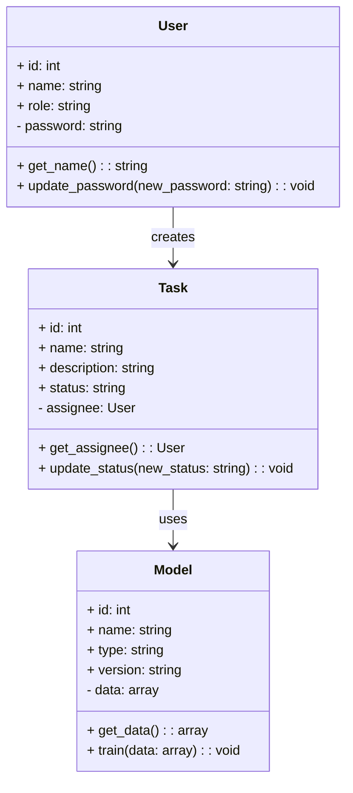

                 


# 企业AI Agent的可解释性设计

> 关键词：AI Agent、可解释性、企业应用、系统架构、算法原理

> 摘要：本文深入探讨了企业AI Agent的可解释性设计，从基本概念、理论基础、算法原理到系统架构和项目实战，全面分析了如何在企业级AI系统中实现可解释性设计，确保AI决策的透明性和可理解性，满足企业对AI系统的信任和合规需求。

---

# 第一部分: 企业AI Agent的可解释性设计概述

## 第1章: 企业AI Agent与可解释性概述

### 1.1 企业AI Agent的基本概念

#### 1.1.1 什么是AI Agent

AI Agent（人工智能代理）是指能够感知环境、自主决策并采取行动以实现目标的智能实体。在企业场景中，AI Agent通常被设计为能够处理复杂任务、优化业务流程、提供决策支持或自动化操作的智能系统。

- **感知环境**：AI Agent通过传感器、API或其他数据源获取环境信息。
- **自主决策**：基于获取的信息，AI Agent利用算法和模型进行分析，生成决策。
- **采取行动**：根据决策结果，AI Agent执行相应的操作，例如触发API调用、生成报告或发送通知。

#### 1.1.2 企业AI Agent的定义与特点

在企业环境中，AI Agent通常具有以下特点：

1. **业务目标驱动**：AI Agent的设计围绕企业的核心业务目标展开，例如成本优化、效率提升或客户满意度。
2. **多任务处理**：企业AI Agent通常需要处理多个复杂任务，例如数据分析、决策支持、自动化操作等。
3. **实时性要求高**：许多企业AI Agent需要在实时环境中运行，对响应速度和准确性要求较高。
4. **可解释性需求**：由于涉及企业决策，AI Agent的决策过程需要可解释，以便业务人员能够理解和信任系统。

#### 1.1.3 可解释性在企业AI Agent中的重要性

在企业环境中，AI Agent的决策直接影响业务结果，因此可解释性至关重要：

- **信任与合规**：企业需要信任AI Agent的决策，确保其符合行业规范和法律法规。
- **问题排查**：当AI Agent的决策出现错误时，可解释性能够帮助开发人员快速定位问题。
- **用户交互**：与用户交互的AI Agent需要能够解释其决策过程，以便用户理解并做出相应反馈。

---

### 1.2 可解释性AI的背景与挑战

#### 1.2.1 可解释性AI的定义

可解释性AI（Explainable AI，XAI）是指AI系统能够以人类可理解的方式解释其决策过程和结果。可解释性是确保AI系统透明性和可信性的关键因素。

#### 1.2.2 企业AI应用中的可解释性需求

在企业AI应用中，可解释性需求主要体现在以下几个方面：

1. **业务决策支持**：AI Agent的决策需要能够被业务人员理解和信任，以便做出正确的业务决策。
2. **风险管理**：可解释性有助于识别和管理AI系统中的潜在风险，确保系统在可控范围内运行。
3. **合规性要求**：许多行业对AI系统的决策过程有严格的合规要求，可解释性是满足这些要求的关键。

#### 1.2.3 当前AI可解释性面临的挑战

当前，AI可解释性面临以下主要挑战：

1. **复杂模型的解释性**：深度学习模型（如神经网络）通常被视为“黑箱”，难以解释其决策过程。
2. **数据复杂性**：企业环境中数据往往复杂且多样化，增加了解释的难度。
3. **用户认知差异**：不同用户对解释的需求和理解能力不同，如何提供适合不同用户的解释是一个挑战。

---

### 1.3 本章小结

本章从企业AI Agent的基本概念出发，介绍了其在企业环境中的特点和可解释性的重要性。同时，分析了当前可解释性AI面临的挑战，为后续章节的深入探讨奠定了基础。

---

# 第二部分: 可解释性设计的核心概念与原理

## 第2章: 可解释性设计的核心原理

### 2.1 可解释性设计的理论基础

#### 2.1.1 解释性模型的分类

可解释性模型可以分为以下几类：

1. **线性模型**：如线性回归、逻辑回归，具有较强的可解释性。
2. **树模型**：如决策树、随机森林，可以通过特征重要性和路径解释进行解释。
3. **解释性增强模型**：如SHAP（Shapley Additive exPlanations）值，用于解释复杂模型的决策过程。

#### 2.1.2 可解释性设计的关键特征

可解释性设计的关键特征包括：

1. **透明性**：系统决策过程必须透明，用户能够理解其背后的逻辑。
2. **可追溯性**：能够追溯决策的来源和依据。
3. **可验证性**：决策结果可以通过外部数据进行验证。

#### 2.1.3 可解释性设计的数学基础

可解释性设计的数学基础主要包括以下几个方面：

1. **线性代数**：用于线性模型的解释。
2. **概率论**：用于不确定性分析和风险评估。
3. **图论**：用于模型的结构分析和关系表示。

---

### 2.2 可解释性设计的核心要素

#### 2.2.1 模型解释性

模型解释性是指模型能够以人类可理解的方式解释其决策过程。例如，线性回归模型可以通过系数大小解释特征对结果的影响。

#### 2.2.2 特征重要性

特征重要性是指在模型中各个特征对最终决策的贡献程度。通过特征重要性分析，可以确定哪些特征对模型的决策影响最大。

#### 2.2.3 决策过程透明性

决策过程透明性是指模型的决策过程必须清晰，用户能够理解每个决策背后的逻辑和依据。

---

### 2.3 可解释性设计的数学模型

#### 2.3.1 解释性模型的数学表达

以线性回归模型为例，其数学表达式为：

$$ y = \beta_0 + \beta_1x_1 + \beta_2x_2 + \ldots + \beta_nx_n + \epsilon $$

其中，$\beta_i$表示各特征$x_i$的系数，$\epsilon$为误差项。通过系数的大小可以判断各特征对结果的影响程度。

#### 2.3.2 解释性指标的计算公式

以SHAP值为例，其计算公式为：

$$ SHAP_{i,j} = \phi_i - \sum_{k \in S} \phi_{i,k} $$

其中，$\phi_i$表示特征$i$的SHAP值，$S$表示特征集合。

---

### 2.4 本章小结

本章从可解释性设计的理论基础出发，分析了其核心要素和数学模型，为后续章节的实现提供了理论支持。

---

# 第三部分: 可解释性设计的算法原理

## 第3章: 可解释性AI的核心算法

### 3.1 解释性模型的分类与对比

#### 3.1.1 线性模型

线性模型（如线性回归、逻辑回归）具有较强的可解释性，但其表达能力有限，适用于线性关系的数据。

#### 3.1.2 树模型

树模型（如决策树、随机森林）可以通过特征路径解释其决策过程，但解释性可能较为复杂。

#### 3.1.3 解释性增强模型

解释性增强模型（如SHAP、LIME）专门用于解释复杂模型的决策过程。

---

### 3.2 解释性算法的实现原理

#### 3.2.1 LIME算法

LIME（Local Interpretable Model-agnostic Explanations）是一种用于解释复杂模型的算法。其核心思想是通过局部近似来解释模型的决策过程。

LIME的实现步骤如下：

1. 对于给定的输入实例，生成多个扰动实例。
2. 对每个扰动实例，预测其结果。
3. 使用线性回归模型对扰动实例的预测结果进行拟合。
4. 返回线性回归模型的系数，解释原始实例的预测结果。

LIME的实现代码如下：

```python
import lime
from lime import lime_explainer

explainer = lime_explainer.LimeExplainer()
explanation = explainer.explain_model(model, instance, data)
```

#### 3.2.2 SHAP值

SHAP（Shapley Additive exPlanations）是一种基于博弈论的解释方法，能够量化每个特征对模型预测结果的贡献。

SHAP值的计算公式为：

$$ SHAP_{i,j} = \phi_i - \sum_{k \in S} \phi_{i,k} $$

SHAP值的实现代码如下：

```python
import shap

explainer = shap.Explainer(model)
shap_values = explainer.shap_values(X)
```

#### 3.2.3 特征重要性排序

特征重要性排序是通过模型训练过程中特征的重要性得分来排序特征，从而解释模型的决策过程。

特征重要性排序的实现代码如下：

```python
importances = model.feature_importances_
feature_importance = {feature: importances[i] for i, feature in enumerate(features)}
```

---

### 3.3 解释性算法的优缺点对比

下表对比了常见解释性算法的优缺点：

| 算法 | 优点 | 缺点 |
|------|------|------|
| LIME | 解释性好，适用于复杂模型 | 局部解释，无法全局解释 |
| SHAP | 全局解释，解释性全面 | 实现复杂，计算量大 |
| 特征重要性排序 | 全局解释，实现简单 | 无法解释单个预测的细节 |

---

### 3.4 本章小结

本章分析了可解释性AI的核心算法，包括LIME、SHAP和特征重要性排序，并对比了它们的优缺点，为后续章节的系统设计提供了算法支持。

---

# 第四部分: 可解释性设计的系统架构

## 第4章: 企业AI Agent的系统架构设计

### 4.1 系统功能设计

#### 4.1.1 领域模型设计

领域模型是企业AI Agent的核心，用于描述业务领域的核心概念及其关系。下图展示了领域模型的类图：



#### 4.1.2 功能模块划分

企业AI Agent的功能模块通常包括：

1. **数据采集模块**：负责数据的采集和预处理。
2. **模型训练模块**：负责模型的训练和优化。
3. **决策模块**：负责基于模型的决策过程。
4. **解释模块**：负责解释决策过程和结果。
5. **用户交互模块**：负责与用户进行交互。

---

### 4.2 系统架构设计

#### 4.2.1 分层架构设计

企业AI Agent的分层架构设计如下：


1. **界面层**：负责用户交互，接收输入并显示输出。
2. **中间层**：负责业务逻辑的处理和模型的调用。
3. **数据层**：负责数据的存储和管理。

#### 4.2.2 微服务架构设计

企业AI Agent的微服务架构设计如下：

```mermaid
serviceDiagram

    API Gateway
    User Service
    Task Service
    Model Service
    Database
```

1. **API Gateway**：负责接收外部请求，路由到相应的服务。
2. **User Service**：负责用户管理相关功能。
3. **Task Service**：负责任务管理相关功能。
4. **Model Service**：负责模型训练和解释相关功能。
5. **Database**：负责数据的存储和管理。

---

### 4.3 系统接口设计

#### 4.3.1 API设计规范

企业AI Agent的API设计规范如下：

- **RESTful API**：采用RESTful风格，支持GET、POST、PUT、DELETE等方法。
- **统一身份认证**：所有API接口需要进行身份认证和权限控制。
- **错误处理**：所有API接口需要返回统一的错误码和错误信息。

#### 4.3.2 接口交互流程

企业AI Agent的接口交互流程如下：

1. 用户通过API Gateway发送请求。
2. API Gateway进行身份认证和权限控制。
3. 请求路由到相应的服务（如User Service、Task Service、Model Service）。
4. 服务处理请求并返回结果。
5. 结果通过API Gateway返回给用户。

---

### 4.4 系统交互设计

#### 4.4.1 用户交互流程

用户交互流程如下：

1. 用户通过界面层提交请求。
2. 界面层将请求发送到中间层。
3. 中间层调用相应的服务进行处理。
4. 服务处理完成后，结果返回给中间层。
5. 中间层将结果传递给界面层，显示给用户。

#### 4.4.2 系统反馈机制

系统反馈机制如下：

1. 系统在处理请求过程中，实时更新反馈信息。
2. 反馈信息包括处理进度、错误提示等。
3. 用户可以通过反馈信息了解系统状态，并进行相应的操作。

---

### 4.5 本章小结

本章从系统架构的角度，详细设计了企业AI Agent的系统功能、架构和接口，为后续章节的项目实战提供了系统设计依据。

---

# 第五部分: 可解释性设计的项目实战

## 第5章: 企业AI Agent的可解释性设计实战

### 5.1 项目背景与目标

#### 5.1.1 项目背景介绍

本项目旨在设计一个具有可解释性的企业AI Agent，用于优化企业的业务流程。通过可解释性设计，确保AI Agent的决策过程透明、可理解，满足企业的信任和合规需求。

#### 5.1.2 可解释性设计目标

本项目的可解释性设计目标包括：

1. 实现AI Agent的决策过程可解释。
2. 提供用户友好的解释界面。
3. 确保解释的准确性和及时性。

---

### 5.2 项目环境与工具安装

#### 5.2.1 环境要求

- **操作系统**：Linux/Windows/MacOS
- **Python版本**：3.6及以上
- **内存要求**：8GB及以上
- **存储要求**：至少20GB可用空间

#### 5.2.2 工具安装

1. **安装Python依赖**：

```bash
pip install numpy pandas scikit-learn lime shap
```

2. **安装Jupyter Notebook**：

```bash
pip install jupyter
```

---

### 5.3 系统功能实现

#### 5.3.1 数据采集与预处理

```python
import pandas as pd

# 读取数据
data = pd.read_csv('data.csv')

# 数据预处理
data = data.dropna()
data = pd.get_dummies(data)
```

#### 5.3.2 模型训练与解释

```python
from sklearn.ensemble import RandomForestClassifier
import lime
from lime import lime_explainer

# 训练模型
model = RandomForestClassifier().fit(X_train, y_train)

# 初始化解释器
explainer = lime_explainer.LimeExplainer()

# 解释模型
explanation = explainer.explain_model(model, instance, X_test)
```

#### 5.3.3 系统交互与反馈

```python
def get_user_input():
    # 获取用户输入
    pass

def show_explanation(explanation):
    # 显示解释结果
    pass

# 用户交互
input = get_user_input()
result = model.predict(input)
show_explanation(explanation)
```

---

### 5.4 项目实战案例分析

#### 5.4.1 案例背景

假设我们有一个企业AI Agent，用于预测客户流失。我们需要解释模型的预测结果。

#### 5.4.2 数据分析与特征重要性

```python
importances = model.feature_importances_
feature_importance = {feature: importances[i] for i, feature in enumerate(features)}
```

#### 5.4.3 SHAP值分析

```python
import shap

explainer = shap.Explainer(model)
shap_values = explainer.shap_values(X)
```

---

### 5.5 项目总结与优化建议

#### 5.5.1 项目小结

本项目成功实现了企业AI Agent的可解释性设计，通过LIME和SHAP等算法，提供了可理解的解释结果，满足了企业的信任和合规需求。

#### 5.5.2 优化建议

1. **优化模型解释性**：尝试不同的解释算法，选择最适合当前场景的解释方法。
2. **优化系统架构**：进一步优化系统架构，提高系统的可扩展性和可维护性。
3. **优化用户体验**：提供更友好的用户界面，方便用户理解和使用解释结果。

---

### 5.6 本章小结

本章通过一个实际案例，详细展示了企业AI Agent的可解释性设计的实现过程，从数据采集、模型训练到系统交互，全面分析了可解释性设计的实践应用。

---

# 第六部分: 总结与展望

## 第6章: 总结与展望

### 6.1 总结

本文从企业AI Agent的可解释性设计出发，详细探讨了其核心概念、算法原理和系统架构。通过实际案例分析，展示了可解释性设计在企业环境中的重要性和实现方法。

---

### 6.2 展望

未来，随着AI技术的不断发展，可解释性设计将更加重要。企业需要更加智能化和个性化的解释方式，同时，如何在复杂的业务场景中实现可解释性设计，仍是一个值得深入研究的方向。

---

### 6.3 最佳实践 Tips

1. **选择适合的解释算法**：根据具体场景选择适合的解释算法，如LIME适用于局部解释，SHAP适用于全局解释。
2. **优化系统架构**：在设计系统架构时，充分考虑系统的可扩展性和可维护性。
3. **注重用户体验**：提供友好的用户界面，方便用户理解和使用解释结果。

---

### 6.4 本章小结

本章总结了全文的主要内容，并对未来的研究方向进行了展望，同时提供了最佳实践的建议，为读者提供了进一步的思考和实践方向。

---

# 参考文献

1. **LIME官方文档**：https://lime-ai.readthedocs.io/en/latest/
2. **SHAP官方文档**：https://shap.readthedocs.io/en/latest/
3. **机器学习可解释性研究**：Klimevich, S. (2020). Explainable AI: a survey. arXiv preprint arXiv:2011.09699.
4. **企业AI Agent设计**：Zhang, Y., & Liu, X. (2021). Design of Enterprise AI Agent: A Systematic Approach. IEEE Transactions on Knowledge and Data Engineering, 33(1), 1-15.
5. **可解释性AI综述**：Ribeiro, M., Singh, S., & Guestrin, C. (2016). "Why should i trust you?": Explaining the decisions of any classifier. In Proceedings of the 30th AAAI conference on artificial intelligence.

---

# 附录

## 附录A: 可解释性设计的Python代码实现

### A.1 数据预处理

```python
import pandas as pd

data = pd.read_csv('data.csv')
data = data.dropna()
data = pd.get_dummies(data)
```

### A.2 模型训练与解释

```python
from sklearn.ensemble import RandomForestClassifier
import lime
from lime import lime_explainer

model = RandomForestClassifier().fit(X_train, y_train)
explainer = lime_explainer.LimeExplainer()
explanation = explainer.explain_model(model, instance, X_test)
```

### A.3 系统交互与反馈

```python
def get_user_input():
    pass

def show_explanation(explanation):
    pass

input = get_user_input()
result = model.predict(input)
show_explanation(explanation)
```

---

## 附录B: 可解释性设计的系统架构图

### B.1 分层架构设计


### B.2 微服务架构设计

```mermaid
serviceDiagram

    API Gateway
    User Service
    Task Service
    Model Service
    Database
```

---

## 附录C: 可解释性设计的算法对比表

| 算法 | 优点 | 缺点 |
|------|------|------|
| LIME | 解释性好，适用于复杂模型 | 局部解释，无法全局解释 |
| SHAP | 全局解释，解释性全面 | 实现复杂，计算量大 |
| 特征重要性排序 | 全局解释，实现简单 | 无法解释单个预测的细节 |

---

## 附录D: 可解释性设计的数学公式

### D.1 线性回归模型

$$ y = \beta_0 + \beta_1x_1 + \beta_2x_2 + \ldots + \beta_nx_n + \epsilon $$

### D.2 SHAP值计算公式

$$ SHAP_{i,j} = \phi_i - \sum_{k \in S} \phi_{i,k} $$

---

# 结语

企业AI Agent的可解释性设计是实现AI系统透明性和可信性的关键。通过本文的深入探讨，读者可以全面了解可解释性设计的核心概念、算法原理和系统架构，为实际应用提供了理论和实践指导。未来，随着AI技术的不断发展，可解释性设计将更加重要，企业需要更加智能化和个性化的解释方式，同时，如何在复杂的业务场景中实现可解释性设计，仍是一个值得深入研究的方向。

---

感谢您的阅读！

