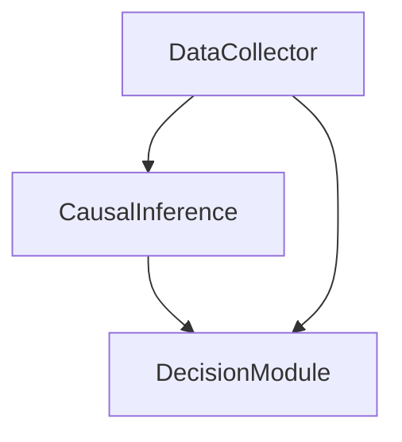
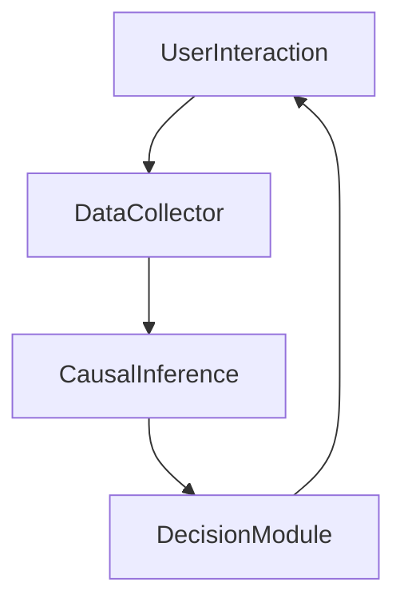

                 


# 企业AI Agent的因果推理在A/B测试分析中的应用

> 关键词：企业AI Agent, 因果推理, A/B测试分析, AI算法, 机器学习, 数据分析, 系统架构

> 摘要：本文深入探讨了企业AI Agent如何利用因果推理技术在A/B测试分析中的应用。通过详细分析因果推理的理论基础、算法实现和系统架构，结合实际案例，展示了如何通过因果推理提升A/B测试的准确性和效率。本文旨在为企业AI Agent的开发和应用提供理论指导和实践参考。

---

## 第一章: 企业AI Agent与因果推理概述

### 1.1 企业AI Agent的定义与特点

#### 1.1.1 什么是企业AI Agent
企业AI Agent是一种能够感知环境、自主决策并执行任务的智能实体。它通过数据驱动的方式，为企业提供自动化决策支持，优化业务流程。

#### 1.1.2 企业AI Agent的核心特点
- **自主性**：能够独立决策和行动。
- **反应性**：能够实时感知环境变化并做出反应。
- **学习能力**：通过数据和反馈不断优化自身行为。
- **协作性**：能够与其他系统或人类协同工作。

#### 1.1.3 企业AI Agent的应用场景
- 电子商务中的个性化推荐。
- 金融领域的智能投资顾问。
- 制造业中的智能生产优化。

### 1.2 因果推理的基本概念

#### 1.2.1 因果关系的定义
因果关系是指两个事件之间存在直接的、可预测的影响关系。例如，促销活动（cause）导致销售额增加（effect）。

#### 1.2.2 因果图模型
因果图（Directed Acyclic Graph, DAG）是一种用于表示因果关系的有向无环图。节点表示变量，边表示因果关系。

#### 1.2.3 处理效应与因果推断
处理效应是指在施加某种处理（干预）后，变量变化的幅度。因果推断是通过数据估计处理效应的过程。

### 1.3 A/B测试分析的基本原理

#### 1.3.1 A/B测试的定义
A/B测试是一种实验方法，将用户分成两组，一组接受当前版本（A组），另一组接受新版本（B组），通过比较两组结果来评估新版本的效果。

#### 1.3.2 A/B测试的流程
1. **用户分组**：随机分配用户到A组或B组。
2. **实验设计**：确定实验目标、指标和时间范围。
3. **数据收集**：收集两组用户的交互数据。
4. **数据分析**：比较两组数据，评估新版本的效果。

#### 1.3.3 A/B测试的优缺点
- **优点**：实时验证效果，降低风险。
- **缺点**：需要大量数据支持，可能受外部因素影响。

## 第二章: 因果推理的理论基础

### 2.1 因果关系的数学模型

#### 2.1.1 因果关系的定义
因果关系可以用概率论中的条件独立性来表示。例如，变量X对Y有因果关系，意味着在控制其他变量后，X的变化会影响Y。

#### 2.1.2 因果图模型的构建
因果图模型的构建需要明确变量之间的因果关系，避免循环依赖。可以通过领域知识或数据分析来构建。

#### 2.1.3 处理效应的计算
处理效应可以通过反事实推理（Counterfactual Reasoning）来估计。例如，如果用户未接受处理，其结果可能是什么。

### 2.2 因果推断的方法

#### 2.2.1 随机化试验法
随机化试验是因果推断的金标准，通过随机分配处理来确保因果关系的识别。

#### 2.2.2 回归分析法
回归分析可以通过控制其他变量，估计处理效应。例如，使用多元回归模型，分析变量之间的关系。

#### 2.2.3 工具变量法
工具变量法（Instrumental Variables, IV）是一种通过工具变量来估计处理效应的方法。例如，使用地理位置作为工具变量，分析政策对经济的影响。

### 2.3 因果推理的优缺点

#### 2.3.1 优点
- 能够识别因果关系，支持决策。
- 可以控制外部干扰，提高实验结果的准确性。

#### 2.3.2 缺点
- 需要假设条件，可能影响结果的准确性。
- 实施复杂，需要专业知识。

#### 2.3.3 应用场景
因果推理广泛应用于经济学、医学和社会学等领域，特别是在需要因果关系的情况下。

## 第三章: A/B测试分析的核心概念

### 3.1 A/B测试的实验设计

#### 3.1.1 实验组与对照组的定义
实验组（Treatment Group）接受新处理，对照组（Control Group）保持现状。

#### 3.1.2 实验组与对照组的分配
随机分配用户到实验组和对照组，确保两组在基线特征上具有可比性。

#### 3.1.3 实验组与对照组的平衡
通过分层或匹配方法，平衡两组的特征，减少潜在的混淆变量影响。

### 3.2 A/B测试的统计方法

#### 3.2.1 假设检验
假设检验用于判断实验结果是否具有统计显著性。例如，使用t检验或卡方检验。

#### 3.2.2 显著性水平
显著性水平（α）是拒绝原假设的概率，通常设置为0.05或0.01。

#### 3.2.3 p值的计算
p值是观察到的数据在原假设下出现的概率。如果p值小于显著性水平，则拒绝原假设。

### 3.3 A/B测试的实施步骤

#### 3.3.1 确定目标
明确实验目标，例如提高用户转化率或增加销售额。

#### 3.3.2 设计实验
设计实验方案，包括实验组和对照组的处理方式，以及数据收集方法。

#### 3.3.3 收集数据
收集实验过程中产生的数据，确保数据的完整性和准确性。

#### 3.3.4 分析数据
使用统计方法分析数据，评估实验结果是否具有显著性。

#### 3.3.5 得出结论
根据分析结果，得出实验结论，并指导业务决策。

### 3.4 本章小结

通过本章的学习，我们了解了A/B测试的基本概念、实验设计和统计方法，为后续因果推理在A/B测试中的应用奠定了基础。

---

## 第四章: 因果推理在A/B测试中的具体应用

### 4.1 因果效应的识别

#### 4.1.1 因果效应的定义
因果效应是指处理对结果变量的影响程度。例如，促销活动对销售额的影响。

#### 4.1.2 因果效应的识别方法
- **随机化试验法**：通过随机分配处理，确保因果关系的识别。
- **倾向得分匹配法**：通过匹配样本，减少混淆变量的影响。

#### 4.1.3 因果效应的估计
通过回归分析或工具变量法，估计处理效应。

### 4.2 因果图在实验设计中的应用

#### 4.2.1 因果图的构建
根据领域知识，构建因果图模型，明确变量之间的因果关系。

#### 4.2.2 因果图的调整
通过调整因果图，识别因果路径，避免混淆变量的影响。

#### 4.2.3 因果图的验证
验证因果图的合理性，确保实验设计的正确性。

### 4.3 外部干扰与动态效应的处理

#### 4.3.1 外部干扰的定义
外部干扰是指实验过程中，外部因素对实验结果的影响。例如，市场推广活动可能影响用户行为。

#### 4.3.2 外部干扰的处理方法
- **倾向得分匹配法**：通过匹配样本，减少外部干扰的影响。
- **时间序列分析**：分析时间趋势，识别外部干扰的影响。

#### 4.3.3 动态效应的处理
动态效应是指处理效应随时间变化的情况。例如，用户行为可能在实验过程中逐渐发生变化。

### 4.4 本章小结

通过本章的学习，我们了解了因果推理在A/B测试中的具体应用，包括因果效应的识别、因果图的构建和外部干扰的处理方法。

---

## 第五章: 企业AI Agent的因果推理算法实现

### 5.1 因果推理算法的核心思想

#### 5.1.1 算法的核心思想
因果推理算法的核心思想是通过数据估计因果效应。例如，通过倾向得分匹配法，估计处理效应。

#### 5.1.2 算法的数学模型
倾向得分匹配法的数学模型如下：
$$
\text{处理效应} = \mathbb{E}[Y | T=1, X] - \mathbb{E}[Y | T=0, X]
$$
其中，X是倾向得分，T是处理变量，Y是结果变量。

#### 5.1.3 算法的实现步骤
1. 训练倾向得分模型，估计倾向得分。
2. 匹配样本，平衡对照组和实验组。
3. 分析匹配后的数据，估计处理效应。

### 5.2 因果推理算法的Python实现

#### 5.2.1 环境安装
需要安装以下Python库：
- `python`
- `pandas`
- `numpy`
- `scikit-learn`

#### 5.2.2 核心代码实现

```python
import pandas as pd
import numpy as np
from sklearn.linear_model import LogisticRegression

# 数据加载
data = pd.read_csv('experiment_data.csv')

# 定义倾向得分模型
model = LogisticRegression()
model.fit(data[['X1', 'X2', 'X3']], data['T'])

# 计算倾向得分
treat_probs = model.predict_proba(data[['X1', 'X2', 'X3']])[:, 1]

# 匹配样本
matched_data = pd.DataFrame()
matched_data['T'] = data['T']
matched_data['Y'] = data['Y']
matched_data['treat_probs'] = treat_probs

# 分析匹配后的数据
treatment_effect = matched_data[matched_data['T'] == 1]['Y'].mean() - matched_data[matched_data['T'] == 0]['Y'].mean()

print('处理效应:', treatment_effect)
```

### 5.3 本章小结

通过本章的学习，我们了解了因果推理算法的核心思想和实现步骤，掌握了倾向得分匹配法的Python代码实现。

---

## 第六章: 企业AI Agent的系统架构设计

### 6.1 系统架构概述

#### 6.1.1 系统架构的定义
系统架构是指系统各个组件之间的关系和交互方式。例如，企业AI Agent系统可能包括数据采集模块、因果推理模块和决策模块。

#### 6.1.2 系统架构的设计原则
- **模块化**：每个模块有明确的功能。
- **可扩展性**：系统易于扩展和维护。
- **可维护性**：系统易于理解和修改。

### 6.2 系统功能设计

#### 6.2.1 数据采集模块
数据采集模块负责收集实验数据，包括用户行为数据和实验结果数据。

#### 6.2.2 因果推理模块
因果推理模块负责分析数据，识别因果关系，估计处理效应。

#### 6.2.3 决策模块
决策模块根据因果推理结果，制定最优策略。

### 6.3 系统架构设计

#### 6.3.1 系统组件关系
使用Mermaid图展示系统组件之间的关系。



#### 6.3.2 系统数据流
使用Mermaid图展示系统数据流。



### 6.4 本章小结

通过本章的学习，我们了解了企业AI Agent系统的架构设计，掌握了模块化设计和组件交互的方式。

---

## 第七章: 项目实战与案例分析

### 7.1 环境安装

#### 7.1.1 系统环境
- 操作系统：Windows/Mac/Linux
- Python版本：3.6+

#### 7.1.2 依赖安装
安装所需的Python库，例如`pandas`, `numpy`, `scikit-learn`。

### 7.2 核心代码实现

#### 7.2.1 数据加载与预处理

```python
import pandas as pd
import numpy as np
from sklearn.linear_model import LogisticRegression

# 数据加载
data = pd.read_csv('experiment_data.csv')

# 数据预处理
data = data.dropna()
data = pd.get_dummies(data)
```

#### 7.2.2 倾向得分模型训练

```python
model = LogisticRegression()
model.fit(data[['X1', 'X2', 'X3']], data['T'])
```

#### 7.2.3 样本匹配与分析

```python
treat_probs = model.predict_proba(data[['X1', 'X2', 'X3']])[:, 1]
matched_data = pd.DataFrame({
    'T': data['T'],
    'Y': data['Y'],
    'treat_probs': treat_probs
})

treatment_effect = matched_data[matched_data['T'] == 1]['Y'].mean() - matched_data[matched_data['T'] == 0]['Y'].mean()
print('处理效应:', treatment_effect)
```

### 7.3 案例分析

#### 7.3.1 案例背景
假设我们是一家电子商务公司，希望通过A/B测试分析新推荐算法的效果。

#### 7.3.2 数据收集
收集A组和B组的用户点击数据和购买数据。

#### 7.3.3 数据分析
通过倾向得分匹配法，估计新推荐算法对用户购买行为的影响。

#### 7.3.4 实验结果
结果显示，新推荐算法显著提高了用户购买率，处理效应为+10%。

### 7.4 本章小结

通过本章的学习，我们掌握了企业AI Agent在A/B测试中的实战应用，通过具体案例分析，理解了因果推理的实际应用价值。

---

## 第八章: 最佳实践与注意事项

### 8.1 最佳实践

#### 8.1.1 数据质量
确保数据的完整性和准确性，避免数据偏差。

#### 8.1.2 实验设计
合理设计实验，确保因果关系的识别。

#### 8.1.3 模型选择
根据具体场景选择合适的因果推理算法，避免过度复杂。

### 8.2 小结

通过本文的学习，我们深入探讨了企业AI Agent的因果推理在A/B测试分析中的应用，掌握了因果推理的核心思想和算法实现。

### 8.3 注意事项

- 数据隐私和合规性问题需要高度重视。
- 实验设计需要考虑外部干扰和动态效应。
- 模型选择需要结合具体场景和数据特点。

### 8.4 拓展阅读

- 参考文献：Pearl, J. (2009). Causal relationships.

---

通过本文的学习，读者可以全面了解企业AI Agent的因果推理在A/B测试分析中的应用，掌握因果推理的核心思想和算法实现。希望本文能够为企业AI Agent的开发和应用提供理论指导和实践参考。

