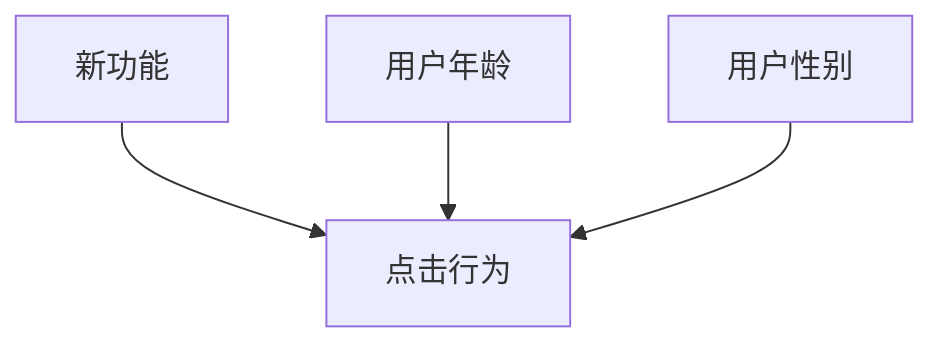
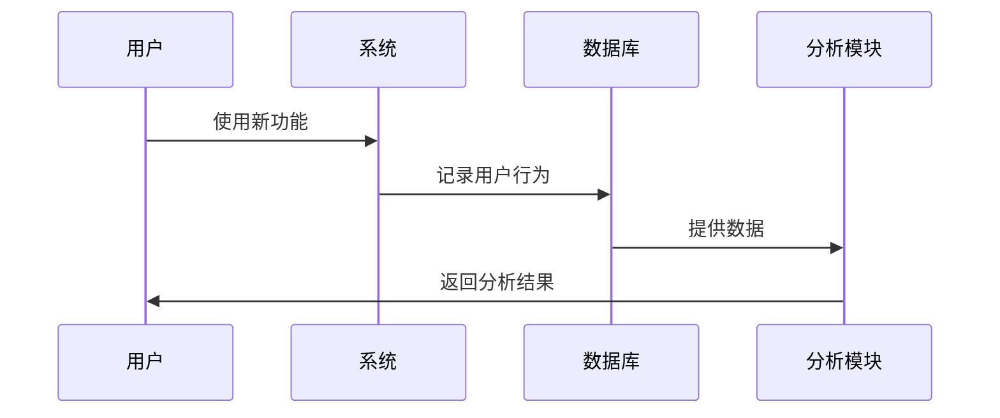

                 


# 企业AI Agent的因果推理在A/B测试结果分析中的应用

> 关键词：企业AI Agent，因果推理，A/B测试，数据分析，机器学习

> 摘要：本文探讨了企业AI Agent如何利用因果推理技术提升A/B测试结果分析的准确性和效率。通过结合因果推理和机器学习，AI Agent能够更深入地理解实验数据之间的因果关系，从而为企业决策提供更可靠的依据。本文从理论基础到实际应用，详细分析了因果推理在A/B测试中的应用，为企业AI Agent的开发和应用提供了重要的参考。

---

# 第一部分：企业AI Agent的因果推理基础

## 第1章：企业AI Agent与因果推理概述

### 1.1 企业AI Agent的基本概念

#### 1.1.1 AI Agent的定义与特点
AI Agent（人工智能代理）是指能够感知环境、自主决策并执行任务的智能体。企业AI Agent具备以下特点：
- **自主性**：能够在没有外部干预的情况下完成任务。
- **反应性**：能够根据环境反馈动态调整行为。
- **目标导向**：以实现特定目标为导向。
- **学习能力**：通过数据和经验不断优化自身行为。

#### 1.1.2 企业AI Agent的应用场景
企业AI Agent广泛应用于以下场景：
- **客户互动**：通过聊天机器人与客户进行实时互动。
- **决策支持**：协助企业高管进行数据驱动的决策。
- **流程优化**：自动化企业内部流程，提高效率。
- **风险管理**：识别潜在风险并提出应对策略。

#### 1.1.3 企业AI Agent与传统数据分析的区别
企业AI Agent与传统数据分析的区别主要体现在：
- **数据处理能力**：AI Agent能够实时处理和分析数据。
- **自主决策能力**：AI Agent能够根据数据做出决策，而传统数据分析仅提供数据支持。
- **学习能力**：AI Agent能够通过机器学习不断优化自身的分析能力。

### 1.2 因果推理的基本概念

#### 1.2.1 因果关系的定义
因果关系是指一个事件（原因）导致另一个事件（结果）发生的必然联系。例如，下雨（原因）导致地面湿（结果）。

#### 1.2.2 因果推理的核心原理
因果推理的核心原理是通过观察数据之间的关系，识别出因果关系，并预测干预措施对结果的影响。例如，在A/B测试中，因果推理可以识别出新功能（干预措施）对用户行为（结果）的影响。

#### 1.2.3 因果推理在企业分析中的重要性
因果推理在企业分析中的重要性体现在：
- **因果关系识别**：能够准确识别变量之间的因果关系。
- **干预效果评估**：能够评估干预措施对结果的实际影响。
- **决策优化**：能够为企业决策提供科学依据。

### 1.3 A/B测试的基本原理

#### 1.3.1 A/B测试的定义与特点
A/B测试是指将用户随机分配到不同的组别（A组和B组），分别接受不同的干预措施（例如，新功能或旧功能），通过比较两组的结果来评估干预措施的效果。

#### 1.3.2 A/B测试的实施流程
A/B测试的实施流程包括：
1. **目标设定**：明确测试的目标和关键指标。
2. **用户分组**：将用户随机分配到A组和B组。
3. **干预实施**：对A组或B组实施不同的干预措施。
4. **数据收集**：收集两组用户的各项数据。
5. **数据分析**：通过统计方法分析两组数据的差异，评估干预措施的效果。

#### 1.3.3 A/B测试结果分析的挑战
A/B测试结果分析的挑战包括：
- **因果关系混淆**：如何区分干预措施的效果与外部因素的影响。
- **样本偏差**：如何确保两组用户的特征相似。
- **统计显著性**：如何确定结果是否具有统计显著性。

### 1.4 本章小结
本章介绍了企业AI Agent的基本概念、因果推理的核心原理以及A/B测试的基本原理。企业AI Agent通过因果推理能够更准确地分析A/B测试结果，为企业决策提供科学依据。

---

## 第2章：因果推理的数学基础

### 2.1 因果关系的数学模型

#### 2.1.1 随机变量与概率分布
随机变量是指在不同条件下可能取不同值的变量，例如用户点击行为。概率分布描述了随机变量在不同取值下的概率。

#### 2.1.2 因果图模型
因果图模型（Causal Graph Model）是一种用于表示因果关系的图形化模型。它通过有向边表示变量之间的因果关系，例如用户点击行为（结果）由新功能（干预措施）引起。

#### 2.1.3 调节变量与中介变量
- **调节变量**：调节变量影响因果关系的强度，例如用户的年龄可能调节新功能对点击行为的影响。
- **中介变量**：中介变量是因果关系的中间步骤，例如用户的满意度可能是新功能对点击行为的中介变量。

### 2.2 马尔可夫条件与独立性

#### 2.2.1 马尔可夫条件的定义
马尔可夫条件是指在因果图中，一个变量的条件概率分布仅依赖于其直接前驱变量，而与其余变量无关。

#### 2.2.2 独立性与条件独立性
- **独立性**：两个变量在没有其他变量存在时的概率独立。
- **条件独立性**：两个变量在给定其他变量存在时的概率独立。

#### 2.2.3 马尔可夫链与因果推理
马尔可夫链是一种用于描述系统状态转移的概率模型，常用于因果推理中分析变量之间的动态关系。

### 2.3 因果效应的计算公式

#### 2.3.1 平均处理效应（ATE）
平均处理效应是指在整体人群中，干预措施对结果的影响程度，计算公式为：
$$ATE = E[Y^{1} - Y^{0}]$$
其中，$Y^{1}$表示干预措施实施后的结果，$Y^{0}$表示干预措施未实施的结果。

#### 2.3.2 平均净效应（ANET）
平均净效应是指干预措施对结果的净影响，计算公式为：
$$ANET = E[Y^{1} - Y^{0}] - E[Y^{0}]$$

#### 2.3.3 因果风险比（RR）
因果风险比是指干预措施实施后结果发生的概率与未实施结果发生的概率的比值，计算公式为：
$$RR = \frac{P(Y=1|T=1)}{P(Y=1|T=0)}$$

### 2.4 本章小结
本章介绍了因果关系的数学模型、马尔可夫条件与独立性以及因果效应的计算公式。这些数学工具为后续的因果推理分析提供了理论基础。

---

## 第3章：企业AI Agent的因果推理实现

### 3.1 因果推理算法概述

#### 3.1.1 随机森林与因果树
因果树是一种基于树结构的因果推理方法，能够通过分割数据识别因果关系。例如，可以使用随机森林算法构建因果树，分析不同变量对结果的影响。

#### 3.1.2 回归分析与倾向评分
倾向评分（Propensity Score）是指在干预措施实施前，预测用户接受干预措施的概率。回归分析可以通过倾向评分调整数据，减少混淆变量的影响。

#### 3.1.3 反事实推理
反事实推理（Counterfactual Reasoning）是指通过假设干预措施未实施，推断用户在未实施干预措施下的结果。例如，可以使用反事实推理分析用户未接受新功能时的点击行为。

### 3.2 因果推理的实现步骤

#### 3.2.1 数据收集与预处理
数据收集与预处理包括：
1. **数据清洗**：删除无效数据，处理缺失值。
2. **特征提取**：提取与结果相关的特征变量。
3. **数据分组**：将数据分为干预组和对照组。

#### 3.2.2 建立因果图模型
因果图模型的建立步骤包括：
1. **定义变量**：明确干预措施、结果变量和调节变量。
2. **绘制因果图**：使用Mermaid绘制因果图，表示变量之间的因果关系。

#### 3.2.3 确定因果效应
因果效应的确定包括：
1. **计算平均处理效应（ATE）**：使用倾向评分调整数据，计算干预措施对结果的影响。
2. **计算平均净效应（ANET）**：通过反事实推理计算干预措施的净影响。

#### 3.2.4 验证与评估
验证与评估包括：
1. **模型验证**：通过交叉验证评估因果推理模型的准确性。
2. **结果解释**：分析因果效应的结果，解释干预措施对结果的影响。

### 3.3 基于Python的因果推理实现

#### 3.3.1 使用`doWhy`库进行因果推理
`doWhy`库是一个基于Python的因果推理库，可以用于估计因果效应。以下是使用`doWhy`库的示例代码：
```python
import doWhy as dowhy

# 初始化因果推理模型
model = dowhy.D因果推理模型()

# 添加因果图关系
model.add凑因变量('新功能', '点击行为')

# 估计因果效应
model.estimate_ATE()
```

#### 3.3.2 使用` causal森林`进行因果树分析
` causal森林`是一种基于树结构的因果推理方法，可以用于分析多变量的因果关系。以下是使用` causal森林`的示例代码：
```python
import causal森林 as cf

# 初始化因果树模型
model = cf.CausalTree()

# 训练模型
model.fit(X, y)

# 预测因果效应
model.predict(X)
```

#### 3.3.3 使用`pymwst`进行反事实推理
`pymwst`是一个用于反事实推理的Python库，可以用于估计反事实概率。以下是使用`pymwst`的示例代码：
```python
import pymwst as pm

# 初始化反事实推理模型
model = pm.Counterfactual()

# 训练模型
model.fit(X, y)

# 预测反事实概率
model.predict(X)
```

### 3.4 本章小结
本章介绍了企业AI Agent因果推理的实现步骤，包括数据预处理、因果图模型的建立、因果效应的计算以及基于Python的因果推理实现。这些方法为企业AI Agent的开发提供了技术支撑。

---

## 第4章：企业A/B测试的因果推理分析

### 4.1 A/B测试中的因果关系建模

#### 4.1.1 A/B测试的因果图构建
在A/B测试中，因果图的构建步骤包括：
1. **定义干预措施**：例如，新功能的推出。
2. **定义结果变量**：例如，用户的点击行为。
3. **定义调节变量**：例如，用户的年龄、性别等。

#### 4.1.2 处理组与对照组的定义
处理组是指接受干预措施的用户组，对照组是指未接受干预措施的用户组。

#### 4.1.3 干预变量与结果变量的关系
干预变量是指干预措施，结果变量是指干预措施实施后的结果。

### 4.2 基于因果推理的A/B测试分析

#### 4.2.1 平均处理效应的计算
平均处理效应的计算公式为：
$$ATE = E[Y^{1} - Y^{0}]$$
其中，$Y^{1}$表示干预组的结果，$Y^{0}$表示对照组的结果。

#### 4.2.2 调节变量的分析
调节变量的分析包括：
1. **识别调节变量**：找出影响干预措施效果的调节变量。
2. **计算调节效应**：评估调节变量对干预措施效果的影响。

#### 4.2.3 中介效应的分析
中介效应的分析包括：
1. **识别中介变量**：找出干预措施与结果之间的中介变量。
2. **计算中介效应**：评估中介变量对干预措施效果的影响。

### 4.3 A/B测试结果的稳健性检验

#### 4.3.1 置信区间的计算
置信区间的计算公式为：
$$CI = \bar{Y} \pm z \cdot \frac{\sigma}{\sqrt{n}}$$
其中，$\bar{Y}$是样本均值，$\sigma$是标准差，$n$是样本数量，$z$是标准正态分布的分位数。

#### 4.3.2 p值的解释
p值是指在假设检验中，观测到的样本结果与原假设相符的概率。p值越小，拒绝原假设的证据越强。

#### 4.3.3 敏感性分析
敏感性分析是指通过改变模型假设或参数，评估结果的稳健性。例如，可以改变样本分组方式或模型参数，观察结果是否稳定。

### 4.4 本章小结
本章介绍了基于因果推理的A/B测试分析方法，包括因果关系建模、平均处理效应的计算、调节变量和中介变量的分析，以及A/B测试结果的稳健性检验。

---

## 第5章：企业AI Agent在A/B测试中的应用案例

### 5.1 案例背景介绍

#### 5.1.1 案例行业与目标
本案例来自互联网行业，目标是通过A/B测试评估新功能对用户点击行为的影响。

#### 5.1.2 数据来源与规模
数据来自某互联网公司，包含10万用户的点击行为数据。

#### 5.1.3 业务目标与关键指标
业务目标是提高用户点击率，关键指标包括点击率、转化率等。

### 5.2 案例分析与实施

#### 5.2.1 数据预处理与特征提取
数据预处理包括：
1. **清洗数据**：删除无效数据。
2. **特征提取**：提取用户ID、点击行为、新功能使用情况等特征。

#### 5.2.2 因果图模型的构建
因果图模型的构建包括：
1. **定义干预措施**：新功能的推出。
2. **定义结果变量**：用户的点击行为。
3. **定义调节变量**：用户的年龄、性别等。

#### 5.2.3 因果效应的计算与解释
因果效应的计算与解释包括：
1. **计算平均处理效应（ATE）**：新功能对点击率的影响。
2. **计算平均净效应（ANET）**：新功能的净影响。
3. **分析调节变量和中介变量**：例如，年龄对干预措施效果的影响。

### 5.3 案例结果与业务价值

#### 5.3.1 实验结果的解读
实验结果显示，新功能的推出显著提高了用户的点击率，平均处理效应（ATE）为5%，p值小于0.05，结果具有统计显著性。

#### 5.3.2 业务决策的优化
基于实验结果，公司决定全面推出新功能，并针对不同年龄段的用户制定不同的推广策略。

#### 5.3.3 价值评估与总结
通过因果推理分析，公司不仅提高了用户点击率，还优化了业务决策流程，提升了用户体验。

### 5.4 本章小结
本章通过实际案例展示了企业AI Agent在A/B测试中的应用，验证了因果推理在业务决策优化中的重要性。

---

## 第6章：总结与展望

### 6.1 总结
本文详细探讨了企业AI Agent如何利用因果推理技术提升A/B测试结果分析的准确性和效率。通过结合因果推理和机器学习，企业AI Agent能够更深入地理解实验数据之间的因果关系，为企业决策提供更可靠的依据。

### 6.2 未来展望
未来，随着因果推理技术的不断发展，企业AI Agent在A/B测试中的应用将更加广泛。例如，可以进一步研究因果推理在多变量、多干预措施下的应用，以及如何结合强化学习优化业务决策。

---

# 附录

## 附录A：相关Python库的安装与使用

### 附录A.1 `doWhy`库的安装与使用
安装`doWhy`库：
```bash
pip install doWhy
```

使用`doWhy`库进行因果推理：
```python
import doWhy as dowhy

# 初始化因果推理模型
model = dowhy.D因果推理模型()

# 添加因果图关系
model.add凑因变量('新功能', '点击行为')

# 估计因果效应
model.estimate_ATE()
```

### 附录A.2 ` causal森林`库的安装与使用
安装` causal森林`库：
```bash
pip install causal森林
```

使用` causal森林`库进行因果树分析：
```python
import causal森林 as cf

# 初始化因果树模型
model = cf.CausalTree()

# 训练模型
model.fit(X, y)

# 预测因果效应
model.predict(X)
```

### 附录A.3 `pymwst`库的安装与使用
安装`pymwst`库：
```bash
pip install pymwst
```

使用`pymwst`库进行反事实推理：
```python
import pymwst as pm

# 初始化反事实推理模型
model = pm.Counterfactual()

# 训练模型
model.fit(X, y)

# 预测反事实概率
model.predict(X)
```

## 附录B：因果图模型的Mermaid图示



## 附录C：系统架构图的Mermaid图示


## 附录D：系统交互图的Mermaid图示



---

# 结语

通过本文的详细介绍，读者可以系统地了解企业AI Agent在A/B测试结果分析中的应用。企业可以通过因果推理技术，更准确地评估干预措施的效果，优化业务决策，提升用户体验。未来，随着技术的不断发展，企业AI Agent将在更多领域发挥重要作用。

