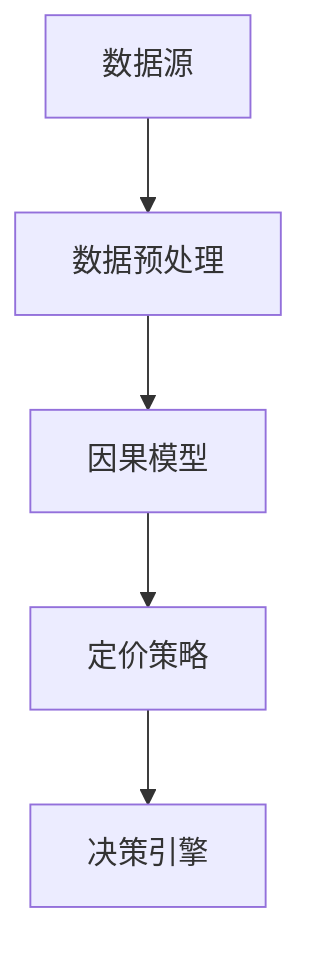

                 


# 企业AI Agent的因果推理在产品定价策略中的精准应用

> 关键词：企业AI Agent，因果推理，产品定价策略，定价模型，AI驱动定价，因果关系

> 摘要：本文详细探讨了企业AI Agent如何利用因果推理技术优化产品定价策略。通过分析因果关系，企业能够更精准地预测价格变化对销量、利润和其他业务指标的影响。文章从理论基础到实际应用，系统性地介绍了因果推理在定价策略中的应用，结合具体案例，展示了AI Agent如何通过因果推理提升定价决策的科学性和准确性。

---

# 第一部分：因果推理与AI Agent的理论基础

## 第1章：因果推理的核心概念

### 1.1 从相关性到因果性

#### 1.1.1 相关性与因果性的区别
在传统的统计分析中，我们关注的是变量之间的相关性。例如，价格与销量的相关性可能为负，这意味着价格越高，销量可能越低。然而，相关性并不等同于因果性。因果推理的目标是理解变量之间的因果关系，即价格变化如何直接影响销量。

#### 1.1.2 因果关系的定义
因果关系是指一个事件（原因）导致另一个事件（结果）发生的机制。在定价策略中，价格（原因）直接影响销量（结果）。

#### 1.1.3 因果推理的重要性
因果推理能够帮助企业在复杂的市场环境中，准确理解变量之间的因果关系，从而做出更科学的定价决策。

### 1.2 因果图与结构方程模型

#### 1.2.1 因果图的构建
因果图是一种用于表示变量之间因果关系的工具。通过构建因果图，我们可以清晰地看到价格、销量、利润等变量之间的因果关系。

#### 1.2.2 结构方程模型
结构方程模型是一种用于估计因果效应的方法。它通过建立变量之间的线性关系，估计因果效应的大小。

---

## 第2章：AI Agent在定价策略中的角色

### 2.1 AI Agent的定义与特点

#### 2.1.1 AI Agent的定义
AI Agent是一种智能体，能够感知环境并采取行动以实现目标。在企业中，AI Agent可以用于优化定价策略。

#### 2.1.2 AI Agent的特点
- **自主性**：能够自主决策
- **反应性**：能够根据环境变化调整策略
- **目标导向性**：以实现特定目标为导向

### 2.2 AI Agent在定价策略中的应用

#### 2.2.1 数据驱动的定价
AI Agent通过分析大量的市场数据，识别价格与销量之间的因果关系，优化定价策略。

#### 2.2.2 动态定价
AI Agent能够实时分析市场变化，动态调整价格，以最大化利润或市场份额。

#### 2.2.3 智能推荐
AI Agent可以根据消费者的行为和偏好，推荐最优价格，提升销售转化率。

---

# 第二部分：因果推理在定价策略中的应用

## 第3章：因果推理的核心算法

### 3.1 潜在结果框架

#### 3.1.1 潜在结果的定义
潜在结果是指在给定特定处理情况下，变量的可能结果。例如，如果价格提高10%，销量可能会减少20%。

#### 3.1.2 平均处理效应
$$ \text{ATE} = E[Y_{1} - Y_{0}] $$
其中，$Y_{1}$和$Y_{0}$分别表示处理和不处理情况下的结果。

### 3.2 工具变量法

#### 3.2.1 工具变量的定义
工具变量是一种用于估计因果效应的变量，它与处理变量相关，但仅通过处理变量影响结果变量。

#### 3.2.2 工具变量法的步骤
1. 选择工具变量
2. 估计处理变量与工具变量之间的关系
3. 估计结果变量与处理变量之间的关系
4. 通过工具变量法估计因果效应

### 3.3 随机森林与因果推断

#### 3.3.1 随机森林的定义
随机森林是一种基于树的集成方法，能够处理高维数据和复杂关系。

#### 3.3.2 随机森林在因果推断中的应用
随机森林可以用于估计因果效应，通过树的分割方式，识别变量之间的因果关系。

---

## 第4章：企业AI Agent的定价系统设计

### 4.1 系统架构设计

#### 4.1.1 系统架构图


#### 4.1.2 数据预处理
数据预处理包括数据清洗、特征提取和数据增强等步骤。

### 4.2 定价策略的实现

#### 4.2.1 定价模型的实现
$$ \text{价格} = \beta \cdot \text{销量} + \epsilon $$
其中，$\beta$是价格对销量的影响系数，$\epsilon$是误差项。

#### 4.2.2 模型优化
通过交叉验证和超参数调优，优化定价模型的性能。

---

## 第5章：实际案例分析

### 5.1 案例背景

#### 5.1.1 案例概述
某电商公司希望通过AI Agent优化其产品定价策略。

### 5.2 数据分析与模型训练

#### 5.2.1 数据特征分析
分析价格、销量、利润等变量之间的关系。

#### 5.2.2 模型训练
使用因果推理算法，训练定价模型，预测价格对销量的影响。

### 5.3 案例结果

#### 5.3.1 定价策略优化
通过因果推理，AI Agent帮助该公司实现了价格与销量的最优平衡，提升了整体利润。

---

# 第三部分：总结与展望

## 第6章：总结与启示

### 6.1 核心结论
因果推理在产品定价策略中的应用，能够帮助企业更准确地理解价格与销量之间的因果关系，优化定价策略。

### 6.2 启示与建议
建议企业在定价策略中引入因果推理技术，提升定价决策的科学性和准确性。

## 第7章：未来展望

### 7.1 技术发展趋势
未来，因果推理在AI Agent中的应用将更加广泛，技术也将更加成熟。

### 7.2 应用前景
因果推理在定价策略中的应用前景广阔，可以帮助企业实现更高效的定价管理。

---

# 附录

## 附录A：因果推理算法实现代码

```python
import numpy as np
from sklearn.ensemble import RandomForestRegressor

# 示例数据
X = np.random.rand(100, 5)
y = X[:, 0] * 2 + X[:, 1] * 3 + np.random.randn(100)

# 训练随机森林模型
model = RandomForestRegressor(n_estimators=100)
model.fit(X, y)

# 预测结果
y_pred = model.predict(X)
print(y_pred)
```

## 附录B：系统架构图


---

通过本文的详细分析，我们可以看到，企业AI Agent通过因果推理技术，能够更精准地优化产品定价策略，为企业创造更大的价值。

