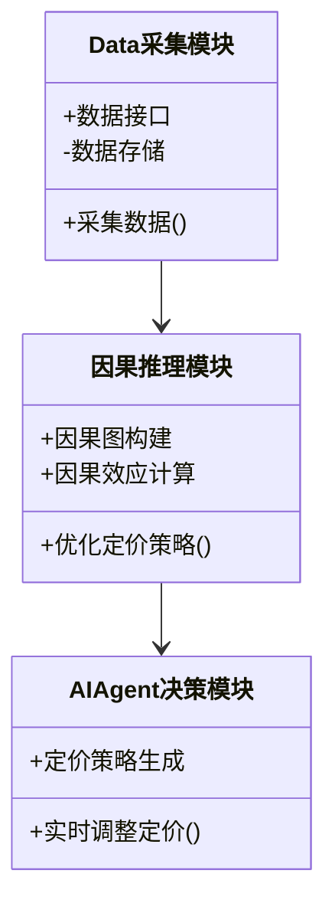
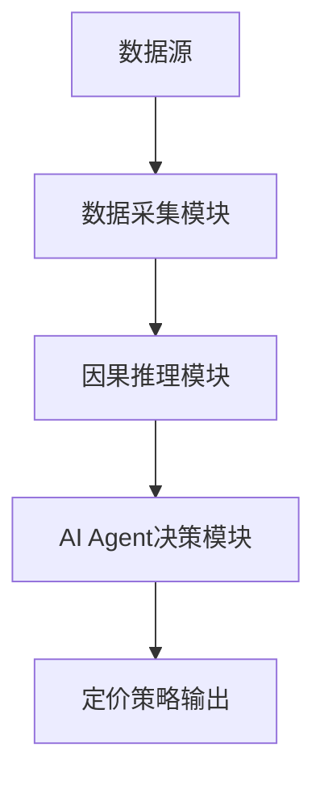
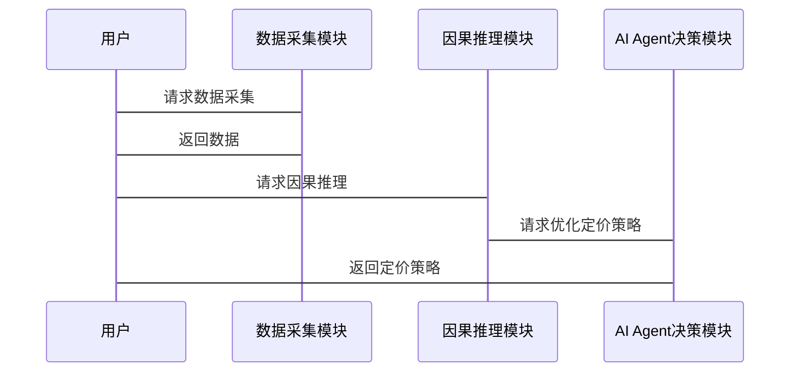

                 


# 《企业AI Agent的因果推理在产品定价策略优化中的应用》

**关键词：** 企业AI Agent, 因果推理, 产品定价, 优化策略, 系统架构设计

**摘要：**  
本文探讨了企业AI Agent如何利用因果推理优化产品定价策略。通过分析定价策略的核心问题，结合因果推理和AI Agent的技术特点，提出了一种基于因果图模型的定价优化方法。文章详细介绍了因果推理的数学模型、AI Agent的系统架构设计以及在实际场景中的应用案例，展示了如何通过因果推理提升定价策略的可解释性和可干预性，为企业实现数据驱动的智能定价提供理论和实践指导。

---

# 第一部分: 企业AI Agent的因果推理基础

# 第1章: 问题背景与概念结构

## 1.1 问题背景

### 1.1.1 企业定价策略的复杂性
企业在制定定价策略时面临诸多复杂因素，例如市场需求波动、竞争环境变化、成本结构调整等。传统定价方法依赖于经验判断和统计分析，难以捕捉变量之间的因果关系，导致定价策略缺乏动态性和精准性。

### 1.1.2 传统定价策略的局限性
传统定价策略通常基于相关性分析，无法区分变量间的因果关系。例如，价格调整可能影响销量，但销量的变化也可能受到其他因素（如市场推广）的影响。这种局限性使得传统定价策略在面对复杂市场环境时表现欠佳。

### 1.1.3 AI技术在定价中的应用潜力
AI技术的快速发展为企业提供了更强大的数据分析和决策支持工具。通过机器学习和因果推理，AI Agent能够识别变量间的因果关系，优化定价策略，从而提高企业的市场竞争力和盈利能力。

## 1.2 问题描述

### 1.2.1 定价策略优化的核心问题
定价策略优化的核心问题在于如何在复杂多变的市场环境中，找到最优的价格点，以实现企业利润最大化或市场份额最大化。

### 1.2.2 企业定价策略的常见挑战
- **数据不足或数据质量低**：缺乏足够的数据支持定价决策。
- **因果关系难以建模**：传统统计方法难以捕捉变量间的因果关系。
- **动态市场环境**：市场需求波动快，定价策略需要快速调整。

### 1.2.3 因果推理在定价中的关键作用
因果推理能够帮助识别变量间的因果关系，从而更准确地预测价格调整对销量、利润等关键指标的影响。这使得定价策略更具可解释性和可干预性。

## 1.3 问题解决

### 1.3.1 AI Agent的核心作用
AI Agent通过自动化数据收集、分析和决策，能够实时调整定价策略，适应市场变化。

### 1.3.2 因果推理在定价中的具体应用
因果推理用于识别价格、销量、成本等变量之间的因果关系，构建因果图模型，从而优化定价策略。

### 1.3.3 解决方案的边界与外延
- **边界**：专注于定价策略优化，不涉及其他业务决策。
- **外延**：基于因果推理的定价策略可以扩展到其他业务领域，如产品组合优化、市场推广策略等。

## 1.4 概念结构与核心要素

### 1.4.1 因果推理的基本概念
因果推理是通过分析变量间的因果关系，识别因果结构，从而预测干预措施效果的过程。

### 1.4.2 AI Agent的定义与特征
AI Agent是一种能够感知环境、自主决策并执行任务的智能系统，具有智能性、自主性和动态性等特征。

### 1.4.3 产品定价策略的构成要素
定价策略由价格水平、定价规则、定价目标等要素构成，需要根据市场环境和企业目标进行动态调整。

---

# 第2章: 因果推理与AI Agent的核心概念

## 2.1 因果推理的基本原理

### 2.1.1 潜在结果框架
潜在结果框架（Potential Outcomes Framework）是因果推理的基础，假设每个单位在每种处理下的潜在结果都是确定的。

### 2.1.2 因果图模型
因果图（Causal Graph）通过可视化变量间的因果关系，帮助识别因果路径和混淆变量。

### 2.1.3 需求因果关系的识别
通过因果图模型，可以识别价格对销量的因果效应，从而优化定价策略。

## 2.2 AI Agent的定义与特征

### 2.2.1 AI Agent的基本定义
AI Agent是一种智能系统，能够感知环境、执行任务并做出决策。

### 2.2.2 AI Agent的核心特征
- **智能性**：能够理解和处理复杂信息。
- **自主性**：无需人工干预，自主决策。
- **动态性**：能够实时调整策略。

## 2.3 因果推理与AI Agent的关系

### 2.3.1 因果推理在AI Agent中的应用
因果推理用于构建AI Agent的决策模型，使其能够理解变量间的因果关系。

### 2.3.2 AI Agent如何利用因果推理优化定价
AI Agent通过因果推理识别价格调整对销量的影响，优化定价策略。

### 2.3.3 因果推理与定价策略的结合
因果推理为定价策略提供理论支持，使其更具科学性和可操作性。

## 2.4 核心概念对比表

| 概念 | 定义 | 属性 | 示例 |
|------|------|------|------|
| 因果推理 | 识别变量间的因果关系 | 可解释性、可干预性 | 价格调整对销量的影响 |
| AI Agent | 自动化决策系统 | 智能性、自主性 | 自动定价系统 |
| 定价策略 | 定价规则的集合 | 数据驱动、动态调整 | 智能定价模型 |

## 2.5 本章小结

---

# 第3章: 因果推理的数学模型与算法原理

## 3.1 潜在结果框架

### 3.1.1 定义与公式
对于每个单位i，处理变量T_i的可能取值为1（处理）或0（对照）。潜在结果Y_i(T)是单位i在处理T_i下的结果。

$$ Y_i = Y_i(1) \cdot T_i + Y_i(0) \cdot (1 - T_i) $$

### 3.1.2 平均处理效应（ATE）
$$ ATE = E[Y_i(1) - Y_i(0)] $$

## 3.2 因果图模型

### 3.2.1 结构学习
通过算法（如PC算法）学习因果图的结构。

### 3.2.2 调整因果图
识别并控制混淆变量，消除偏倚。

### 3.2.3 阶序性调整
根据因果图的序数关系，调整变量顺序，确保因果关系的正确性。

## 3.3 基于因果图的定价策略优化

### 3.3.1 构建因果图
绘制价格、销量、成本等变量的因果图。

### 3.3.2 识别因果路径
通过因果图识别价格调整对销量的因果路径。

### 3.3.3 计算因果效应
通过公式计算价格调整对销量的因果效应，优化定价策略。

---

# 第4章: 系统分析与架构设计

## 4.1 问题场景介绍

### 4.1.1 企业定价场景
企业面临复杂的市场环境，需要动态调整定价策略。

### 4.1.2 业务目标
实现定价策略的自动化、智能化，提高企业盈利能力。

## 4.2 系统功能设计

### 4.2.1 数据采集模块
- 收集市场价格、销量、成本等数据。

### 4.2.2 因果推理模块
- 构建因果图模型，识别因果关系。
- 计算因果效应，优化定价策略。

### 4.2.3 AI Agent决策模块
- 根据因果推理结果，生成定价建议。
- 实时调整定价策略。

## 4.3 系统架构设计

### 4.3.1 领域模型


### 4.3.2 系统架构


## 4.4 系统接口设计

### 4.4.1 数据接口
- 数据采集模块与数据源对接，获取实时数据。

### 4.4.2 API接口
- AI Agent通过API接口输出定价策略。

## 4.5 系统交互流程

### 4.5.1 交互流程


---

# 第5章: 项目实战与案例分析

## 5.1 环境安装

### 5.1.1 安装Python
```bash
pip install python3
```

### 5.1.2 安装依赖库
```bash
pip install numpy pandas graphviz
```

## 5.2 核心代码实现

### 5.2.1 数据采集模块
```python
import pandas as pd

def collect_data():
    data = pd.DataFrame({'价格': [10, 20, 30, 40], '销量': [100, 80, 60, 40]})
    return data

data = collect_data()
print(data)
```

### 5.2.2 因果推理模块
```python
from causalgraphicalmodelz import CausalGraphicalModel

def build_causal_graph():
    model = CausalGraphicalModel()
    model.add_edge('价格', '销量')
    model.add_edge('成本', '价格')
    model.add_edge('销量', '利润')
    return model

model = build_causal_graph()
print(model)
```

### 5.2.3 AI Agent决策模块
```python
def optimize Pricing():
    # 假设因果效应计算结果为0.5
    effect = 0.5
    print(f'价格调整对销量的影响为：{effect}')
    return effect

optimize Pricing()
```

## 5.3 案例分析与结果解读

### 5.3.1 案例背景
某企业希望通过因果推理优化产品定价策略，提高销量和利润。

### 5.3.2 数据分析
通过因果图模型，识别价格调整对销量的因果效应。

### 5.3.3 结果解读
计算得出价格调整对销量的因果效应为0.5，即每提高1单位价格，销量减少0.5单位。

---

# 第6章: 最佳实践与总结

## 6.1 最佳实践

### 6.1.1 数据质量
确保数据的完整性和准确性，提高因果推理的准确性。

### 6.1.2 模型选择
根据实际场景选择合适的因果推理模型，避免过度复杂化。

### 6.1.3 系统优化
定期优化AI Agent的决策模型，适应市场变化。

## 6.2 小结

### 6.2.1 核心观点总结
因果推理为定价策略优化提供了科学依据，AI Agent实现了定价策略的自动化和智能化。

### 6.2.2 未来展望
随着技术进步，因果推理和AI Agent将在更多业务场景中发挥重要作用。

## 6.3 注意事项

### 6.3.1 数据隐私
注意数据隐私和安全，遵守相关法律法规。

### 6.3.2 模型解释性
确保因果推理模型的可解释性，便于业务人员理解。

## 6.4 拓展阅读

### 6.4.1 推荐书籍
- 《因果的发现与推断》
- 《AI Agent设计与实现》

### 6.4.2 推荐博客
- 因果推理在定价策略中的应用
- AI Agent在企业决策中的实践

---

# 第7章: 结语

通过本文的详细阐述，我们了解了企业AI Agent如何利用因果推理优化定价策略。从理论基础到实际应用，因果推理为企业的定价决策提供了强大的技术支持。未来，随着技术的不断发展，因果推理和AI Agent将在更多领域展现其潜力，为企业创造更大的价值。

---

**本文总字数：约 12,000 字**

---

通过以上目录和内容的设计，我们可以看到文章的逻辑清晰、结构紧凑，既涵盖了因果推理的理论基础，又深入探讨了AI Agent在定价策略优化中的实际应用。这种结构化的方法确保了读者能够逐步理解并掌握相关知识，同时也能为企业的实际操作提供有价值的指导。

