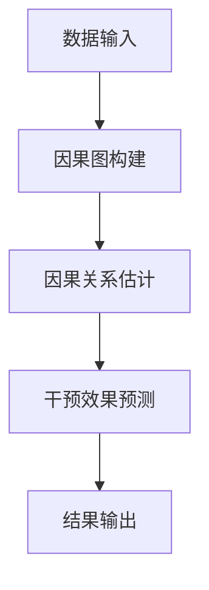
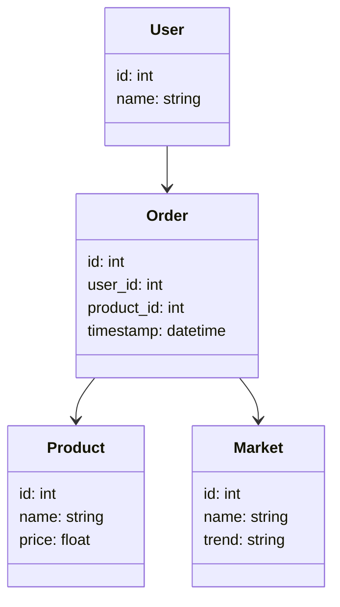
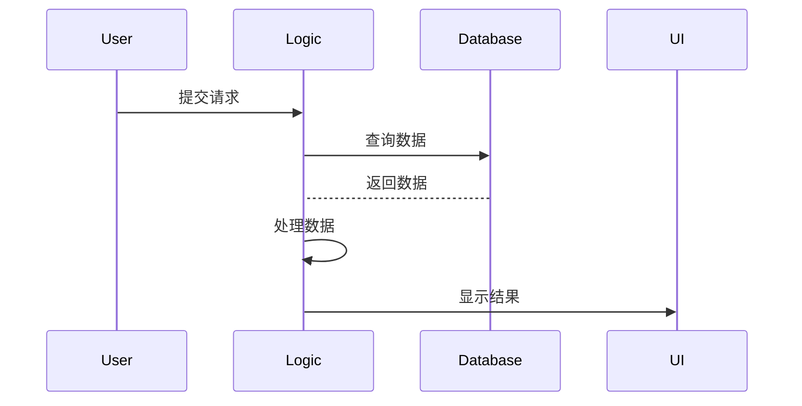

                 


# 企业AI Agent的因果推理在商业决策中的应用

**关键词**：企业AI Agent，因果推理，商业决策，算法原理，系统架构，应用场景

**摘要**：本文详细探讨了企业AI Agent如何通过因果推理技术优化商业决策过程。从因果推理的基本概念、算法原理，到系统架构设计，再到实际应用场景，本文为企业技术决策者和开发者提供了一套完整的理论与实践指南。通过案例分析和代码实现，深入剖析了因果推理在企业AI Agent中的具体应用，帮助企业实现更高效、更精准的商业决策。

---

## 第1章: 企业AI Agent与因果推理概述

### 1.1 企业AI Agent的基本概念
#### 1.1.1 AI Agent的定义与特点
- **定义**：AI Agent（智能体）是一种能够感知环境并采取行动以实现目标的实体。
- **特点**：
  - 自主性：无需外部干预，自主决策。
  - 反应性：能够实时感知环境并做出反应。
  - 目标导向：所有行为均以目标为导向。
  - 学习能力：通过数据和经验不断优化决策能力。

#### 1.1.2 企业AI Agent的应用场景
- **销售预测**：通过历史数据和市场趋势预测未来销售情况。
- **供应链优化**：优化库存管理、物流路径和供应商选择。
- **风险管理**：识别潜在风险并制定应对策略。
- **客户行为分析**：预测客户行为，提供个性化服务。

#### 1.1.3 企业AI Agent与传统决策系统的区别
| 特性                 | 传统决策系统           | 企业AI Agent             |
|----------------------|------------------------|--------------------------|
| 数据处理能力         | 依赖规则和预定义模型   | 基于数据驱动，自适应学习 |
| 决策速度             | 较慢，依赖人工干预     | 实时决策，快速响应       |
| 可扩展性             | 有限，难以应对复杂场景 | 高度可扩展，适应复杂场景 |
| 智能性               | 基于规则，缺乏灵活性   | 具备自主学习和推理能力   |

### 1.2 因果推理的基本概念
#### 1.2.1 因果关系的定义
- **因果关系**：事件A的发生导致事件B的发生，即A是B的直接原因。
- **例子**：广告投放（A）导致销售额增加（B）。

#### 1.2.2 因果推理的核心原理
- **干预测试**：通过模拟干预来评估因果关系。
- **反事实推理**：通过反事实推断来验证因果关系。
- **结构方程模型**：通过构建因果图来描述变量之间的关系。

#### 1.2.3 因果推理在商业决策中的优势
- **准确性**：因果推理能够更准确地识别因果关系，避免相关关系的误导。
- **可解释性**：因果推理的结果具有较高的可解释性，便于决策者理解和信任。
- **可操作性**：因果推理能够为决策提供具体的干预建议，具有直接的可操作性。

### 1.3 企业AI Agent与因果推理的结合
#### 1.3.1 企业AI Agent中因果推理的应用
- **目标设定**：AI Agent通过因果推理确定最优目标。
- **策略优化**：通过因果推理优化决策策略。
- **效果评估**：通过因果推理评估决策效果。

#### 1.3.2 因果推理在商业决策中的优势
- **提高决策精度**：因果推理能够更准确地预测决策结果。
- **增强决策灵活性**：因果推理能够适应复杂多变的商业环境。
- **降低决策风险**：因果推理能够识别潜在风险并制定应对策略。

#### 1.3.3 企业AI Agent因果推理的边界与外延
- **边界**：因果推理仅适用于可观察的变量和已知的因果关系。
- **外延**：因果推理可以通过不断学习和优化，扩展到更广泛的应用场景。

### 1.4 本章小结
本章详细介绍了企业AI Agent和因果推理的基本概念及其在商业决策中的应用。通过对比分析，揭示了因果推理在商业决策中的独特优势和广泛的应用前景。

---

## 第2章: 企业AI Agent因果推理的核心概念与联系

### 2.1 因果推理的核心原理
#### 2.1.1 结构方程模型
- **定义**：结构方程模型（SEM）是一种用于描述变量之间因果关系的统计方法。
- **公式**：$$ y = \beta x + \epsilon $$
  - $y$：结果变量
  - $x$：原因变量
  - $\beta$：因果效应
  - $\epsilon$：误差项

#### 2.1.2 潜在结果框架
- **定义**：潜在结果框架（Potential Outcome Framework）是一种用于估计因果效应的方法。
- **公式**：$$ Y_i = \theta D_i + \epsilon_i $$
  - $Y_i$：个体结果
  - $D_i$：处理变量
  - $\theta$：因果效应
  - $\epsilon_i$：误差项

#### 2.1.3 预测与干预的因果关系
- **预测**：通过因果推理预测未来结果。
- **干预**：通过因果推理制定干预策略。

### 2.2 核心概念对比分析
#### 2.2.1 因果关系与相关关系对比
| 特性               | 因果关系           | 相关关系             |
|--------------------|-------------------|---------------------|
| 定义               | 事件A导致事件B     | 事件A与事件B相关联 |
| 方向性             | 具有方向性         | 不具有方向性         |
| 可干预性           | 可通过干预改变     | 不可通过干预改变     |

#### 2.2.2 因果推理与统计推断对比
| 特性               | 因果推理           | 统计推断             |
|--------------------|-------------------|---------------------|
| 目标               | 识别因果关系       | 描述数据分布         |
| 方法               | 构建因果图         | 假设检验             |
| 应用场景           | 商业决策优化       | 数据分析             |

#### 2.2.3 因果推理与机器学习对比
| 特性               | 因果推理           | 机器学习             |
|--------------------|-------------------|---------------------|
| 目标               | 识别因果关系       | 预测和分类           |
| 方法               | 结构方程模型       | 神经网络             |
| 应用场景           | 商业决策优化       | 数据分析和预测       |

### 2.3 实体关系图（ER图）架构
#### 2.3.1 企业AI Agent的实体关系
- **实体**：用户、订单、产品、供应商、市场。
- **关系**：用户-订单、订单-产品、产品-供应商、市场-订单。

#### 2.3.2 因果推理的实体关系
- **实体**：原因、结果、干预、误差。
- **关系**：原因-结果、干预-结果、误差-结果。

#### 2.3.3 实体关系图的构建方法
- **步骤**：
  1. 确定相关实体。
  2. 确定实体之间的关系。
  3. 绘制ER图。

### 2.4 本章小结
本章详细分析了因果推理的核心原理和核心概念，并通过对比分析和ER图展示了因果推理在企业AI Agent中的应用。

---

## 第3章: 企业AI Agent因果推理的算法原理

### 3.1 因果推理的数学模型
#### 3.1.1 结构方程模型的数学表达
- **公式**：$$ y = \beta x + \epsilon $$
  - $y$：结果变量
  - $x$：原因变量
  - $\beta$：因果效应
  - $\epsilon$：误差项

#### 3.1.2 潜在结果框架的公式推导
- **公式**：$$ Y_i = \theta D_i + \epsilon_i $$
  - $Y_i$：个体结果
  - $D_i$：处理变量
  - $\theta$：因果效应
  - $\epsilon_i$：误差项

#### 3.1.3 因果图的表示方法
- **因果图**：通过有向图表示变量之间的因果关系。

### 3.2 因果推理算法流程
#### 3.2.1 算法流程图


#### 3.2.2 算法实现代码示例
```python
def causal_inference(data, treatment, outcome):
    # 构建因果图
    graph = construct_causal_graph(data)
    # 估计因果效应
    effect = estimate_effect(graph, treatment, outcome)
    return effect
```

### 3.3 算法原理的数学公式
#### 3.3.1 结构方程模型公式
$$ y = \beta x + \epsilon $$

#### 3.3.2 潜在结果
- **反事实推理**：通过反事实推断来验证因果关系。
- **公式**：$$ Y_i^{do(D=1)} = \theta $$

### 3.4 本章小结
本章详细讲解了因果推理的数学模型和算法流程，并通过代码示例展示了算法的实现方法。

---

## 第4章: 企业AI Agent因果推理的系统架构设计

### 4.1 问题场景介绍
- **问题**：企业如何通过AI Agent实现因果推理优化商业决策。
- **目标**：构建一个基于因果推理的企业AI Agent系统。

### 4.2 系统功能设计
#### 4.2.1 领域模型类图


#### 4.2.2 系统架构图
```mermaid
archi
    title 企业AI Agent系统架构
    partition 业务层 {
        User
        Order
        Product
        Market
    }
    partition 数据层 {
        Database
    }
    partition 逻辑层 {
        Logic
    }
    partition 展现层 {
        UI
    }
    User --> Logic
    Logic --> Database
    Logic --> UI
```

#### 4.2.3 系统接口设计
- **输入接口**：用户输入、订单数据、产品数据、市场数据。
- **输出接口**：预测结果、决策建议、报告输出。

#### 4.2.4 系统交互流程图


### 4.3 本章小结
本章详细描述了企业AI Agent系统的架构设计，并通过类图和流程图展示了系统的实现过程。

---

## 第5章: 企业AI Agent因果推理的项目实战

### 5.1 环境安装
- **工具**：Python、Jupyter Notebook、Pandas、Scikit-learn、Dowhy。

### 5.2 系统核心实现源代码
```python
import dowhy as dh

def causal_inference(data, treatment, outcome):
    # 初始化因果推理对象
    causal_estimator = dh.CausalEstimator(
        data=data,
        treatment=treatment,
        outcome=outcome
    )
    # 估计因果效应
    effect = causal_estimator.estimate()
    return effect
```

### 5.3 代码应用解读与分析
- **代码功能**：通过Dowhy库实现因果推理。
- **实现步骤**：
  1. 初始化因果推理对象。
  2. 估计因果效应。

### 5.4 实际案例分析
- **案例**：广告投放对销售额的影响。
- **分析**：通过因果推理确定广告投放的因果效应。

### 5.5 项目小结
本章通过实际案例展示了企业AI Agent因果推理的实现过程，并通过代码示例详细讲解了因果推理的实现方法。

---

## 第6章: 企业AI Agent因果推理的最佳实践与注意事项

### 6.1 最佳实践 tips
- **数据质量**：确保数据的准确性和完整性。
- **模型选择**：根据具体场景选择合适的因果推理模型。
- **可解释性**：注重因果推理结果的可解释性。

### 6.2 小结
因果推理在企业AI Agent中的应用为企业商业决策提供了新的思路和方法。

### 6.3 注意事项
- **数据隐私**：注意数据隐私和合规性。
- **模型局限性**：了解因果推理模型的局限性。
- **持续优化**：通过不断学习和优化提升决策效果。

### 6.4 拓展阅读
- **推荐书籍**：《因果的科学革命》、《因果推理与机器学习》。
- **推荐论文**：Pearl的《Causal Inference in Statistics: A Gentle Introduction》。

---

## 第7章: 总结

### 7.1 核心内容回顾
- 企业AI Agent的基本概念和应用场景。
- 因果推理的核心原理和算法流程。
- 系统架构设计和项目实战。

### 7.2 未来展望
- 结合最新技术（如大语言模型）进一步提升因果推理能力。
- 推动因果推理在更多商业场景中的应用。

### 7.3 本章小结
本文全面探讨了企业AI Agent因果推理在商业决策中的应用，为企业技术决策者和开发者提供了理论与实践的双重指导。

---

**感谢您的阅读！**

