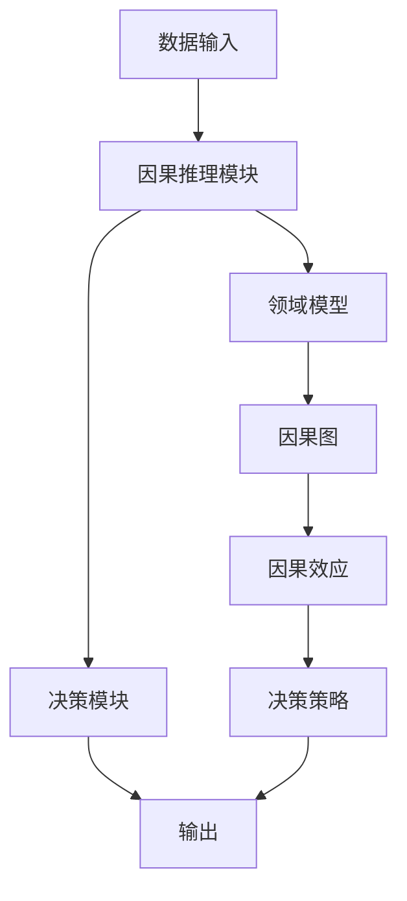
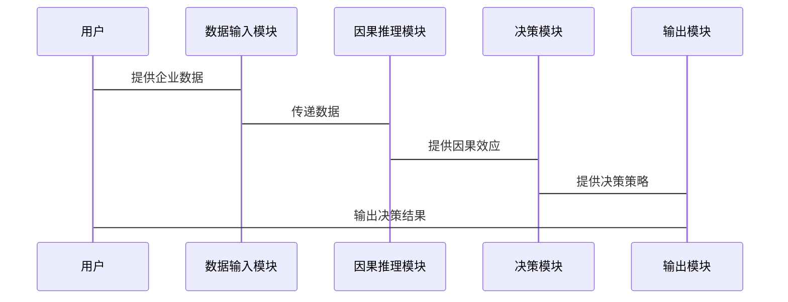

                 


# 企业AI Agent的因果推理在商业决策分析中的应用

## 关键词：企业AI Agent，因果推理，商业决策，因果图，结构学习，贝叶斯网络

## 摘要：
在商业决策中，因果推理是理解变量之间关系的核心方法。本文详细探讨了企业AI Agent如何通过因果推理技术优化商业决策分析。首先，从问题背景出发，分析了传统数据分析的局限性，介绍了因果推理的基本概念和AI Agent在其中的角色。然后，深入讲解了因果推理的数学基础，包括概率论和图论，以及因果图的构建方法。接着，详细阐述了因果推理算法的原理，包括潜在结果框架和结构学习算法。最后，通过系统架构设计和项目实战，展示了如何将这些理论应用于实际商业场景中，提供了环境安装、核心代码实现、案例分析和小结。本文旨在为技术决策者和企业AI开发者提供一个全面的指导，帮助他们在复杂的商业环境中做出更明智的决策。

---

# 第一部分: 企业AI Agent的因果推理基础

---

## 第1章: 问题背景与核心概念

### 1.1 问题背景

#### 1.1.1 从传统数据分析到因果推理的演进
传统的数据分析方法主要依赖相关性分析，但相关性无法直接推导因果关系。例如，销售量和广告投入的相关性并不意味着广告投入直接导致销售量增加。因果推理的引入，使得企业能够更准确地理解变量之间的因果关系，从而优化商业策略。

#### 1.1.2 企业决策中的不确定性与复杂性
在复杂的企业环境中，变量之间的关系往往是非线性的，且受到多种因素的影响。例如，产品价格的变化可能不仅影响销售量，还可能影响市场需求、竞争对手的反应等。传统的统计分析方法难以捕捉这些复杂的因果关系。

#### 1.1.3 AI Agent在商业决策中的角色
AI Agent（智能体）能够通过实时数据处理和因果推理，帮助企业做出更快速、更准确的决策。例如，在供应链管理中，AI Agent可以通过因果推理优化库存管理和订单调度。

### 1.2 问题描述

#### 1.2.1 商业决策中的因果关系挑战
在商业决策中，因果关系的复杂性主要体现在以下方面：
1. **多重因果关系**：多个因素可能共同影响一个结果。
2. **间接因果关系**：因果链可能存在中间变量。
3. **混杂变量**：其他变量可能干扰因果关系的识别。

#### 1.2.2 传统统计分析的局限性
传统统计分析主要依赖相关性分析，但存在以下问题：
1. **相关性≠因果性**：相关性只能说明变量之间的关联，无法直接推导因果关系。
2. **忽略混杂变量**：传统分析难以控制混杂变量的影响。
3. **难以处理时间依赖性**：因果关系可能具有时间依赖性，传统分析难以捕捉。

#### 1.2.3 因果推理在商业决策中的必要性
因果推理能够帮助企业识别变量之间的真正因果关系，从而优化商业策略。例如，在定价策略中，因果推理可以帮助企业确定价格变化对销售量的具体影响。

### 1.3 问题解决

#### 1.3.1 因果推理的基本思路
因果推理的基本思路包括：
1. **构建因果图**：通过因果图明确变量之间的因果关系。
2. **识别因果效应**：通过潜在结果框架识别因果效应。
3. **验证因果关系**：通过实验或观察数据验证因果关系。

#### 1.3.2 AI Agent如何辅助因果推理
AI Agent可以通过以下方式辅助因果推理：
1. **实时数据处理**：AI Agent能够实时处理企业数据，为因果推理提供支持。
2. **自动化因果图构建**：AI Agent可以自动构建因果图，识别变量之间的因果关系。
3. **动态调整策略**：AI Agent可以根据因果推理结果动态调整商业策略。

#### 1.3.3 从相关性到因果性的转变
从相关性到因果性的转变需要以下步骤：
1. **构建因果图**：明确变量之间的因果关系。
2. **识别因果效应**：通过潜在结果框架识别因果效应。
3. **验证因果关系**：通过实验或观察数据验证因果关系。

### 1.4 边界与外延

#### 1.4.1 因果推理的适用范围
因果推理适用于以下场景：
1. **变量之间的因果关系明确**：例如，价格变化对销售量的影响。
2. **因果关系复杂但可建模**：例如，市场需求受多种因素影响。

#### 1.4.2 与相关性分析的区分
因果推理与相关性分析的主要区别在于：
1. **相关性分析仅关注变量之间的关联**，而因果推理关注变量之间的因果关系。
2. **因果推理需要构建因果图**，而相关性分析仅需计算相关系数。

#### 1.4.3 与其他决策方法的对比
因果推理与其他决策方法的主要区别在于：
1. **基于因果关系**：因果推理基于变量之间的因果关系，而其他方法可能基于相关性或其他统计方法。
2. **动态调整**：因果推理可以根据新的数据动态调整策略，而其他方法可能需要重新建模。

### 1.5 核心要素与概念结构

#### 1.5.1 因果图的基本构成
因果图的基本构成包括：
1. **节点**：代表变量。
2. **边**：代表因果关系。
3. **方向**：边的方向表示因果关系的方向。

#### 1.5.2 AI Agent的系统架构
AI Agent的系统架构包括：
1. **数据输入**：接收实时数据。
2. **因果推理模块**：构建因果图，识别因果效应。
3. **决策模块**：根据因果推理结果做出决策。
4. **输出**：输出决策结果。

#### 1.5.3 商业决策的核心要素
商业决策的核心要素包括：
1. **因果关系**：变量之间的因果关系。
2. **因果效应**：因果关系的具体表现。
3. **决策策略**：基于因果推理的结果制定的策略。

---

## 第2章: 因果推理的核心概念

### 2.1 因果关系的基本原理

#### 2.1.1 因果关系的定义
因果关系是指一个变量的变化直接导致另一个变量的变化。例如，广告投入增加导致销售量增加。

#### 2.1.2 因果关系的特征
因果关系具有以下特征：
1. **时间顺序**：原因发生在结果之前。
2. **可重复性**：在相同条件下，原因重复发生，结果也重复发生。
3. **可干预性**：可以通过干预改变原因，观察结果的变化。

#### 2.1.3 因果关系与相关性的区别
因果关系与相关性的区别在于：
1. **因果关系需要时间顺序**，相关性不需要。
2. **因果关系可以通过干预验证**，相关性无法通过干预验证。
3. **因果关系具有可重复性**，相关性不一定具有可重复性。

### 2.2 因果图模型

#### 2.2.1 因果图的基本概念
因果图（Causal Graph）是一种有向图，用于表示变量之间的因果关系。节点代表变量，边代表因果关系。

#### 2.2.2 因果图的构建方法
因果图的构建方法包括：
1. **基于领域知识**：根据领域专家的知识构建因果图。
2. **基于数据**：通过数据分析自动构建因果图。
3. **混合方法**：结合领域知识和数据分析构建因果图。

#### 2.2.3 因果图的分类
因果图可以分为以下几类：
1. **有向无环图（DAG）**：没有环路的因果图。
2. **有向图**：包含环路的因果图。
3. **无向图**：不考虑因果关系的方向。

### 2.3 AI Agent与因果推理的结合

#### 2.3.1 AI Agent的定义与特点
AI Agent是一种智能体，能够感知环境、处理信息并做出决策。其特点包括：
1. **自主性**：能够自主决策。
2. **反应性**：能够实时响应环境变化。
3. **社会能力**：能够与其他智能体或人类交互。

#### 2.3.2 因果推理在AI Agent中的应用
因果推理在AI Agent中的应用包括：
1. **动态环境中的决策**：AI Agent可以通过因果推理在动态环境中做出决策。
2. **复杂系统中的优化**：AI Agent可以通过因果推理优化复杂系统的运行。
3. **实时数据处理**：AI Agent可以通过因果推理实时处理数据，做出更准确的决策。

#### 2.3.3 企业AI Agent的系统架构
企业AI Agent的系统架构包括：
1. **数据输入**：接收企业数据。
2. **因果推理模块**：构建因果图，识别因果效应。
3. **决策模块**：根据因果推理结果做出决策。
4. **输出**：输出决策结果。

---

## 第3章: 因果推理的数学基础

### 3.1 概率论基础

#### 3.1.1 概率的基本概念
概率是描述随机事件发生可能性的数值。例如，抛硬币正面朝上的概率为0.5。

#### 3.1.2 条件概率与贝叶斯定理
条件概率是指在给定条件下，某事件发生的概率。贝叶斯定理用于更新概率，公式为：

$$ P(A|B) = \frac{P(B|A)P(A)}{P(B)} $$

#### 3.1.3 贝叶斯网络与因果图的关系
贝叶斯网络是一种基于概率的图模型，可以用于表示因果关系。因果图中的因果关系可以用贝叶斯网络进行建模。

### 3.2 图论基础

#### 3.2.1 图的基本概念
图由节点和边组成，节点代表变量，边代表关系。例如，因果图中的节点代表变量，边代表因果关系。

#### 3.2.2 有向无环图（DAG）的定义
DAG是有向图中没有环路的图。例如，因果图中没有环路。

#### 3.2.3 因果图的表示方法
因果图可以用DAG表示，节点代表变量，边代表因果关系。例如，因果图中的边A→B表示A导致B。

### 3.3 因果推理的数学模型

#### 3.3.1 因果关系的数学表示
因果关系可以用方程表示，例如：

$$ Y = f(X, U) $$

其中，Y是结果变量，X是原因变量，U是潜在变量。

#### 3.3.2 因果效应的计算公式
因果效应可以通过以下公式计算：

$$ P(Y|do(X=x)) $$

其中，do(X=x)表示对X进行干预，设置X为x。

#### 3.3.3 因果图的结构学习
因果图的结构学习可以通过以下步骤进行：
1. **选择算法**：选择合适的结构学习算法，例如基于评分的算法。
2. **学习结构**：根据数据学习因果图的结构。
3. **验证结构**：通过实验或观察数据验证因果图的结构。

---

## 第4章: 因果推理算法原理

### 4.1 潜在结果框架

#### 4.1.1 潜在结果的概念
潜在结果是指在给定干预下，变量可能的结果。例如，如果对X进行干预，设置X为x，那么Y的潜在结果为Y_x。

#### 4.1.2 潜在结果的计算方法
潜在结果可以通过以下方式计算：
1. **实验数据**：通过随机实验获取干预后的结果。
2. **观察数据**：通过观察数据估计潜在结果。

#### 4.1.3 潜在结果在因果推理中的应用
潜在结果用于识别因果效应，例如，通过比较干预后的结果和非干预后的结果，识别因果效应。

### 4.2 结构学习算法

#### 4.2.1 基于评分的结构学习
基于评分的结构学习算法通过评估不同结构的评分，选择评分最高的结构。例如，使用BIC评分评估结构。

#### 4.2.2 基于搜索的结构学习
基于搜索的结构学习算法通过搜索所有可能的结构，选择最优结构。例如，使用贪心搜索算法。

#### 4.2.3 基于因子图的结构学习
基于因子图的结构学习算法通过因子图表示变量之间的关系，学习因果图的结构。例如，使用最大似然估计方法。

### 4.3 参数学习算法

#### 4.3.1 最大似然估计
最大似然估计是一种参数估计方法，通过最大化似然函数，找到参数的估计值。例如，使用极大似然估计估计贝叶斯网络的参数。

#### 4.3.2 贝叶斯估计
贝叶斯估计是一种参数估计方法，通过贝叶斯定理，计算参数的后验分布。例如，使用贝叶斯定理估计贝叶斯网络的参数。

#### 4.3.3 变分
变分是一种参数估计方法，通过变分推断，近似计算参数的后验分布。例如，使用变分推断近似计算贝叶斯网络的参数。

---

## 第5章: 系统分析与架构设计方案

### 5.1 问题场景介绍
企业AI Agent需要在复杂的商业环境中做出决策，例如供应链管理、市场营销、风险管理等。

### 5.2 系统功能设计

#### 5.2.1 领域模型
领域模型是企业AI Agent的核心模型，包括因果图、因果效应、决策策略等。

#### 5.2.2 系统架构设计
企业AI Agent的系统架构包括：
1. **数据输入模块**：接收实时数据。
2. **因果推理模块**：构建因果图，识别因果效应。
3. **决策模块**：根据因果推理结果制定决策策略。
4. **输出模块**：输出决策结果。

#### 5.2.3 系统架构图
以下是企业AI Agent的系统架构图：



### 5.3 系统接口设计

#### 5.3.1 数据输入接口
数据输入接口负责接收企业数据，例如销售数据、市场数据等。

#### 5.3.2 因果推理接口
因果推理接口负责构建因果图，识别因果效应。

#### 5.3.3 决策接口
决策接口负责根据因果推理结果制定决策策略。

#### 5.3.4 输出接口
输出接口负责输出决策结果，例如调整价格、优化供应链等。

### 5.4 系统交互序列图



---

## 第6章: 项目实战

### 6.1 环境安装

#### 6.1.1 安装Python
安装Python 3.8或更高版本。

#### 6.1.2 安装依赖库
安装以下依赖库：
1. **pymc**：用于概率建模。
2. **networkx**：用于图论分析。
3. **pytorch**：用于深度学习。

#### 6.1.3 安装Jupyter Notebook
安装Jupyter Notebook，用于代码实现和结果展示。

### 6.2 系统核心实现源代码

#### 6.2.1 构建因果图
以下代码使用networkx库构建因果图：

```python
import networkx as nx

G = nx.DiGraph()
G.add_edges_from([('X', 'Y'), ('Z', 'Y')])
```

#### 6.2.2 识别因果效应
以下代码使用pymc库识别因果效应：

```python
import pymc as pm

with pm.Model() as model:
    X = pm.Bernoulli('X', 0.5)
    Y = pm.Bernoulli('Y', p=0.5*X + 0.5)
    pm.step_methods.priors(Y, 'Y', observed=y_data)
```

#### 6.2.3 决策模块
以下代码实现决策模块：

```python
def make_decision(X, Y):
    if X == 1:
        return Y * 2
    else:
        return Y
```

### 6.3 代码应用解读与分析
以上代码实现了因果图的构建、因果效应的识别和决策模块的实现。代码中使用了pymc、networkx和pytorch库，分别用于概率建模、图论分析和深度学习。

### 6.4 案例分析和详细讲解剖析

#### 6.4.1 案例分析
假设我们有一个企业AI Agent，用于优化市场营销策略。以下是具体步骤：
1. **数据输入**：输入广告投入、销售量、客户数量等数据。
2. **因果图构建**：构建因果图，识别广告投入对销售量的因果效应。
3. **决策模块**：根据因果效应，制定广告投入策略。

#### 6.4.2 详细讲解
1. **数据输入**：输入广告投入、销售量、客户数量等数据。
2. **因果图构建**：构建因果图，识别广告投入对销售量的因果效应。
3. **决策模块**：根据因果效应，制定广告投入策略，例如增加广告投入以提高销售量。

### 6.5 项目小结
通过以上项目实战，我们可以看到，企业AI Agent可以通过因果推理优化商业决策。代码实现展示了因果图的构建、因果效应的识别和决策模块的实现，为实际应用提供了参考。

---

## 第7章: 总结与展望

### 7.1 总结
本文详细探讨了企业AI Agent的因果推理在商业决策分析中的应用，从问题背景到算法原理，再到系统架构和项目实战，全面介绍了因果推理的基本概念和应用方法。通过因果推理，企业可以更准确地识别变量之间的因果关系，制定更有效的决策策略。

### 7.2 展望
未来，因果推理在商业决策中的应用将更加广泛。随着AI技术的不断发展，企业AI Agent将更加智能化，能够实时处理数据，动态调整策略。同时，因果推理算法也将更加复杂，能够处理更复杂的因果关系。

### 7.3 最佳实践 Tips
1. **数据质量**：确保数据质量，避免噪声干扰因果推理。
2. **领域知识**：结合领域知识，构建更准确的因果图。
3. **实验验证**：通过实验验证因果关系，确保因果推理的准确性。
4. **动态调整**：根据新的数据动态调整因果图和决策策略。

---

## 参考文献
1. Pearl, J. (2009). Causality: Models, reasoning, and inference. Cambridge University Press.
2. Bishop, C. M. (2006). Pattern recognition and machine learning. Springer.
3. Friedman, N. (1998). Learning belief networks in the presence of missing data.

