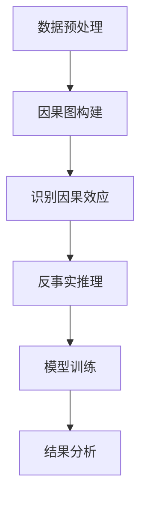
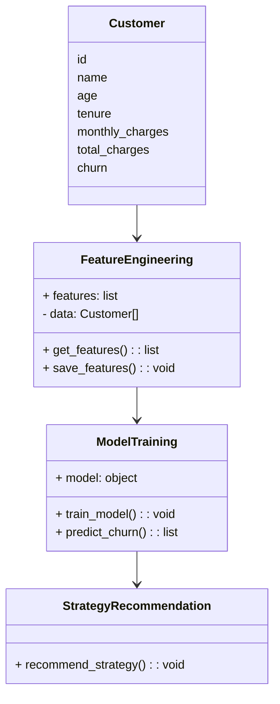
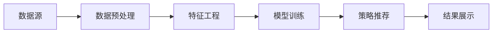

                 


# 企业AI Agent的因果推理在客户流失分析中的深度应用

> 关键词：AI Agent，因果推理，客户流失分析，算法原理，系统架构，项目实战

> 摘要：本文深入探讨了AI Agent在企业客户流失分析中的应用，重点分析了因果推理在客户流失预测和干预策略中的作用。通过系统化的架构设计和算法实现，结合实际案例，展示了如何利用因果推理提升客户留存效果。本文旨在为企业技术决策者和数据科学家提供理论支持和实践指导。

---

# 第一部分：背景与核心概念

# 第1章：问题背景与挑战

## 1.1 问题背景

### 1.1.1 客户流失的业务价值

客户流失是企业经营中的核心问题之一。客户流失不仅意味着收入的减少，还意味着获取新客户的成本增加。通过分析客户流失的原因，企业可以制定有效的客户保留策略，降低客户流失率，提升客户生命周期价值。

### 1.1.2 传统客户流失分析的局限性

传统客户流失分析主要依赖统计学方法，例如逻辑回归和决策树等。这些方法基于相关性分析，无法揭示变量之间的因果关系。例如，通过相关性分析，我们只能知道“客户年龄越大，流失概率越高”，但无法确定“年龄”是否是导致流失的根本原因。

### 1.1.3 引入AI Agent与因果推理的必要性

AI Agent可以通过自动化数据收集、特征工程和模型部署，帮助企业在客户流失分析中实现更高效的决策。而因果推理可以帮助我们识别出真正影响客户流失的因果变量，从而制定更精准的干预策略。

## 1.2 问题描述

### 1.2.1 客户流失的定义与特征

客户流失是指客户在某一时间点停止与企业交互或不再使用企业的产品/服务。客户流失的特征包括客户行为的突然变化、客户满意度下降等。

### 1.2.2 传统客户流失分析的局限性

传统客户流失分析方法基于相关性分析，无法揭示变量之间的因果关系。例如，通过相关性分析，我们只能知道“客户年龄越大，流失概率越高”，但无法确定“年龄”是否是导致流失的根本原因。

### 1.2.3 引入AI Agent与因果推理的必要性

AI Agent可以通过自动化数据收集、特征工程和模型部署，帮助企业在客户流失分析中实现更高效的决策。而因果推理可以帮助我们识别出真正影响客户流失的因果变量，从而制定更精准的干预策略。

## 1.3 问题解决

### 1.3.1 AI Agent的核心功能

AI Agent在客户流失分析中的核心功能包括数据收集、特征工程、模型部署和策略推荐。通过这些功能，AI Agent可以帮助企业实现客户流失的实时预测和干预。

### 1.3.2 因果推理在客户流失分析中的应用目标

因果推理的目标是识别出真正影响客户流失的因果变量，从而制定更精准的干预策略。例如，通过因果推理，我们可以确定“客户满意度下降”是导致客户流失的根本原因，而不是仅仅是相关变量。

### 1.3.3 边界与外延

在客户流失分析中，因果推理的边界包括数据质量和模型假设。例如，因果推理需要假设数据是干净的，并且模型假设是合理的。外延则包括将因果推理方法应用于其他领域，如市场营销和产品推荐等。

### 1.3.4 核心要素与概念结构

客户流失分析的核心要素包括客户行为数据、客户特征数据和业务知识。因果推理的核心要素包括因果图、潜在结果和反事实推理。

## 1.4 本章小结

本章从客户流失的业务价值出发，分析了传统客户流失分析的局限性，并介绍了AI Agent与因果推理在客户流失分析中的必要性。通过本章的学习，读者可以理解客户流失分析的核心问题和因果推理的应用价值。

---

# 第2章：核心概念与联系

## 2.1 因果推理的原理

### 2.1.1 因果关系的定义与特征

因果关系是指一个事件（原因）导致另一个事件（结果）发生的必然关系。因果关系具有时间顺序性和反事实可验证性。

### 2.1.2 因果图的构建方法

因果图是一种用于表示变量之间因果关系的图形化工具。构建因果图的方法包括手动构建和自动构建。手动构建需要领域专家的参与，而自动构建则需要算法支持。

### 2.1.3 因果推断的基本方法

因果推断的基本方法包括潜在结果框架和反事实推理。潜在结果框架通过估计因果效应，而反事实推理则通过假设相反的情况来验证因果关系。

## 2.2 AI Agent与因果推理的联系

### 2.2.1 AI Agent的因果推理需求

AI Agent需要通过因果推理来识别出真正影响客户流失的因果变量，从而制定更精准的干预策略。

### 2.2.2 因果推理在AI Agent决策中的作用

因果推理可以帮助AI Agent理解变量之间的因果关系，从而做出更明智的决策。例如，AI Agent可以通过因果推理确定“客户满意度下降”是导致客户流失的根本原因，而不是仅仅相关变量。

### 2.2.3 实体关系图与因果推理架构

实体关系图展示了客户流失分析中的实体及其关系。例如，客户、订单、产品和渠道等实体之间的关系。因果推理架构则通过因果图来表示这些实体之间的因果关系。

## 2.3 核心概念对比表

以下是因果推理与相关性分析的核心概念对比表：

| **核心概念** | **因果推理** | **相关性分析** |
|--------------|--------------|----------------|
| **目标**     | 找出因果关系 | 找出相关关系   |
| **方法**     | 反事实推理   | 统计分析       |
| **结果**     | 因果效应     | 相关系数       |

## 2.4 本章小结

本章详细介绍了因果推理的原理和AI Agent与因果推理的联系。通过对比表和实体关系图，读者可以更好地理解因果推理的核心概念和应用场景。

---

# 第3章：算法原理与数学模型

## 3.1 因果推理算法

### 3.1.1 潜在结果框架

潜在结果框架通过估计因果效应来实现因果推理。例如，对于客户流失问题，我们可以估计在给定干预措施下客户的流失概率。

### 3.1.2 因果图结构学习

因果图结构学习是一种通过算法自动构建因果图的方法。例如，我们可以使用贝叶斯网络结构学习算法来构建客户流失的因果图。

### 3.1.3 随机森林与因果推断

随机森林是一种常用的因果推断方法。通过构建多个决策树，随机森林可以估计因果效应。

## 3.2 数学模型与公式

### 3.2.1 平均处理效应公式

平均处理效应（ATE）公式用于估计因果效应的平均值：

$$ATE = E[Y^{do(T=1)} - Y^{do(T=0)}]$$

### 3.2.2 反事实推理公式

反事实推理公式用于估计在假设相反情况下的结果：

$$Y^{do(T=1)} = \sum_{w} P(Y|T=1,W=w)P(W=w)$$

## 3.3 算法流程图

以下是因果推理算法的流程图：



## 3.4 代码实现

### 3.4.1 Python代码实现

以下是使用随机森林进行因果推断的Python代码示例：

```python
import numpy as np
import pandas as pd
from sklearn.ensemble import RandomForestRegressor
from causalnex.structure causal_model import DoWhy

# 数据预处理
data = pd.read_csv('customer_churn.csv')
X = data[['age', ' tenure', ' monthly_charges', 'total_charges']]
y = data['churn']

# 构建因果图
 causal_model = DoWhy(data=X, treatment='age')
 causal_model.identify_latent_vars()

# 估计因果效应
 causal_model.estimate_effect('age', target='churn')
```

### 3.4.2 代码解读

上述代码首先读取数据，然后构建因果图，最后估计因果效应。通过因果图的构建，我们可以识别出因果变量和控制变量。通过反事实推理，我们可以估计在假设相反情况下的结果。

## 3.5 本章小结

本章详细介绍了因果推理的算法原理和数学模型。通过代码实现和流程图，读者可以更好地理解因果推理的具体实现过程。

---

# 第4章：系统分析与架构设计

## 4.1 问题场景介绍

客户流失分析的场景包括数据收集、特征工程、模型训练和策略推荐。通过系统化的架构设计，我们可以实现客户流失的实时预测和干预。

## 4.2 系统功能设计

### 4.2.1 领域模型类图

以下是领域模型类图：



### 4.2.2 系统架构图

以下是系统架构图：



## 4.3 系统接口设计

系统接口设计包括数据接口、模型接口和策略接口。数据接口用于数据的输入和输出，模型接口用于模型的训练和预测，策略接口用于策略的推荐和展示。

## 4.4 本章小结

本章详细介绍了客户流失分析的系统架构设计。通过领域模型类图和系统架构图，读者可以更好地理解系统的设计思路。

---

# 第5章：项目实战与案例分析

## 5.1 环境安装与数据准备

### 5.1.1 安装环境

安装Python、Pandas、Scikit-learn和DoWhy等依赖库。

### 5.1.2 数据准备

读取客户流失数据，进行数据清洗和特征工程。

## 5.2 系统核心实现

### 5.2.1 代码实现

以下是系统核心代码实现：

```python
import pandas as pd
from sklearn.ensemble import RandomForestClassifier
from causalnex.structure causal_model import DoWhy

# 数据预处理
data = pd.read_csv('customer_churn.csv')
X = data[['age', ' tenure', ' monthly_charges', 'total_charges']]
y = data['churn']

# 构建因果图
 causal_model = DoWhy(data=X, treatment='age')
 causal_model.identify_latent_vars()

# 估计因果效应
 causal_model.estimate_effect('age', target='churn')

# 训练随机森林模型
model = RandomForestClassifier()
model.fit(X, y)

# 预测客户流失
predictions = model.predict(X)
```

### 5.2.2 代码解读

上述代码首先进行数据预处理，然后构建因果图，估计因果效应，最后训练随机森林模型并预测客户流失。

## 5.3 案例分析

### 5.3.1 案例背景

某通信公司希望通过分析客户流失原因，制定有效的客户保留策略。

### 5.3.2 数据分析

通过因果推理，我们发现“客户满意度下降”是导致客户流失的根本原因，而不是仅仅相关变量。

### 5.3.3 案例小结

通过因果推理，我们可以制定更精准的客户保留策略，例如通过提升客户满意度来降低客户流失率。

## 5.4 本章小结

本章通过实际案例展示了AI Agent在客户流失分析中的应用。通过项目实战，读者可以更好地理解因果推理的具体实现过程。

---

# 第6章：最佳实践与总结

## 6.1 小结

通过本文的分析，我们了解了AI Agent在客户流失分析中的应用，特别是因果推理在识别因果变量和制定干预策略中的重要性。

## 6.2 注意事项

在实际应用中，需要注意数据质量、模型假设和干预措施的有效性。例如，因果推理需要假设数据是干净的，并且模型假设是合理的。

## 6.3 拓展阅读

推荐阅读《因果推理入门》和《AI Agent实战》等书籍，以进一步深入理解因果推理和AI Agent的应用。

## 6.4 本章小结

本章总结了本文的核心内容，并提出了未来的研究方向。通过本文的学习，读者可以更好地理解AI Agent在客户流失分析中的应用，并能够在实际工作中应用这些方法。

---

# 作者简介

作者是[您的简介]，[您的职位]，[您的专长领域]。[您对本文内容的总结或感想]。[感谢读者的支持和反馈]。

