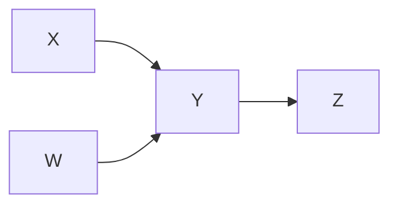
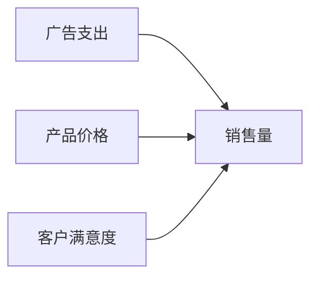
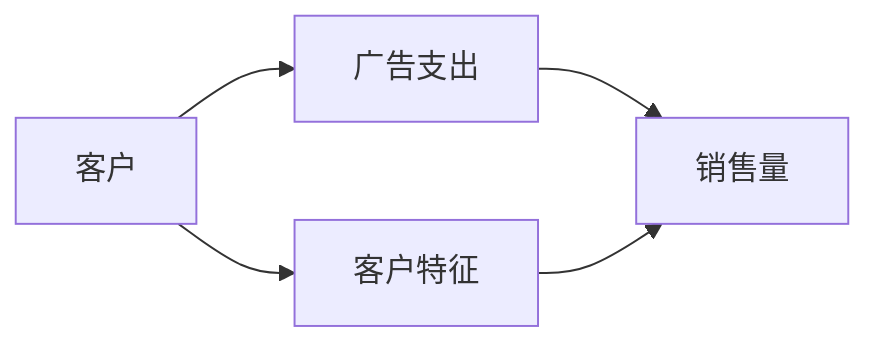
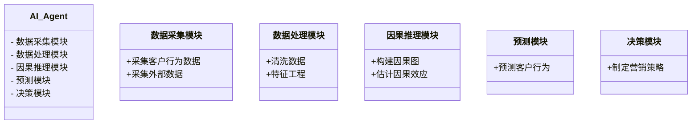
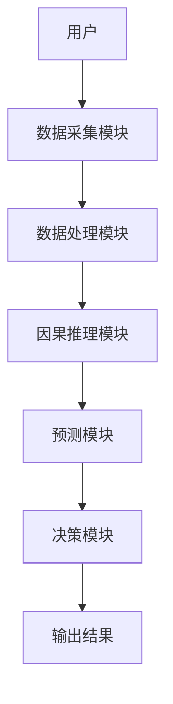

                 


# 企业AI Agent的因果推理在客户行为分析与预测中的应用

## 关键词：企业AI Agent，因果推理，客户行为分析，预测模型，因果图

## 摘要：本文深入探讨了企业AI Agent如何通过因果推理技术进行客户行为分析与预测。文章首先介绍了AI Agent和因果推理的基本概念，接着分析了因果推理在客户行为分析中的应用，详细讲解了因果图的构建、因果关系的识别与估计方法。随后，文章深入讨论了因果推理的算法实现，包括倾向评分和因果森林等技术，并提供了系统设计与架构设计方案。最后，通过实际项目案例，展示了如何在企业环境中应用这些方法进行客户行为预测，为企业决策提供科学依据。

---

# 第一部分：企业AI Agent与因果推理基础

## 第1章：企业AI Agent的概述

### 1.1 AI Agent的基本概念

#### 1.1.1 AI Agent的定义与特点
AI Agent（人工智能代理）是指能够感知环境并采取行动以实现目标的智能实体。它具有以下特点：
- **自主性**：能够自主决策，无需外部干预。
- **反应性**：能够实时感知环境并做出反应。
- **目标导向**：所有行为都围绕实现特定目标展开。
- **社交能力**：能够与其他系统或人类进行交互。

#### 1.1.2 企业AI Agent的应用场景
企业AI Agent广泛应用于多个领域，如客户关系管理、供应链优化、风险管理等。例如：
- **客户关系管理**：通过分析客户行为，提供个性化服务。
- **供应链优化**：实时监控库存，优化物流流程。
- **风险管理**：预测潜在风险，制定应对策略。

#### 1.1.3 企业AI Agent的核心功能
企业AI Agent的核心功能包括：
- 数据采集与处理
- 行为分析与预测
- 决策制定与执行
- 持续学习与优化

### 1.2 因果推理的基本原理

#### 1.2.1 因果关系与相关关系的区别
**相关关系**：变量之间的统计关联，不考虑因果关系。例如，广告支出与销售量可能相关，但广告支出不一定导致销售量增加。
**因果关系**：变量之间存在直接的影响关系。例如，广告支出增加确实导致销售量增加。

#### 1.2.2 因果推理的定义与特征
因果推理是通过分析变量之间的因果关系，推断出某一变量对另一变量的影响程度。其特征包括：
- **干预性**：因果关系可以通过干预来验证。
- **方向性**：因果关系具有明确的方向性。
- **可解释性**：因果推理的结果具有较高的可解释性。

#### 1.2.3 因果推理的基本方法
常用的方法包括：
- **结构方程模型（SEM）**：通过构建变量之间的方程，分析因果关系。
- **潜在结果框架（Potential Outcome Framework）**：通过假设每个个体在不同处理情况下的潜在结果，估计因果效应。
- **因果图（Causal Graph）**：通过图形化方法，表示变量之间的因果关系。

---

## 第2章：因果推理的基本原理

### 2.1 因果关系与相关关系的区别

#### 2.1.1 相关关系的局限性
相关关系只能说明变量之间的关联程度，无法确定因果关系。例如，尽管温度与冰淇淋销量高度相关，但温度并不是导致销量增加的原因。

### 2.2 因果推理的基本方法

#### 2.2.1 结构方程模型
结构方程模型通过构建变量之间的线性方程，分析因果关系。例如：
- 方程1：X → Y（X影响Y）
- 方程2：Y → Z（Y影响Z）

通过估计这些方程的参数，可以推断出变量之间的因果关系。

#### 2.2.2 潜在结果框架
潜在结果框架通过假设每个个体在不同处理情况下的潜在结果，估计因果效应。例如：
- 对于客户i，假设广告支出增加10%，其购买概率可能从0.2增加到0.3。

#### 2.2.3 因果图的构建与分析
因果图通过图形化方法，表示变量之间的因果关系。例如：



图中，X是Y的父节点，Y是Z的父节点，W也是Y的父节点。通过分析图的结构，可以推断出变量之间的因果关系。

---

# 第二部分：因果推理在客户行为分析中的应用

## 第3章：客户行为分析的因果模型

### 3.1 客户行为分析的背景与挑战

#### 3.1.1 客户行为分析的常见问题
- 数据噪声大，难以准确捕捉客户行为模式。
- 客户行为受到多种因素影响，如价格、广告、促销等，难以区分因果关系。
- 传统统计方法只能预测行为，无法解释行为背后的原因。

#### 3.1.2 传统预测方法的局限性
传统预测方法（如线性回归、随机森林）只能发现相关关系，无法推断因果关系。例如，传统方法可以预测广告支出与销售量的相关性，但无法确定广告支出是否真正影响销售量。

#### 3.1.3 引入因果推理的必要性
因果推理可以帮助企业理解客户行为背后的原因，从而制定更有效的营销策略。例如：
- 通过因果推理，企业可以确定广告支出增加是否确实导致销售量增加。

### 3.2 客户行为分析的因果图构建

#### 3.2.1 因果图的基本结构
因果图用于表示变量之间的因果关系。例如，客户行为可能受到广告支出、产品价格、客户满意度等因素的影响。



#### 3.2.2 客户行为的影响因素分析
影响客户行为的因素可能包括：
- 广告支出
- 产品价格
- 客户满意度
- 市场推广活动

#### 3.2.3 构建客户行为因果图的步骤
1. 确定所有可能影响客户行为的因素。
2. 根据已有知识和数据，绘制因果图。
3. 通过数据分析，验证因果关系。

---

## 第4章：客户行为因果关系的识别与估计

### 4.1 因果关系的识别方法

#### 4.1.1 基于实验的方法
通过A/B测试等实验方法，收集干预组和对照组的数据，估计因果效应。例如：
- 干预组：广告支出增加10%
- 对照组：广告支出保持不变
- 通过比较两组的销售量，估计广告支出对销售量的影响。

#### 4.1.2 基于观察数据的方法
当无法进行实验时，可以通过观察数据估计因果效应。例如：
- 使用倾向评分匹配，平衡干预组和对照组的特征。

#### 4.1.3 混淆变量的识别与控制
混淆变量是指同时影响因变量和自变量的变量。例如：
- 广告支出（自变量）和客户满意度（混淆变量）都影响销售量（因变量）。
- 通过控制混淆变量，可以消除其影响，准确估计因果效应。

### 4.2 因果效应的估计方法

#### 4.2.1 反事实推理
反事实推理通过假设相反的情况，估计因果效应。例如：
- 如果客户没有看到广告，他们是否会购买产品？

#### 4.2.2 因果森林
因果森林是一种基于随机森林的因果推断方法。它通过构建多个树结构，估计每个样本的因果效应。例如：

```python
from causalinference import CausalTreeForest

# 假设我们有广告支出和销售量的数据
# 广告支出是处理变量，销售量是结果变量
# 构建因果森林模型
model = CausalTreeForest(treatment='ad_spend', outcome='sales')
model.fit(data)

# 估计因果效应
ate = model.ate()
```

#### 4.2.3 时间序列因果分析
时间序列因果分析用于处理时间依赖的数据。例如：
- 使用Granger因果检验，判断时间序列之间的因果关系。

---

# 第三部分：因果推理的算法实现

## 第5章：倾向评分与因果森林

### 5.1 倾向评分的原理与实现

#### 5.1.1 倾向评分的定义
倾向评分是指在给定其他变量的情况下，客户接受干预的概率。例如：
- 广告支出是干预，销售量是结果。
- 倾向评分是客户看到广告的概率。

#### 5.1.2 倾向评分的估计方法
常用的方法包括：
- **Logistic回归**：通过logit模型估计倾向评分。
- **随机森林**：通过随机森林模型估计倾向评分。

#### 5.1.3 倾向评分在因果分析中的应用
通过倾向评分匹配，可以平衡干预组和对照组的特征，减少混淆变量的影响。例如：

```python
from sklearn.linear_model import LogisticRegression

# 估计倾向评分
model = LogisticRegression()
model.fit(X, treatment)

# 进行倾向评分匹配
from causal_match import Matcher

matcher = Matcher()
matched_data = matcher.match(data, treatment, outcome, model)
```

### 5.2 因果森林算法

#### 5.2.1 因果森林的基本原理
因果森林通过构建多个树结构，估计每个样本的因果效应。例如：



#### 5.2.2 因果森林的实现步骤
1. 构建随机森林模型，估计每个样本的因果效应。
2. 通过交叉验证，选择最优的树结构参数。
3. 输出每个样本的平均因果效应。

---

## 第6章：时间序列因果分析

### 6.1 时间序列数据的因果分析

#### 6.1.1 时间序列数据的特性
时间序列数据具有以下特性：
- **趋势性**：数据呈现长期趋势。
- **季节性**：数据呈现周期性波动。
- **随机性**：数据中包含随机噪声。

#### 6.1.2 时间序列因果分析的挑战
- 时间依赖性：变量之间的关系可能随时间变化。
- 平稳性：时间序列需要满足平稳性假设。

#### 6.1.3 时间序列因果分析的方法
常用的方法包括：
- **Granger因果检验**：通过F检验判断时间序列之间的因果关系。
- **动态因果图**：通过构建动态因果图，分析变量之间的因果关系。

### 6.2 基于Granger因果检验的实现

#### 6.2.1 Granger因果检验的基本原理
Granger因果检验通过F检验判断时间序列之间的因果关系。例如：

```python
from statsmodels.tsa.stattools import grangercausalitytest

# 检验广告支出是否是销售量的Granger原因
grangercausalitytest(ad_spend, sales, max_lag=5)
```

#### 6.2.2 Granger因果检验的实现步骤
1. 选择适当的滞后阶数。
2. 构建回归模型，检验干预变量的显著性。
3. 通过F检验判断因果关系。

---

# 第四部分：系统设计与架构

## 第7章：系统设计与架构方案

### 7.1 问题场景介绍
企业需要通过AI Agent分析客户行为，预测客户行为，并制定相应的营销策略。

### 7.2 系统功能设计

#### 7.2.1 领域模型
领域模型描述了系统的功能模块及其相互关系。例如：



### 7.3 系统架构设计

#### 7.3.1 系统架构图
系统架构图描述了系统的整体结构。例如：


### 7.4 系统接口设计

#### 7.4.1 数据接口
- 数据采集模块与数据库接口交互，获取客户行为数据。
- 数据处理模块与数据预处理接口交互，进行数据清洗和特征工程。

#### 7.4.2 API接口
- 因果推理模块提供API接口，供其他模块调用因果效应估计结果。
- 预测模块提供API接口，供其他系统调用客户行为预测结果。

### 7.5 系统交互流程图

#### 7.5.1 系统交互流程


---

# 第五部分：项目实战

## 第8章：项目实战：客户行为预测系统

### 8.1 环境安装

#### 8.1.1 安装Python环境
- 安装Python 3.x
- 安装Jupyter Notebook

#### 8.1.2 安装依赖库
- 安装`pandas`、`numpy`、`scikit-learn`、`causal森林`等库。

### 8.2 核心实现

#### 8.2.1 数据采集模块
```python
import pandas as pd
import requests

# 采集客户行为数据
data = pd.read_csv('customer_behavior.csv')
```

#### 8.2.2 数据处理模块
```python
# 清洗数据
data.dropna(inplace=True)

# 特征工程
from sklearn.preprocessing import StandardScaler
scaler = StandardScaler()
data_features = scaler.fit_transform(data[['ad_spend', 'price', 'customer_satisfaction']])
```

#### 8.2.3 因果推理模块
```python
# 构建因果图
from causalgraph import CausalGraph

graph = CausalGraph()
graph.add_edge('ad_spend', 'sales')
graph.add_edge('price', 'sales')
graph.add_edge('customer_satisfaction', 'sales')
```

#### 8.2.4 预测模块
```python
# 预测客户行为
from causal_forest import CausalForest

model = CausalForest()
model.fit(data_features, data['sales'])
predictions = model.predict(new_data)
```

### 8.3 代码实现与解读

#### 8.3.1 数据采集模块代码
```python
import pandas as pd

# 读取数据
data = pd.read_csv('customer_behavior.csv')

# 查看数据的前几行
print(data.head())
```

#### 8.3.2 数据处理模块代码
```python
import numpy as np
from sklearn.preprocessing import StandardScaler

# 清洗数据
data.dropna(inplace=True)

# 特征工程
features = data[['ad_spend', 'price', 'customer_satisfaction']]
scaler = StandardScaler()
scaled_features = scaler.fit_transform(features)

print(scaled_features)
```

#### 8.3.3 因果推理模块代码
```python
from causalgraph import CausalGraph

# 构建因果图
graph = CausalGraph()
graph.add_edge('ad_spend', 'sales')
graph.add_edge('price', 'sales')
graph.add_edge('customer_satisfaction', 'sales')

# 可视化因果图
graph.view()
```

#### 8.3.4 预测模块代码
```python
from causal_forest import CausalForest

# 训练模型
model = CausalForest()
model.fit(scaled_features, data['sales'])

# 预测新数据
new_data = [[100, 50, 80]]
scaled_new_data = scaler.transform(new_data)
prediction = model.predict(scaled_new_data)

print(prediction)
```

### 8.4 实际案例分析

#### 8.4.1 数据来源与预处理
- 数据来源：客户行为数据，包括广告支出、产品价格、客户满意度、销售量等。
- 数据预处理：清洗数据，处理缺失值，进行特征工程。

#### 8.4.2 案例分析
通过因果推理，分析广告支出对销售量的影响。例如：
- 通过A/B测试，验证广告支出增加是否导致销售量增加。
- 通过因果森林，估计每个客户的因果效应，制定个性化营销策略。

---

# 第六部分：总结与展望

## 第9章：总结与展望

### 9.1 全文总结
本文深入探讨了企业AI Agent如何通过因果推理技术进行客户行为分析与预测。通过构建因果图，识别因果关系，估计因果效应，企业可以更准确地预测客户行为，并制定更有效的营销策略。

### 9.2 研究前沿与未来趋势
未来的研究方向可能包括：
- 更高效、更准确的因果推理算法。
- 多维因果分析，考虑更多因素的影响。
- 实时因果推理，实时分析客户行为。

### 9.3 最佳实践 tips
- 在实际应用中，建议结合实验数据和观察数据，提高因果效应估计的准确性。
- 定期更新模型，适应市场变化和客户行为的变化。
- 在实际项目中，建议与数据科学家和业务专家密切合作，确保模型的准确性和可解释性。

---

# 结语

企业AI Agent的因果推理在客户行为分析与预测中的应用，为企业提供了更科学、更精准的决策支持。通过本文的深入探讨，读者可以掌握因果推理的基本原理和应用方法，为企业实际应用提供理论支持和实践指导。

