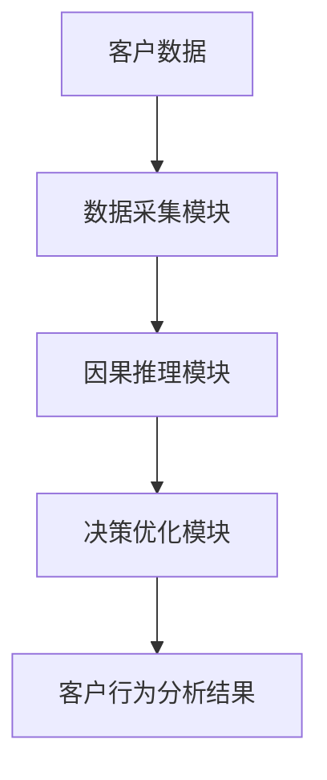
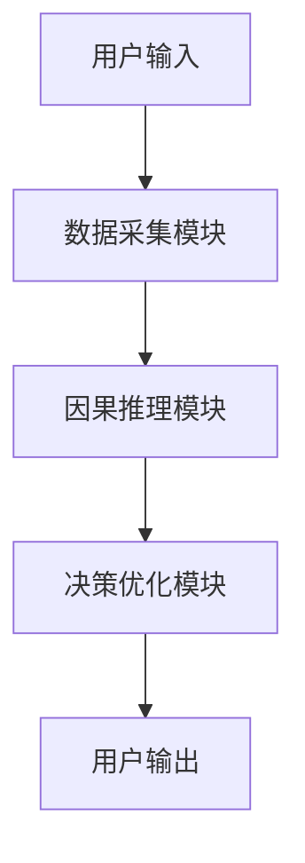

                 


# 企业AI Agent的因果推理在客户行为分析中的应用

> 关键词：企业AI Agent，因果推理，客户行为分析，因果图模型，潜在结果框架

> 摘要：本文探讨了企业AI Agent在客户行为分析中的应用，重点分析了因果推理在其中的作用。文章从传统客户行为分析的局限性出发，详细介绍了因果推理的核心概念、算法原理、系统架构设计及其实战应用，最后总结了最佳实践和未来研究方向。

---

## 第一部分: 企业AI Agent的因果推理基础

### 第1章: 问题背景与定义

#### 1.1 问题背景

##### 1.1.1 传统客户行为分析的局限性
传统的客户行为分析主要依赖相关分析（如回归分析、聚类分析等），这些方法能够揭示变量之间的相关关系，但无法直接推断因果关系。例如，数据分析可能会显示“购买频率高的客户更可能 churn”，但这并不意味着购买频率是导致客户流失的直接原因。这种局限性使得企业在制定策略时缺乏因果依据，难以精准干预。

##### 1.1.2 因果推理在客户行为分析中的价值
因果推理能够识别变量之间的因果关系，帮助企业更准确地理解客户行为的驱动因素。例如，通过因果推理可以确定“推出新优惠政策”是导致客户留存率上升的直接原因，而不是其他相关变量的间接影响。这种能力使得企业能够制定更具针对性的策略，提升客户满意度和业务绩效。

##### 1.1.3 企业AI Agent的应用场景
企业AI Agent是一种能够自主感知、分析和决策的智能系统，其在客户行为分析中的应用场景包括：
- **客户画像与分群**：通过因果推理识别不同客户群体的行为驱动因素。
- **精准营销**：根据因果关系制定个性化的营销策略。
- **风险预测与干预**：预测客户流失的因果因素，并采取干预措施。

#### 1.2 核心概念定义

##### 1.2.1 企业AI Agent的定义
企业AI Agent是一种智能系统，能够通过数据感知、分析和推理，自主决策并执行任务，以优化企业目标的实现。

##### 1.2.2 因果推理的定义与特征
因果推理是一种分析方法，用于识别变量之间的因果关系。其特征包括：
- **可干预性**：可以通过改变因果变量来观察结果的变化。
- **方向性**：因果关系具有明确的方向性。
- **反事实推理**：能够分析“如果如何，则会如何”的反事实情况。

##### 1.2.3 企业AI Agent与因果推理的关系
企业AI Agent通过因果推理技术，能够理解客户行为的因果关系，从而做出更智能的决策。

#### 1.3 当前研究与应用现状

##### 1.3.1 因果推理在企业分析中的应用现状
当前，因果推理在企业分析中的应用主要集中在广告效果评估、客户流失预测等领域，但尚未大规模普及。

##### 1.3.2 企业AI Agent技术的发展趋势
随着机器学习和AI技术的快速发展，企业AI Agent正在从单一任务处理向多任务协同方向发展。

##### 1.3.3 当前存在的主要问题与挑战
- 数据质量与可解释性问题
- 多因果变量的复杂性
- 算法的实时性与可扩展性

---

## 第2章: 核心概念与联系

### 2.1 因果推理的原理与机制

#### 2.1.1 因果关系的基本类型
- **直接因果关系**：A直接导致B。
- **间接因果关系**：A通过中间变量C影响B。
- **共同原因**：A和C共同影响B。

#### 2.1.2 因果推理的基本方法
- **潜在结果框架**：通过反事实推理分析因果关系。
- **因果图模型**：通过构建因果图识别因果路径。
- **随机化实验方法**：通过实验数据估计因果效应。

#### 2.1.3 因果关系与相关关系的区别
| 特征               | 相关关系                  | 因果关系                  |
|--------------------|--------------------------|--------------------------|
| 定义               | 变量之间的统计关联      | 变量之间的因果联系        |
| 方向性             | 非方向性                 | 具有方向性                |
| 干预效果           | 干预不影响相关性         | 干预会影响结果             |

### 2.2 实体关系图


---

## 第3章: 算法原理与实现

### 3.1 因果推理算法概述

#### 3.1.1 潜在结果框架

##### 3.1.1.1 定义
潜在结果框架是一种基于反事实推理的因果分析方法，假设每个客户在不同的处理情况下会有不同的结果。

##### 3.1.1.2 公式
$$ P(Y|T) $$
其中，Y是结果变量，T是处理变量。

##### 3.1.1.3 示例
假设我们想分析“优惠政策”（T）对客户留存率（Y）的影响，潜在结果框架可以帮助我们估计在不同处理情况下的留存概率。

### 3.2 算法实现流程

#### 3.2.1 数据预处理
- 清洗数据
- 特征工程

#### 3.2.2 构建因果图
使用因果图模型识别因果路径和混杂变量。

#### 3.2.3 识别因果关系
通过反事实推理或随机化实验估计因果效应。

---

## 第4章: 系统分析与架构设计

### 4.1 问题场景介绍

#### 4.1.1 客户行为分析的典型问题
- 客户流失预测
- 营销效果评估
- 个性化推荐

### 4.2 系统功能设计

#### 4.2.1 功能模块
- 数据采集模块
- 因果推理模块
- 决策优化模块

### 4.3 系统架构设计



### 4.4 接口设计

#### 4.4.1 API接口
- 数据接口：用于数据采集模块与数据库交互。
- 推理接口：用于因果推理模块与决策优化模块交互。

### 4.5 交互流程图



---

## 第5章: 项目实战

### 5.1 环境安装

#### 5.1.1 安装Python和相关库
```bash
pip install numpy pandas sklearn
```

### 5.2 核心代码实现

#### 5.2.1 数据预处理代码
```python
import pandas as pd
import numpy as np

data = pd.read_csv('customer.csv')
data.dropna(inplace=True)
```

#### 5.2.2 因果推理实现
```python
from doWhy import causal_model

model = causal_model.CausalModel(data)
model.fit()
```

### 5.3 案例分析

#### 5.3.1 案例背景
某电商平台希望通过因果推理分析“优惠政策”对客户购买行为的影响。

#### 5.3.2 数据分析
通过潜在结果框架，估计在不同优惠政策下的购买概率。

#### 5.3.3 结果解读
优惠政策显著提高了客户购买率，建议企业继续推广。

### 5.4 项目小结
通过实战案例，验证了因果推理在客户行为分析中的有效性。

---

## 第6章: 最佳实践与总结

### 6.1 小结
因果推理能够帮助企业更准确地理解客户行为，制定更有效的策略。

### 6.2 注意事项
- 数据质量和完整性
- 模型的可解释性
- 实验设计的严谨性

### 6.3 拓展阅读
- 贝叶斯网络
- 高维因果推理

### 6.4 参考文献
- Pearl, J. (2000). Causality.

---

## 第七章: 未来研究方向

### 7.1 研究热点
- 高维因果推理
- 实时因果推理

### 7.2 技术挑战
- 数据稀疏性
- 混杂变量的识别

### 7.3 应用前景
- 更智能的客户行为预测
- 自适应营销策略

---

通过以上结构化的内容，您可以逐步完成整篇文章的撰写，确保每个部分都详细且逻辑清晰。

