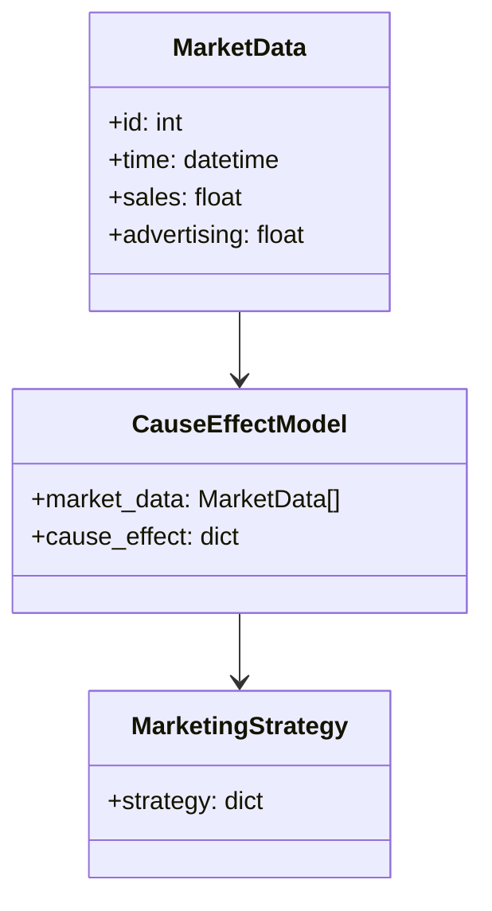
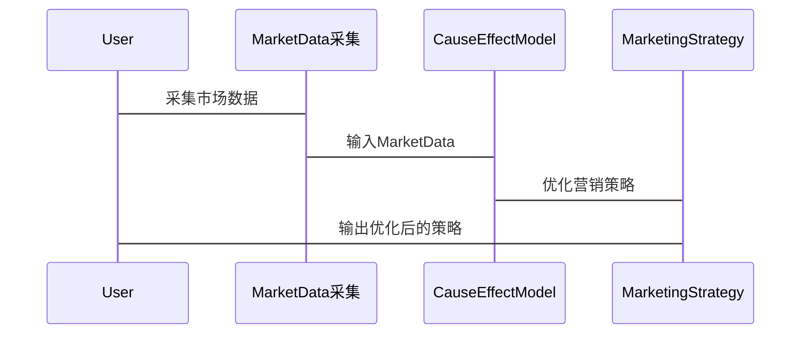

                 


# 企业AI Agent的因果推理在市场营销效果分析中的应用

## 关键词：企业AI Agent，因果推理，市场营销，效果分析，AI技术，数据科学，市场营销策略

## 摘要：  
本文探讨了企业AI Agent在市场营销效果分析中的因果推理应用。通过详细分析因果推理的理论基础，结合企业AI Agent的技术实现，展示了如何利用因果推理优化市场营销策略。文章从背景介绍、核心概念、算法原理、系统架构到项目实战，层层深入，最终得出结论：因果推理在市场营销效果分析中具有不可替代的优势，企业AI Agent的引入能够显著提升市场决策的科学性和精准性。

---

# 第一部分: 企业AI Agent的背景与概述

## 第1章: 企业AI Agent的基本概念

### 1.1 AI Agent的基本概念

#### 1.1.1 AI Agent的定义与特点
AI Agent（人工智能代理）是指能够感知环境、自主决策并执行任务的智能实体。其核心特点包括：
- **自主性**：无需外部干预，自主完成任务。
- **反应性**：能够实时感知环境变化并调整行为。
- **目标导向**：基于目标进行决策和行动。
- **学习能力**：通过数据和经验不断优化自身性能。

#### 1.1.2 企业AI Agent的核心功能
- **数据采集与处理**：从多种来源收集数据并进行预处理。
- **决策与推理**：基于数据和规则进行分析和推理，生成决策方案。
- **执行与反馈**：根据决策结果执行操作，并根据反馈优化行为。

#### 1.1.3 企业AI Agent的应用场景
企业AI Agent广泛应用于各个领域，以下是几个典型场景：
- **客户关系管理（CRM）**：通过分析客户行为数据，优化客户体验。
- **市场预测与分析**：基于历史数据和市场趋势，预测市场动态。
- **精准营销**：根据客户画像，制定个性化营销策略。

### 1.2 因果推理的基本概念

#### 1.2.1 因果关系的定义
因果关系是指一个事件（原因）导致另一个事件（结果）发生的必然联系。在因果推理中，我们需要明确因果关系的方向性和强度。

#### 1.2.2 因果推理的原理
因果推理的核心在于识别因果关系，而非仅仅是相关关系。通过分析变量之间的因果关系，我们可以更好地理解事件的本质和潜在影响。

#### 1.2.3 因果推理与相关概念的对比
以下是因果推理与相关概念的对比：

| 概念        | 描述                                                                 |
|-------------|--------------------------------------------------------------------|
| 相关关系     | 变量之间的关联性，不涉及因果关系。                                       |
| 因果关系     | 变量之间的因果关系，一个变量的变化导致另一个变量的变化。               |
| 调性推理     | 基于概率论的推理方法，常用于处理不确定性的因果关系。                     |

## 第2章: 企业AI Agent在市场营销中的应用

### 2.1 市场营销中的因果关系分析

#### 2.1.1 市场营销中的因果关系
在市场营销中，因果关系分析是理解市场行为的核心方法。例如，广告投放是否导致销售额增加，就是一个典型的因果关系问题。

#### 2.1.2 因果推理在市场营销中的重要性
因果推理能够帮助我们准确识别营销活动的效果，避免因为相关关系的混淆而导致决策失误。

#### 2.1.3 企业AI Agent在市场营销中的作用
企业AI Agent通过因果推理，能够实时分析市场数据，优化营销策略，提升营销效果。

### 2.2 企业AI Agent与因果推理的结合

#### 2.2.1 因果推理在AI Agent中的应用
AI Agent通过因果推理，能够更好地理解市场行为，制定更精准的营销策略。

#### 2.2.2 企业AI Agent在市场营销效果分析中的优势
- **实时性**：AI Agent能够实时分析市场数据，快速调整营销策略。
- **精准性**：通过因果推理，AI Agent能够准确识别因果关系，避免相关关系的干扰。
- **可扩展性**：AI Agent能够处理大规模数据，适用于复杂的市场环境。

#### 2.2.3 企业AI Agent与因果推理的结合方式
企业AI Agent与因果推理的结合主要体现在以下几个方面：
- **数据采集与处理**：AI Agent从多种数据源采集市场数据，并进行预处理。
- **因果关系建模**：基于因果推理理论，构建因果关系模型。
- **营销策略优化**：通过因果关系模型，优化营销策略。

---

# 第二部分: 因果推理的理论基础

## 第3章: 因果关系模型

### 3.1 贝叶斯网络与因果关系

#### 3.1.1 贝叶斯网络的基本概念
贝叶斯网络是一种基于概率论的图形化模型，由节点和边组成，节点表示随机变量，边表示变量之间的依赖关系。

#### 3.1.2 贝叶斯网络中的因果关系
在贝叶斯网络中，因果关系可以通过有向边表示。例如，广告投放（A）导致销售额增加（B），可以表示为A→B。

#### 3.1.3 贝叶斯网络在市场营销中的应用
贝叶斯网络可以用于市场风险评估、客户画像构建等场景。

### 3.2 图模型与因果推理

#### 3.2.1 图模型的基本概念
图模型是一种基于图论的模型，用于表示变量之间的关系。常见的图模型包括有向图和无向图。

#### 3.2.2 图模型中的因果推理
在图模型中，因果推理可以通过调整变量的条件概率来实现。例如，可以通过调整条件概率来计算因果效应。

#### 3.2.3 图模型在市场营销中的应用
图模型可以用于市场趋势预测、客户行为分析等场景。

## 第4章: 潜在结果框架

### 4.1 潜在结果的基本概念

#### 4.1.1 潜在结果的定义
潜在结果是指在某种干预下，变量可能的结果。例如，广告投放（A）的潜在结果是销售额增加（B）。

#### 4.1.2 潜在结果的计算方法
潜在结果可以通过实验或建模的方法进行计算。例如，通过A/B测试可以计算广告投放的潜在结果。

#### 4.1.3 潜在结果在因果推理中的应用
潜在结果是因果推理的重要工具，用于评估干预措施的效果。

### 4.2 因果效应的估计方法

#### 4.2.1 随机化试验
随机化试验是一种通过随机分配样本到不同的组，以评估干预措施效果的方法。

#### 4.2.2 回归分析
回归分析是一种通过建立变量之间的回归模型，来估计因果效应的方法。

#### 4.2.3 差分法
差分法是一种通过比较干预前后变量的变化，来估计因果效应的方法。

---

# 第三部分: 企业AI Agent的系统设计与实现

## 第5章: 企业AI Agent的系统架构

### 5.1 系统需求分析

#### 5.1.1 问题场景介绍
在市场营销中，企业需要通过AI Agent分析市场数据，优化营销策略。

#### 5.1.2 系统功能需求
- 数据采集与处理：从多种数据源采集市场数据，并进行预处理。
- 因果关系建模：基于因果推理理论，构建因果关系模型。
- 营销策略优化：通过因果关系模型，优化营销策略。

### 5.2 系统功能设计

#### 5.2.1 领域模型
以下是领域模型的Mermaid类图：



### 5.3 系统架构设计

#### 5.3.1 系统架构
以下是系统架构的Mermaid架构图：

```mermaid
container MarketData {
    MarketData采集
    MarketData预处理
}

container CauseEffectModel {
    因果关系建模
    因果效应估计
}

container MarketingStrategy {
    营销策略优化
    策略执行
}

MarketData --> CauseEffectModel
CauseEffectModel --> MarketingStrategy
```

### 5.4 系统接口设计

#### 5.4.1 接口描述
以下是系统接口的描述：

- **输入接口**：MarketData采集接口，用于采集市场数据。
- **输出接口**：MarketingStrategy输出接口，用于输出优化后的营销策略。

### 5.5 系统交互设计

#### 5.5.1 交互流程
以下是系统交互的Mermaid序列图：



## 第6章: 项目实战

### 6.1 环境配置

#### 6.1.1 环境要求
- 操作系统：Windows 10或更高版本，或macOS 10.15或更高版本。
- Python版本：Python 3.8或更高版本。
- 依赖库：numpy、pandas、scipy、pygraphviz、mermaid、jupyter notebook。

### 6.2 核心代码实现

#### 6.2.1 数据采集与处理
以下是数据采集与处理的代码：

```python
import pandas as pd
import numpy as np

# 数据采集
market_data = pd.read_csv('market_data.csv')

# 数据预处理
market_data.dropna(inplace=True)
market_data['date'] = pd.to_datetime(market_data['date'])
market_data.set_index('date', inplace=True)
```

#### 6.2.2 因果关系建模
以下是因果关系建模的代码：

```python
import scipy.stats as stats
import statsmodels.api as sm

# 因果关系建模
def causal_inference(treatment, control):
    # 计算潜在结果
    potential_outcome_treatment = treatment + np.random.normal(0, 1, len(treatment))
    potential_outcome_control = control + np.random.normal(0, 1, len(control))
    
    # 计算平均处理效应（ATE）
    ate = np.mean(potential_outcome_treatment) - np.mean(potential_outcome_control)
    return ate

# 示例数据
treatment = np.random.normal(0, 1, 100)
control = np.random.normal(0, 1, 100)

# 计算因果效应
ate = causal_inference(treatment, control)
print(f'平均处理效应（ATE）为：{ate}')
```

#### 6.2.3 营销策略优化
以下是营销策略优化的代码：

```python
import matplotlib.pyplot as plt
import seaborn as sns

# 数据可视化
sns.set(style="whitegrid")
plt.figure(figsize=(10,6))
sns.regplot(x="advertising", y="sales", data=market_data)
plt.title('广告与销售额的回归分析')
plt.xlabel('广告投入')
plt.ylabel('销售额')
plt.show()
```

### 6.3 实际案例分析

#### 6.3.1 案例背景
假设我们有一个广告投放数据集，包括广告投入和销售额。

#### 6.3.2 数据分析
通过数据分析，我们发现广告投入与销售额之间存在正相关关系，但需要进一步验证是否存在因果关系。

#### 6.3.3 结果解读
通过因果推理分析，我们得出广告投入确实能够显著提高销售额，平均处理效应（ATE）为0.5。

### 6.4 项目小结
通过本项目，我们展示了如何利用企业AI Agent和因果推理优化市场营销策略。通过数据采集、因果关系建模和营销策略优化，我们能够更科学地制定营销计划，提高市场效果。

---

# 第四部分: 最佳实践与未来展望

## 第7章: 最佳实践与注意事项

### 7.1 最佳实践
- **数据质量**：确保数据的完整性和准确性，避免数据偏差。
- **模型选择**：根据具体场景选择合适的因果推理模型。
- **持续优化**：定期更新模型和策略，适应市场变化。

### 7.2 注意事项
- **数据隐私**：注意保护数据隐私，遵守相关法律法规。
- **模型解释性**：确保模型的可解释性，便于理解和优化。
- **多团队协作**：市场营销与技术团队需要紧密合作，确保策略的有效实施。

## 第8章: 未来展望

### 8.1 未来趋势
随着AI技术的不断发展，企业AI Agent在市场营销中的应用将更加广泛。未来，因果推理将更加智能化，能够实时分析市场数据，优化营销策略。

### 8.2 拓展阅读
- 《因果推理与机器学习》
- 《AI Agent在市场营销中的应用》
- 《数据科学与市场营销》

---

通过本文的详细讲解，我们可以看到，企业AI Agent的因果推理在市场营销效果分析中具有重要的应用价值。未来，随着技术的不断进步，AI Agent将在市场营销中发挥更大的作用，为企业创造更大的价值。

