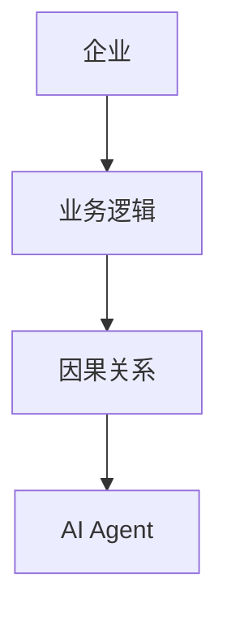
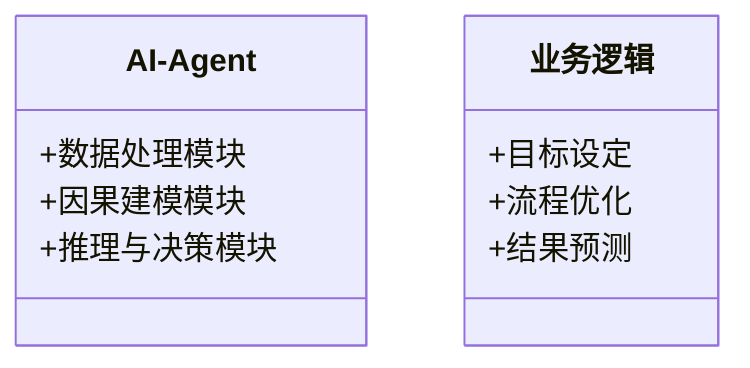
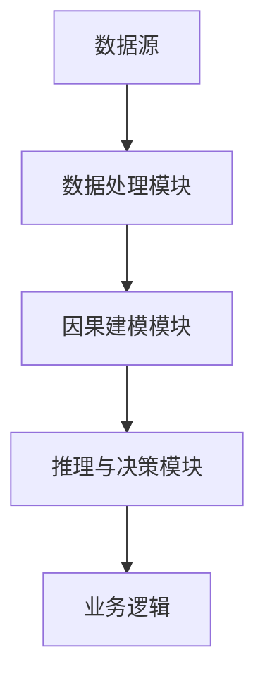
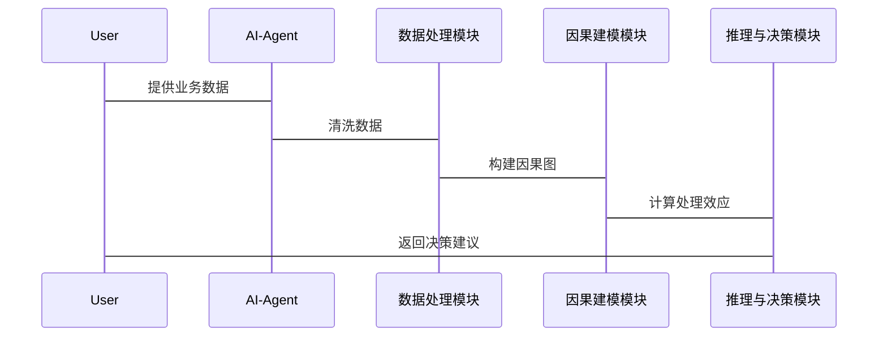

                 


# 企业AI Agent的因果推理应用：深入理解业务逻辑

## 关键词：AI Agent、因果推理、业务逻辑、系统架构、项目实战、最佳实践

## 摘要：本文深入探讨企业AI Agent在因果推理中的应用，从背景、核心概念到算法原理、系统架构，再到项目实战和最佳实践，全面解析如何通过因果推理提升业务逻辑的理解与应用，帮助企业实现智能化决策。

---

## 第1章: 企业AI Agent与因果推理概述

### 1.1 问题背景

#### 1.1.1 传统数据分析的局限性
传统数据分析基于相关性，无法直接推断因果关系，导致业务决策的不准确性和片面性。

#### 1.1.2 业务决策中的因果关系需求
企业在复杂的业务环境中需要理解因果关系，以优化流程、提升效率和制定精准策略。

#### 1.1.3 AI Agent在企业中的角色
AI Agent作为企业智能决策的核心工具，能够通过因果推理帮助企业在复杂场景中做出最优决策。

### 1.2 问题描述

#### 1.2.1 业务逻辑中的因果关系问题
业务逻辑往往涉及复杂的因果关系，传统方法难以有效捕捉和分析。

#### 1.2.2 AI Agent面临的因果推理挑战
AI Agent需要在动态、不确定的环境中进行因果推理，面临数据稀疏性、噪声干扰和计算复杂性等问题。

#### 1.2.3 问题解决的必要性
通过因果推理，AI Agent能够更准确地理解业务逻辑，从而优化决策和行动。

### 1.3 问题解决

#### 1.3.1 因果推理的核心思想
因果推理通过分析变量之间的因果关系，推断出因果关系的强度和方向。

#### 1.3.2 AI Agent如何实现因果推理
AI Agent通过构建因果图、应用因果推理算法，逐步分析因果关系，支持决策制定。

#### 1.3.3 业务逻辑与因果关系的结合
通过因果推理，AI Agent能够深入理解业务逻辑，优化流程、预测结果并制定最优策略。

### 1.4 边界与外延

#### 1.4.1 因果推理的边界条件
因果推理的边界包括数据质量和模型假设，需在特定范围内进行推理。

#### 1.4.2 AI Agent的应用范围
AI Agent适用于需要动态决策和复杂因果关系分析的业务场景。

#### 1.4.3 与相关概念的区分
因果推理与相关性分析、机器学习的区别与联系。

### 1.5 概念结构与核心要素

#### 1.5.1 因果推理的基本模型
包括因果图、潜在结果和处理效应等核心概念。

#### 1.5.2 AI Agent的核心功能
包括数据收集、因果建模、推理与决策优化。

#### 1.5.3 业务逻辑的构成要素
业务逻辑由目标、流程、规则和结果构成，与因果关系密切相关。

### 1.6 本章小结

---

## 第2章: 因果推理的核心概念与联系

### 2.1 因果推理的原理

#### 2.1.1 因果关系的定义
因果关系是指一个事件是另一个事件发生的充分必要条件。

#### 2.1.2 因果图的构建
因果图通过节点和边表示变量之间的因果关系。

#### 2.1.3 调理学方法
通过干预和观察分析因果关系，推断变量之间的因果方向和强度。

### 2.2 因果关系的特征对比

#### 2.2.1 内部特征
因果关系具有方向性、传递性和可逆性。

#### 2.2.2 外部特征
因果关系依赖于背景知识、数据质量和实验设计。

#### 2.2.3 对比分析
通过对比因果关系与相关性，说明因果推理的核心思想。

### 2.3 ER实体关系图



---

## 第3章: 因果推理算法原理

### 3.1 潜在结果框架

#### 3.1.1 定义
潜在结果是指在给定处理情况下，变量的可能结果。

#### 3.1.2 核心思想
通过分析潜在结果，推断出因果关系的处理效应。

#### 3.1.3 应用场景
用于处理效应估计、政策评估和反事实推理。

### 3.2 因果图构建算法

#### 3.2.1 算法流程
1. 收集数据，识别变量之间的依赖关系。
2. 建立初始因果图，识别潜在的因果关系。
3. 验证和调整因果图，确保其准确性。

#### 3.2.2 实现细节
使用贝叶斯网络或结构方程模型构建因果图。

#### 3.2.3 代码示例

```python
import pandas as pd
from causalnex.structure import DirectedGraph

# 数据加载
data = pd.read_csv('data.csv')

# 构建因果图
graph = DirectedGraph()
graph.add_edge('X', 'Y')
graph.add_edge('Z', 'Y')

# 可视化
graph.plot(figsize=(4,4))
```

### 3.3 调理学方法

#### 3.3.1 调理学公式
$$P(Y|do(X)) = \frac{P(Y, X, Z)}{P(Z)}$$

#### 3.3.2 调理学定理
通过干预变量，推断因果关系的公式化表达。

#### 3.3.3 实例分析
通过具体案例，说明如何应用调理学方法进行因果推理。

---

## 第4章: 系统分析与架构设计

### 4.1 问题场景介绍

#### 4.1.1 问题背景
企业需要通过AI Agent进行因果推理，优化业务流程。

#### 4.1.2 项目目标
构建一个基于因果推理的AI Agent系统，支持企业智能化决策。

### 4.2 系统功能设计

#### 4.2.1 领域模型


#### 4.2.2 功能模块
- 数据处理模块：清洗、预处理和特征提取。
- 因果建模模块：构建因果图、估计处理效应。
- 推理与决策模块：基于因果推理结果制定最优策略。

### 4.3 系统架构设计

#### 4.3.1 架构图


#### 4.3.2 接口设计
- 数据处理模块：接收原始数据，返回清洗后的数据。
- 因果建模模块：接收数据，返回因果图和处理效应。
- 推理与决策模块：接收因果关系，返回决策建议。

### 4.4 系统交互设计

#### 4.4.1 序列图


---

## 第5章: 项目实战

### 5.1 环境安装

#### 5.1.1 安装Python环境
使用Anaconda或virtualenv创建独立的Python环境。

#### 5.1.2 安装依赖库
安装pandas、numpy、causalnex等库。

### 5.2 系统核心实现

#### 5.2.1 数据处理模块
编写代码读取数据、清洗数据并提取特征。

```python
import pandas as pd

# 读取数据
data = pd.read_csv('data.csv')

# 数据清洗
data.dropna(inplace=True)

# 特征提取
data['new_feature'] = data['feature1'] * data['feature2']
```

#### 5.2.2 因果建模模块
构建因果图并进行因果推理。

```python
from causalnex.structure import DirectedGraph
from causalnex.dag import estimate ITE

# 构建因果图
graph = DirectedGraph()
graph.add_edge('X', 'Y')
graph.add_edge('Z', 'Y')

# 估计处理效应
ite = estimateITE(data, graph, 'Y', 'X')
```

#### 5.2.3 推理与决策模块
根据因果推理结果制定决策建议。

```python
# 输出决策建议
if ite > 0.5:
    print("采取行动")
else:
    print("不采取行动")
```

### 5.3 案例分析

#### 5.3.1 实际案例
通过一个具体业务场景，展示AI Agent如何通过因果推理优化决策。

#### 5.3.2 案例分析
详细分析因果推理的过程、结果和决策优化的效果。

### 5.4 项目小结

---

## 第6章: 最佳实践与总结

### 6.1 小结

#### 6.1.1 本章总结
总结企业AI Agent在因果推理中的应用，强调因果推理在业务逻辑中的重要性。

#### 6.1.2 注意事项
在实际应用中，需注意数据质量和模型假设的影响。

### 6.2 扩展阅读

#### 6.2.1 推荐书籍
推荐因果推理和AI Agent相关的经典书籍和论文。

#### 6.2.2 拓展学习
建议读者深入学习因果推理的数学模型和算法优化。

---

## 结语

通过本文的深入探讨，读者可以全面理解企业AI Agent在因果推理中的应用，掌握因果推理的核心概念和算法原理，能够在实际项目中应用这些知识，提升企业的智能化决策能力。

