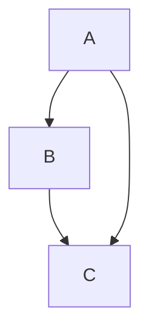
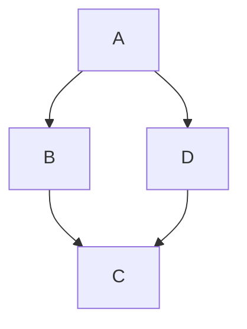
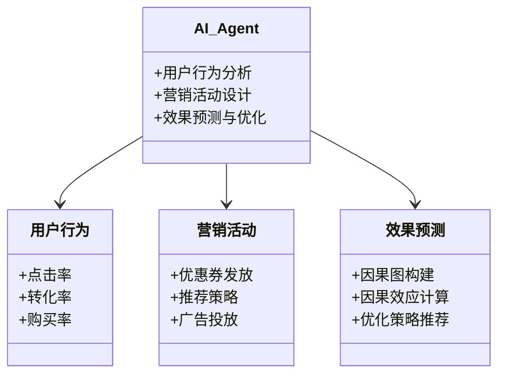
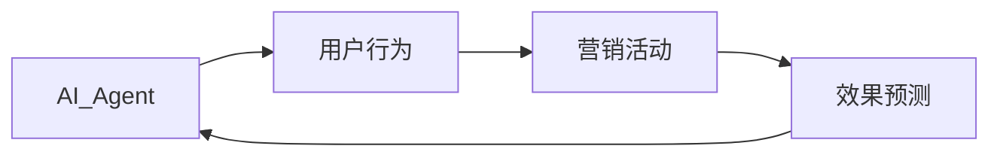

                 


# 《企业AI Agent的因果推理应用：深入理解业务逻辑》

---

## 关键词

- 企业AI Agent
- 因果推理
- 业务逻辑
- 系统架构设计
- 项目实战

---

## 摘要

企业AI Agent是人工智能技术与企业业务深度融合的产物，其核心能力之一是因果推理。因果推理能够帮助AI Agent理解业务逻辑中的因果关系，从而做出更智能、更可靠的决策。本文将从背景、核心概念、算法原理、系统架构设计、项目实战等角度，深入探讨企业AI Agent的因果推理应用，结合具体案例，分析其在实际业务中的应用价值和实现方法。

---

## 第一部分: 企业AI Agent的背景与核心概念

### 第1章: 问题背景与问题描述

#### 1.1 问题背景

随着人工智能技术的快速发展，企业AI Agent逐渐成为企业智能化转型的重要工具。AI Agent通过感知环境、理解业务逻辑、做出决策并执行操作，能够显著提升企业的运营效率和决策能力。然而，传统的统计学习方法往往只能处理相关关系，而无法理解因果关系，这使得AI Agent在复杂业务场景中的应用受到限制。

因果推理作为人工智能领域的核心技术，能够帮助AI Agent理解业务逻辑中的因果关系，从而做出更可靠的决策。因果推理不仅仅是简单的相关关系分析，而是通过分析变量之间的因果关系，理解“为什么”某一结果会发生，从而能够预测和干预结果。

#### 1.2 问题描述

企业AI Agent的核心目标是通过因果推理理解业务逻辑，实现智能决策。然而，因果推理在企业中的应用还面临以下问题：

- **复杂性**：企业业务逻辑复杂，因果关系网络庞大，如何构建和推理因果关系是关键问题。
- **数据依赖性**：因果推理需要大量的高质量数据来支持，如何获取和处理这些数据是挑战。
- **可解释性**：因果推理的结果需要具有可解释性，以便企业能够理解和信任AI Agent的决策。

#### 1.3 问题解决

因果推理在企业AI Agent中的应用主要体现在以下几个方面：

1. **业务逻辑的理解**：通过因果推理，AI Agent能够理解业务逻辑中的因果关系，从而更好地预测和干预结果。
2. **决策优化**：因果推理能够帮助AI Agent做出更优化的决策，提升企业的运营效率。
3. **风险控制**：通过因果推理，AI Agent能够识别和预测潜在风险，从而提前采取措施，降低风险。

#### 1.4 概念结构与核心要素

企业AI Agent的因果推理应用涉及以下核心要素：

- **因果关系**：变量之间的因果关系，包括直接因果关系和间接因果关系。
- **因果图**：用于表示因果关系的图形化工具，包括节点和边。
- **因果推断**：基于因果图进行因果关系的推断，包括因果路径和因果效应的计算。
- **业务逻辑**：企业业务流程中的因果关系网络，包括输入、处理、输出等环节。

---

## 第二部分: 因果推理的核心概念与联系

### 第2章: 因果推理的理论基础

#### 2.1 因果关系的定义与特征

因果关系是指一个事件（原因）导致另一个事件（结果）发生的确定性关系。因果关系具有以下特征：

- **可传递性**：如果A是B的原因，B是C的原因，那么A是C的间接原因。
- **反传递性**：如果A是B的原因，那么B不可能是A的原因。
- **对称性**：因果关系是不可对称的，即如果A是B的原因，B不可能是A的原因。

#### 2.2 因果图的构建与分析

因果图是一种用于表示因果关系的图形化工具，由节点和边组成，节点表示变量，边表示因果关系。因果图的构建步骤如下：

1. **变量识别**：识别与问题相关的所有变量。
2. **因果关系确定**：根据领域知识确定变量之间的因果关系。
3. **图的绘制**：将变量和因果关系绘制为因果图。

以下是因果图的示例：



在上述因果图中，A是B和C的共同原因，B是C的直接原因。

---

### 第3章: 因果推断与业务逻辑

#### 3.1 因果推断的基本方法

因果推断是指基于因果图进行因果关系的推断，主要包括以下方法：

1. **潜在结果框架**：通过分析潜在结果来推断因果效应。
2. **因果路径分析**：通过分析因果路径来确定因果关系。
3. **倾向评分匹配**：通过匹配倾向评分来消除混杂变量的影响。

#### 3.2 业务逻辑中的因果关系网络

业务逻辑中的因果关系网络是一个复杂的因果图，包含多个变量和因果关系。以下是业务逻辑中的因果关系网络示例：



在上述因果图中，A是B和D的共同原因，B是C的直接原因，D是C的间接原因。

---

## 第三部分: 因果推理的算法原理

### 第4章: 基于潜在结果的因果推理算法

#### 4.1 潜在结果框架

潜在结果框架是一种常用的因果推理方法，其核心思想是通过分析潜在结果来推断因果效应。具体步骤如下：

1. **定义潜在结果**：对于每个处理变量，定义其潜在结果。
2. **计算因果效应**：通过比较潜在结果来计算因果效应。
3. **估计因果效应**：通过统计方法估计因果效应。

#### 4.2 倾向评分匹配

倾向评分匹配是一种常用的因果推断方法，通过匹配倾向评分来消除混杂变量的影响。具体步骤如下：

1. **估计倾向评分**：通过机器学习方法估计倾向评分。
2. **匹配样本**：根据倾向评分匹配样本。
3. **计算因果效应**：通过匹配样本计算因果效应。

以下是倾向评分匹配的Python代码示例：

```python
import numpy as np
import pandas as pd
from sklearn.linear_model import LogisticRegression

# 生成数据
n = 1000
X = pd.DataFrame({
    'A': np.random.binomial(1, 0.5, n),
    'B': np.random.binomial(1, 0.5, n),
    'C': np.random.binomial(1, 0.5, n)
})

# 定义倾向评分模型
model = LogisticRegression()
model.fit(X[['A', 'B']], X['C'])

# 估计倾向评分
treat = X['C']
control = 1 - treat
treated = X[treat == 1]
control = X[treat == 0]

# 计算平均处理效应（ATE）
ate = treated.mean() - control.mean()
print("ATE:", ate)
```

---

## 第四部分: 系统架构设计与实现

### 第5章: 系统架构设计

#### 5.1 问题场景介绍

假设我们有一个电商企业，希望利用AI Agent优化营销策略。AI Agent需要通过因果推理理解用户行为，优化营销活动的效果。

#### 5.2 项目介绍

项目目标：通过因果推理优化营销活动效果。

项目范围：用户行为分析、营销活动设计、效果预测与优化。

系统功能设计：



系统架构设计：



---

## 第五部分: 项目实战与应用

### 第6章: 项目实战

#### 6.1 环境安装

安装必要的Python库：

```bash
pip install numpy pandas scikit-learn
```

#### 6.2 核心代码实现

以下是因果推理算法的Python代码示例：

```python
import numpy as np
import pandas as pd
from sklearn.linear_model import LogisticRegression

# 生成数据
n = 1000
X = pd.DataFrame({
    'A': np.random.binomial(1, 0.5, n),
    'B': np.random.binomial(1, 0.5, n),
    'C': np.random.binomial(1, 0.5, n)
})

# 定义倾向评分模型
model = LogisticRegression()
model.fit(X[['A', 'B']], X['C'])

# 估计倾向评分
treat = X['C']
control = 1 - treat
treated = X[treat == 1]
control = X[treat == 0]

# 计算平均处理效应（ATE）
ate = treated.mean() - control.mean()
print("ATE:", ate)
```

#### 6.3 应用解读与分析

通过上述代码，我们可以计算出营销活动的平均处理效应（ATE），从而优化营销策略。

---

## 第六部分: 最佳实践与总结

### 第7章: 最佳实践

#### 7.1 小结

因果推理是企业AI Agent的核心能力之一，通过因果推理可以理解业务逻辑中的因果关系，从而做出更智能、更可靠的决策。

#### 7.2 注意事项

- 数据质量：因果推理需要高质量的数据，数据不足或不准确会影响因果效应的计算。
- 模型选择：选择合适的因果推理方法和模型，结合领域知识和数据特征。
- 可解释性：因果推理的结果需要具有可解释性，以便企业能够理解和信任AI Agent的决策。

#### 7.3 拓展阅读

- 参考文献：推荐几本因果推理的经典书籍和论文。
- 在线资源：推荐一些因果推理的在线课程和工具。

---

## 结语

企业AI Agent的因果推理应用是一个复杂而重要的领域，通过本文的探讨，我们深入理解了因果推理的核心概念、算法原理、系统架构设计和项目实战。未来，随着人工智能技术的不断发展，因果推理将在企业AI Agent中发挥越来越重要的作用，帮助企业实现更智能、更高效的决策。

