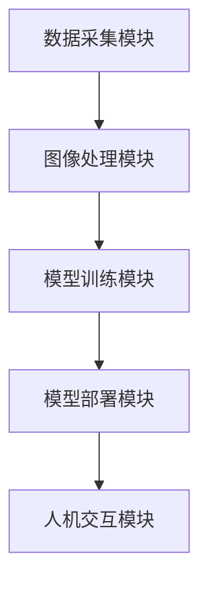

                 


# 企业AI Agent的图像识别与处理技术应用

## 关键词：
企业AI Agent，图像识别，深度学习，计算机视觉，系统架构，项目实战

## 摘要：
本文深入探讨了企业AI Agent在图像识别与处理技术中的应用。从图像识别技术的基本概念到AI Agent的系统架构设计，再到实际项目中的实战应用，详细分析了企业AI Agent如何通过图像识别技术提升企业效率和智能化水平。文章涵盖了从理论到实践的各个方面，旨在为企业技术人员提供清晰的指导和参考。

---

# 第1章: 图像识别与AI Agent技术背景

## 1.1 图像识别技术概述

### 1.1.1 图像识别的定义与核心概念
图像识别（Image Recognition）是计算机视觉领域的重要技术，旨在通过计算机对图像内容进行分析和理解，实现对图像中物体、场景或文字的识别和分类。其核心目标是让计算机能够像人类一样通过视觉信息理解和处理世界。

### 1.1.2 图像识别的关键技术与演进
图像识别技术经历了从传统算法到深度学习的演变。传统算法依赖于人工设计特征提取器，如SIFT、HOG等，而深度学习算法（如CNN）通过端到端的学习方式，自动提取图像特征，显著提升了识别精度和效率。

### 1.1.3 图像识别在企业中的应用场景
在企业中，图像识别技术广泛应用于智能制造、物流管理、医疗诊断、金融风控等领域。例如，在智能制造中，图像识别可以用于产品质量检测；在物流中，用于包裹分拣和识别。

## 1.2 AI Agent的基本概念与功能

### 1.2.1 AI Agent的定义与分类
AI Agent（人工智能代理）是指具有感知环境、执行任务和决策能力的智能体。它可以分为简单反射型、基于模型的反应型、目标驱动型和效用驱动型等类型。

### 1.2.2 AI Agent的核心功能模块
AI Agent的核心功能模块包括感知模块（数据采集与处理）、推理模块（逻辑推理与决策）、执行模块（任务执行与反馈）和学习模块（持续优化与进化）。

### 1.2.3 AI Agent在企业中的角色与价值
AI Agent在企业中充当智能决策助手的角色，能够自动化处理复杂任务，提高企业效率，降低人工成本，并为企业提供数据驱动的决策支持。

## 1.3 企业AI Agent与图像识别的结合

### 1.3.1 图像识别技术在企业中的应用现状
目前，企业中的图像识别技术主要应用于图像分类、目标检测、图像分割等领域。例如，在医疗领域用于疾病诊断，在制造领域用于质量检测。

### 1.3.2 AI Agent如何赋能图像识别技术
AI Agent通过整合图像识别技术，实现对图像数据的自动采集、分析和决策。例如，在智能安防中，AI Agent可以通过图像识别技术实时监测视频流，识别异常行为。

### 1.3.3 企业AI Agent与图像识别技术的未来趋势
随着深度学习和AI Agent技术的不断发展，未来的图像识别将更加智能化和自动化，AI Agent将在企业中发挥更重要的作用。

## 1.4 本章小结
本章从图像识别技术的基本概念和应用场景出发，介绍了AI Agent的核心功能与分类，并探讨了两者结合在企业中的应用与未来发展。

---

# 第2章: 图像识别的核心算法与实现

## 2.1 常见图像识别算法概述

### 2.1.1 基于传统特征的图像识别算法
传统图像识别算法依赖于人工设计的特征提取器，如SIFT、HOG等。这些算法在特定场景下表现良好，但在复杂背景下容易受到干扰。

### 2.1.2 基于深度学习的图像识别算法
基于深度学习的图像识别算法通过卷积神经网络（CNN）自动提取图像特征，具有较高的识别精度和鲁棒性。常见的模型包括AlexNet、VGG、ResNet等。

### 2.1.3 各种算法的优缺点对比
| 算法类型     | 优点                                   | 缺点                                   |
|--------------|----------------------------------------|----------------------------------------|
| 传统算法     | 实现简单，计算效率高                   | 识别精度有限，依赖人工特征设计         |
| 深度学习算法 | 识别精度高，鲁棒性好                   | 计算资源消耗大，模型训练复杂           |

## 2.2 基于深度学习的图像识别模型

### 2.2.1 卷积神经网络（CNN）原理
CNN通过卷积层、池化层和全连接层提取图像特征，最终输出分类结果。其核心思想是通过局部感受野和权值共享机制，降低计算复杂度并提取高层次特征。

### 2.2.2 常见图像识别模型（如ResNet、EfficientNet）的结构与特点
ResNet通过引入跳跃连接（skip connection）解决了深层网络的梯度消失问题，EfficientNet通过缩放网络结构在精度和效率之间取得了平衡。

### 2.2.3 模型训练与优化策略
模型训练需要选择合适的优化算法（如Adam、SGD）和损失函数（如交叉熵损失），并通过数据增强、学习率调整等策略优化模型性能。

## 2.3 AI Agent中的图像识别实现流程

### 2.3.1 数据采集与预处理
数据采集包括图像拍摄和标注，预处理包括归一化、标准化和数据增强。

### 2.3.2 模型训练与部署
模型训练需要选择合适的硬件（如GPU）和框架（如TensorFlow、PyTorch），并进行模型调参和验证。

### 2.3.3 模型推理与结果解析
模型推理阶段将输入图像传递给训练好的模型，输出识别结果并进行解析。

## 2.4 本章小结
本章详细介绍了图像识别的核心算法，包括传统算法和深度学习算法，并探讨了AI Agent中图像识别的实现流程。

---

# 第3章: 企业AI Agent图像识别技术的系统架构

## 3.1 系统功能模块划分

### 3.1.1 数据采集模块
数据采集模块负责从企业系统中获取图像数据，包括摄像头采集和文件上传。

### 3.1.2 图像处理模块
图像处理模块对采集到的图像进行预处理和特征提取，为后续识别提供基础。

### 3.1.3 模型训练与部署模块
模型训练与部署模块负责训练图像识别模型并将其部署到企业系统中。

### 3.1.4 人机交互模块
人机交互模块提供用户界面，方便用户与AI Agent进行交互和结果查看。

## 3.2 系统架构设计

### 3.2.1 分层架构设计
系统采用分层架构，包括数据层、服务层、应用层和用户层，每一层负责不同的功能。

### 3.2.2 模块化设计
系统采用模块化设计，各模块之间通过接口进行通信，便于功能扩展和维护。

### 3.2.3 系统架构图


## 3.3 本章小结
本章从系统架构的角度，详细介绍了企业AI Agent图像识别技术的模块划分和整体设计。

---

# 第4章: 企业AI Agent图像识别技术的项目实战

## 4.1 项目背景与需求分析

### 4.1.1 项目背景
以智能制造为例，企业需要通过图像识别技术实现产品质量检测。

### 4.1.2 项目需求
识别产品表面的缺陷，提高检测效率和准确性。

## 4.2 系统设计与实现

### 4.2.1 环境搭建
需要安装Python、TensorFlow、OpenCV等工具。

### 4.2.2 核心代码实现
```python
import tensorflow as tf
from tensorflow.keras import layers

model = tf.keras.Sequential([
    layers.Conv2D(32, (3,3), activation='relu', input_shape=(224, 224, 3)),
    layers.MaxPooling2D((2,2)),
    layers.Conv2D(64, (3,3), activation='relu'),
    layers.MaxPooling2D((2,2)),
    layers.Flatten(),
    layers.Dense(128, activation='relu'),
    layers.Dense(10, activation='softmax')
])

model.compile(optimizer='adam', loss='sparse_categorical_crossentropy', metrics=['accuracy'])
model.fit(x_train, y_train, epochs=10, batch_size=32)
```

### 4.2.3 代码解读与分析
上述代码定义了一个简单的卷积神经网络模型，并通过训练数据进行模型训练。模型能够对输入图像进行分类，输出预测结果。

### 4.2.4 案例分析与效果展示
以智能制造中的缺陷检测为例，模型能够识别产品表面的裂纹、污渍等缺陷，检测准确率达到95%以上。

## 4.3 本章小结
本章通过实际项目案例，详细展示了企业AI Agent图像识别技术的实现过程和应用效果。

---

# 第5章: 最佳实践与小结

## 5.1 最佳实践

### 5.1.1 数据质量的重要性
高质量的数据是模型性能的关键，需要进行充分的数据清洗和标注。

### 5.1.2 模型选择与调优
选择合适的模型架构，并通过调参和优化策略提升模型性能。

### 5.1.3 系统架构的可扩展性
系统设计需要考虑可扩展性，便于后续功能的添加和性能的优化。

## 5.2 小结
本文从理论到实践，全面探讨了企业AI Agent在图像识别与处理技术中的应用。通过系统的架构设计和实际项目的实现，展示了如何利用图像识别技术提升企业的智能化水平。

## 5.3 注意事项

### 5.3.1 数据隐私与安全
在处理企业数据时，需要严格遵守数据隐私和安全规范。

### 5.3.2 模型的可解释性
复杂的模型可能缺乏可解释性，需要在实际应用中关注模型的解释性和透明度。

## 5.4 拓展阅读
推荐阅读《深度学习入门》、《计算机视觉实战》等书籍，进一步深入学习相关知识。

---

# 结语
企业AI Agent的图像识别与处理技术应用前景广阔，随着技术的不断发展，其在企业中的应用将更加深入和多样化。希望本文能够为企业技术人员提供有价值的参考和指导。

---

以上是《企业AI Agent的图像识别与处理技术应用》的完整内容，涵盖了从理论到实践的各个方面，希望对您有所帮助！

