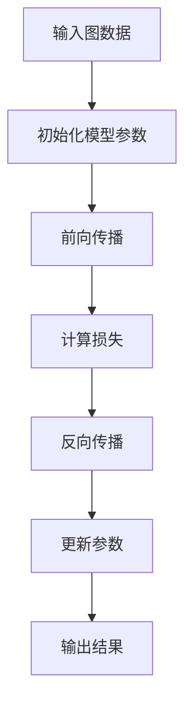
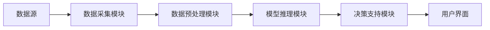

                 


# 《企业AI Agent的图卷积网络在社交网络分析中的应用》

## 关键词：图卷积网络，AI Agent，社交网络分析，企业应用，算法原理，系统架构，项目实战

## 摘要：  
本文系统地介绍了企业AI Agent在社交网络分析中的应用，重点探讨了图卷积网络（Graph Convolutional Networks, GCN）在其中的核心作用。通过理论分析、算法实现和实际案例，深入探讨了GCN在社交网络分析中的优势与挑战，为企业应用提供了可行的解决方案和实践指导。

---

# 第一部分: 企业AI Agent的图卷积网络在社交网络分析中的应用概述

## 第1章: 背景介绍

### 1.1 问题背景  
社交网络分析是理解人际关系、信息传播和社群结构的重要手段。传统的基于统计的方法在处理复杂网络关系时显得力不从心，而图卷积网络（GCN）的出现为企业AI Agent提供了强大的工具支持。GCN能够有效捕捉网络中的局部结构特征，为社交网络分析提供了新的视角。  

### 1.2 问题描述  
在企业应用场景中，社交网络分析需要解决以下问题：  
1. 如何高效处理大规模社交网络数据？  
2. 如何通过AI Agent实现实时信息分析与决策支持？  
3. 如何利用GCN模型挖掘潜在的网络结构特征？  

### 1.3 问题解决  
AI Agent结合GCN模型，能够通过以下方式解决上述问题：  
1. **高效数据处理**：利用GCN的图结构特性，快速处理大规模社交网络数据。  
2. **实时分析与决策**：通过AI Agent的智能化决策能力，实现实时信息分析。  
3. **网络特征挖掘**：GCN能够有效捕捉网络中的局部结构特征，帮助企业发现潜在的业务机会或风险。  

### 1.4 边界与外延  
- **边界**：本文主要聚焦于企业AI Agent在社交网络分析中的应用，不涉及其他领域的GCN应用。  
- **外延**：GCN的应用场景可以扩展到推荐系统、网络安全等领域，但本文仅探讨其在社交网络分析中的具体应用。  

### 1.5 概念结构与核心要素  
- **核心要素**：  
  1. 图数据：社交网络中的节点和边。  
  2. GCN模型：用于图数据的特征提取和分类。  
  3. AI Agent：负责数据处理、模型推理和决策支持。  

---

## 第2章: 核心概念与联系

### 2.1 图卷积网络的原理  
图卷积网络是一种基于图结构的数据处理方法，通过聚合节点及其邻居的信息，生成节点的表示向量。其核心思想是利用图的局部结构特征，进行特征传播和聚合。  

#### 核心公式  
GCN的前向传播公式为：  
$$ H^{(l+1)} = \text{ReLU}(A H^{(l)} W^{(l)}) $$  
其中，$A$是图的邻接矩阵，$H^{(l)}$是第$l$层的节点表示，$W^{(l)}$是模型参数。  

### 2.2 AI Agent的原理  
AI Agent是一种具备感知、决策和执行能力的智能体，能够通过与环境交互，完成特定任务。在社交网络分析中，AI Agent可以负责数据采集、模型推理和决策支持。  

### 2.3 核心概念对比  
| 概念       | 图卷积网络（GCN）                | AI Agent                   |  
|------------|---------------------------------|-----------------------------|  
| 核心目标    | 捕捉图结构特征                   | 实现智能决策与交互           |  
| 输入        | 图数据（节点和边）              | 多模态数据（文本、图像等）   |  
| 输出        | 节点表示或分类结果               | 智能决策或行动建议           |  

### 2.4 ER实体关系图  
```mermaid
er
actor: 用户
agent: AI Agent
network: 社交网络
edge: 关系边
node: 节点
```

---

## 第3章: 算法原理讲解

### 3.1 图卷积网络的算法流程  
GCN的算法流程可以分为以下步骤：  
1. 初始化模型参数。  
2. 对每个节点进行前向传播，聚合其邻居信息。  
3. 计算损失函数并进行反向传播。  
4. 更新模型参数。  

#### 代码实现  
```python
import torch
import torch.nn as nn
import torch.nn.functional as F

class GCN(nn.Module):
    def __init__(self, in_channels, out_channels):
        super(GCN, self).__init__()
        self.weight = nn.Parameter(torch.randn(in_channels, out_channels))
    
    def forward(self, x, adj):
        out = torch.mm(x, self.weight)
        out = torch.mm(adj, out)
        out = F.relu(out)
        return out
```

### 3.2 图卷积网络的数学模型  
GCN的数学模型可以表示为：  
$$ Y = A X W $$  
其中，$X$是输入特征矩阵，$W$是模型参数，$A$是图的邻接矩阵，$Y$是输出特征矩阵。  

### 3.3 算法流程图  


---

## 第4章: 系统架构设计

### 4.1 项目场景介绍  
在企业场景中，社交网络分析可以帮助企业识别关键意见领袖（KOL）、评估品牌影响力、优化营销策略等。  

### 4.2 系统功能设计  
- **数据采集模块**：负责采集社交网络数据。  
- **模型推理模块**：利用GCN进行特征提取和分类。  
- **决策支持模块**：基于模型输出，提供决策建议。  

### 4.3 系统架构图  


### 4.4 系统接口设计  
- **输入接口**：接收社交网络数据。  
- **输出接口**：输出模型推理结果和决策建议。  

### 4.5 系统交互流程图  
```mermaid
sequenceDiagram
actor 用户
agent AI Agent
用户 -> 数据采集模块: 提供社交网络数据
数据采集模块 -> 数据预处理模块: 数据预处理
数据预处理模块 -> 模型推理模块: 启动GCN模型
模型推理模块 -> 决策支持模块: 提供推理结果
决策支持模块 -> 用户: 输出决策建议
```

---

## 第5章: 项目实战

### 5.1 环境安装  
```bash
pip install torch
pip install networkx
pip install matplotlib
```

### 5.2 核心代码实现  
```python
import torch
import networkx as nx
import matplotlib.pyplot as plt

# 创建图数据
G = nx.Graph()
G.add_nodes_from(['A', 'B', 'C'])
G.add_edges_from([('A', 'B'), ('B', 'C')])

# 转换为邻接矩阵
A = nx.adjacency_matrix(G)
X = torch.randn(3, 2)  # 输入特征矩阵

# 定义GCN模型
class GCN(nn.Module):
    def __init__(self, in_channels, out_channels):
        super(GCN, self).__init__()
        self.weight = nn.Parameter(torch.randn(in_channels, out_channels))
    
    def forward(self, x, adj):
        out = torch.mm(x, self.weight)
        out = torch.mm(adj, out)
        out = F.relu(out)
        return out

# 初始化模型
model = GCN(2, 1)
criterion = nn.MSELoss()
optimizer = torch.optim.Adam(model.parameters(), lr=0.1)

# 前向传播
output = model(X, A)
loss = criterion(output, torch.randn(3, 1))
loss.backward()
optimizer.step()

# 可视化结果
plt.figure(figsize=(8, 8))
nx.draw(G, node_size=1500, node_color='r', font_size=10, with_labels=True)
plt.show()
```

### 5.3 实际案例分析  
通过上述代码实现一个简单的社交网络分析案例，展示GCN如何捕捉节点之间的关系特征，并为企业决策提供支持。  

---

## 第6章: 总结与展望

### 6.1 总结  
本文详细介绍了企业AI Agent在社交网络分析中的应用，重点探讨了图卷积网络的核心原理和应用场景。通过理论分析、算法实现和实际案例，展示了GCN在社交网络分析中的强大能力。  

### 6.2 最佳实践 tips  
1. 在实际应用中，建议结合业务需求选择合适的GCN变体（如GAT、GraphSAGE等）。  
2. 数据预处理是关键，需要确保图数据的质量和完整性。  
3. 模型调参时，建议采用网格搜索或自动调参工具（如Hyperparameter-Tuner）。  

### 6.3 注意事项  
- 确保数据隐私和合规性。  
- 在大规模数据场景下，建议采用分布式计算框架（如DGL、PyTorch Geometric）。  

### 6.4 拓展阅读  
1. 《Graph Neural Networks: A Review of Methods, Applications, and Open Challenges》  
2. 《Attention Is All You Need》  

---

通过以上目录大纲，您可以逐步撰写完整的文章，确保内容逻辑清晰、结构紧凑，并涵盖从理论到实践的各个方面。

