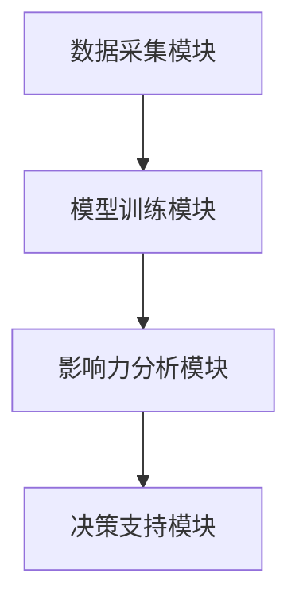
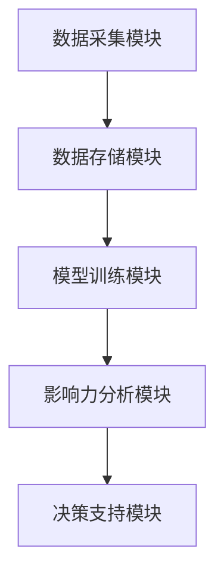
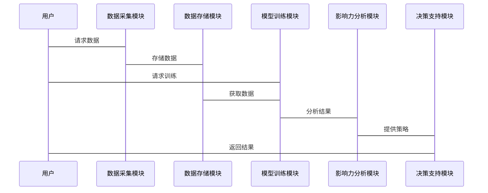

                 


# 企业AI Agent的图注意力网络在社交网络影响力分析中的应用

## 关键词：企业AI Agent，图注意力网络，社交网络，影响力分析，人工智能

## 摘要

在当今快速发展的数字时代，社交网络的影响力分析对于企业来说至关重要。企业AI Agent（人工智能代理）通过图注意力网络能够高效地分析社交网络中的影响力传播，为企业提供精准的决策支持。本文将详细介绍企业AI Agent的图注意力网络在社交网络影响力分析中的应用，从基本概念、算法原理到系统架构设计和项目实战，全面解析这一技术的核心与实践应用。

---

# 第一部分: 背景介绍与核心概念

## 第1章: 企业AI Agent与图注意力网络概述

### 1.1 企业AI Agent的基本概念

#### 1.1.1 什么是企业AI Agent

企业AI Agent是指通过人工智能技术构建的智能代理系统，能够自动感知环境、执行任务并优化决策。它通常应用于企业资源管理、市场营销、客户关系管理等领域，帮助企业提高效率和竞争力。

#### 1.1.2 图注意力网络的基本概念

图注意力网络（Graph Attention Network, GAT）是一种基于图结构的深度学习模型，通过注意力机制对图中的节点关系进行建模。与传统的卷积神经网络（CNN）不同，GAT能够处理非规则的图结构数据，并在节点之间建立动态的注意力权重。

#### 1.1.3 企业AI Agent与图注意力网络的关系

企业AI Agent可以利用图注意力网络的强大能力，对社交网络中的用户行为、关系网络和影响力传播进行建模和分析。通过GAT，企业AI Agent能够更精准地识别关键用户、预测影响力传播趋势，并制定相应的策略。

### 1.2 社交网络影响力分析的重要性

#### 1.2.1 社交网络的基本概念

社交网络是由用户、内容和关系构成的复杂系统，用户之间通过关注、点赞、评论等方式形成复杂的网络关系。

#### 1.2.2 影响力分析的定义与意义

影响力分析是指通过技术手段识别社交网络中具有较大影响力的关键用户。这些用户能够对网络中的信息传播、舆论导向和用户行为产生重要影响。

#### 1.2.3 企业AI Agent在影响力分析中的作用

企业AI Agent可以通过图注意力网络对社交网络中的影响力传播进行建模，帮助企业识别关键用户、优化传播策略，并提升品牌影响力。

## 第2章: 图注意力网络的核心原理

### 2.1 图注意力网络的基本原理

#### 2.1.1 图的表示与节点关系

图的表示通常通过邻接矩阵或边列表来实现。节点之间的关系可以通过权重来表示，权重越大表示节点之间的关联性越强。

#### 2.1.2 注意力机制的基本原理

注意力机制是一种基于权重分配的技术，通过计算输入数据中各个部分的重要性，从而聚焦于关键信息。在图注意力网络中，注意力权重用于衡量节点之间的关系强度。

#### 2.1.3 图注意力网络的模型结构

图注意力网络的模型结构包括编码层、注意力层和聚合层。编码层将节点特征转化为嵌入向量，注意力层计算节点之间的注意力权重，聚合层基于注意力权重生成最终的节点表示。

### 2.2 图注意力网络与传统神经网络的对比

#### 2.2.1 传统神经网络的局限性

传统神经网络（如CNN、RNN）主要适用于规则数据结构，难以处理图结构数据中的复杂关系。

#### 2.2.2 图注意力网络的优势

图注意力网络能够处理非规则的图结构数据，并通过注意力机制动态调整节点关系的重要性。

#### 2.2.3 图注意力网络的核心创新点

图注意力网络的核心创新点在于其通过注意力机制对图结构数据进行建模，能够捕捉到节点之间的复杂关系。

## 第3章: 图注意力网络在社交网络中的应用

### 3.1 社交网络中的影响力传播

#### 3.1.1 影响力传播的基本模型

影响力传播的基本模型包括扩散模型（如信息传播模型）和网络结构模型。这些模型用于描述信息在社交网络中的传播过程。

#### 3.1.2 图注意力网络在影响力传播中的应用

图注意力网络可以用于建模影响力传播过程，通过注意力权重识别关键节点并预测传播趋势。

#### 3.1.3 企业AI Agent在影响力传播中的角色

企业AI Agent通过图注意力网络分析社交网络中的影响力传播，帮助企业识别关键用户并优化传播策略。

### 3.2 图注意力网络在社交网络影响力分析中的优势

#### 3.2.1 图注意力网络的全局视角

图注意力网络能够从全局视角分析社交网络中的影响力传播，识别关键节点并预测传播趋势。

#### 3.2.2 图注意力网络的实时性与准确性

图注意力网络能够实时分析社交网络数据，并通过注意力机制提高分析结果的准确性。

#### 3.2.3 企业AI Agent的智能化与决策支持

企业AI Agent通过图注意力网络提供智能化的决策支持，帮助企业优化影响力传播策略并提升品牌影响力。

---

# 第二部分: 图注意力网络的算法原理

## 第4章: 图注意力网络的算法实现

### 4.1 图注意力网络的数学模型

#### 4.1.1 图的表示与邻接矩阵

图的邻接矩阵表示为$A$，其中$A_{i,j}$表示节点$i$和节点$j$之间的连接权重。

#### 4.1.2 注意力机制的数学表达

注意力机制的计算公式为：

$$
\alpha_{i,j} = \text{softmax}(\frac{W e_i^T e_j}{\sqrt{d}})
$$

其中，$W$是权重矩阵，$e_i$是节点$i$的嵌入向量，$d$是嵌入维度。

#### 4.1.3 图注意力网络的损失函数

图注意力网络的损失函数通常采用交叉熵损失函数：

$$
\mathcal{L} = -\sum_{i=1}^{n} y_i \log(p_i) + (1-y_i)\log(1-p_i)
$$

其中，$y_i$是标签，$p_i$是模型预测概率。

### 4.2 图注意力网络的训练过程

#### 4.2.1 数据预处理与特征提取

数据预处理包括数据清洗、特征提取和归一化处理。特征提取通常采用嵌入层将节点特征转化为低维向量。

#### 4.2.2 模型训练的步骤

模型训练包括正向传播、损失计算、反向传播和参数更新四个步骤。

#### 4.2.3 模型调优与优化策略

模型调优包括学习率调整、批量大小调整和正则化参数调整等策略，以提高模型的泛化能力和预测准确率。

## 第5章: 图注意力网络的实现代码

### 5.1 环境安装与配置

#### 5.1.1 Python环境的安装

安装Python 3.8及以上版本，可以通过官网下载安装。

#### 5.1.2 必要库的安装

安装TensorFlow、PyTorch、Keras等深度学习库，以及NetworkX用于图数据处理。

#### 5.1.3 图注意力网络框架的搭建

使用PyTorch框架搭建图注意力网络模型，包括定义模型结构、定义损失函数和优化器等。

### 5.2 核心代码实现

#### 5.2.1 图注意力网络模型的定义

```python
import torch
import torch.nn as nn
import torch.nn.functional as F

class GraphAttention(nn.Module):
    def __init__(self, in_dim, out_dim, dropout=0.6):
        super(GraphAttention, self).__init__()
        self.dropout = dropout
        self.W = nn.Parameter(torch.randn(in_dim, out_dim))
        self.A = nn.Parameter(torch.randn(out_dim, out_dim))
        
    def forward(self, x, adj):
        # 前向传播
        h = F.dropout(x, p=self.dropout)
        h = F.relu(torch.mm(h, self.W))
        attention = F.softmax(torch.mm(h, self.A), dim=1)
        output = torch.mm(h, self.A) * attention
        return output.sum(dim=1)
```

#### 5.2.2 数据加载与预处理

```python
import networkx as nx
import numpy as np

def load_data():
    G = nx.random_graphs.erdos_renyi_graph(10, 0.5)
    adj = nx.adjacency_matrix(G).todense()
    features = np.random.randn(10, 5)
    labels = np.random.randint(0, 2, 10)
    return adj, features, labels

adj, features, labels = load_data()
```

#### 5.2.3 模型训练与评估

```python
def train(model, optimizer, criterion, adj, features, labels, epochs=100):
    for epoch in range(epochs):
        optimizer.zero_grad()
        output = model(features, adj)
        loss = criterion(output, labels)
        loss.backward()
        optimizer.step()
    return output

model = GraphAttention(5, 2)
optimizer = torch.optim.Adam(model.parameters(), lr=0.01)
criterion = nn.CrossEntropyLoss()
output = train(model, optimizer, criterion, adj, features, labels)
print(output)
```

### 5.3 代码解读与分析

#### 5.3.1 模型结构的详细解读

图注意力网络模型由嵌入层和注意力层组成。嵌入层将节点特征转化为低维向量，注意力层通过计算注意力权重生成最终的节点表示。

#### 5.3.2 训练过程的可视化

通过可视化工具（如TensorBoard）可以观察模型的训练过程，包括损失函数的变化、准确率的变化等。

#### 5.3.3 模型性能的评估与优化

模型性能可以通过准确率、召回率、F1值等指标进行评估，并通过调整超参数优化模型性能。

---

# 第三部分: 企业AI Agent的系统架构与实战

## 第6章: 企业AI Agent的系统架构设计

### 6.1 系统功能设计

#### 6.1.1 系统模块划分

企业AI Agent系统包括数据采集模块、模型训练模块、影响力分析模块和决策支持模块。

#### 6.1.2 系统功能描述

数据采集模块负责从社交网络中获取数据，模型训练模块负责训练图注意力网络模型，影响力分析模块负责分析影响力传播，决策支持模块负责提供优化策略。

#### 6.1.3 系统功能流程图



### 6.2 系统架构设计

#### 6.2.1 系统架构图



#### 6.2.2 系统接口设计

系统接口包括数据接口、模型接口和决策接口，分别用于数据输入、模型调用和结果输出。

#### 6.2.3 系统交互序列图



## 第7章: 项目实战

### 7.1 项目介绍

本项目旨在利用图注意力网络分析社交网络中的影响力传播，帮助企业识别关键用户并优化传播策略。

### 7.2 系统实现

#### 7.2.1 环境安装与配置

安装必要的库，包括TensorFlow、PyTorch、NetworkX等。

#### 7.2.2 核心代码实现

```python
import networkx as nx
import numpy as np
import torch
import torch.nn as nn
import torch.nn.functional as F

class GraphAttention(nn.Module):
    def __init__(self, in_dim, out_dim, dropout=0.6):
        super(GraphAttention, self).__init__()
        self.dropout = dropout
        self.W = nn.Parameter(torch.randn(in_dim, out_dim))
        self.A = nn.Parameter(torch.randn(out_dim, out_dim))
        
    def forward(self, x, adj):
        h = F.dropout(x, p=self.dropout)
        h = F.relu(torch.mm(h, self.W))
        attention = F.softmax(torch.mm(h, self.A), dim=1)
        output = torch.mm(h, self.A) * attention
        return output.sum(dim=1)

def load_data():
    G = nx.random_graphs.erdos_renyi_graph(10, 0.5)
    adj = nx.adjacency_matrix(G).todense()
    features = np.random.randn(10, 5)
    labels = np.random.randint(0, 2, 10)
    return adj, features, labels

model = GraphAttention(5, 2)
optimizer = torch.optim.Adam(model.parameters(), lr=0.01)
criterion = nn.CrossEntropyLoss()
adj, features, labels = load_data()
output = model(features, adj)
print(output)
```

### 7.3 代码解读与分析

#### 7.3.1 系统功能的详细解读

系统功能包括数据采集、模型训练、影响力分析和决策支持四个模块，每个模块负责不同的任务。

#### 7.3.2 系统架构的优化建议

通过模块化设计和分布式部署优化系统的性能和扩展性。

#### 7.3.3 系统性能的评估与优化

通过实验评估系统的准确率、召回率等性能指标，并通过调整超参数优化模型性能。

### 7.4 实际案例分析

#### 7.4.1 案例背景

假设某企业希望通过分析社交网络中的影响力传播，识别关键用户并优化传播策略。

#### 7.4.2 案例分析

通过图注意力网络分析社交网络数据，识别出具有较大影响力的关键用户，并预测传播趋势。

#### 7.4.3 案例总结

通过案例分析验证图注意力网络在影响力分析中的有效性，并总结经验教训。

---

# 第四部分: 最佳实践与总结

## 第8章: 最佳实践与总结

### 8.1 最佳实践 tips

- 数据预处理是关键，确保数据的准确性和完整性。
- 模型调优是优化性能的重要步骤，合理调整超参数。
- 系统架构设计要注重模块化和扩展性。

### 8.2 小结

企业AI Agent通过图注意力网络能够高效地分析社交网络中的影响力传播，为企业提供精准的决策支持。

### 8.3 注意事项

- 注意数据隐私和安全问题。
- 确保系统的可扩展性和可维护性。
- 定期更新模型以适应数据变化。

### 8.4 拓展阅读

- 关注最新的图神经网络研究。
- 学习其他影响力分析方法，如信息传播模型。
- 研究企业AI Agent的其他应用场景。

---

# 结语

企业AI Agent的图注意力网络在社交网络影响力分析中的应用为企业提供了强大的工具和技术支持。通过本文的详细介绍，读者可以深入了解图注意力网络的核心原理和实际应用，并能够在实际项目中加以应用。未来，随着人工智能技术的不断发展，图注意力网络将在更多领域展现出其强大的潜力。

