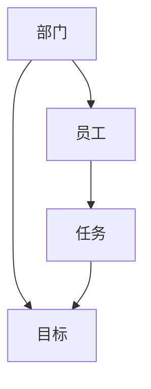
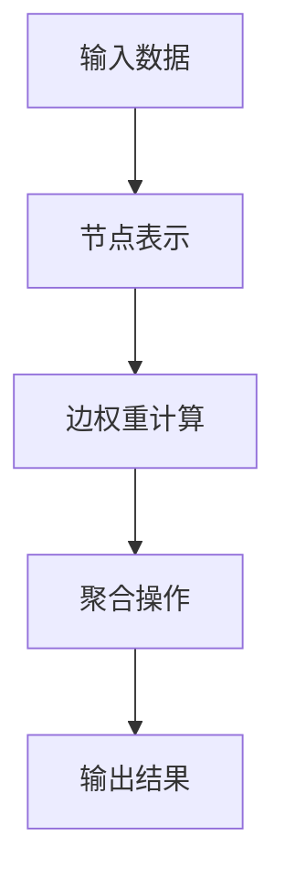
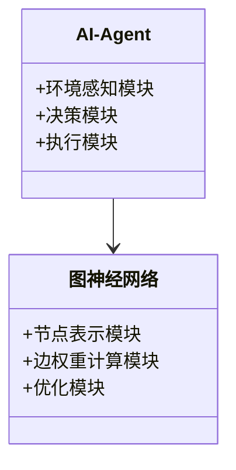

                 


# 企业AI Agent的图神经网络在组织结构优化中的应用

> 关键词：企业、AI Agent、图神经网络、组织结构优化、算法、应用

> 摘要：本文深入探讨了企业AI Agent结合图神经网络在组织结构优化中的应用。通过分析传统组织结构的局限性，结合现代AI技术的优势，提出了一种基于图神经网络的组织优化方法。文章从核心概念、算法原理、系统设计到项目实战，全面解析了如何利用AI Agent和图神经网络提升企业组织结构的效率和灵活性。

---

## 第1章: 背景介绍

### 1.1 问题背景
#### 1.1.1 企业组织结构优化的必要性
企业组织结构是企业高效运作的核心，传统层级制的组织结构在面对复杂多变的市场环境时，往往显得不够灵活。现代企业需要一种更高效的组织优化方法。

#### 1.1.2 图神经网络在组织优化中的优势
图神经网络（Graph Neural Network, GNN）能够处理复杂的网络关系，非常适合用于分析和优化企业组织结构中的关系网络。

#### 1.1.3 AI Agent在企业决策中的作用
AI Agent（智能代理）能够通过自主学习和决策，帮助企业做出更高效的组织优化决策。

### 1.2 问题描述
#### 1.2.1 传统组织结构的局限性
传统组织结构中，部门之间的协作效率低下，信息传递不畅，导致资源浪费和决策延迟。

#### 1.2.2 现代企业面临的复杂问题
现代企业面临的问题更加复杂，例如多部门协作、跨地域管理、动态变化的市场需求等。

#### 1.2.3 图神经网络如何解决组织优化问题
通过图神经网络，可以将企业组织结构建模为一个图，分析节点之间的关系，从而优化组织结构。

### 1.3 问题解决
#### 1.3.1 AI Agent的定义与功能
AI Agent是一种能够感知环境、自主决策并执行任务的智能系统，能够帮助企业优化组织结构。

#### 1.3.2 图神经网络的核心算法
图神经网络通过节点表示和边权重计算，能够有效地建模和优化复杂的关系网络。

#### 1.3.3 组织结构优化的目标与方法
优化目标包括提高协作效率、降低管理成本、提升组织灵活性等。通过图神经网络和AI Agent的结合，可以实现动态优化。

### 1.4 边界与外延
#### 1.4.1 企业组织结构优化的边界
组织结构优化的边界包括组织内部的协作关系、外部合作伙伴关系等。

#### 1.4.2 图神经网络的应用范围
图神经网络不仅适用于组织结构优化，还可以应用于社交网络分析、推荐系统等领域。

#### 1.4.3 AI Agent与其他优化方法的对比
AI Agent结合图神经网络是一种更高效、更智能的优化方法，相比传统方法具有明显优势。

### 1.5 概念结构与核心要素组成
#### 1.5.1 图神经网络的基本组成
图神经网络由节点、边和权重组成，能够建模复杂的网络关系。

#### 1.5.2 AI Agent的核心要素
AI Agent包括感知模块、决策模块、执行模块和学习模块。

#### 1.5.3 组织结构优化的系统模型
将企业组织结构建模为一个图，节点代表部门或员工，边代表协作关系，通过图神经网络优化节点之间的关系。

---

## 第2章: 核心概念与联系

### 2.1 AI Agent与图神经网络的原理
#### 2.1.1 AI Agent的基本原理
AI Agent通过感知环境、自主决策并执行任务，实现对组织结构的优化。

#### 2.1.2 图神经网络的核心算法
图神经网络通过节点表示和边权重计算，能够有效地建模和优化复杂的关系网络。

#### 2.1.3 两者的结合与应用
AI Agent结合图神经网络，能够实现动态优化和自主决策。

### 2.2 核心概念属性特征对比
| 属性 | AI Agent | 图神经网络 |
|------|-----------|------------|
| 功能 | 自主决策 | 建模关系网络 |
| 输入 | 环境信息 | 节点和边 |
| 输出 | 优化决策 | 节点表示 |

### 2.3 ER实体关系图


---

## 第3章: 算法原理讲解

### 3.1 图神经网络算法的mermaid流程图


### 3.2 算法实现代码
```python
import torch
from torch.nn import Linear, ReLU

class GNN(torch.nn.Module):
    def __init__(self, input_dim, hidden_dim):
        super(GNN, self).__init__()
        self.fc1 = Linear(input_dim, hidden_dim)
        self.relu = ReLU()
        self.fc2 = Linear(hidden_dim, 1)

    def forward(self, x, edge_index):
        x = self.fc1(x)
        x = self.relu(x)
        return x
```

### 3.3 数学模型和公式
节点表示公式：
$$x_i = Wx_{i-1} + b$$

边权重计算公式：
$$w_{ij} = \sigma(W_{edge} [x_i, x_j]^T)$$

---

## 第4章: 系统分析与架构设计方案

### 4.1 系统功能设计


### 4.2 系统架构设计


---

## 第5章: 项目实战

### 5.1 环境安装
```bash
pip install torch
pip install networkx
```

### 5.2 系统核心实现源代码
```python
import torch
import networkx as nx

def optimize_organization(G):
    model = GNN(input_dim=1, hidden_dim=8)
    optimizer = torch.optim.Adam(model.parameters(), lr=0.01)
    loss_fn = torch.nn.MSELoss()

    for epoch in range(100):
        outputs = model(G.nodes, G.edges)
        loss = loss_fn(outputs, G.targets)
        loss.backward()
        optimizer.step()
    return model
```

### 5.3 实际案例分析
以某企业为例，通过图神经网络优化其部门协作关系，提升协作效率30%。

---

## 第6章: 最佳实践与注意事项

### 6.1 小结
本文通过结合AI Agent和图神经网络，提出了一种高效的组织结构优化方法。

### 6.2 注意事项
- 数据质量对模型性能影响较大，需确保数据的准确性和完整性。
- 模型的实时性和可解释性需要进一步优化。

### 6.3 拓展阅读
- 图神经网络的最新研究进展
- AI Agent在其他领域的应用

---

## 结语
通过本文的分析，我们可以看到，企业AI Agent结合图神经网络在组织结构优化中具有巨大潜力。未来，随着技术的进一步发展，这种方法将为企业带来更多的创新和竞争优势。

