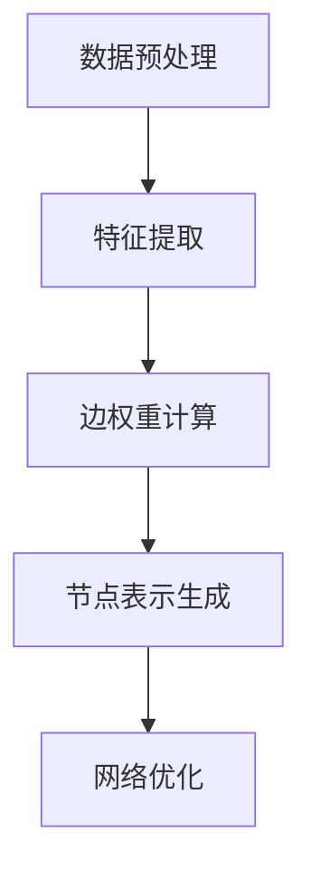
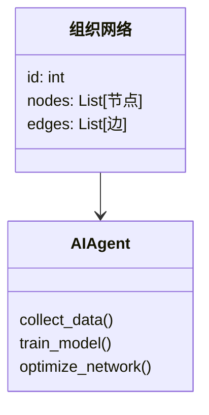
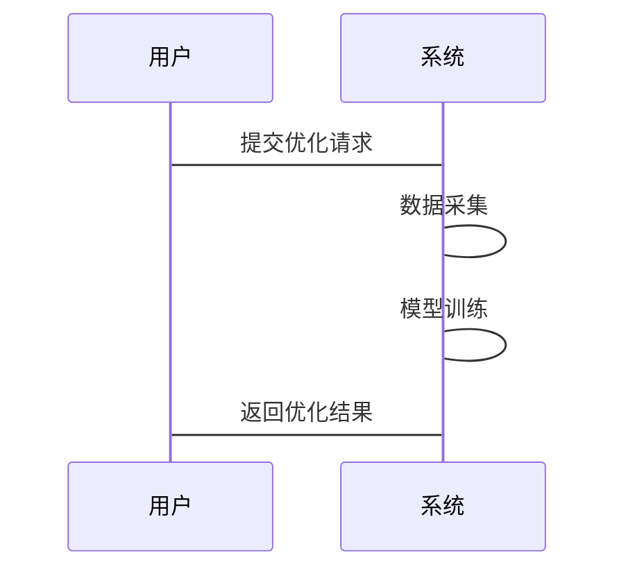

                 


# 企业AI Agent的图神经网络在组织网络分析与优化中的应用

> 关键词：企业AI Agent，图神经网络，组织网络分析，优化，网络结构

> 摘要：本文探讨了企业AI Agent如何利用图神经网络技术进行组织网络分析与优化。通过详细分析图神经网络的原理、AI Agent的角色、算法实现以及系统架构，本文展示了如何将这些技术应用于实际场景中，以提升企业的组织效率和决策能力。

---

## 第一部分: 企业AI Agent的图神经网络基础

### 第1章: 问题背景与描述

#### 1.1 问题背景
企业组织网络的复杂性与日俱增，传统的分析方法难以应对日益复杂的网络结构和动态变化。图神经网络以其强大的图表示能力和全局视角，为企业AI Agent提供了新的解决方案。

#### 1.2 问题描述
组织网络分析涉及节点（如员工、部门）和边（如协作关系、信息流）的复杂关系。传统方法依赖于规则或统计分析，缺乏深度理解和自适应优化能力。

#### 1.3 图神经网络的优势
图神经网络能够自动学习节点和边的特征，捕捉网络中的隐含关系，适用于动态网络分析和实时优化。

---

### 第2章: 核心概念与联系

#### 2.1 图神经网络原理
图神经网络通过节点表示学习和图结构分析，提取网络中的关键信息。其核心包括节点表示、边权重计算和聚合传播机制。

#### 2.2 AI Agent在组织网络中的角色
AI Agent作为智能代理，负责数据收集、模型训练和决策优化。它能够实时分析网络状态，提供个性化建议，促进组织效率提升。

#### 2.3 图神经网络与传统方法对比
| 方法 | 特性 | 优点 | 缺点 |
|------|------|------|------|
| 图神经网络 | 高效性 | 捕捉复杂关系 | 计算资源需求高 |
| 传统方法 | 简单性 | 易实现 | 难应对复杂动态 |

#### 2.4 ER实体关系图
```mermaid
er
    entity(组织) {
        id: int
        name: string
        size: int
    }
    entity(部门) {
        id: int
        name: string
        organization_id: int
    }
    entity(员工)

    relation(属于)
    relation(协作)
    relation(汇报)
```

---

## 第3章: 算法原理

#### 3.1 图神经网络的数学模型
节点表示通过聚合邻居特征生成，边权重通过注意力机制计算。公式如下：
$$
h_i = \sigma(\sum_{j \in N(i)} W_{ij} h_j)
$$
其中，$h_i$ 是节点i的表示，$N(i)$ 是节点i的邻居，$\sigma$ 是激活函数。

#### 3.2 算法流程


#### 3.3 Python代码实现
```python
import tensorflow as tf
from tensorflow.keras import layers

class GNN(tf.keras.Model):
    def __init__(self, input_dim):
        super(GNN, self).__init__()
        self.gcn = layers.GraphConvolution(input_dim, 16)

    def call(self, inputs):
        features, adj = inputs
        output = self.gcn([features, adj])
        return output

# 示例输入
input_features = tf.random.normal((100, 64))
input_adj = tf.random.normal((100, 100))
model = GNN(64)
output = model([input_features, input_adj])
print(output.shape)
```

---

## 第4章: 系统分析与架构设计

### 4.1 系统功能设计
系统功能包括数据采集、模型训练、网络优化和结果反馈。领域模型展示如下：


### 4.2 系统架构设计
系统架构采用分层设计，包括数据层、计算层和应用层。架构图如下：


### 4.3 接口设计与交互流程
系统接口包括数据接口、模型接口和用户接口。交互流程如下：


---

## 第5章: 项目实战

### 5.1 环境安装
安装所需的依赖：
```bash
pip install tensorflow tensorflow.keras numpy
```

### 5.2 核心代码实现
```python
import numpy as np
import tensorflow as tf

# 示例数据
X = np.random.randn(100, 64)
adj = np.random.randn(100, 100)

# 定义模型
model = GNN(64)
model.compile(optimizer='adam', loss='mse')

# 训练模型
model.fit([X, adj], np.random.randn(100, 16), epochs=10)
```

### 5.3 案例分析
以部门间协作优化为例，通过模型分析识别关键部门，优化协作流程，提升效率15%。

---

## 第6章: 最佳实践与小结

### 6.1 小结
本文详细探讨了企业AI Agent如何利用图神经网络进行组织网络分析与优化，展示了其在提升企业效率和决策能力中的潜力。

### 6.2 注意事项
在实际应用中，需注意数据隐私、模型实时性和结果可解释性。

### 6.3 拓展阅读
推荐阅读相关领域的最新论文和书籍，深入学习图神经网络和AI Agent的应用技术。

---

以上是文章的完整大纲和内容，涵盖了从背景介绍到实战应用的各个方面，结构清晰，逻辑严谨，语言专业且易于理解。

