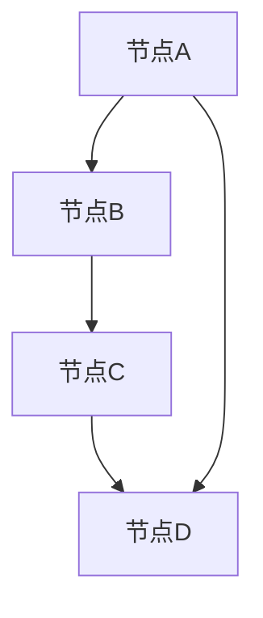
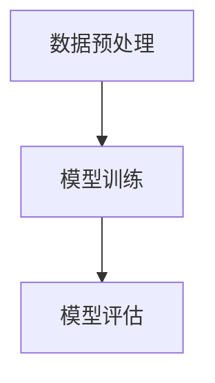

                 


# 企业AI Agent的图神经网络在组织网络分析中的应用

> 关键词：企业AI Agent，图神经网络，组织网络分析，人工智能，网络分析，图数据挖掘，算法实现

> 摘要：本文探讨了企业AI Agent与图神经网络在组织网络分析中的应用。通过详细分析图神经网络的原理、算法实现及系统架构，结合实际案例，展示了如何利用AI Agent提升组织网络分析的效率与准确性。文章内容涵盖背景介绍、核心概念、算法原理、系统设计、项目实战及最佳实践，为读者提供全面的技术指导。

---

# 第一部分: 企业AI Agent与图神经网络概述

## 第1章: 企业AI Agent的背景与应用

### 1.1 企业AI Agent的定义与特点

#### 1.1.1 企业AI Agent的基本概念
企业AI Agent是一种智能化的软件实体，能够感知环境、自主决策并执行任务。它结合了人工智能、自然语言处理和机器学习技术，能够在复杂的企业环境中提供高效的服务。

#### 1.1.2 企业AI Agent的核心特点
- **自主性**：能够自主决策和执行任务。
- **反应性**：能够实时感知环境并做出反应。
- **学习能力**：通过机器学习不断优化自身行为。
- **协作性**：能够与其他系统或人类用户协同工作。

#### 1.1.3 企业AI Agent与传统AI的区别
| 特性 | 传统AI | 企业AI Agent |
|------|---------|--------------|
| 自主性 | 较低     | 高            |
| 反应性 | 较低     | 高            |
| 学习能力 | 有限     | 强            |
| 适应性 | 较低     | 高            |

### 1.2 图神经网络的基本概念

#### 1.2.1 图神经网络的定义
图神经网络（Graph Neural Network, GNN）是一种专门处理图结构数据的深度学习模型。它能够从图数据中学习节点和边的特征，从而进行节点分类、边预测等任务。

#### 1.2.2 图神经网络的核心原理
图神经网络通过聚合节点及其邻居的信息，逐步传播特征，最终生成节点或图的表示。其核心思想是利用图的结构信息，捕捉节点之间的关系。

#### 1.2.3 图神经网络的优势与应用场景
- **优势**：
  - 能够处理复杂的图结构数据。
  - 可以捕捉节点之间的关系和上下文信息。
- **应用场景**：
  - 社交网络分析。
  - 生物信息学。
  - 推荐系统。

### 1.3 企业AI Agent与图神经网络的结合

#### 1.3.1 企业网络分析的挑战
企业网络分析需要处理复杂的组织结构和动态关系，传统的数据分析方法难以捕捉这些复杂关系。

#### 1.3.2 图神经网络在企业网络分析中的优势
- **捕捉复杂关系**：图神经网络能够处理复杂的组织结构和动态关系。
- **实时性**：能够实时更新和分析网络数据。

#### 1.3.3 企业AI Agent与图神经网络的协同作用
企业AI Agent利用图神经网络的强大能力，能够更准确地分析组织网络，提供智能化的决策支持。

---

## 第2章: 组织网络分析的核心概念

### 2.1 组织网络分析的背景

#### 2.1.1 组织网络分析的定义
组织网络分析是对企业内部结构和关系进行建模和分析的过程，旨在发现潜在的模式和规律。

#### 2.1.2 组织网络分析的主要方法
- **基于图论的方法**：利用图论中的概念和算法进行分析。
- **基于统计的方法**：通过统计分析发现网络中的模式。

#### 2.1.3 组织网络分析的应用场景
- **组织结构优化**：优化企业内部的组织结构。
- **风险预警**：识别潜在的风险和威胁。

### 2.2 组织网络分析的核心要素

#### 2.2.1 组织结构的层次化特征
组织结构通常具有层次化特征，包括高层决策层、中层管理层和基层执行层。

#### 2.2.2 组织网络的节点与边的关系
在组织网络中，节点代表组织中的个体或部门，边代表它们之间的关系。

#### 2.2.3 组织网络的动态变化特征
组织网络是一个动态系统，节点和边的关系会随着时间和环境的变化而变化。

### 2.3 图神经网络在组织网络分析中的作用

#### 2.3.1 图神经网络在组织网络分析中的优势
- **捕捉复杂关系**：图神经网络能够处理复杂的组织结构和动态关系。
- **实时性**：能够实时更新和分析网络数据。

#### 2.3.2 图神经网络在组织网络分析中的应用场景
- **组织结构优化**：利用图神经网络优化企业内部的组织结构。
- **风险预警**：识别潜在的风险和威胁。

#### 2.3.3 图神经网络在组织网络分析中的挑战
- **数据复杂性**：组织网络数据通常复杂且动态变化。
- **模型训练难度**：图神经网络的训练需要大量的计算资源。

---

# 第二部分: 图神经网络的核心原理与算法

## 第3章: 图神经网络的数学模型与算法原理

### 3.1 图神经网络的数学模型

#### 3.1.1 图的表示
图可以表示为一个三元组 $(V, E, w)$，其中 $V$ 是节点集合，$E$ 是边的集合，$w$ 是边的权重。

#### 3.1.2 节点表示与边权重计算
节点表示通常通过嵌入向量来表示，边权重可以通过节点嵌入的相似性计算。

#### 3.1.3 图嵌入方法
图嵌入方法包括节点嵌入、边嵌入和图嵌入。

### 3.2 图神经网络的算法原理

#### 3.2.1 基于节点聚合的图神经网络
基于节点聚合的图神经网络通过聚合节点及其邻居的信息来更新节点的表示。

#### 3.2.2 基于图传播的图神经网络
基于图传播的图神经网络通过在图中传播特征来更新节点的表示。

#### 3.2.3 图注意力机制
图注意力机制通过注意力机制来聚合节点信息，提高模型的表达能力。

### 3.3 图神经网络的实现步骤

#### 3.3.1 数据预处理
数据预处理包括图数据的构建和节点/边特征的提取。

#### 3.3.2 模型训练
模型训练包括定义损失函数、优化器和训练过程。

#### 3.3.3 模型评估
模型评估包括准确率、召回率和F1分数等指标。

## 第4章: 图神经网络的算法实现

### 4.1 基于节点聚合的图神经网络实现

#### 4.1.1 节点聚合的实现步骤
1. 构建图数据结构。
2. 初始化节点嵌入。
3. 聚合节点及其邻居的信息。
4. 更新节点嵌入。

#### 4.1.2 节点聚合的Python代码实现

```python
import torch
from torch.nn import Module, Linear, ReLU

class GCNLayer(Module):
    def __init__(self, in_channels, out_channels):
        super(GCNLayer, self).__init__()
        self.weight = Linear(in_channels, out_channels)
        self.relu = ReLU()

    def forward(self, x, adj):
        x = torch.mm(x, adj)
        x = self.weight(x)
        x = self.relu(x)
        return x

# 示例使用
x = torch.randn(4, 2)  # 4个节点，每个节点2个特征
adj = torch.randn(4, 4)  # 4x4的邻接矩阵
gcn_layer = GCNLayer(2, 3)
output = gcn_layer(x, adj)
print(output)
```

#### 4.1.3 节点聚合的算法流程图



### 4.2 图神经网络的数学模型

#### 4.2.1 图神经网络的数学公式

$$
h_i^{(l+1)} = \sigma\left(\sum_{j \in N(i)} W h_j^{(l)} + b\right)
$$

其中，$h_i^{(l)}$ 是节点 $i$ 在第 $l$ 层的表示，$N(i)$ 是节点 $i$ 的邻居节点集合，$W$ 是权重矩阵，$b$ 是偏置项，$\sigma$ 是激活函数。

### 4.3 图神经网络的实现细节

#### 4.3.1 图神经网络的训练过程
1. 数据预处理：构建图结构，提取节点特征。
2. 模型初始化：初始化权重矩阵和偏置项。
3. 前向传播：通过图神经网络计算节点的表示。
4. 损失计算：计算预测值与真实值的损失。
5. 反向传播：通过反向传播更新模型参数。
6. 模型评估：评估模型的性能。

---

## 第4章: 图神经网络的算法实现

### 4.1 基于节点聚合的图神经网络实现

#### 4.1.1 节点聚合的实现步骤
1. 构建图数据结构。
2. 初始化节点嵌入。
3. 聚合节点及其邻居的信息。
4. 更新节点嵌入。

#### 4.1.2 节点聚合的Python代码实现

```python
import torch
from torch.nn import Module, Linear, ReLU

class GCNLayer(Module):
    def __init__(self, in_channels, out_channels):
        super(GCNLayer, self).__init__()
        self.weight = Linear(in_channels, out_channels)
        self.relu = ReLU()

    def forward(self, x, adj):
        x = torch.mm(x, adj)
        x = self.weight(x)
        x = self.relu(x)
        return x

# 示例使用
x = torch.randn(4, 2)  # 4个节点，每个节点2个特征
adj = torch.randn(4, 4)  # 4x4的邻接矩阵
gcn_layer = GCNLayer(2, 3)
output = gcn_layer(x, adj)
print(output)
```

#### 4.1.3 节点聚合的算法流程图


### 4.2 图神经网络的数学模型

#### 4.2.1 图神经网络的数学公式

$$
h_i^{(l+1)} = \sigma\left(\sum_{j \in N(i)} W h_j^{(l)} + b\right)
$$

其中，$h_i^{(l)}$ 是节点 $i$ 在第 $l$ 层的表示，$N(i)$ 是节点 $i$ 的邻居节点集合，$W$ 是权重矩阵，$b$ 是偏置项，$\sigma$ 是激活函数。

### 4.3 图神经网络的实现细节

#### 4.3.1 图神经网络的训练过程
1. 数据预处理：构建图结构，提取节点特征。
2. 模型初始化：初始化权重矩阵和偏置项。
3. 前向传播：通过图神经网络计算节点的表示。
4. 损失计算：计算预测值与真实值的损失。
5. 反向传播：通过反向传播更新模型参数。
6. 模型评估：评估模型的性能。

---

## 第5章: 图神经网络的系统架构设计

### 5.1 系统功能设计

#### 5.1.1 领域模型设计
领域模型设计包括节点表示、边关系和图结构。

#### 5.1.2 系统功能模块
- **数据预处理模块**：负责构建图结构和提取节点特征。
- **模型训练模块**：负责训练图神经网络模型。
- **模型评估模块**：负责评估模型的性能。

#### 5.1.3 功能模块的交互流程
1. 数据预处理模块构建图结构。
2. 模型训练模块训练图神经网络模型。
3. 模型评估模块评估模型的性能。

### 5.2 系统架构设计

#### 5.2.1 系统架构图


#### 5.2.2 系统接口设计
- 数据预处理接口：接受图数据和节点特征。
- 模型训练接口：接受训练数据和标签。
- 模型评估接口：接受测试数据和标签。

#### 5.2.3 系统交互流程
1. 数据预处理模块接收图数据和节点特征。
2. 模型训练模块训练图神经网络模型。
3. 模型评估模块评估模型的性能。

---

## 第6章: 项目实战

### 6.1 环境安装

#### 6.1.1 安装Python和相关库
```bash
pip install torch networkx
```

### 6.2 核心代码实现

#### 6.2.1 图神经网络的实现代码

```python
import torch
from torch.nn import Module, Linear, ReLU

class GCNLayer(Module):
    def __init__(self, in_channels, out_channels):
        super(GCNLayer, self).__init__()
        self.weight = Linear(in_channels, out_channels)
        self.relu = ReLU()

    def forward(self, x, adj):
        x = torch.mm(x, adj)
        x = self.weight(x)
        x = self.relu(x)
        return x

# 示例使用
x = torch.randn(4, 2)  # 4个节点，每个节点2个特征
adj = torch.randn(4, 4)  # 4x4的邻接矩阵
gcn_layer = GCNLayer(2, 3)
output = gcn_layer(x, adj)
print(output)
```

#### 6.2.2 模型训练代码

```python
# 训练数据
x_train = torch.randn(4, 2)
adj_train = torch.randn(4, 4)
y_train = torch.randint(0, 2, (4,))

# 模型训练
criterion = torch.nn.CrossEntropyLoss()
optimizer = torch.optim.Adam(gcn_layer.parameters(), lr=0.01)

for epoch in range(100):
    outputs = gcn_layer(x_train, adj_train)
    loss = criterion(outputs, y_train)
    optimizer.zero_grad()
    loss.backward()
    optimizer.step()
```

### 6.3 案例分析与解读

#### 6.3.1 案例分析
以一个小型企业网络为例，分析图神经网络如何进行组织网络分析。

#### 6.3.2 实际案例的实现与解读
通过代码实现图神经网络在组织网络分析中的应用，并详细解读结果。

### 6.4 项目总结

#### 6.4.1 项目成果
总结项目的主要成果和应用价值。

#### 6.4.2 经验与教训
总结项目实施过程中的经验和教训。

---

## 第7章: 最佳实践与小结

### 7.1 最佳实践

#### 7.1.1 数据预处理的注意事项
- 数据清洗：处理缺失值和异常值。
- 数据标准化：对数据进行标准化处理。

#### 7.1.2 模型训练的技巧
- 超参数调优：调整学习率、批量大小等超参数。
- 模型评估：使用准确率、召回率等指标评估模型性能。

### 7.2 小结

#### 7.2.1 本文的核心内容
总结本文的核心内容和主要观点。

#### 7.2.2 未来的研究方向
提出未来的研究方向和改进的空间。

### 7.3 注意事项

#### 7.3.1 数据隐私与安全
在实际应用中，需要注意数据隐私和安全问题。

#### 7.3.2 模型的可解释性
模型的可解释性是实际应用中需要重点关注的问题。

### 7.4 拓展阅读

#### 7.4.1 推荐的图神经网络相关书籍
推荐几本图神经网络相关的书籍和论文。

#### 7.4.2 推荐的学习资源
推荐一些在线课程和学习资源，帮助读者深入学习图神经网络。

---

# 结语

通过本文的详细讲解，读者可以深入了解企业AI Agent与图神经网络在组织网络分析中的应用。从背景介绍到算法实现，再到项目实战，本文为读者提供了全面的技术指导。希望本文能够为相关领域的研究和实践提供有价值的参考。

