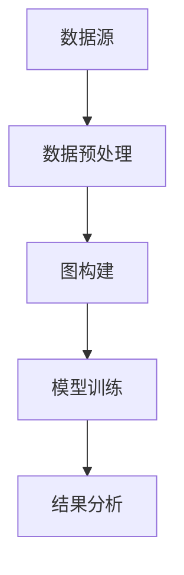

                 

# 企业AI Agent的图神经网络应用：复杂关系分析

> 关键词：企业AI Agent，图神经网络，复杂关系分析，深度学习，知识图谱，异构图

> 摘要：本文深入探讨了图神经网络在企业AI Agent中的应用，特别是在复杂关系分析方面。通过分析图神经网络的核心原理、算法实现、系统架构设计以及实际案例，本文为企业如何利用AI Agent技术优化复杂关系分析提供了理论和实践指导。

---

## 第一章: 企业AI Agent与图神经网络概述

### 1.1 问题背景与定义

#### 1.1.1 企业复杂关系分析的挑战
企业在运营中面临复杂的关系网络，包括客户、供应商、合作伙伴等。传统的数据分析方法难以捕捉这些关系的复杂性，导致决策效率低下。

#### 1.1.2 图神经网络的定义与特点
图神经网络（Graph Neural Networks, GNNs）是一种处理图结构数据的深度学习模型。它能够捕捉节点之间的关系，适用于复杂网络分析。

#### 1.1.3 企业AI Agent的核心概念与目标
企业AI Agent通过感知和分析内外部关系，优化企业运营。图神经网络在其中扮演关键角色，帮助AI Agent理解复杂关系。

### 1.2 图神经网络与传统神经网络的对比

| 特性            | 传统神经网络                 | 图神经网络               |
|-----------------|-----------------------------|--------------------------|
| 数据结构        | 无结构化数据                 | 图结构化数据             |
| 关系处理能力    | 无法处理关系结构             | 能够处理复杂关系         |
| 应用场景        | 图像识别、自然语言处理       | 社交网络、知识图谱         |

### 1.3 本章小结
图神经网络在企业复杂关系分析中的优势显著，能够帮助AI Agent更好地理解企业内外部关系，提升决策效率。

---

## 第二章: 图神经网络的核心原理与算法

### 2.1 图的表示与节点关系

#### 2.1.1 图的基本概念与表示方法
图由节点（Vertex）和边（Edge）组成，边可以有方向和权重。

#### 2.1.2 节点与边的属性定义
节点属性：节点的特征，如客户ID、年龄；边属性：边的权重和方向。

#### 2.1.3 图的异构性与复杂性
异构图包含不同类型的节点和边，复杂性体现在高维数据和复杂关系上。

### 2.2 图神经网络的核心算法

#### 2.2.1 图卷积网络（GCN）原理
GCN通过聚合相邻节点的信息来更新节点表示。

$$ y = \sigma(A X X^T) $$

#### 2.2.2 图注意力网络（GAT）原理
GAT通过注意力机制自适应地聚合信息。

$$ \alpha_{ij} = \text{softmax}(e^{f(i,j)}) $$

### 2.3 图神经网络的数学模型

#### GCN的数学公式
$$ y = \sigma(A X X^T) $$

#### GAT的注意力机制公式
$$ \alpha_{ij} = \text{softmax}(e^{f(i,j)}) $$

### 2.4 本章小结
图神经网络通过聚合邻居信息和注意力机制，有效捕捉图结构中的复杂关系。

---

## 第三章: 图神经网络在企业AI Agent中的应用

### 3.1 企业复杂关系分析的场景与需求

#### 3.1.1 企业内部关系网络
内部员工协作、部门间协作。

#### 3.1.2 企业外部关系网络
客户、供应商、合作伙伴。

#### 3.1.3 跨组织关系网络
行业网络、生态合作。

### 3.2 企业AI Agent的任务分解

#### 3.2.1 数据采集与预处理
数据清洗、特征提取。

#### 3.2.2 关系建模与分析
构建知识图谱、图嵌入。

#### 3.2.3 智能决策与反馈
基于分析结果优化决策。

### 3.3 企业复杂关系分析的典型场景

#### 3.3.1 客户关系管理（CRM）
通过图神经网络分析客户关系，优化客户维护策略。

#### 3.3.2 供应链优化
分析供应商关系，优化供应链效率。

#### 3.3.3 风险评估与预警
识别潜在风险，提前预警。

### 3.4 本章小结
图神经网络在企业复杂关系分析中的应用广泛，能够显著提升企业决策效率。

---

## 第四章: 图神经网络算法的实现与优化

### 4.1 图神经网络的训练流程

#### 4.1.1 数据预处理与特征提取
数据清洗、特征选择。

#### 4.1.2 模型训练与参数优化
使用梯度下降优化模型参数。

#### 4.1.3 模型评估与调优
评估指标选择、超参数调优。

### 4.2 图神经网络的系统架构设计

#### 4.2.1 系统功能设计
- 数据采集模块
- 图构建模块
- 模型训练模块
- 结果分析模块

#### 4.2.2 系统架构图

### 4.3 本章小结
系统架构设计是图神经网络成功应用的关键，需要合理设计各模块交互。

---

## 第五章: 项目实战与案例分析

### 5.1 项目实战: 社交网络分析

#### 5.1.1 环境安装与配置
安装必要的库，如TensorFlow、Keras、NetworkX。

#### 5.1.2 数据预处理与图构建
使用社交网络数据，构建图结构。

#### 5.1.3 模型训练与结果分析
训练GCN模型，分析社交网络关系。

#### 5.1.4 模型可视化与优化
使用Matplotlib可视化结果，优化模型性能。

### 5.2 本章小结
通过实际案例分析，验证了图神经网络在企业关系分析中的有效性。

---

## 第六章: 最佳实践与未来展望

### 6.1 最佳实践 tips

#### 6.1.1 数据质量的重要性
高质量数据是模型准确性的保障。

#### 6.1.2 模型调优的技巧
合理选择超参数，避免过拟合。

#### 6.1.3 可视化的重要性
通过可视化工具帮助理解模型结果。

### 6.2 未来展望

#### 6.2.1 图神经网络的创新方向
研究新的图结构学习方法。

#### 6.2.2 企业AI Agent的发展趋势
与大数据、云计算等技术深度融合。

### 6.3 本章小结
图神经网络在企业复杂关系分析中具有广阔的应用前景。

---

## 结语

企业AI Agent的图神经网络应用为企业复杂关系分析提供了强大的工具。通过深入理解图神经网络的核心原理和算法，结合实际案例分析，企业可以更好地利用这些技术优化决策过程。未来，随着技术的发展，图神经网络将在企业AI Agent中发挥更重要的作用。

---

> **温馨提示**：如果需要进一步了解图神经网络的实现细节或案例分析，可以参考以下资源：
>
> - [《Graph Neural Networks: A Comprehensive Review》](#)
> - [TensorFlow官方文档](#)
> - [Keras官方文档](#)

