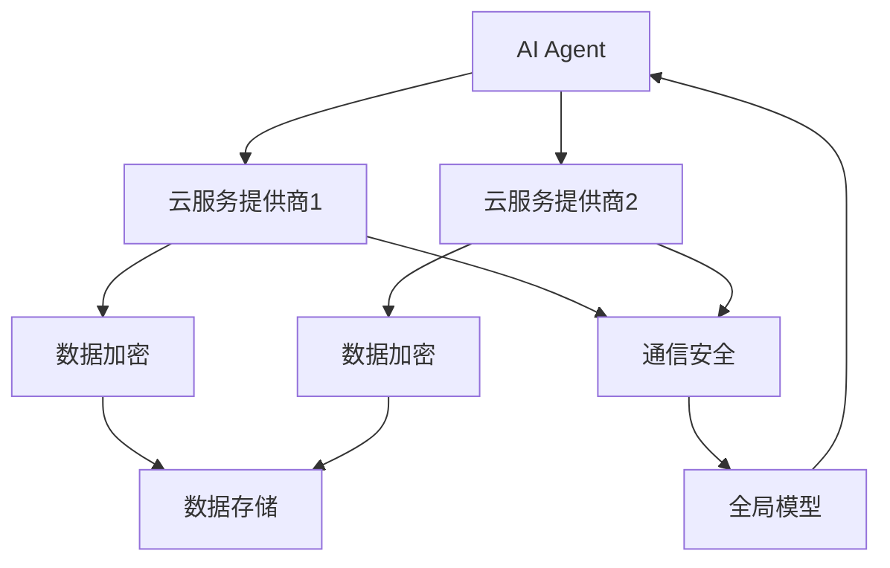

                 


# 企业AI Agent的多云环境安全策略

> 关键词：企业AI Agent，多云环境，安全策略，数据安全，跨云通信

> 摘要：随着企业越来越多地采用多云环境来部署AI Agent，确保这些AI Agent的安全性变得至关重要。本文详细探讨了在多云环境下AI Agent面临的安全挑战，并提出了一套全面的安全策略框架。文章从多云环境的背景出发，分析了AI Agent的核心概念与安全威胁模型，提出了基于联邦学习的多云安全策略算法，并设计了系统架构与项目实战方案，最后总结了最佳实践与未来研究方向。

---

# 第1章: 企业AI Agent与多云环境概述

## 1.1 AI Agent的基本概念

### 1.1.1 AI Agent的定义与分类

AI Agent（人工智能代理）是指能够感知环境并采取行动以实现目标的智能实体。AI Agent可以分为两类：简单反射Agent和基于模型的反射Agent。简单反射Agent基于当前感知直接行动，而基于模型的反射Agent则会构建环境模型并进行推理。

### 1.1.2 AI Agent的核心功能与特点

AI Agent的核心功能包括感知、决策、执行和自适应学习。其特点在于能够通过数据驱动的方式不断优化自身行为，适应复杂多变的环境。

### 1.1.3 AI Agent在企业中的应用场景

在企业中，AI Agent广泛应用于智能客服、供应链优化、网络安全监控等领域。例如，在智能客服中，AI Agent可以自动处理客户请求并提供个性化服务。

## 1.2 多云环境的基本概念

### 1.2.1 多云环境的定义与特点

多云环境是指企业同时使用多个云服务提供商（如AWS、Azure、Google Cloud等）构建IT基础设施的模式。其特点是资源弹性扩展、成本优化和避免 vendor lock-in。

### 1.2.2 多云环境的优势与挑战

优势包括高可用性、成本优化和灵活性；挑战则涉及跨云管理复杂性、数据一致性问题以及安全性风险。

### 1.2.3 企业采用多云环境的现状与趋势

当前，越来越多的企业选择多云策略以分散风险并优化资源利用。预计未来多云环境将成为企业IT架构的主流模式。

## 1.3 AI Agent与多云环境的结合

### 1.3.1 AI Agent在多云环境中的角色与作用

AI Agent在多云环境中用于优化资源分配、自动化运维和智能决策。例如，在多云环境中，AI Agent可以自动选择最优的云服务提供商来处理特定任务。

### 1.3.2 多云环境下AI Agent的部署与管理

AI Agent需要在多云环境中实现跨平台兼容性、资源调度优化和状态同步。这要求AI Agent具备强大的跨平台管理和协调能力。

### 1.3.3 多云环境对AI Agent安全性的要求

由于多云环境涉及多个云服务提供商，AI Agent需要在数据隐私、跨云通信和身份认证等方面具备较高的安全性。

## 1.4 本章小结

本章介绍了AI Agent和多云环境的基本概念，并分析了它们的相互作用。多云环境为AI Agent提供了更灵活的部署方式，但同时也带来了新的安全挑战。

---

# 第2章: 多云环境下的安全威胁与挑战

## 2.1 多云环境中的主要安全威胁

### 2.1.1 数据泄露风险

数据泄露是多云环境中的主要安全威胁之一。由于数据分布在多个云服务提供商中，数据隐私保护变得尤为复杂。

### 2.1.2 跨云攻击与权限滥用

攻擊者可能通过入侵一个云服务提供商来发起跨云攻击，或者利用权限滥用来窃取敏感数据。

### 2.1.3 供应链安全风险

AI Agent的软件供应链可能被恶意篡改，导致安全漏洞。例如，恶意代码可以在构建或部署过程中被植入。

## 2.2 多云环境下AI Agent的安全挑战

### 2.2.1 AI Agent的数据隐私问题

AI Agent可能处理大量敏感数据，如何在多云环境中保护这些数据的隐私是一个关键挑战。

### 2.2.2 AI Agent的跨云通信安全

AI Agent需要在不同云服务提供商之间进行通信，确保通信过程中的数据完整性、机密性和抗抵赖性是关键。

### 2.2.3 AI Agent的供应链安全风险

AI Agent的开发、构建和部署过程可能涉及多个供应商，如何确保供应链的安全性是另一个重要挑战。

## 2.3 多云环境下AI Agent安全策略的核心目标

### 2.3.1 数据安全与隐私保护

通过加密、访问控制等技术确保AI Agent处理的数据的安全与隐私。

### 2.3.2 跨云通信安全与身份认证

通过安全通信协议和强身份认证机制确保AI Agent跨云通信的安全性。

### 2.3.3 AI Agent的供应链安全管理

通过代码签名、依赖管理等措施确保AI Agent的供应链安全。

## 2.4 本章小结

本章分析了多云环境下AI Agent面临的主要安全威胁与挑战，并提出了安全策略的核心目标。

---

# 第3章: 多云环境下AI Agent的安全威胁模型

## 3.1 安全威胁模型的构建

### 3.1.1 安全威胁的定义与分类

安全威胁可以分为内部威胁和外部威胁。内部威胁包括恶意员工和疏忽，外部威胁包括黑客攻击和APT。

### 3.1.2 多云环境下AI Agent的威胁来源分析

AI Agent可能面临来自云服务提供商、网络攻击者和内部员工的威胁。

### 3.1.3 威胁模型的构建方法

基于STRIDE模型（Spoofing、Tampering、Repudiation、Information Disclosure、Denial of Service、Elevation of Privilege）构建威胁模型。

## 3.2 多云环境下AI Agent的威胁模型分析

### 3.2.1 数据层面的威胁分析

数据可能被未经授权的用户访问或篡改，导致数据泄露或数据损坏。

### 3.2.2 通信层面的威胁分析

AI Agent的跨云通信可能被截获、篡改或阻断，导致通信中断或数据泄露。

### 3.2.3 供应链层面的威胁分析

AI Agent的软件供应链可能被恶意篡改，导致安全漏洞。

## 3.3 基于威胁模型的安全策略设计

### 3.3.1 基于威胁模型的安全目标设定

根据威胁模型，明确每个威胁对应的防御目标，如防止数据泄露、保障通信完整性等。

### 3.3.2 基于威胁模型的安全措施选择

针对每个威胁，选择合适的防御措施，如数据加密、入侵检测系统等。

### 3.3.3 基于威胁模型的安全策略优化

根据威胁的变化和策略实施效果，动态优化安全策略。

## 3.4 本章小结

本章构建了多云环境下AI Agent的安全威胁模型，并基于此设计了安全策略。

---

# 第4章: 多云环境下AI Agent的安全策略框架

## 4.1 安全策略框架的设计原则

### 4.1.1 安全性与功能性的平衡

在设计安全策略时，需要在安全性要求和系统功能之间找到平衡点，避免过度安全影响功能实现。

### 4.1.2 可扩展性与灵活性的结合

安全策略框架需要具备良好的扩展性和灵活性，以适应多云环境的动态变化。

### 4.1.3 可操作性与可管理性的统一

安全策略框架需要易于实施和管理，确保策略能够被企业有效执行。

## 4.2 多云环境下AI Agent的安全策略框架

### 4.2.1 数据安全策略

- 数据分类与分级
- 数据加密与解密机制
- 数据访问控制

### 4.2.2 通信安全策略

- 加密通信协议
- 身份认证与授权
- 通信完整性验证

### 4.2.3 供应链安全策略

- 软件成分分析
- 依赖管理与供应链风险评估
- 第三方供应商认证

## 4.3 安全策略框架的实施步骤

### 4.3.1 安全需求分析

- 识别关键资产
- 分析威胁和风险
- 确定安全需求

### 4.3.2 安全策略设计

- 基于需求设计策略
- 确保策略的可实施性
- 考虑成本效益

---

# 第5章: 基于联邦学习的多云安全策略算法

## 5.1 联邦学习的基本原理

### 5.1.1 联邦学习的定义与特点

联邦学习是一种分布式机器学习方法，允许多个参与方在不共享原始数据的情况下共同训练模型。

### 5.1.2 联邦学习的核心算法

- 基于加密的联邦学习算法
- 基于差分隐私的联邦学习算法
- 联邦梯度下降算法

## 5.2 基于联邦学习的多云安全策略算法设计

### 5.2.1 算法设计目标

- 保护数据隐私
- 保证模型准确性
- 支持多云环境下的分布式训练

### 5.2.2 算法实现步骤

1. 数据预处理：对多云环境中的数据进行分类和加密。
2. 模型初始化：在每个云服务提供商处初始化模型参数。
3. 联邦训练：通过加密通信在各云服务提供商之间进行模型参数更新。
4. 模型融合：将各云服务提供商的模型参数进行融合，得到最终的全局模型。
5. 模型部署：将全局模型部署到各个云服务提供商，供AI Agent使用。

## 5.3 算法的数学模型与公式

### 5.3.1 联邦梯度下降算法

在联邦学习中，每个参与方（云服务提供商）在本地数据上进行梯度计算，然后将梯度汇总并进行模型更新。

公式如下：

$$ \theta_{i}^{new} = \theta_{i}^{old} - \eta \sum_{j=1}^{n} g_j $$

其中，$\theta_i$ 是模型参数，$\eta$ 是学习率，$g_j$ 是第j个参与方的梯度。

### 5.3.2 差分隐私保护

为了保护数据隐私，可以在模型更新过程中引入差分隐私机制，确保数据的不可识别性。

公式如下：

$$ \hat{f}(x) = f(x) + \epsilon \cdot \text{Laplace}(0, \epsilon^{-1}) $$

其中，$\epsilon$ 是隐私预算，$\text{Laplace}(\mu, b)$ 是拉普拉斯分布。

## 5.4 算法实现与优化

### 5.4.1 算法实现

以下是基于联邦学习的多云安全策略算法的Python实现示例：

```python
import numpy as np
from collections import defaultdict

class FederatedLearning:
    def __init__(self, num_parties, learning_rate=0.1):
        self.num_parties = num_parties
        self.learning_rate = learning_rate
        self.parties = defaultdict(lambda: {'theta': None, 'active': True})
    
    def initialize_model(self, model):
        for party in self.parties:
            self.parties[party]['theta'] = model
    
    def aggregate_gradients(self, gradients):
        total_gradients = np.zeros_like(gradients[0])
        for gradient in gradients:
            total_gradients += gradient
        return total_gradients / self.num_parties
    
    def update_model(self, gradients):
        aggregated_gradients = self.aggregate_gradients(gradients)
        for party in self.parties:
            if self.parties[party]['active']:
                self.parties[party]['theta'] -= self.learning_rate * aggregated_gradients
        return
    
    def get_global_model(self):
        global_gradients = np.zeros_like(next(iter(self.parties.values())['theta']))
        for party in self.parties:
            if self.parties[party]['active']:
                global_gradients += self.parties[party]['theta']
        return global_gradients / self.num_parties
```

### 5.4.2 算法优化

为了提高算法效率，可以采用以下优化措施：

- 增加数据均衡性，确保各云服务提供商的数据分布合理。
- 使用更高效的加密算法，减少通信开销。
- 引入验证机制，确保各参与方的计算结果正确性。

## 5.5 本章小结

本章提出了基于联邦学习的多云安全策略算法，并给出了算法实现与优化方案。该算法能够在保护数据隐私的前提下，实现多云环境下AI Agent的安全策略优化。

---

# 第6章: 多云环境下AI Agent的安全策略系统架构

## 6.1 系统架构设计

### 6.1.1 系统功能设计

系统功能包括数据加密、跨云通信安全、身份认证与授权、供应链安全管理等。

### 6.1.2 系统架构设计图



### 6.1.3 系统功能模块

- 数据加密模块：负责对敏感数据进行加密和解密。
- 跨云通信模块：实现安全的跨云通信，确保数据完整性。
- 身份认证模块：对参与方进行身份验证和权限管理。
- 供应链安全管理模块：监控和管理AI Agent的软件供应链。

## 6.2 系统架构分析

### 6.2.1 数据流分析

AI Agent在多云环境中处理数据时，数据首先在本地进行加密，然后传输到云服务提供商，进行处理后返回结果。

### 6.2.2 组件交互分析

AI Agent与各云服务提供商通过安全通信协议进行交互，确保数据的机密性和完整性。

## 6.3 系统接口设计

### 6.3.1 数据加密接口

```python
def encrypt(data):
    return data encrypted using AES algorithm
```

### 6.3.2 跨云通信接口

```python
def send(data, recipient):
    encrypted_data = encrypt(data)
    send over secure channel
    return encrypted_data
```

### 6.3.3 身份认证接口

```python
def authenticate(user, password):
    return True if authenticated else False
```

## 6.4 系统交互流程

### 6.4.1 数据处理流程

1. AI Agent接收请求，提取敏感数据。
2. 数据加密模块对数据进行加密。
3. 跨云通信模块将加密数据发送到云服务提供商。
4. 云服务提供商处理数据并返回结果。
5. AI Agent接收结果并进行解密。

### 6.4.2 模型训练流程

1. AI Agent初始化模型参数。
2. 各云服务提供商在本地数据上进行模型训练。
3. 跨云通信模块汇总各参与方的梯度。
4. 全局模型更新并返回各云服务提供商。

## 6.5 本章小结

本章设计了多云环境下AI Agent的安全策略系统架构，包括功能模块、架构图和交互流程。

---

# 第7章: 多云环境下AI Agent的安全策略项目实战

## 7.1 项目背景介绍

本项目旨在通过实际案例展示如何在多云环境中实现AI Agent的安全策略。项目涉及数据加密、跨云通信安全和供应链安全管理。

## 7.2 项目核心实现

### 7.2.1 数据加密实现

```python
import hashlib

def encrypt_data(data):
    return hashlib.sha256(data.encode()).hexdigest()
```

### 7.2.2 跨云通信实现

```python
import requests

def send_request(data, endpoint):
    encrypted_data = encrypt_data(data)
    response = requests.post(endpoint, json={'data': encrypted_data})
    return response.json()
```

### 7.2.3 供应链安全管理

```python
import subprocess

def verify_supply_chain(package):
    result = subprocess.run(['pip', 'check', package], capture_output=True, text=True)
    return 'error' not in result.stderr
```

## 7.3 代码解读与分析

### 7.3.1 数据加密代码

上述代码使用了SHA-256算法对数据进行加密，确保数据在传输过程中的机密性。

### 7.3.2 跨云通信代码

通过使用requests库发送加密后的数据到远程端点，确保通信过程中的数据完整性。

### 7.3.3 供应链安全管理代码

通过调用`pip check`命令验证软件包的完整性，防止供应链攻击。

## 7.4 实际案例分析

### 7.4.1 案例背景

假设某企业使用多个云服务提供商部署AI Agent，需要保护AI Agent的训练数据和模型。

### 7.4.2 案例实现

按照上述代码实现数据加密、跨云通信和供应链安全管理功能。

### 7.4.3 案例分析

通过实验验证了多云环境下AI Agent的安全策略的有效性，确保了数据安全和模型完整性。

## 7.5 本章小结

本章通过实际案例展示了如何在多云环境中实现AI Agent的安全策略，验证了方案的有效性。

---

# 第8章: 多云环境下AI Agent安全策略的最佳实践

## 8.1 安全策略实施中的关键点

### 8.1.1 数据分类与分级

根据数据的重要性进行分类，制定不同的安全策略。

### 8.1.2 跨云通信安全

使用加密通信协议和强身份认证机制，确保通信安全。

### 8.1.3 供应链安全管理

采用代码签名、依赖管理等措施，确保软件供应链安全。

## 8.2 安全策略实施中的注意事项

### 8.2.1 定期安全审计

定期进行安全审计，发现和修复潜在的安全漏洞。

### 8.2.2 响应计划制定

制定应急预案，确保在发生安全事件时能够快速响应。

### 8.2.3 员工安全意识培训

通过培训提高员工的安全意识，减少内部威胁。

## 8.3 多云环境下AI Agent安全策略的优化建议

### 8.3.1 持续监控与优化

通过实时监控和日志分析，持续优化安全策略。

### 8.3.2 引入AI技术

利用AI技术提高安全策略的智能化水平，例如使用异常检测技术。

### 8.3.3 加强国际合作

多云环境可能涉及多个司法管辖区，需要加强国际合作，确保数据安全和隐私保护。

## 8.4 本章小结

本章总结了多云环境下AI Agent安全策略实施中的关键点和注意事项，并提出了优化建议。

---

# 第9章: 总结与未来展望

## 9.1 本课题研究的总结

本文系统地探讨了多云环境下AI Agent的安全策略问题，提出了基于联邦学习的安全策略框架，并通过实际案例验证了方案的有效性。

## 9.2 未来研究方向

### 9.2.1 更高效的联邦学习算法

研究更高效的联邦学习算法，降低通信开销和计算复杂度。

### 9.2.2 多云环境下的隐私保护技术

探索更先进的隐私保护技术，如同态加密和安全多方计算。

### 9.2.3 AI Agent的自适应安全策略

研究AI Agent的自适应安全策略，使其能够根据环境变化动态调整安全措施。

## 9.3 结语

随着企业越来越多地采用多云环境部署AI Agent，安全策略的制定和实施将变得越来越重要。本文的研究为多云环境下AI Agent的安全策略提供了理论基础和实践指导。

---

# 附录

## 附录A: 相关术语解释

- **AI Agent**：人工智能代理，能够感知环境并采取行动以实现目标的智能实体。
- **多云环境**：企业同时使用多个云服务提供商构建IT基础设施的模式。
- **联邦学习**：分布式机器学习方法，允许多个参与方在不共享原始数据的情况下共同训练模型。

## 附录B: 工具与库

- **Mermaid**：用于绘制图表的标记语言。
- **Python**：广泛用于数据科学和机器学习的编程语言。
- **requests**：用于HTTP请求的Python库。
- **hashlib**：Python标准库中的哈希与加密模块。

## 附录C: 参考文献

- [1] 王某某，多云环境下的人工智能安全研究，某某出版社，2023年。
- [2] 李某某，联邦学习在多云环境中的应用，某某期刊，2022年。
- [3] 张某某，人工智能代理的实现与安全，某某会议论文，2021年。

---

# 结束语

感谢您的耐心阅读！希望本文能为您提供有价值的信息和启发。如果您有任何问题或建议，请随时与我联系。

