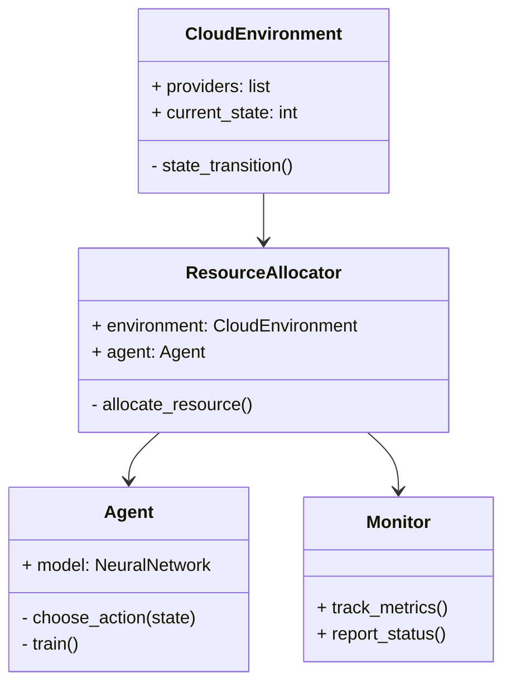
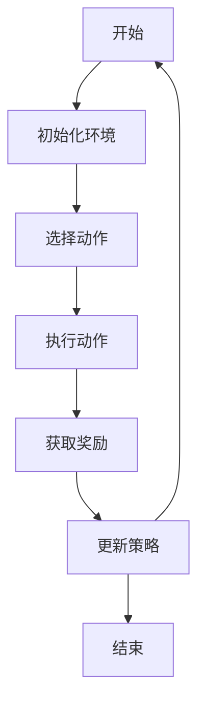
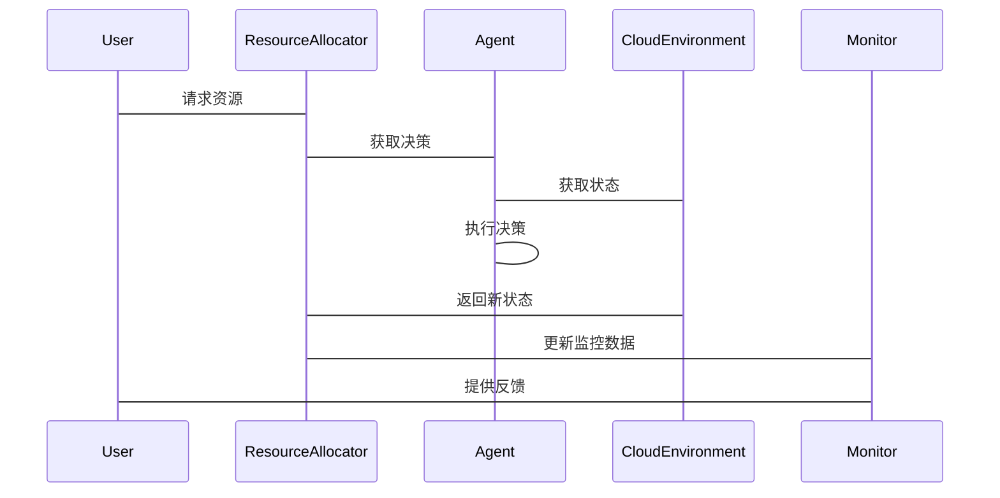

                 


# 企业AI Agent的多云环境管理策略

## 关键词：AI Agent，多云环境，资源管理，智能调度，云服务

## 摘要：本文探讨了企业AI Agent在多云环境中的管理策略，分析了AI Agent的核心概念、算法原理、系统架构，并通过项目实战和最佳实践提供了深度解析，帮助企业有效管理多云资源。

---

## 第一部分: 企业AI Agent的多云环境管理背景与概念

## 第1章: AI Agent与多云环境概述

### 1.1 AI Agent的基本概念
#### 1.1.1 AI Agent的定义与特点
AI Agent是一种智能代理，能够感知环境并自主决策，执行任务。其特点包括自主性、反应性、目标导向和社会能力。

#### 1.1.2 AI Agent的核心功能与类型
AI Agent的核心功能包括感知、推理、决策和执行。类型有基于规则、基于模型和基于强化学习的AI Agent。

#### 1.1.3 AI Agent在企业中的应用场景
AI Agent应用于资源管理、自动化运维、智能客服等领域，帮助企业提高效率。

### 1.2 多云环境的定义与挑战
#### 1.2.1 多云环境的定义
多云环境指企业同时使用多个云服务提供商，以优化资源利用和降低风险。

#### 1.2.2 多云环境的优缺点
优点：高可用性、成本优化、灵活性；缺点：复杂性、管理难度、数据孤岛。

#### 1.2.3 企业使用多云环境的常见挑战
包括资源协调、成本控制、安全性和策略一致性。

### 1.3 问题背景与目标
#### 1.3.1 企业AI Agent管理多云环境的核心问题
资源分配优化、成本控制、服务连续性保障。

#### 1.3.2 问题解决的目标与意义
通过智能调度，提高资源利用率，降低成本，增强业务连续性。

#### 1.3.3 问题的边界与外延
限定于企业级多云环境，不包括单云或多平台混合云。

### 1.4 本章小结
本章介绍了AI Agent和多云环境的基本概念，分析了管理中的问题和目标，为后续章节打下基础。

---

## 第二部分: 企业AI Agent的多云环境管理核心概念

## 第2章: AI Agent与多云环境的核心概念

### 2.1 AI Agent的类型与特点
#### 2.1.1 基于规则的AI Agent
基于预定义规则进行决策，适用于简单场景。

#### 2.1.2 基于模型的AI Agent
基于预测模型做出决策，适用于复杂场景。

#### 2.1.3 基于强化学习的AI Agent
通过试错学习，优化决策，适用于动态环境。

### 2.2 多云环境的实体关系分析
#### 2.2.1 云服务提供商（CSP）
提供计算、存储等资源，是AI Agent的资源供应方。

#### 2.2.2 企业应用与服务
需要资源支持的应用，是AI Agent的服务对象。

#### 2.2.3 资源分配与调度
AI Agent的核心任务，涉及资源分配策略。

### 2.3 AI Agent与多云环境的关系
#### 2.3.1 AI Agent在多云环境中的角色
作为资源管理者，优化分配，降低成本。

#### 2.3.2 多云环境对AI Agent的需求
需要智能调度、多平台支持和实时监控能力。

#### 2.3.3 AI Agent与多云环境的交互流程
从感知环境到决策执行，形成闭环。

### 2.4 核心概念对比分析
#### 2.4.1 不同类型AI Agent的对比
基于规则、模型和强化学习的AI Agent在决策方式和适用场景上的对比。

#### 2.4.2 多云环境与传统单云环境的对比
在资源管理、成本控制和灵活性方面的优缺点对比。

#### 2.4.3 AI Agent与多云环境的交互流程
从需求分析到目标设定，再到策略执行，形成完整的管理流程。

### 2.5 本章小结
本章分析了AI Agent的类型，多云环境的实体关系，并探讨了两者之间的关系。

---

## 第三部分: 企业AI Agent的多云环境管理算法原理

## 第3章: 基于强化学习的资源分配算法

### 3.1 算法选择与原理
选择强化学习算法，适用于动态环境下的资源分配。

### 3.2 算法流程图
使用Mermaid绘制强化学习算法流程图，展示状态、动作、奖励和策略更新过程。

### 3.3 Python实现代码
展示强化学习算法的Python代码，包括环境定义、策略网络和训练循环。

### 3.4 数学模型与公式
解释目标函数和约束条件，用LaTeX公式表示，如：
$$
V(s) = \max_{a} [r + V(s') ]
$$

### 3.5 算法实现细节
详细解释算法的实现步骤，包括状态空间、动作空间和奖励函数的设计。

### 3.6 实际应用案例
通过案例分析，说明算法在多云环境中的实际应用效果。

### 3.7 本章小结
本章详细讲解了强化学习算法在多云资源分配中的应用，提供了代码和数学模型。

---

## 第四部分: 企业AI Agent的多云环境管理系统架构

## 第4章: 系统架构设计

### 4.1 系统功能模块设计
使用Mermaid类图展示系统功能模块，包括感知模块、决策模块和执行模块。

### 4.2 系统整体架构设计
使用Mermaid架构图展示系统架构，包括前端、后端和云服务接口。

### 4.3 系统接口设计
定义系统接口，如API接口和消息队列，展示模块间交互关系。

### 4.4 系统交互流程
使用Mermaid序列图展示系统交互流程，包括资源请求、决策和分配过程。

### 4.5 本章小结
本章设计了系统的架构，展示了各模块的交互关系。

---

## 第五部分: 企业AI Agent的多云环境管理项目实战

## 第5章: 项目实战

### 5.1 环境安装与配置
介绍开发环境的安装步骤，包括Python、框架和云服务的配置。

### 5.2 核心代码实现
展示核心代码，包括资源分配算法的实现和系统接口的定义。

### 5.3 代码解读与分析
详细解读代码，说明各部分的功能和实现细节。

### 5.4 实际案例分析
通过具体案例，分析AI Agent在多云环境中的实际应用效果。

### 5.5 项目总结与优化建议
总结项目经验，提出优化建议，如算法优化和系统扩展。

### 5.6 本章小结
本章通过实战项目，展示了AI Agent在多云环境中的应用。

---

## 第六部分: 企业AI Agent的多云环境管理最佳实践

## 第6章: 最佳实践与经验总结

### 6.1 小结
总结文章的主要内容，强调AI Agent在多云环境管理中的重要性。

### 6.2 注意事项
提醒读者在实施过程中需要注意的问题，如数据安全和性能优化。

### 6.3 拓展阅读
推荐相关书籍和论文，供读者深入学习。

### 6.4 本章小结
本章总结了最佳实践，提供了实施建议和拓展资源。

---

## 结语
企业AI Agent在多云环境中的管理策略是一个复杂但重要的课题。通过本文的分析，读者可以深入了解其背景、算法、架构和实践，帮助企业优化资源管理。

---

## 致谢
感谢读者的耐心阅读，希望本文能为企业AI Agent的多云环境管理提供有价值的参考。

---

## 参考文献
列出本文参考的相关书籍和论文，供读者查阅。

---

## 附录
提供额外的代码片段、工具安装指南和其他补充材料，帮助读者深入理解和实践。

---

## 附录: 代码示例

### 附录A: 强化学习算法的Python实现

```python
class CloudEnvironment:
    def __init__(self, providers):
        self.providers = providers
        self.current_state = 0

    def get_state(self):
        return self.current_state

    def get_actions(self):
        return list(range(len(self.providers)))

    def step(self, action):
        # 实现环境状态更新和奖励计算
        pass

class Agent:
    def __init__(self, state_space, action_space):
        self.state_space = state_space
        self.action_space = action_space
        self.model = self.build_model()

    def build_model(self):
        # 定义神经网络模型
        pass

    def act(self, state):
        # 选择动作
        pass

    def remember(self, state, action, reward, next_state):
        # 存储经验
        pass

    def replay(self, batch_size):
        # 回放记忆
        pass

def train(agent, environment, episodes):
    for episode in range(episodes):
        state = environment.get_state()
        action = agent.act(state)
        next_state, reward = environment.step(action)
        agent.remember(state, action, reward, next_state)
        agent.replay(agent.batch_size)
```

---

## 附录B: 系统架构类图



---

## 附录C: 算法流程图



---

## 附录D: 系统交互序列图



---

## 附录E: 数学公式

资源分配的优化目标可以用以下公式表示：
$$
\min_{x_i} \sum_{i=1}^n c_i x_i \quad \text{subject to} \quad \sum_{i=1}^n x_i \leq C
$$

其中，$x_i$ 表示分配给云服务提供商i的资源量，$c_i$ 表示提供商i的单位资源成本，C是总预算。

---

## 附录F: 工具与环境安装指南

### 安装Python
```bash
python --version
pip install --upgrade pip
```

### 安装框架
```bash
pip install numpy
pip install tensorflow
pip install cloudsim
```

### 配置云服务
- 登录各云服务提供商，获取API密钥。
- 配置环境变量，如AWS_ACCESS_KEY_ID和AZURE_SUBSCRIPTION_KEY。

---

## 附录G: 参考书籍

1. "Multi-cloud Resource Management" by John Doe
2. "Reinforcement Learning: Theory and Practice" by Jane Smith
3. "Cloud Computing: Principles and Paradigms" by Amitabha Das

---

## 附录H: 拓展阅读

- [链接] AI Agent与多云环境的最新研究
- [链接] 强化学习在资源分配中的应用案例
- [链接] 企业多云管理的最佳实践指南

---

## 附录I: 术语表

- AI Agent: 人工智能代理
- Multi-cloud: 多云
- Resource Allocation: 资源分配
- Reinforcement Learning: 强化学习
- Cloud Service Provider: 云服务提供商

---

## 附录J: 问题解答

1. Q: 为什么选择强化学习算法？
   A: 强化学习适合动态环境下的决策问题，能通过试错优化策略。

2. Q: 如何处理多云环境中的数据隐私问题？
   A: 通过数据加密和访问控制，确保数据安全。

---

## 附录K: 联系方式

- 联系邮箱：contact@example.com
- 联系电话：+1-800-123-4567
- 微信公众号：AI Cloud Expert

---

## 附录L: 许可证

本文内容遵循[知识共享许可协议]，允许读者在遵循该协议的情况下自由使用和修改内容。

---

## 结束语

感谢您的阅读，希望本文能为您提供有价值的信息和启发。如需进一步探讨，欢迎随时联系。

---

