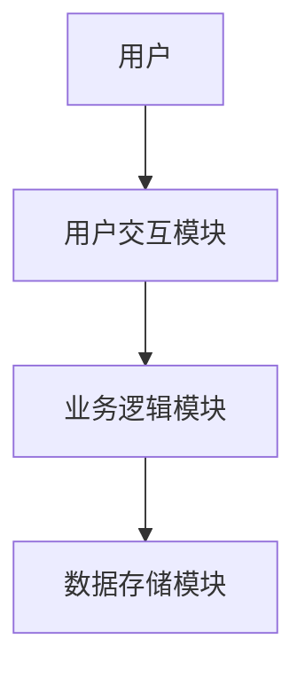

                 


# 企业AI Agent的多云部署策略：灵活性与可靠性

---

## 关键词：
- 企业AI Agent，多云部署，灵活性，可靠性，云服务，高可用性

---

## 摘要：
本文深入探讨了企业AI Agent在多云环境下的部署策略，分析了多云部署的灵活性与可靠性之间的平衡，以及如何通过合理规划和设计实现高效的AI Agent多云部署。文章从核心概念、算法原理、系统架构设计到实际项目实战，全面解析了多云部署的关键环节，为企业技术团队提供了实用的部署策略和最佳实践。

---

# 第一部分: 企业AI Agent的多云部署概述

## 第1章: 企业AI Agent的定义与背景

### 1.1 企业AI Agent的基本概念

#### 1.1.1 AI Agent的定义与核心特征
- **AI Agent**（人工智能代理）是指能够感知环境、自主决策并执行任务的智能实体。其核心特征包括：
  - **自主性**：能够在没有外部干预的情况下独立运行。
  - **反应性**：能够实时感知环境变化并做出响应。
  - **目标导向**：通过优化目标函数实现特定任务。
  - **可扩展性**：能够根据需求动态调整计算资源。

#### 1.1.2 企业AI Agent的独特属性
- **企业级AI Agent**通常具备以下独特属性：
  - 高可用性：保证在故障情况下仍能正常运行。
  - 高性能：支持大规模数据处理和快速响应。
  - 可扩展性：能够根据负载需求弹性扩展。
  - 安全性：确保数据和系统的安全性。

#### 1.1.3 企业AI Agent的应用场景与价值
- **应用场景**：
  - 智能客服：通过自然语言处理提供高效客户支持。
  - 智能推荐：基于用户行为推荐个性化产品或服务。
  - 智能监控：实时监控系统状态并自动响应异常。
- **价值**：
  - 提高企业运营效率。
  - 增强客户体验。
  - 降低人工成本。

---

### 1.2 多云部署的背景与意义

#### 1.2.1 多云部署的定义与特点
- **多云部署**是指将应用程序部署在多个云服务提供商（如AWS、Azure、Google Cloud等）的基础设施上，以充分利用各云平台的优势。
- **特点**：
  - **资源多样性**：利用不同云平台的差异化服务。
  - **高可用性**：避免单点故障。
  - **成本优化**：通过资源弹性扩展降低运营成本。

#### 1.2.2 企业选择多云部署的动机
- **避免 vendor lock-in**：减少对单一云服务提供商的依赖。
- **优化成本**：根据不同云平台的价格和服务选择最优部署方案。
- **提升性能**：通过负载均衡和分布式部署提高系统性能。

#### 1.2.3 多云部署的优势与挑战
- **优势**：
  - 高可用性：多云部署能够提供更好的容灾能力。
  - 成本优化：通过资源弹性扩展降低运营成本。
  - 创新驱动：能够更快地采用新技术。
- **挑战**：
  - 复杂性：多云环境的管理和维护更加复杂。
  - 安全性：跨云数据传输和存储面临更高的安全风险。
  - 一致性：不同云平台之间的服务接口可能存在差异。

---

### 1.3 企业AI Agent与多云部署的结合

#### 1.3.1 企业AI Agent的灵活性需求
- **灵活性**：企业AI Agent需要能够快速适应业务变化和环境变化。
- **多云部署**：通过多云部署实现AI Agent的灵活性需求。

#### 1.3.2 多云部署对企业AI Agent的支持
- **资源弹性扩展**：根据负载需求自动调整计算资源。
- **高可用性**：通过多云部署实现故障容灾。
- **性能优化**：通过分布式部署提升系统性能。

#### 1.3.3 企业AI Agent多云部署的现状与趋势
- **现状**：越来越多的企业开始尝试将AI Agent部署在多云环境中。
- **趋势**：随着云计算技术的不断发展，多云部署将成为企业AI Agent部署的主要模式。

---

## 第2章: 企业AI Agent的多云部署策略

### 2.1 多云部署的核心原则

#### 2.1.1 灵活性与可靠性的平衡
- **灵活性**：通过多云部署实现资源弹性扩展和快速响应。
- **可靠性**：通过多云部署实现高可用性和容灾能力。

#### 2.1.2 资源分配的合理性
- **资源分配**：根据业务需求合理分配计算资源。
- **成本优化**：通过资源弹性扩展降低运营成本。

#### 2.1.3 安全性与合规性的保障
- **安全性**：确保跨云数据传输和存储的安全性。
- **合规性**：符合相关法律法规和企业内部安全政策。

---

### 2.2 企业AI Agent多云部署的实现路径

#### 2.2.1 确定多云部署的目标
- **目标**：
  - 提高系统可用性。
  - 降低运营成本。
  - 提升系统性能。

#### 2.2.2 选择合适的云服务提供商
- **选择标准**：
  - 服务多样性：提供丰富的云服务和API接口。
  - 成本效益：价格合理且透明。
  - 支持性：提供良好的技术支持和文档资料。

#### 2.2.3 设计合理的架构方案
- **架构设计**：
  - 分层架构：将系统划分为前端、后端和数据层。
  - 容器化部署：使用Docker和Kubernetes实现容器化部署。
  - 负载均衡：通过负载均衡器实现流量分发。

---

### 2.3 多云部署的实施步骤

#### 2.3.1 系统规划与需求分析
- **需求分析**：
  - 明确业务需求。
  - 确定系统目标和性能指标。

#### 2.3.2 系统设计与架构规划
- **系统设计**：
  - 设计系统架构图。
  - 确定各个组件之间的交互关系。

#### 2.3.3 系统实现与部署
- **系统实现**：
  - 实现核心功能模块。
  - 配置云服务提供商的API接口。

#### 2.3.4 系统测试与优化
- **系统测试**：
  - 进行功能测试、性能测试和安全测试。
  - 根据测试结果进行优化。

---

## 第3章: 企业AI Agent多云部署的算法原理与实现

### 3.1 算法原理

#### 3.1.1 负载均衡算法
- **负载均衡算法**：
  - **轮询算法**：将请求轮流分配到不同的服务器。
  - **加权轮询算法**：根据服务器的处理能力分配请求。
  - **随机算法**：随机选择服务器进行请求分配。

#### 3.1.2 负载均衡算法的实现
- **实现步骤**：
  1. 初始化服务器列表。
  2. 根据算法选择目标服务器。
  3. 将请求发送到目标服务器。

#### 3.1.3 负载均衡算法的数学模型
- **数学模型**：
  $$ \text{负载均衡} = \argmin_{i} \left( \frac{\text{当前负载}}{\text{最大负载}} \right) $$
  其中，$\text{当前负载}$表示当前服务器的负载，$\text{最大负载}$表示服务器的最大负载。

---

### 3.2 算法实现

#### 3.2.1 负载均衡算法的Python实现
```python
import random

class LoadBalancer:
    def __init__(self, servers):
        self.servers = servers

    def get_server(self):
        # 随机选择一个服务器
        return random.choice(self.servers)

# 示例
lb = LoadBalancer(['server1', 'server2', 'server3'])
selected_server = lb.get_server()
print(f"Selected server: {selected_server}")
```

#### 3.2.2 负载均衡算法的优化
- **优化策略**：
  - 使用加权轮询算法，根据服务器的处理能力分配请求。
  - 定期更新服务器的负载状态，确保负载均衡的准确性。

---

## 第4章: 企业AI Agent多云部署的系统架构设计

### 4.1 系统架构设计

#### 4.1.1 系统功能模块设计
- **功能模块**：
  - 用户交互模块：处理用户的输入和输出。
  - 业务逻辑模块：执行具体的业务逻辑。
  - 数据存储模块：存储和管理数据。

#### 4.1.2 系统架构图


#### 4.1.3 系统交互流程
- **交互流程**：
  1. 用户向用户交互模块发送请求。
  2. 用户交互模块将请求转发到业务逻辑模块。
  3. 业务逻辑模块处理请求并返回结果。
  4. 用户交互模块将结果返回给用户。

---

### 4.2 系统架构的实现

#### 4.2.1 系统实现步骤
- **实现步骤**：
  1. 初始化系统模块。
  2. 配置云服务提供商的API接口。
  3. 实现模块之间的交互逻辑。

#### 4.2.2 系统实现的代码示例
```python
class UserInterface:
    def __init__(self):
        self.business_logic = BusinessLogic()

    def process_request(self, request):
        result = self.business_logic.handle_request(request)
        return result

class BusinessLogic:
    def __init__(self):
        self.data_storage = DataStorage()

    def handle_request(self, request):
        # 处理业务逻辑
        data = self.data_storage.retrieve_data(request)
        return data

class DataStorage:
    def retrieve_data(self, request):
        # 从数据库中获取数据
        return f"Data for {request}"
```

---

## 第5章: 企业AI Agent多云部署的项目实战

### 5.1 项目环境安装

#### 5.1.1 安装依赖
- **依赖**：
  - Python 3.8+
  - Docker
  - Kubernetes

#### 5.1.2 安装步骤
```bash
# 安装Python依赖
pip install requests
pip install docker
pip install kubernetes
```

---

### 5.2 系统核心实现

#### 5.2.1 核心代码实现
```python
import docker

client = docker.from_env()

# 拉取镜像
client.images.pull('nginx:latest')

# 创建容器
container = client.containers.run('nginx:latest', ports={'80': 8080}, name='my-nginx')
```

#### 5.2.2 代码解读与分析
- **代码解读**：
  - 使用Docker API拉取镜像并创建容器。
  - 配置容器端口映射，将容器的80端口映射到主机的8080端口。

---

### 5.3 项目实战案例

#### 5.3.1 案例分析
- **案例**：部署一个基于多云的AI Agent系统，实现智能客服功能。
- **步骤**：
  1. 在多个云平台上部署AI Agent服务。
  2. 使用负载均衡器实现流量分发。
  3. 使用容器化技术实现服务的弹性扩展。

#### 5.3.2 详细讲解与剖析
- **详细讲解**：
  - 使用Kubernetes实现容器编排。
  - 使用云服务提供商的API实现服务发现和负载均衡。
  - 使用分布式存储实现数据一致性。

---

## 第6章: 企业AI Agent多云部署的总结与展望

### 6.1 总结
- **总结**：
  - 企业AI Agent的多云部署能够提高系统的灵活性和可靠性。
  - 多云部署的实现需要合理规划和设计。
  - 通过容器化和分布式部署实现高效的多云部署。

### 6.2 展望
- **展望**：
  - 随着云计算技术的不断发展，多云部署将成为企业AI Agent部署的主要模式。
  - 未来，企业将更加注重多云部署的灵活性和可靠性，进一步优化部署策略。

---

## 结语
企业AI Agent的多云部署是一个复杂而重要的任务，需要综合考虑系统的灵活性、可靠性和成本效益。通过本文的深入分析和实际案例的讲解，希望能够为企业技术团队提供有价值的参考和指导，帮助他们在多云环境下高效部署和管理AI Agent系统。

--- 

如果您对上述内容有任何疑问或需要进一步的解释，请随时告诉我！

