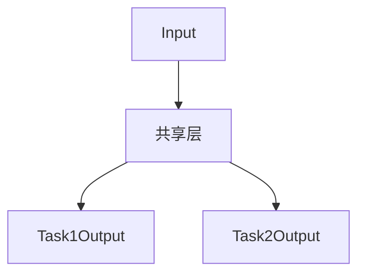
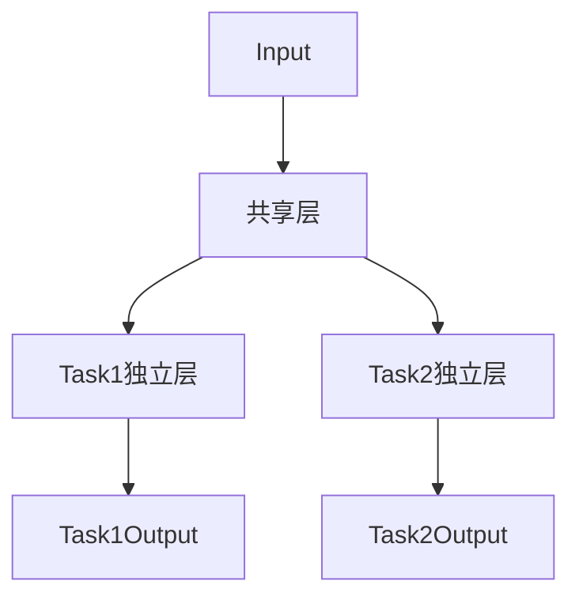
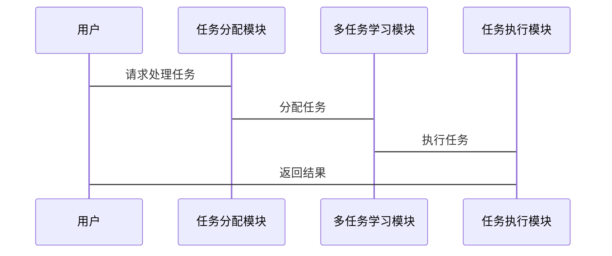
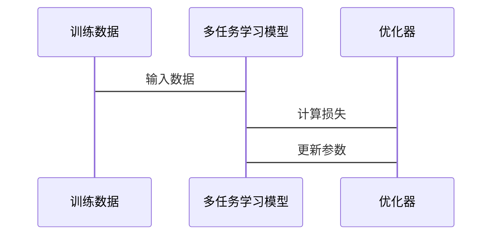
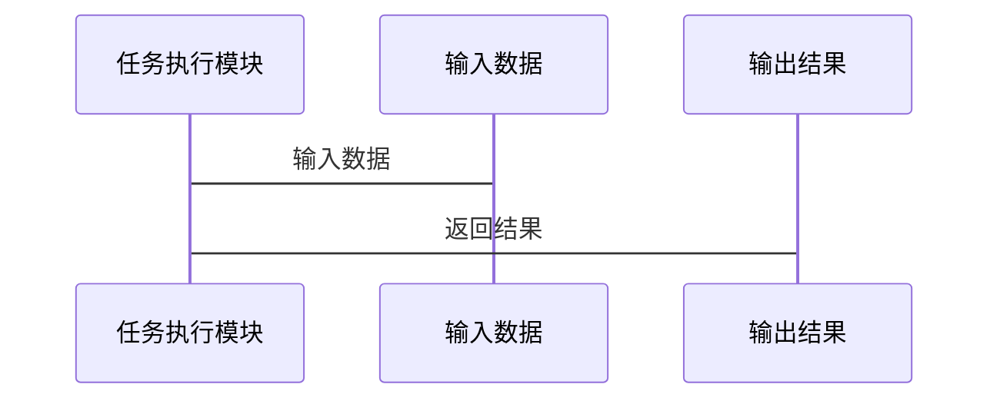
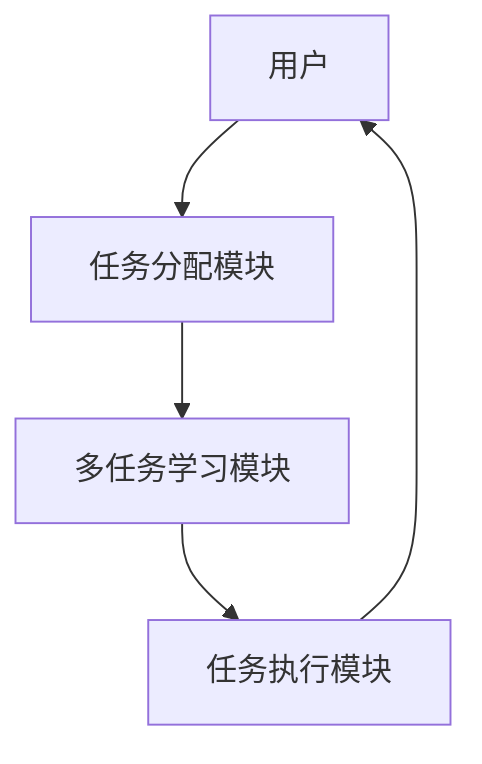

                 


# 企业AI Agent的多任务学习架构：提升效率与通用性

> 关键词：企业AI Agent、多任务学习、AI架构设计、系统效率优化、AI通用性

> 摘要：本文详细探讨了企业AI Agent的多任务学习架构设计，从理论到实践，深入分析了多任务学习如何提升AI Agent的效率与通用性。文章通过案例分析和系统设计，结合数学模型与代码实现，为企业AI Agent的优化提供了实用的解决方案。

---

## 第1章: 企业AI Agent与多任务学习概述

### 1.1 企业AI Agent的定义与特点

#### 1.1.1 AI Agent的基本概念
AI Agent（人工智能代理）是指能够感知环境、自主决策并执行任务的智能实体。企业AI Agent专注于为企业场景提供自动化解决方案，例如流程自动化、智能客服、数据分析等。

#### 1.1.2 企业AI Agent的核心特点
- **智能性**：能够理解上下文并做出决策。
- **自主性**：无需人工干预，自主完成任务。
- **适应性**：能够根据环境变化调整行为。
- **协作性**：能够与人或其他系统协同工作。

#### 1.1.3 企业AI Agent的应用场景
- **流程自动化**：优化企业内部流程，提高效率。
- **智能客服**：提供24/7的智能支持服务。
- **数据分析与决策**：辅助企业做出数据驱动的决策。

### 1.2 多任务学习的定义与优势

#### 1.2.1 多任务学习的基本概念
多任务学习（Multi-Task Learning, MTL）是指同时学习多个任务的模型设计方法。通过共享不同任务的特征，模型可以在多个任务之间实现知识迁移。

#### 1.2.2 多任务学习的优势与挑战
- **优势**：
  - 提高模型的泛化能力。
  - 利用共享特征降低模型的复杂度。
  - 提升模型在小数据集上的表现。
- **挑战**：
  - 任务之间的干扰可能影响模型性能。
  - 需要平衡不同任务的重要性。

#### 1.2.3 多任务学习在企业AI Agent中的应用价值
通过多任务学习，企业AI Agent可以在同一框架下处理多个相关任务（如问答、信息抽取、情感分析），显著提升效率和通用性。

---

## 第2章: 多任务学习的核心概念与原理

### 2.1 多任务学习的基本原理

#### 2.1.1 多任务学习的数学模型与公式
多任务学习的核心思想是通过共享参数来同时优化多个任务。假设我们有 $N$ 个任务，每个任务的损失函数为 $L_i$，则多任务学习的总损失函数可以表示为：

$$ L = \sum_{i=1}^{N} \lambda_i L_i $$

其中，$\lambda_i$ 是任务 $i$ 的权重。

#### 2.1.2 多任务学习的算法框架
多任务学习的算法框架通常包括以下步骤：
1. 初始化共享参数和任务特定参数。
2. 计算每个任务的损失。
3. 更新参数以最小化总损失。

### 2.2 多任务学习的核心概念对比

#### 2.2.1 任务之间的关系分析
任务之间的关系可以分为以下几种：
- **独立任务**：任务之间没有相关性。
- **相关任务**：任务之间存在部分共享特征。
- **嵌套任务**：任务之间存在层次关系。

#### 2.2.2 任务的共享与独立特征对比
通过ER实体关系图（Entity-Relationship Diagram），我们可以清晰地展示任务之间的共享特征和独立特征。

```mermaid
er
    企业AI Agent
    entity 任务1 [任务1]
    entity 任务2 [任务2]
    entity 任务3 [任务3]
    任务1 --> 共享特征
    任务2 --> 共享特征
    任务3 --> 共享特征
    任务1 --> 独立特征1
    任务2 --> 独立特征2
    任务3 --> 独立特征3
```

#### 2.2.3 多任务学习的优化目标与评价指标
- **优化目标**：最小化总损失函数。
- **评价指标**：准确率、F1值、AUC值等。

---

## 第3章: 多任务学习的算法原理

### 3.1 多任务学习的算法框架

#### 3.1.1 基于共享参数的多任务学习
共享参数方法通过共享部分参数来降低模型的复杂度。例如，我们可以共享一个全连接层的权重：



#### 3.1.2 基于任务特定参数的多任务学习
任务特定参数方法允许每个任务拥有独立的参数，同时共享部分参数。例如：



#### 3.1.3 混合参数的多任务学习方法
混合参数方法结合了共享参数和任务特定参数。例如：


### 3.2 多任务学习的数学模型与公式

#### 3.2.1 基于共享参数的多任务学习模型
假设我们有 $N$ 个任务，共享参数 $\theta$，任务特定参数 $\phi_i$，则模型可以表示为：

$$ f_i(x) = g(x, \theta) + h(x, \phi_i) $$

其中，$g(x, \theta)$ 是共享部分，$h(x, \phi_i)$ 是任务特定部分。

#### 3.2.2 基于任务特定参数的多任务学习模型
模型可以表示为：

$$ f_i(x) = g(x, \theta) $$

其中，$\theta$ 是共享参数。

#### 3.2.3 混合参数多任务学习模型的数学表达
模型可以表示为：

$$ f_i(x) = g(x, \theta) + h(x, \phi_i) $$

---

## 第4章: 企业AI Agent的系统架构设计

### 4.1 系统功能设计

#### 4.1.1 任务分配与调度模块
任务分配与调度模块负责将输入的任务分配给不同的子系统进行处理。



#### 4.1.2 多任务学习模型训练模块
多任务学习模型训练模块负责对模型进行训练和优化。



#### 4.1.3 任务执行模块
任务执行模块负责根据分配的任务执行具体的处理逻辑。



### 4.2 系统架构设计

#### 4.2.1 系统架构图
以下是系统的整体架构图：



---

## 第5章: 项目实战

### 5.1 环境安装

```bash
pip install -r requirements.txt
```

### 5.2 系统核心实现源代码

#### 5.2.1 多任务学习模型实现

```python
class MultiTaskModel(torch.nn.Module):
    def __init__(self, input_size, hidden_size, output_size):
        super().__init__()
        self.shared_layer = torch.nn.Linear(input_size, hidden_size)
        self.task_layers = torch.nn.ModuleList([
            torch.nn.Linear(hidden_size, output_size) for _ in range(num_tasks)
        ])
        
    def forward(self, x):
        x = torch.relu(self.shared_layer(x))
        outputs = []
        for i in range(num_tasks):
            outputs.append(torch.relu(self.task_layers[i](x)))
        return outputs
```

#### 5.2.2 优化器实现

```python
optimizer = torch.optim.Adam(model.parameters(), lr=0.001)
criterion = torch.nn.MSELoss()
```

#### 5.2.3 训练循环

```python
for epoch in range(num_epochs):
    for batch_x, batch_y in dataloader:
        outputs = model(batch_x)
        loss = 0
        for i in range(num_tasks):
            loss += criterion(outputs[i], batch_y[i])
        optimizer.zero_grad()
        loss.backward()
        optimizer.step()
```

### 5.3 案例分析与详细讲解

#### 5.3.1 案例分析
假设我们有一个企业AI Agent需要同时处理问答、信息抽取和情感分析三个任务。我们可以使用上述多任务学习模型来同时优化这三个任务。

#### 5.3.2 代码实现

```python
import torch
import torch.nn as nn
import torch.optim as optim

class MultiTaskModel(nn.Module):
    def __init__(self, input_size, hidden_size, output_size):
        super().__init__()
        self.shared_layer = nn.Linear(input_size, hidden_size)
        self.task_layers = nn.ModuleList([
            nn.Linear(hidden_size, output_size) for _ in range(3)
        ])
        
    def forward(self, x):
        x = torch.relu(self.shared_layer(x))
        outputs = []
        for i in range(3):
            outputs.append(torch.relu(self.task_layers[i](x)))
        return outputs

model = MultiTaskModel(input_size=100, hidden_size=50, output_size=1)
optimizer = optim.Adam(model.parameters(), lr=0.001)
criterion = nn.MSELoss()

for epoch in range(100):
    for batch_x, batch_y in dataloader:
        outputs = model(batch_x)
        loss = 0
        for i in range(3):
            loss += criterion(outputs[i], batch_y[i])
        optimizer.zero_grad()
        loss.backward()
        optimizer.step()
```

### 5.4 项目小结

通过上述实现，我们可以看到多任务学习在企业AI Agent中的应用价值。通过共享参数，模型可以在多个任务之间实现知识迁移，显著提高效率和通用性。

---

## 第6章: 总结与展望

### 6.1 总结
本文详细探讨了企业AI Agent的多任务学习架构设计，从理论到实践，深入分析了多任务学习如何提升AI Agent的效率与通用性。通过案例分析和系统设计，结合数学模型与代码实现，为企业AI Agent的优化提供了实用的解决方案。

### 6.2 未来展望
未来，随着AI技术的不断发展，多任务学习在企业AI Agent中的应用将更加广泛。我们可以进一步研究如何在多任务学习中引入强化学习、元学习等技术，以进一步提升模型的性能和通用性。

---

**最佳实践 tips**：
- 在实际应用中，建议根据具体任务需求选择合适的多任务学习方法。
- 定期对模型进行评估和优化，以保持其性能。
- 注意任务之间的依赖关系，避免任务干扰影响模型性能。

---

**注意事项**：
- 多任务学习的复杂性较高，需要对模型进行充分的调参和优化。
- 在实际应用中，需要根据具体场景选择合适的任务分配策略。

---

**拓展阅读**：
- 《Multi-Task Learning: A Review and Future Directions》
- 《Deep Learning for Multi-Task Learning》

