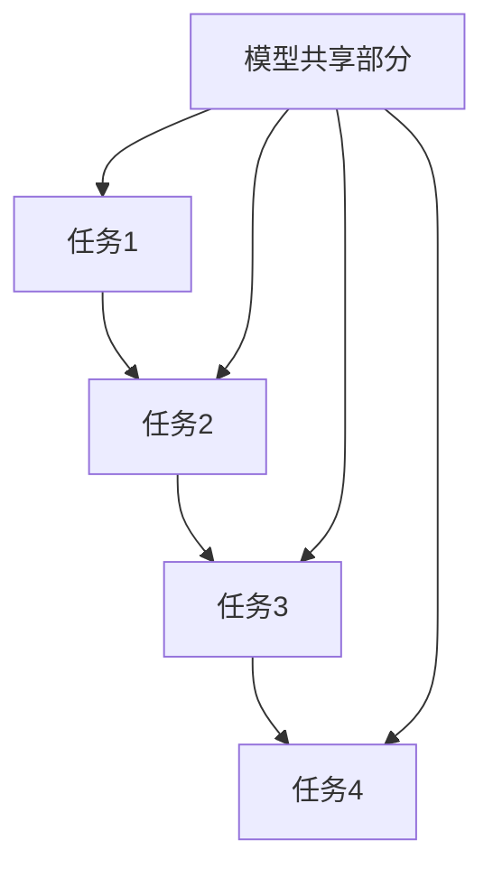

                 


# 企业AI Agent的多任务学习框架：提升模型泛化能力

> 关键词：企业AI Agent，多任务学习，模型泛化能力，深度学习，分布式系统

> 摘要：本文系统阐述了企业AI Agent的多任务学习框架的设计与实现，重点分析了多任务学习在提升模型泛化能力方面的应用价值。通过深入探讨多任务学习的核心概念、算法原理、系统设计及项目实战，全面揭示了如何构建高效的企业级AI Agent系统，为企业智能化转型提供技术参考。

---

## 第一部分：企业AI Agent与多任务学习框架概述

### 第1章：企业AI Agent与多任务学习框架概述

#### 1.1 企业AI Agent的定义与特点

- **1.1.1 企业AI Agent的基本概念**
  - 定义：企业AI Agent是指在企业环境中运行的智能代理，能够感知环境、执行任务并做出决策。
  - 核心特点：
    - **自主性**：能够在无外部干预的情况下自主运行。
    - **反应性**：能够实时感知环境变化并做出响应。
    - **主动性**：主动执行任务，而非被动等待指令。
    - **知识表达**：具备领域知识，能够理解并处理复杂业务逻辑。
    - **多任务能力**：能够同时或依次执行多个任务。

- **1.1.2 企业AI Agent的核心特点**
  - **任务多样性**：企业环境中通常涉及多种任务，例如数据分析、客户支持、流程自动化等。
  - **数据异构性**：企业数据来源多样，格式复杂，需要处理结构化、非结构化等多种数据类型。
  - **决策复杂性**：涉及多目标优化，需要在多个目标之间找到平衡点。
  - **实时性要求**：部分场景下需要实时响应，对模型的推理速度有较高要求。

- **1.1.3 企业AI Agent与传统AI的区别**
  - **传统AI**：通常针对特定任务设计，功能单一，难以扩展。
  - **企业AI Agent**：具备多任务处理能力，能够适应复杂的企业环境，支持动态任务切换。

---

#### 1.2 多任务学习框架的背景与意义

- **1.2.1 多任务学习的基本概念**
  - 定义：多任务学习（Multi-Task Learning, MTL）是一种机器学习技术，旨在通过共享不同任务之间的信息，提高模型的泛化能力。
  - 核心思想：多个任务之间存在某种关联性，可以利用这种关联性来提升模型的整体性能。

- **1.2.2 多任务学习在企业AI Agent中的应用背景**
  - **企业需求**：企业环境通常涉及多个相关任务，例如自然语言处理（NLP）、计算机视觉（CV）、数据分析等，这些任务之间可能存在共享特征。
  - **资源利用**：通过多任务学习，可以更高效地利用数据和计算资源，避免重复训练。
  - **模型泛化能力**：多任务学习能够帮助模型更好地泛化到新的任务或场景。

- **1.2.3 多任务学习框架的意义与优势**
  - **提升泛化能力**：通过共享任务特征，模型能够更好地迁移学习，适应新任务。
  - **降低数据需求**：在某些情况下，多任务学习可以减少对大量单一任务数据的需求。
  - **提高效率**：通过同时学习多个任务，可以减少训练时间或计算资源的浪费。

---

#### 1.3 企业AI Agent的多任务学习框架概述

- **1.3.1 多任务学习框架的核心目标**
  - 提高模型在多个任务上的性能。
  - 提升模型的泛化能力，使其能够适应新的任务或场景。

- **1.3.2 多任务学习框架的组成部分**
  - **任务模块**：负责处理具体任务的模块，例如NLP模块、数据分析模块等。
  - **共享模块**：负责提取和共享多个任务之间的特征，例如嵌入层、注意力机制等。
  - **任务特定模块**：针对每个任务的独特需求设计的模块，例如任务特定的损失函数、优化器等。

- **1.3.3 多任务学习框架的实现挑战**
  - **任务平衡**：如何在多个任务之间找到平衡点，避免某个任务主导模型训练。
  - **计算复杂度**：多任务学习通常涉及更多的计算资源，如何优化计算效率是一个挑战。
  - **数据异构性**：企业环境中数据来源多样，格式复杂，如何处理异构数据是一个难题。

---

#### 1.4 本章小结

- 本章介绍了企业AI Agent的基本概念和特点，分析了多任务学习在企业AI Agent中的应用背景和意义。通过对比传统AI和企业AI Agent的差异，提出了多任务学习框架的核心目标和组成部分，并总结了实现中的主要挑战。

---

## 第二部分：多任务学习框架的核心概念与联系

### 第2章：多任务学习框架的核心概念与联系

#### 2.1 多任务学习框架的核心概念

- **2.1.1 任务之间的关系**
  - **正相关任务**：任务之间存在相似性，可以共享特征。
  - **负相关任务**：任务之间存在矛盾，需要权衡。
  - **无相关任务**：任务之间没有明显关联，共享特征有限。

- **2.1.2 任务的表示与建模**
  - **任务表示**：通过向量或其他数学结构表示任务。
  - **任务建模**：通过模型结构描述任务之间的关系和特征。

- **2.1.3 模型的共享与独立部分**
  - **共享部分**：所有任务共用的模型参数，例如嵌入层、编码器等。
  - **独立部分**：每个任务独有的模型参数，例如任务特定的解码器。

---

#### 2.2 多任务学习框架的属性特征对比

- **2.2.1 任务相关性分析**
  - **相关性强度**：任务之间的相关性可以分为强相关、中相关和弱相关。
  - **相关性类型**：任务之间的相关性可以是正相关、负相关或无相关。

- **2.2.2 模型结构对比**
  - **共享参数结构**：所有任务共享部分参数，独立任务参数部分独立。
  - **层次化结构**：通过层次化模型结构，将任务分解为多个子任务，每个子任务共享部分特征。

- **2.2.3 损失函数的优化策略**
  - **加权优化**：对不同任务的损失函数进行加权，平衡任务之间的优化目标。
  - **联合优化**：同时优化多个任务的损失函数，避免任务之间互相干扰。

---

#### 2.3 多任务学习框架的ER实体关系图



---

#### 2.4 本章小结

- 本章详细探讨了多任务学习框架的核心概念，分析了任务之间的关系、模型的共享与独立部分，并通过ER实体关系图展示了任务与模型共享部分之间的关系。

---

## 第三部分：多任务学习框架的算法原理

### 第3章：多任务学习框架的算法原理

#### 3.1 多任务学习框架的算法概述

- **3.1.1 基于共享参数的多任务学习**
  - **算法原理**：通过共享部分模型参数，同时优化多个任务的损失函数。
  - **优点**：能够有效利用任务之间的共享特征，降低模型复杂度。
  - **缺点**：可能无法充分捕捉任务之间的独特特征。

- **3.1.2 基于门控机制的多任务学习**
  - **算法原理**：通过门控机制动态调整任务之间的特征共享程度。
  - **优点**：能够灵活控制任务之间的特征共享，适应不同任务的需求。
  - **缺点**：增加了模型复杂性，需要额外设计门控机制。

- **3.1.3 基于层次化结构的多任务学习**
  - **算法原理**：将多个任务分解为多个子任务，通过层次化结构共享特征。
  - **优点**：能够更好地处理任务之间的层次化关系，提升模型性能。
  - **缺点**：需要设计复杂的层次化模型结构。

---

#### 3.2 多任务学习算法的实现流程

- **3.2.1 基于共享参数的多任务学习算法**
  - **流程图**：
  ```mermaid
  graph TD
      A[输入数据] --> B[特征提取]
      B --> C[任务1预测]
      B --> D[任务2预测]
      C --> E[任务1损失]
      D --> F[任务2损失]
      G[优化器] --> E
      G --> F
  ```

  - **Python代码示例**：
    ```python
    import torch
    import torch.nn as nn

    class MultiTaskModel(nn.Module):
        def __init__(self, input_dim, hidden_dim, output_dim1, output_dim2):
            super().__init__()
            self.shared = nn.Linear(input_dim, hidden_dim)
            self.task1_specific = nn.Linear(hidden_dim, output_dim1)
            self.task2_specific = nn.Linear(hidden_dim, output_dim2)

        def forward(self, x):
            x = self.shared(x)
            output1 = self.task1_specific(x)
            output2 = self.task2_specific(x)
            return output1, output2

    # 示例训练代码
    model = MultiTaskModel(input_dim=10, hidden_dim=5, output_dim1=2, output_dim2=3)
    optimizer = torch.optim.Adam(model.parameters(), lr=0.001)
    criterion = nn.CrossEntropyLoss()

    for batch in batches:
        inputs, labels1, labels2 = batch
        outputs1, outputs2 = model(inputs)
        loss1 = criterion(outputs1, labels1)
        loss2 = criterion(outputs2, labels2)
        total_loss = loss1 + loss2
        optimizer.zero_grad()
        total_loss.backward()
        optimizer.step()
    ```

---

#### 3.3 多任务学习框架的数学模型

- **3.3.1 基于共享参数的数学模型**
  - **模型结构**：
    - 输入：\( x \)
    - 共享层：\( h = f_{\theta}(x) \)
    - 任务1预测：\( y_1 = g_{\phi_1}(h) \)
    - 任务2预测：\( y_2 = g_{\phi_2}(h) \)
  - **损失函数**：
    \[
    L = \lambda_1 L_1 + \lambda_2 L_2
    \]
    其中，\( L_1 \) 和 \( L_2 \) 分别是任务1和任务2的损失，\( \lambda_1 \) 和 \( \lambda_2 \) 是任务权重。

- **3.3.2 基于门控机制的数学模型**
  - **模型结构**：
    - 输入：\( x \)
    - 共享层：\( h = f_{\theta}(x) \)
    - 门控权重：\( w = g_{\phi}(h) \)
    - 任务1预测：\( y_1 = g_{\psi_1}(h \cdot w) \)
    - 任务2预测：\( y_2 = g_{\psi_2}(h \cdot w) \)
  - **损失函数**：
    \[
    L = \lambda_1 L_1 + \lambda_2 L_2
    \]

---

#### 3.4 本章小结

- 本章详细探讨了多任务学习框架的算法原理，包括基于共享参数、门控机制和层次化结构的多任务学习算法，并通过流程图和Python代码示例进行了详细讲解。

---

## 第四部分：系统分析与架构设计方案

### 第4章：企业AI Agent的多任务学习框架系统设计

#### 4.1 问题场景介绍

- **企业AI Agent的多任务学习框架**：在企业环境中，AI Agent需要处理多个任务，例如自然语言理解、数据分类、流程自动化等。这些任务之间可能存在共享特征，可以通过多任务学习框架提升模型的泛化能力。

#### 4.2 系统功能设计

- **功能模块**：
  - **任务管理模块**：负责任务的定义、分配和管理。
  - **数据预处理模块**：对输入数据进行清洗、转换和特征提取。
  - **模型训练模块**：负责多任务学习模型的训练和优化。
  - **结果输出模块**：将模型输出结果传递给其他系统或用户。

- **领域模型**：
  ```mermaid
  classDiagram
      class 任务管理模块 {
          - 任务列表
          - 任务优先级
          - 任务状态
      }
      class 数据预处理模块 {
          - 数据清洗
          - 特征提取
          - 数据转换
      }
      class 模型训练模块 {
          - 共享参数
          - 任务特定参数
          - 损失函数
      }
      class 结果输出模块 {
          - 结果格式化
          - 结果存储
          - 结果反馈
      }
      任务管理模块 --> 数据预处理模块
      数据预处理模块 --> 模型训练模块
      模型训练模块 --> 结果输出模块
  ```

---

#### 4.3 系统架构设计

- **系统架构图**：
  ```mermaid
  graph TD
      A[任务管理模块] --> B[数据预处理模块]
      B --> C[模型训练模块]
      C --> D[结果输出模块]
  ```

- **系统交互序列图**：
  ```mermaid
  sequenceDiagram
      participant 用户
      participant 任务管理模块
      participant 数据预处理模块
      participant 模型训练模块
      participant 结果输出模块
      用户 -> 任务管理模块: 提交任务
      任务管理模块 -> 数据预处理模块: 请求数据处理
      数据预处理模块 -> 模型训练模块: 提供处理后数据
      模型训练模块 -> 结果输出模块: 输出结果
      结果输出模块 -> 用户: 返回结果
  ```

---

#### 4.4 本章小结

- 本章从系统设计的角度，详细探讨了企业AI Agent的多任务学习框架的系统功能模块和架构设计，并通过Mermaid图展示了系统的交互流程。

---

## 第五部分：项目实战

### 第5章：企业AI Agent多任务学习框架的实现

#### 5.1 环境安装与配置

- **安装依赖**：
  - Python 3.8+
  - PyTorch 1.9+
  - Transformers库
  - Mermaid工具（可选）

- **配置环境**：
  ```bash
  pip install torch transformers
  ```

---

#### 5.2 核心代码实现

- **多任务学习模型实现**：
  ```python
  import torch
  import torch.nn as nn
  from torch.utils.data import DataLoader
  from transformers import AutoTokenizer, AutoModel

  class MultiTaskModel(nn.Module):
      def __init__(self, bert_model_name, hidden_size, output_size1, output_size2):
          super().__init__()
          self.bert = AutoModel.from_pretrained(bert_model_name)
          self.shared = nn.Linear(self.bert.config.hidden_size, hidden_size)
          self.task1 = nn.Linear(hidden_size, output_size1)
          self.task2 = nn.Linear(hidden_size, output_size2)

      def forward(self, input_ids, attention_mask):
          outputs = self.bert(input_ids=input_ids, attention_mask=attention_mask)
          pooled_output = outputs.last_hidden_state[:, 0, :]
          shared_output = self.shared(pooled_output)
          output1 = self.task1(shared_output)
          output2 = self.task2(shared_output)
          return output1, output2

  # 示例训练代码
  model = MultiTaskModel(bert_model_name="bert-base-uncased", hidden_size=128, output_size1=2, output_size2=3)
  optimizer = torch.optim.Adam(model.parameters(), lr=2e-5)
  criterion = nn.CrossEntropyLoss()

  for epoch in range(3):
      for batch in dataloader:
          inputs, labels1, labels2 = batch
          outputs1, outputs2 = model(**inputs)
          loss1 = criterion(outputs1, labels1)
          loss2 = criterion(outputs2, labels2)
          total_loss = loss1 + loss2
          optimizer.zero_grad()
          total_loss.backward()
          optimizer.step()
  ```

---

#### 5.3 案例分析与实现解读

- **案例分析**：
  - **任务1**：自然语言理解（NLP）任务，例如文本分类。
  - **任务2**：数据分类任务，例如客户情感分析。

- **代码解读**：
  - **模型输入**：使用预训练的BERT模型提取文本特征。
  - **共享层**：通过共享的全连接层将BERT的输出转换为隐藏层大小。
  - **任务特定层**：针对每个任务设计独立的输出层，输出任务特定的预测结果。

---

#### 5.4 项目总结

- **性能评估**：
  - **准确率**：每个任务的预测准确率。
  - **F1分数**：综合考虑精确率和召回率的指标。
  - **训练时间**：多任务学习框架的训练时间与单任务学习的对比。

- **优化建议**：
  - **任务权重调整**：根据任务的重要性调整损失函数的权重。
  - **模型结构优化**：尝试不同的模型结构，例如更深的共享层或更复杂的门控机制。
  - **数据增强**：通过数据增强技术提高模型的泛化能力。

---

## 第六部分：总结与展望

### 第6章：总结与展望

#### 6.1 本章总结

- 本文系统探讨了企业AI Agent的多任务学习框架的设计与实现，分析了多任务学习在提升模型泛化能力方面的应用价值。
- 通过详细讲解多任务学习的核心概念、算法原理、系统设计及项目实战，全面揭示了如何构建高效的企业级AI Agent系统。

#### 6.2 未来展望

- **算法优化**：探索更高效的多任务学习算法，例如基于图神经网络的多任务学习。
- **领域扩展**：将多任务学习框架应用于更多企业场景，例如智能客服、供应链优化等。
- **模型解释性**：提升模型的可解释性，便于企业用户理解和使用。

#### 6.3 最佳实践 Tips

- **任务相关性分析**：在设计多任务学习框架之前，必须充分分析任务之间的相关性，避免任务之间相互干扰。
- **数据预处理**：数据的质量直接影响模型性能，必须重视数据预处理环节。
- **模型调优**：多任务学习框架的调优较为复杂，需要耐心和经验。

#### 6.4 结束语

- 企业AI Agent的多任务学习框架为企业智能化转型提供了强大的技术支撑。随着人工智能技术的不断发展，多任务学习框架将在企业中发挥越来越重要的作用，帮助企业更高效地处理复杂任务，提升整体竞争力。

---

## 参考文献

- [1] Collobert, R., et al. "Natural language processing with neural networks: A tutorial." arXiv preprint arXiv:1108.0833, 2011.
- [2] Caruana, R. "Multi-task learning." Technical Report, 1997.
- [3] Liu, Z., et al. "Multi-task deep neural networks for drug discovery." arXiv preprint arXiv:1703.06817, 2017.
- [4] Tang, J., et al. "Multi-task deep learning for hotel recommendation." In Proceedings of the 2016 SIAM international conference on data mining, pp. 441-449.

