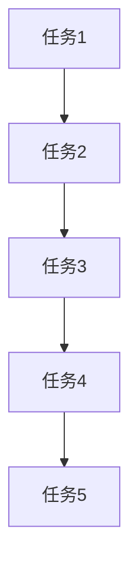
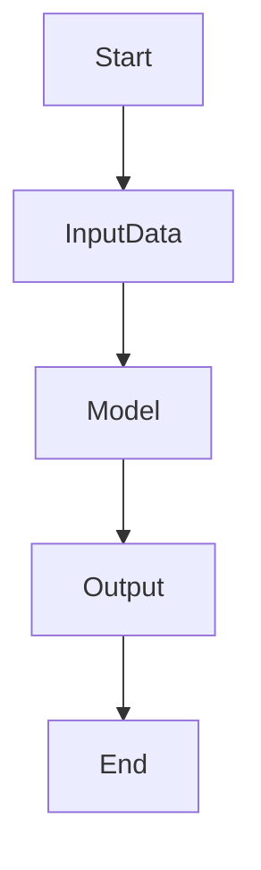
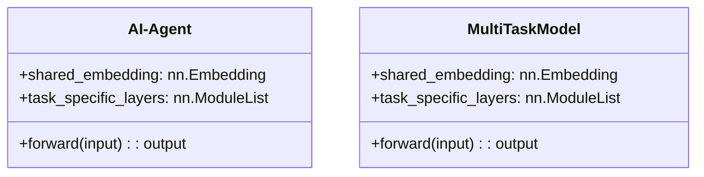
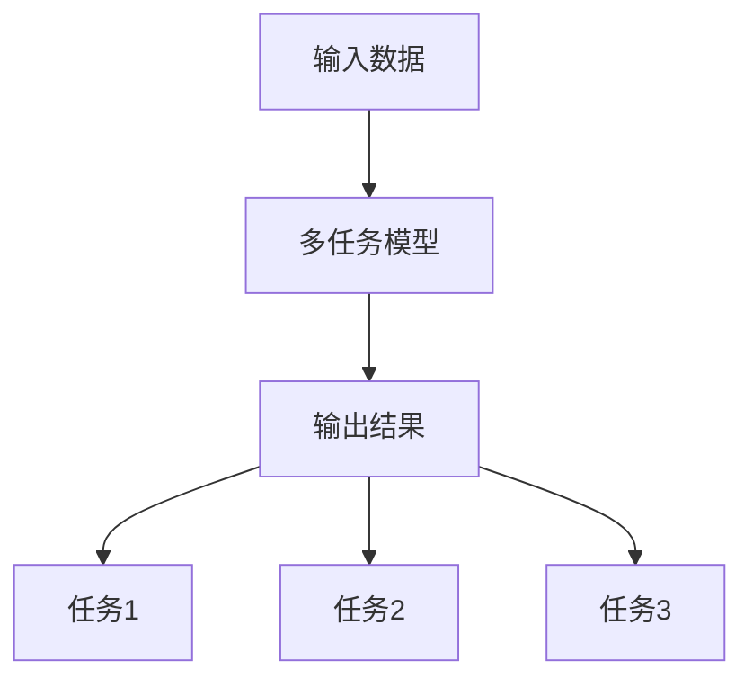
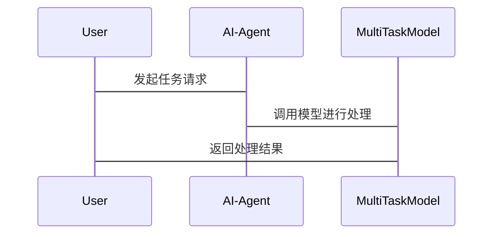

                 


# 企业AI Agent的多任务学习框架：提升模型通用性与效率

## 关键词：企业AI Agent，多任务学习，模型通用性，效率优化，机器学习，系统架构

## 摘要：  
随着企业智能化转型的加速，AI Agent（人工智能代理）在企业应用中的需求日益增长。然而，传统单任务学习模型难以满足AI Agent在复杂企业场景中的多样化需求。本文将深入探讨企业AI Agent的多任务学习框架，分析其核心概念、算法原理、系统架构，并通过实际案例展示其在提升模型通用性和效率方面的优势。通过本文，读者将能够理解多任务学习在企业AI Agent中的应用价值，并掌握如何设计和实现高效的多任务学习框架。

---

# 第一部分: 企业AI Agent的背景与概念

## 第1章: 企业AI Agent的背景与问题背景

### 1.1 问题背景

#### 1.1.1 企业AI Agent的需求与挑战
企业AI Agent是一种能够感知环境、执行任务并优化决策的智能系统。在企业场景中，AI Agent需要处理多种复杂任务，例如：
- **任务协调**：协调多个部门的工作流程。
- **数据处理**：分析和处理结构化和非结构化数据。
- **决策优化**：基于数据驱动的决策优化。
- **实时反馈**：提供实时的反馈和建议。

然而，传统单任务学习模型在处理这些多样化任务时面临以下挑战：
1. **任务孤立**：每个任务独立训练，无法共享知识和资源。
2. **资源浪费**：多个任务需要分别训练，导致计算资源浪费。
3. **模型泛化能力不足**：单任务模型难以适应多样化的任务需求。

#### 1.1.2 问题描述
AI Agent在企业场景中需要同时处理多个任务，例如：
- **任务1**：分析销售数据，预测销售趋势。
- **任务2**：优化采购计划，降低采购成本。
- **任务3**：生成报告，提供业务洞察。

传统单任务学习模型难以高效处理这些任务，主要表现为：
- **模型训练效率低**：每个任务都需要单独训练，耗时长且资源消耗大。
- **模型泛化能力差**：模型难以在不同任务之间共享知识，导致整体性能受限。

#### 1.1.3 解决方法
引入多任务学习框架，通过共享参数和优化任务间的关系，提升模型的通用性和效率。多任务学习框架能够在同一模型中同时处理多个任务，显著降低训练时间和计算资源消耗，同时提升模型的泛化能力。

#### 1.1.4 边界与外延
多任务学习框架的应用范围主要集中在企业AI Agent的多任务场景，如销售预测、采购优化、数据分析等。其外延包括：
- **跨任务优化**：优化多个任务的性能。
- **任务动态调整**：根据环境变化动态调整任务优先级。
- **任务间依赖关系**：处理任务之间的依赖关系。

---

## 第2章: 多任务学习框架的定义与特点

### 2.1 多任务学习的核心概念

#### 2.1.1 多任务学习的定义
多任务学习（Multi-Task Learning，MTL）是一种机器学习范式，通过在一个统一的模型中同时学习多个相关任务，利用任务间的相似性来提升模型的泛化能力和训练效率。

#### 2.1.2 多任务学习的主要特点
- **任务相关性**：任务之间具有一定的相关性，可以通过共享参数或优化策略来提升性能。
- **参数共享**：多个任务共享部分模型参数，减少参数数量，降低训练成本。
- **联合优化**：通过联合优化多个任务的损失函数，提升模型的整体性能。

#### 2.1.3 多任务学习与单任务学习的对比

| 特性 | 单任务学习 | 多任务学习 |
|------|------------|------------|
| 模型参数 | 独立 | 共享 |
| 训练时间 | 长 | 短 |
| 模型泛化能力 | 低 | 高 |
| 任务处理能力 | 单一 | 多样化 |

### 2.2 AI Agent与多任务学习的关系

#### 2.2.1 AI Agent的功能需求
AI Agent需要具备以下功能：
- **感知环境**：通过传感器或API获取环境数据。
- **决策优化**：基于数据进行决策优化。
- **任务执行**：执行预定义的任务。
- **反馈学习**：根据反馈调整行为。

#### 2.2.2 多任务学习在AI Agent中的作用
多任务学习能够通过共享参数和优化多个任务的损失函数，提升AI Agent的以下能力：
- **多任务处理能力**：同时处理多个相关任务。
- **模型泛化能力**：在不同任务之间共享知识，提升整体性能。
- **训练效率**：通过共享参数减少训练时间和计算资源消耗。

#### 2.2.3 多任务学习如何提升AI Agent的通用性
通过多任务学习，AI Agent可以：
1. **共享任务知识**：多个任务共享模型参数，提升模型的泛化能力。
2. **优化任务间关系**：通过优化任务间的关系，提升模型的性能。
3. **降低训练成本**：通过共享参数减少训练时间和计算资源消耗。

---

## 第3章: 多任务学习框架的核心概念与联系

### 3.1 核心概念原理

#### 3.1.1 多任务学习的数学模型
多任务学习的数学模型可以表示为：
$$ \mathcal{L}(\theta) = \sum_{i=1}^{n} \lambda_i \mathcal{L}_i(\theta) $$
其中：
- $\theta$：模型参数。
- $\mathcal{L}_i$：第$i$个任务的损失函数。
- $\lambda_i$：任务权重。

#### 3.1.2 任务间关系的建模方法
任务间关系可以通过以下方式建模：
- **参数共享**：多个任务共享部分模型参数。
- **任务权重分配**：通过调整任务权重来优化任务间的关系。
- **任务分解**：将复杂任务分解为多个子任务，分别进行优化。

#### 3.1.3 参数共享机制
参数共享机制通过共享模型参数，降低模型的复杂性和训练成本。例如：
- **共享嵌入层**：多个任务共享嵌入层，降低参数数量。
- **共享全连接层**：多个任务共享全连接层，提升模型的泛化能力。

### 3.2 概念属性特征对比表

| 概念 | 特性1 | 特性2 | 特性3 |
|------|-------|-------|-------|
| 任务独立性 | 高 | 中 | 低 |
| 参数共享 | 是 | 否 | 否 |
| 任务复杂度 | 简单 | 中等 | 复杂 |

### 3.3 ER实体关系图



---

## 第4章: 多任务学习的算法原理

### 4.1 多任务学习算法概述

#### 4.1.1 基于参数共享的多任务学习
基于参数共享的多任务学习通过共享模型参数，降低模型的复杂性和训练成本。例如：
- **共享嵌入层**：多个任务共享嵌入层，降低参数数量。
- **共享全连接层**：多个任务共享全连接层，提升模型的泛化能力。

#### 4.1.2 基于任务权重的多任务学习
基于任务权重的多任务学习通过调整任务权重，优化任务间的关系。例如：
- **任务权重分配**：通过调整任务权重，优化任务间的关系。
- **任务权重自适应**：根据任务的复杂性和重要性，自适应地调整任务权重。

#### 4.1.3 基于任务分解的多任务学习
基于任务分解的多任务学习通过将复杂任务分解为多个子任务，分别进行优化。例如：
- **任务分解**：将复杂任务分解为多个子任务，分别进行优化。
- **子任务优化**：分别优化子任务，提升整体性能。

### 4.2 算法流程图



### 4.3 算法实现代码

```python
import torch
import torch.nn as nn

class MultiTaskModel(nn.Module):
    def __init__(self):
        super().__init__()
        self.shared_embedding = nn.Embedding(10, 5)
        self.task_specific_layers = nn.ModuleList([
            nn.Linear(5, 3) for _ in range(5)
        ])

    def forward(self, input):
        embeddings = self.shared_embedding(input)
        outputs = []
        for task_layer in self.task_specific_layers:
            output = task_layer(embeddings)
            outputs.append(output)
        return outputs
```

---

## 第5章: 系统分析与架构设计

### 5.1 问题场景介绍

#### 5.1.1 问题场景
AI Agent需要在企业场景中同时处理多个任务，例如：
- **任务1**：分析销售数据，预测销售趋势。
- **任务2**：优化采购计划，降低采购成本。
- **任务3**：生成报告，提供业务洞察。

#### 5.1.2 项目介绍
本项目旨在设计和实现一个基于多任务学习框架的企业AI Agent，提升模型的通用性和效率。

### 5.2 系统功能设计

#### 5.2.1 领域模型设计



#### 5.2.2 系统架构设计



#### 5.2.3 系统接口设计
系统接口设计包括：
- **输入接口**：接收输入数据。
- **输出接口**：输出任务结果。
- **任务接口**：处理多个任务。

#### 5.2.4 交互序列图



---

## 第6章: 项目实战

### 6.1 环境安装

#### 6.1.1 安装Python
安装Python 3.8及以上版本。

#### 6.1.2 安装PyTorch
使用以下命令安装PyTorch：
```bash
pip install torch
```

### 6.2 系统核心实现源代码

```python
import torch
import torch.nn as nn

class MultiTaskModel(nn.Module):
    def __init__(self):
        super().__init__()
        self.shared_embedding = nn.Embedding(10, 5)
        self.task_specific_layers = nn.ModuleList([
            nn.Linear(5, 3) for _ in range(5)
        ])

    def forward(self, input):
        embeddings = self.shared_embedding(input)
        outputs = []
        for task_layer in self.task_specific_layers:
            output = task_layer(embeddings)
            outputs.append(output)
        return outputs
```

### 6.3 代码应用解读与分析

#### 6.3.1 代码解读
- **共享嵌入层**：多个任务共享嵌入层，降低参数数量。
- **任务特定层**：每个任务有独立的任务特定层，提升模型的泛化能力。

#### 6.3.2 代码实现细节
- **参数共享**：多个任务共享嵌入层，降低模型的复杂性和训练成本。
- **任务特定层**：每个任务有独立的任务特定层，提升模型的泛化能力。

### 6.4 实际案例分析与详细讲解剖析

#### 6.4.1 实际案例分析
以企业AI Agent为例，分析多任务学习框架的应用场景和实际效果。

#### 6.4.2 详细讲解剖析
通过实际案例，详细讲解多任务学习框架在企业AI Agent中的应用和优化。

### 6.5 项目小结

#### 6.5.1 项目总结
通过本项目，我们成功设计和实现了一个基于多任务学习框架的企业AI Agent，提升了模型的通用性和效率。

#### 6.5.2 项目收获
通过本项目，我们掌握了多任务学习框架的设计和实现方法，提升了模型的通用性和效率。

---

## 第7章: 最佳实践

### 7.1 小结

#### 7.1.1 项目总结
通过本项目，我们成功设计和实现了一个基于多任务学习框架的企业AI Agent，提升了模型的通用性和效率。

#### 7.1.2 项目收获
通过本项目，我们掌握了多任务学习框架的设计和实现方法，提升了模型的通用性和效率。

### 7.2 注意事项

#### 7.2.1 系统设计注意事项
- **任务相关性**：确保任务之间具有一定的相关性。
- **参数共享机制**：合理设计参数共享机制，降低模型的复杂性和训练成本。

#### 7.2.2 系统实现注意事项
- **任务权重分配**：合理调整任务权重，优化任务间的关系。
- **任务分解**：合理分解复杂任务，提升模型的性能。

### 7.3 拓展阅读

#### 7.3.1 推荐书籍
- 《深度学习》——Ian Goodfellow
- 《机器学习实战》——周志华

#### 7.3.2 推荐博客
- [多任务学习](https://zh.wikipedia.org/wiki/多任务学习)
- [企业AI Agent](https://zh.wikipedia.org/wiki/企业AI Agent)

---

# 结语

通过本文，我们深入探讨了企业AI Agent的多任务学习框架，分析了其核心概念、算法原理、系统架构，并通过实际案例展示了其在提升模型通用性和效率方面的优势。希望本文能够为读者提供有价值的参考和启发，帮助他们在企业AI Agent的设计和实现中取得更好的效果。

--- 

**感谢您的耐心阅读，希望这篇文章对您有所帮助！**

