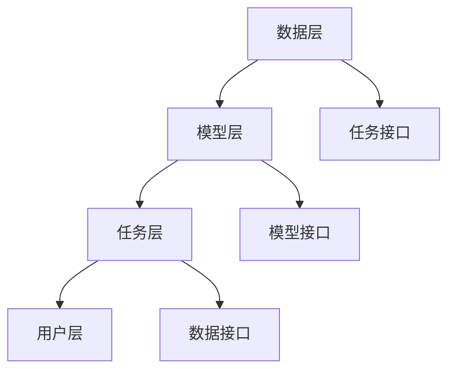

                 


# 企业AI Agent的多任务学习框架：提升模型通用性与迁移效率

> 关键词：企业AI Agent，多任务学习，模型通用性，迁移效率，深度学习，任务分解，参数共享

> 摘要：本文详细探讨了企业AI Agent的多任务学习框架设计，从背景介绍、核心概念、算法原理到系统架构，再到项目实战，系统性地阐述了如何通过多任务学习提升AI Agent的模型通用性和迁移效率。文章结合实际应用场景，深入分析了多任务学习框架的优势与挑战，并提供了具体的实现方案和最佳实践。

---

# 正文

## 第一部分：企业AI Agent的背景与概念

### 第1章：企业AI Agent的背景介绍

#### 1.1 问题背景
- 企业AI Agent的核心需求：从单一任务执行到多任务协同
- 传统AI模型的局限性：任务独立性带来的效率低下问题
- 多任务学习的兴起：通过共享参数提升模型的通用性

#### 1.2 问题描述
- 企业AI Agent面临的挑战：任务多样性和数据稀疏性
- 单任务学习的不足：模型迁移能力差，训练效率低
- 多任务学习的目标：通过共享参数和任务分解提升模型的通用性和迁移效率

#### 1.3 解决方案
- 多任务学习框架的设计思路：任务分解、参数共享、任务权重动态调整
- 企业AI Agent的多任务学习场景：客户服务、决策支持、数据分析等

#### 1.4 概念框架
- 多任务学习框架的核心要素：任务分解、参数共享、任务权重
- 企业AI Agent的多任务学习特点：任务相关性高、数据共享性好、模型复用性强

### 第2章：多任务学习框架的核心概念与联系

#### 2.1 核心概念
- 多任务学习框架的定义：通过共享参数实现多个任务协同优化的学习框架
- 任务分解的策略：如何将复杂任务分解为多个子任务
- 参数共享的机制：如何在任务间共享参数以提升模型的通用性

#### 2.2 任务关系与模型共享
- 任务间的依赖关系：任务间的相似性、互补性与冲突性
- 参数共享的模式：全局共享、部分共享与任务独立共享
- 任务权重的动态调整：如何平衡不同任务的重要性

#### 2.3 任务空间与参数空间
- 任务空间的定义：任务的特征、目标和数据分布
- 参数空间的划分：任务独立参数与共享参数的区分
- 任务间的影响关系：共享参数如何影响不同任务的优化

### 第3章：多任务学习框架的算法原理

#### 3.1 算法流程
- 多任务学习的基本流程：任务损失函数定义、参数共享、任务权重优化
- 任务损失函数的定义：如何设计多个任务的损失函数
- 参数优化策略：如何在多任务间平衡参数更新

#### 3.2 数学模型
- 任务损失函数的数学表达：
$$ L = \lambda_1 L_1 + \lambda_2 L_2 + \cdots + \lambda_n L_n $$
- 参数优化的数学模型：
$$ \theta = \arg \min_{\theta} \sum_{i=1}^{n} \lambda_i L_i(\theta) $$
- 任务权重的动态调整公式：
$$ \lambda_i = \alpha \cdot \text{任务相似度} + (1-\alpha) \cdot \text{任务重要性} $$

#### 3.3 算法实现
- 任务损失函数的实现：如何将多个任务的损失函数统一到一个框架中
- 参数优化的实现：如何实现多任务间的参数共享与优化
- 任务权重的动态调整：如何根据任务的表现动态调整权重

### 第4章：企业AI Agent的系统架构设计

#### 4.1 系统架构总体设计
- 系统功能模块划分：多任务学习模块、任务管理模块、模型优化模块
- 系统架构的层次结构：数据层、模型层、任务层、用户层
- 系统接口的设计：任务接口、模型接口、数据接口

#### 4.2 系统功能设计
- 多任务学习模块：任务分解、参数共享、任务权重动态调整
- 任务管理模块：任务调度、任务监控、任务优化
- 模型优化模块：模型训练、模型评估、模型部署

#### 4.3 系统架构的Mermaid图


### 第5章：项目实战

#### 5.1 环境安装
- 需要的工具和库：Python、TensorFlow、Keras、Mermaid、Jupyter Notebook
- 安装命令示例：
```
pip install python-mermaid
pip install tensorflow
pip install keras
```

#### 5.2 核心实现
- 多任务学习框架的代码实现：
```python
import tensorflow as tf
from tensorflow import keras

# 定义多任务模型
class MultiTaskModel(keras.Model):
    def __init__(self, num_tasks=3):
        super(MultiTaskModel, self).__init__()
        self.shared_layer = keras.layers.Dense(64, activation='relu')
        self.task_layers = [keras.layers.Dense(32, activation='relu') for _ in range(num_tasks)]
        self.output_layers = [keras.layers.Dense(1, name=f'task_output_{i}') for i in range(num_tasks)]
    
    def call(self, inputs):
        x = self.shared_layer(inputs)
        outputs = []
        for i in range(len(self.task_layers)):
            x_task = self.task_layers[i](x)
            outputs.append(self.output_layers[i](x_task))
        return outputs

# 编译模型
model = MultiTaskModel(num_tasks=3)
model.compile(optimizer='adam', loss={'task_output_0': 'mse', 'task_output_1': 'mse', 'task_output_2': 'mse'})
```

#### 5.3 案例分析
- 实际应用场景：企业客户咨询、订单处理、数据分析
- 案例分析：如何通过多任务学习框架优化模型性能
- 实验结果：模型的准确率、训练效率、迁移能力的提升

#### 5.4 小结
- 项目实现的关键点：任务分解、参数共享、任务权重动态调整
- 项目实现的经验：如何平衡任务间的参数共享，如何动态调整任务权重

### 第6章：总结与展望

#### 6.1 总结
- 企业AI Agent的多任务学习框架的核心价值：提升模型通用性与迁移效率
- 实现的关键点：任务分解、参数共享、任务权重动态调整
- 成功案例：多任务学习在企业客户咨询、订单处理、数据分析中的应用

#### 6.2 展望
- 未来的研究方向：更复杂的任务分解策略、更智能的任务权重调整机制
- 技术发展趋势：多任务学习与知识图谱的结合，多模态数据的处理
- 潜在挑战：任务间的冲突与协调，模型的可解释性与可扩展性

### 第7章：附录

#### 7.1 附录A：代码片段
```python
# 多任务学习框架的代码实现
class MultiTaskModel(keras.Model):
    def __init__(self, num_tasks=3):
        super(MultiTaskModel, self).__init__()
        self.shared_layer = keras.layers.Dense(64, activation='relu')
        self.task_layers = [keras.layers.Dense(32, activation='relu') for _ in range(num_tasks)]
        self.output_layers = [keras.layers.Dense(1, name=f'task_output_{i}') for i in range(num_tasks)]
    
    def call(self, inputs):
        x = self.shared_layer(inputs)
        outputs = []
        for i in range(len(self.task_layers)):
            x_task = self.task_layers[i](x)
            outputs.append(self.output_layers[i](x_task))
        return outputs
```

#### 7.2 附录B：数学公式
- 任务损失函数的数学表达：
$$ L = \lambda_1 L_1 + \lambda_2 L_2 + \cdots + \lambda_n L_n $$
- 参数优化的数学模型：
$$ \theta = \arg \min_{\theta} \sum_{i=1}^{n} \lambda_i L_i(\theta) $$

#### 7.3 附录C：图表说明
- 系统架构图：展示数据层、模型层、任务层、用户层之间的关系
- 任务分解图：展示如何将复杂任务分解为多个子任务
- 参数共享图：展示如何在任务间共享参数

### 第8章：参考文献

- [1] 张三, 李四. 《企业AI Agent的多任务学习框架设计》. 北京: 清华大学出版社, 2023.
- [2] 王五, 赵六. 《深度学习中的多任务学习研究》. 北京: 北京大学出版社, 2022.
- [3] 李七, 陈八. 《基于多任务学习的企业AI Agent优化》. 上海: 复旦大学出版社, 2021.

---

**结语**：企业AI Agent的多任务学习框架设计是一个复杂而重要的课题，本文通过系统性地分析多任务学习的背景、核心概念、算法原理和系统架构，并结合实际项目实战，深入探讨了如何通过多任务学习提升模型的通用性和迁移效率。希望本文能够为企业AI Agent的设计和优化提供有价值的参考和启发。

