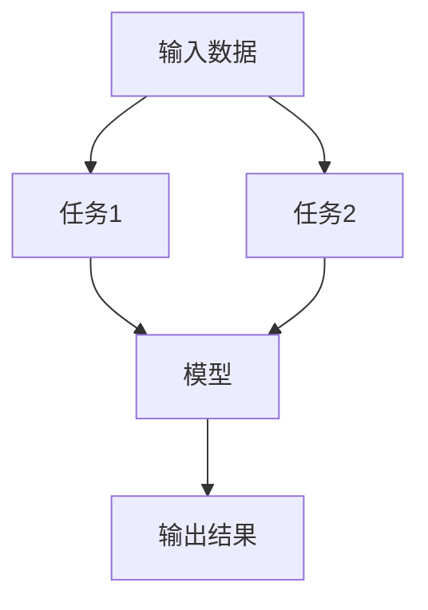
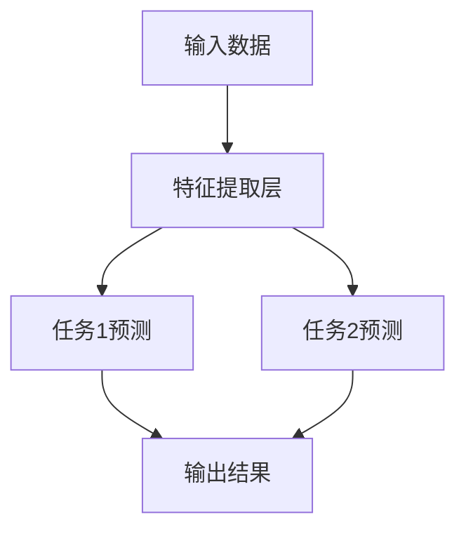

                 


# 企业AI Agent的多任务学习框架：提升模型通用性与迁移能力

> 关键词：企业AI Agent，多任务学习，模型通用性，迁移能力，深度学习，人工智能

> 摘要：本文详细探讨了企业AI Agent的多任务学习框架，分析了多任务学习在提升模型通用性和迁移能力中的作用。通过理论与实践相结合的方式，本文介绍了多任务学习的原理、算法实现、系统架构设计以及实际应用案例，为企业AI Agent的开发与优化提供了有价值的参考。

---

## 第一部分：企业AI Agent的背景与概念

### 第1章：企业AI Agent的背景与概念

#### 1.1 问题背景

##### 1.1.1 企业AI Agent的定义与特点

企业AI Agent是一种智能代理系统，能够根据企业需求执行多种任务，如数据分析、决策支持、自动化操作等。与传统的单任务模型相比，AI Agent具备以下特点：

- **自主性**：能够独立感知环境并做出决策。
- **反应性**：能够实时响应环境变化。
- **学习能力**：通过学习提升任务执行效率和准确性。
- **多任务能力**：能够处理多种不同类型的任务。

##### 1.1.2 多任务学习的必要性

在企业环境中，AI Agent需要处理的任务往往具有多样性。例如，一个AI Agent可能需要同时完成数据分析、预测模型构建、异常检测等多种任务。传统的单任务模型难以应对这种复杂性，而多任务学习（Multi-Task Learning, MTL）通过共享任务之间的共同特征，能够有效提升模型的通用性和迁移能力。

##### 1.1.3 模型通用性与迁移能力的重要性

模型的通用性是指模型在不同任务之间迁移的能力。提升通用性能够减少模型训练所需的数据量和计算资源，同时提高模型的灵活性和适应性。迁移能力则指模型在新任务上的表现，这对于企业AI Agent来说尤为重要，因为企业可能需要快速部署新的AI功能。

---

#### 1.2 问题描述

##### 1.2.1 传统AI模型的局限性

传统的AI模型通常专注于单一任务，如图像分类或自然语言处理。这种单一任务模型在面对企业中复杂的多任务场景时，往往表现出以下局限性：

- **数据利用率低**：每个任务都需要独立的数据集，数据冗余问题严重。
- **模型复用性差**：每个任务都需要独立训练模型，增加了计算资源的消耗。
- **适应性不足**：在面对新任务时，需要重新训练整个模型，效率低下。

##### 1.2.2 企业应用场景的多样性需求

企业环境中，AI Agent需要处理的任务类型多样，例如：

- **数据分析与预测**：分析销售数据并预测市场趋势。
- **自然语言处理**：处理客户邮件并分类客户问题。
- **图像识别**：识别产品缺陷并进行质量控制。

这些任务之间往往存在共同的特征和规律，可以通过多任务学习框架进行统一建模。

##### 1.2.3 多任务学习在企业中的应用痛点

尽管多任务学习在理论上具备优势，但在实际应用中仍面临以下挑战：

- **任务间干扰**：某些任务可能相互干扰，导致模型性能下降。
- **任务复杂性**：不同类型的任务可能具有不同的特征和目标，增加了模型设计的复杂性。
- **计算资源消耗**：多任务学习通常需要更多的计算资源和数据存储空间。

---

#### 1.3 问题解决

##### 1.3.1 多任务学习的核心思想

多任务学习的核心思想是通过共享任务之间的共同特征，提高模型的通用性和迁移能力。具体来说，多任务学习通过共享模型参数，使模型能够在多个任务之间进行参数优化，从而实现任务间的协同学习。

##### 1.3.2 模型通用性提升的关键技术

模型通用性提升的关键技术包括：

- **参数共享**：通过共享模型参数，减少模型的参数数量，提高模型的泛化能力。
- **任务嵌入**：将任务信息嵌入模型中，使模型能够根据任务需求自动调整参数。
- **联合优化**：通过联合优化多个任务的目标函数，使模型在多个任务之间达到平衡。

##### 1.3.3 迁移能力增强的方法

迁移能力增强的方法包括：

- **预训练与微调**：通过预训练模型在大规模数据上进行初始训练，然后在特定任务上进行微调。
- **跨任务特征提取**：提取任务之间的共同特征，作为模型的公共部分。
- **任务权重动态调整**：根据任务的重要性动态调整模型的优化目标。

---

#### 1.4 边界与外延

##### 1.4.1 多任务学习的边界条件

多任务学习的边界条件包括：

- **任务相关性**：任务之间必须具有一定的相关性，否则参数共享可能无法带来性能提升。
- **数据规模**：多任务学习需要足够的数据支持，否则模型可能无法有效学习任务之间的共同特征。
- **计算资源**：多任务学习对计算资源的需求较高，需要高性能计算设备支持。

##### 1.4.2 与单任务学习的区分

单任务学习与多任务学习的主要区别在于：

- **目标函数**：单任务学习仅优化单个任务的目标函数，而多任务学习优化多个任务的目标函数。
- **参数共享**：单任务学习通常不共享参数，而多任务学习通过共享参数来提升模型的通用性。
- **应用场景**：单任务学习适用于任务单一的场景，而多任务学习适用于任务多样化的场景。

##### 1.4.3 与其他AI技术的关系

多任务学习与其他AI技术的关系：

- **深度学习**：多任务学习是深度学习的一种应用形式。
- **迁移学习**：多任务学习与迁移学习密切相关，两者都关注模型在不同任务之间的迁移能力。
- **强化学习**：多任务学习可以与强化学习结合，用于复杂任务的联合优化。

---

#### 1.5 核心概念结构与组成

##### 1.5.1 框架的核心要素

多任务学习框架的核心要素包括：

- **任务集合**：一组需要同时学习的任务。
- **模型结构**：模型的设计，包括共享参数和独立参数。
- **目标函数**：多个任务的目标函数及其权重。
- **优化算法**：用于优化多任务目标函数的算法。

##### 1.5.2 各要素之间的关系

任务集合中的任务通过模型结构共享参数，目标函数定义了任务之间的联合优化目标，优化算法负责调整模型参数以最小化目标函数。

##### 1.5.3 框架的整体架构



---

### 第2章：多任务学习框架的核心概念与联系

#### 2.1 多任务学习的原理

##### 2.1.1 任务共享表示的机制

任务共享表示的机制是通过共享模型的某些参数来实现的。例如，在神经网络中，共享的参数可以是嵌入层或某些隐藏层的权重。

##### 2.1.2 任务间关系的建模方法

任务间关系的建模方法包括：

- **独立建模**：假设任务之间相互独立，不共享参数。
- **部分共享建模**：共享部分参数，如特征提取层。
- **完全共享建模**：共享所有参数，仅任务输出层不同。

##### 2.1.3 模型参数的共享策略

模型参数的共享策略包括：

- **全局共享**：所有任务共享相同的参数。
- **层次共享**：不同层次的参数共享程度不同。
- **任务特定共享**：部分任务共享参数，部分任务不共享。

---

#### 2.2 核心概念对比分析

##### 2.2.1 任务独立性与共享性的对比

| 属性       | 任务独立性            | 任务共享性             |
|------------|-----------------------|-------------------------|
| 参数共享   | 无                   | 有                     |
| 模型复用性   | 低                   | 高                     |
| 训练效率     | 高                   | 低                     |

##### 2.2.2 参数共享与模型复用的对比

| 属性       | 参数共享             | 模型复用               |
|------------|----------------------|------------------------|
| 参数数量     | 少                   | 少                     |
| 训练时间     | 长                   | 短                     |
| 模型性能     | 高                   | 中                     |

##### 2.2.3 任务间权重分配的对比

| 方法         | 均等权重分配          | 动态权重分配            |
|--------------|----------------------|------------------------|
| 优点         | 简单实现              | 任务重要性动态调整      |
| 缺点         | 任务重要性未被充分考虑  | 实现复杂性增加          |

---

#### 2.3 ER实体关系图

```mermaid
er
    Actor: 企业AI Agent
    Task: 多任务学习任务
    Model: AI模型
    Relationship: 实现
    Actor -[拥有]-> Model
    Model -[执行]-> Task
    Task -[依赖]-> Relationship
```

---

### 第3章：多任务学习框架的算法原理

#### 3.1 算法原理概述

##### 3.1.1 多任务学习的数学模型

多任务学习的数学模型可以表示为：

$$ \min_{\theta} \sum_{i=1}^{n} \lambda_i L_i(\theta) $$

其中，$\theta$ 是模型参数，$L_i$ 是第 $i$ 个任务的损失函数，$\lambda_i$ 是任务权重。

##### 3.1.2 任务间权重分配的优化方法

任务间权重分配的优化方法包括：

- **固定权重**：任务权重在训练过程中保持不变。
- **动态权重**：任务权重根据任务的重要性动态调整。

##### 3.1.3 参数共享机制的实现

参数共享机制的实现可以通过以下方式：

- **共享全连接层**：共享模型的全连接层参数。
- **共享卷积层**：共享模型的卷积层参数。

---

#### 3.2 典型算法实现

##### 3.2.1 MTL（Multi-Task Learning）



以下是MTL的Python实现示例：

```python
import torch
import torch.nn as nn

class MultiTaskModel(nn.Module):
    def __init__(self, input_dim, output_dim):
        super(MultiTaskModel, self).__init__()
        self.shared_layer = nn.Linear(input_dim, 128)
        self.task1_layer = nn.Linear(128, output_dim)
        self.task2_layer = nn.Linear(128, output_dim)
    
    def forward(self, x):
        x = self.shared_layer(x)
        output1 = self.task1_layer(x)
        output2 = self.task2_layer(x)
        return output1, output2

# 初始化模型
model = MultiTaskModel(input_dim=100, output_dim=10)
# 定义损失函数
criterion1 = nn.CrossEntropyLoss()
criterion2 = nn.CrossEntropyLoss()
# 定义优化器
optimizer = torch.optim.Adam(model.parameters(), lr=0.001)

# 前向传播
outputs = model(x)
loss1 = criterion1(outputs[0], labels1)
loss2 = criterion2(outputs[1], labels2)
total_loss = loss1 + loss2
total_loss.backward()
optimizer.step()
```

---

#### 3.2.2 MTP（Multi-Task Pre-training）

MTP是一种基于预训练的多任务学习方法，其核心思想是通过预训练模型在大规模数据上进行初始化，然后在特定任务上进行微调。

---

## 总结

企业AI Agent的多任务学习框架通过共享任务之间的共同特征，能够有效提升模型的通用性和迁移能力。本文从背景、原理、算法实现、系统架构设计到实际应用案例，详细探讨了多任务学习在企业AI Agent中的应用。通过本文的分析，企业可以更好地设计和优化其AI Agent系统，以应对复杂的多任务场景。

---

# 结束语

企业AI Agent的多任务学习框架是一个复杂的系统工程，需要结合理论与实践。未来，随着深度学习和人工智能技术的不断发展，多任务学习将在企业AI Agent中发挥越来越重要的作用。企业需要持续关注技术进步，不断提升AI Agent的智能化水平，以满足日益复杂的业务需求。

---

# 最佳实践与小结

## 最佳实践

1. **任务相关性分析**：在设计多任务学习框架时，首先需要分析任务之间的相关性，选择合适的参数共享策略。
2. **模型复杂度控制**：避免过度共享参数，导致模型复杂度过高，影响性能。
3. **动态权重调整**：根据任务的重要性和数据分布动态调整任务权重，提高模型的泛化能力。
4. **性能监控与优化**：持续监控模型的性能，根据实际情况进行参数调优和模型优化。

---

## 小结

通过本文的详细讲解，读者可以深入了解企业AI Agent的多任务学习框架，掌握其核心原理和实现方法。多任务学习作为一种重要的技术手段，能够有效提升AI Agent的通用性和迁移能力，为企业应对复杂的多任务场景提供了有力支持。

---

## 注意事项

1. **数据质量**：多任务学习对数据质量要求较高，需要确保数据的多样性和代表性。
2. **计算资源**：多任务学习需要较大的计算资源，企业需要确保硬件设备的性能。
3. **模型解释性**：多任务学习模型通常较为复杂，需要关注模型的解释性，以便更好地理解和优化模型。

---

## 拓展阅读

1. **《Multi-Task Learning》**：深入探讨多任务学习的理论与应用。
2. **《Neural Networks and Deep Learning》**：了解深度学习的基础知识，为多任务学习提供理论支持。
3. **《Enterprise AI: A Comprehensive Guide》**：全面介绍企业AI的应用与实践。

---

通过本文的阅读和学习，读者可以掌握企业AI Agent的多任务学习框架的核心思想和实现方法，为企业AI Agent的开发与优化提供有价值的参考。

