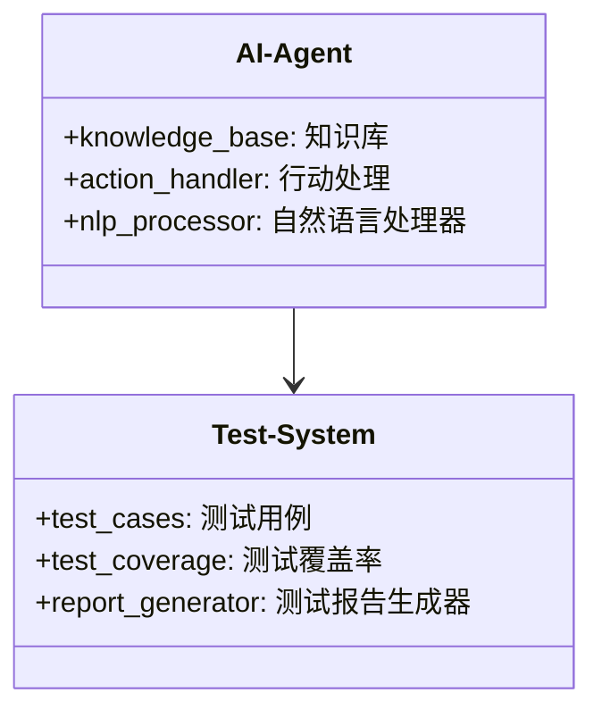
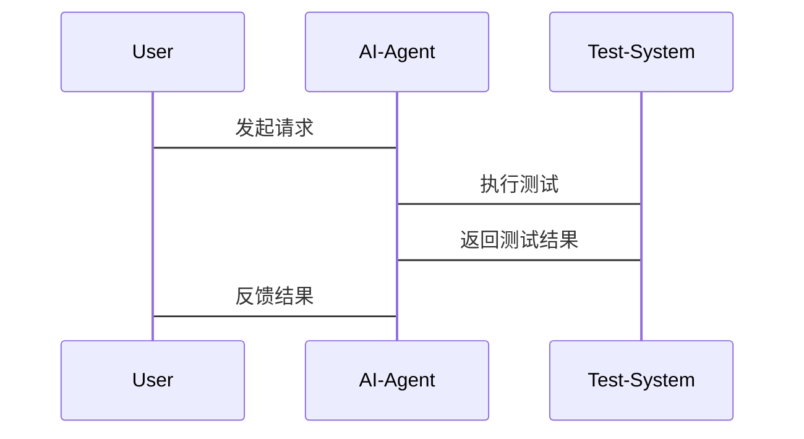

                 


# 企业AI Agent的多场景测试策略：模拟真实业务环境

> 关键词：AI Agent, 多场景测试, 业务环境模拟, 测试策略, 企业应用

> 摘要：本文将详细探讨企业AI Agent在多场景下的测试策略，重点分析如何在模拟真实业务环境中确保AI Agent的稳定性和可靠性。通过背景介绍、核心概念、算法原理、系统架构设计、项目实战和最佳实践等多个维度，系统性地阐述AI Agent测试的实施步骤和关键点，帮助读者全面理解并有效应用这些策略。

---

## 第一部分：企业AI Agent的背景与概念

### 第1章：问题背景与概念解析

#### 1.1 问题背景
在企业智能化转型的背景下，AI Agent（智能代理）逐渐成为企业数字化运营的核心工具。AI Agent能够通过自然语言处理、机器学习等技术，为企业提供自动化决策、问题解决和流程优化的能力。然而，AI Agent的应用场景复杂多样，其在多场景下的稳定性和可靠性成为企业关注的重点。

#### 1.2 问题描述
AI Agent在实际应用中，往往会面临多种复杂场景的挑战，例如：
- 不同业务部门的需求差异导致功能覆盖不全。
- 多系统交互时的边界条件不明确，导致测试覆盖率不足。
- 真实业务环境中的不确定性因素难以被传统测试覆盖。

#### 1.3 问题解决
为了应对上述挑战，企业需要制定一套系统的多场景测试策略，通过模拟真实业务环境，确保AI Agent在各种复杂情况下的稳定性和可靠性。

#### 1.4 边界与外延
AI Agent的测试范围不仅包括功能测试，还包括性能、安全性和用户体验等多方面的测试。其外延则涵盖了从单体系统测试到分布式系统测试的全生命周期。

#### 1.5 概念结构与核心要素
AI Agent的测试策略需要涵盖以下核心要素：
- **测试目标**：明确AI Agent在不同场景下的预期行为。
- **测试场景**：基于真实业务环境构建多样化的测试场景。
- **测试数据**：利用真实业务数据或模拟数据进行测试。
- **测试工具**：选择适合的测试工具和框架。

---

## 第二部分：企业AI Agent的核心概念与联系

### 第2章：核心概念与原理

#### 2.1 核心概念原理
AI Agent的测试策略需要结合以下核心概念：
- **自然语言处理（NLP）**：确保AI Agent能够准确理解用户输入。
- **机器学习（ML）**：通过模型训练提升AI Agent的决策能力。
- **分布式系统**：确保AI Agent在多系统交互中的稳定性。

#### 2.2 核心概念属性特征对比

| 特性       | 传统测试           | AI Agent测试          |
|------------|--------------------|-----------------------|
| 测试目标   | 系统功能验证       | 智能行为验证           |
| 测试数据   | 结构化数据         | 结构化+非结构化数据    |
| 测试场景   | 简单场景           | 复杂场景               |
| 测试工具   | 传统测试框架       | 结合AI的测试框架       |

#### 2.3 ER实体关系图架构
```mermaid
er
actor: 用户
agent: AI Agent
system: 企业系统
action: 行动
goal: 目标
knowledge: 知识库
```

---

## 第三部分：企业AI Agent测试的算法原理

### 第3章：算法原理与实现

#### 3.1 算法原理概述
AI Agent的测试策略需要结合以下算法：
- **基于规则的测试**：通过预定义规则覆盖特定场景。
- **基于模型的测试**：利用AI模型生成测试用例。
- **基于场景的测试**：模拟真实业务场景进行测试。

#### 3.2 算法原理的数学模型
AI Agent的测试覆盖率可以通过以下公式计算：
$$ \text{测试覆盖率} = \frac{\text{已测试场景数}}{\text{总场景数}} \times 100\% $$

#### 3.3 算法实现的Python代码示例
```python
def test_ai_agent(agent, test_cases):
    coverage = 0
    for case in test_cases:
        if agent.handle_case(case):
            coverage += 1
    return coverage / len(test_cases) * 100

# 示例测试用例
test_cases = [
    "处理客户投诉",
    "生成销售报告",
    "协调部门间任务"
]
print(test_ai_agent(agent, test_cases))
```

---

## 第四部分：企业AI Agent测试的系统架构设计

### 第4章：系统分析与架构设计

#### 4.1 问题场景介绍
企业在使用AI Agent时，常见的问题包括：
- 多系统交互复杂，导致测试难度大。
- 真实业务环境难以模拟，测试覆盖率低。

#### 4.2 项目介绍
以一个典型的电商系统为例，AI Agent需要处理订单处理、客户咨询、库存管理等多个场景。

#### 4.3 系统功能设计


#### 4.4 系统架构设计


#### 4.5 系统接口设计
AI Agent与测试系统的交互接口包括：
- `execute_test_case(case)`
- `get_test_coverage()`

#### 4.6 系统交互设计


---

## 第五部分：企业AI Agent测试的项目实战

### 第5章：项目实战与案例分析

#### 5.1 环境安装
测试环境配置：
- Python 3.8+
- AI Agent框架（如Rasa）
- 测试框架（如pytest）

#### 5.2 核心代码实现
```python
from rasa_core.agent import Agent
from rasa_core.train import train
from rasa_core.test import run_tests

# 初始化AI Agent
agent = Agent.load("models/agent_model")

# 执行测试
test_cases = ["book a flight", "check flight status"]
run_tests(agent, test_cases)
```

#### 5.3 案例分析
以电商系统为例，测试AI Agent在订单处理中的表现：
- 测试场景：处理订单支付失败的情况。
- 测试结果：AI Agent能够正确引导用户完成退款流程。

---

## 第六部分：企业AI Agent测试的最佳实践

### 第6章：小结与注意事项

#### 6.1 小结
本文详细探讨了企业AI Agent的多场景测试策略，重点分析了如何在模拟真实业务环境中确保AI Agent的稳定性和可靠性。

#### 6.2 注意事项
- **测试数据**：确保测试数据的多样性和真实性。
- **测试场景**：覆盖所有可能的业务场景。
- **测试工具**：选择适合的测试工具和框架。

#### 6.3 拓展阅读
推荐阅读以下书籍和文章：
- 《AI系统测试与质量保障》
- “多场景测试在企业AI系统中的应用”

---

通过以上内容，我们系统性地阐述了企业AI Agent的多场景测试策略，希望能够为企业的智能化转型提供有价值的参考和指导。

