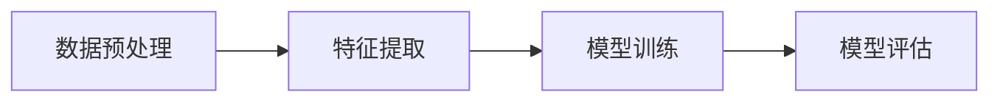
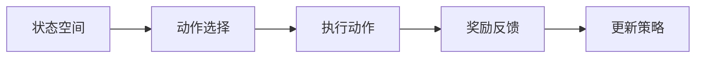

                 


# 企业AI Agent的多场景测试：模拟真实业务环境

> 关键词：企业AI Agent，多场景测试，真实业务环境，测试方法，系统设计

> 摘要：本文系统地介绍了企业AI Agent在多场景下的测试方法，从背景、核心概念到算法原理、系统设计，再到项目实战和最佳实践，详细阐述了如何在真实业务环境中进行有效的AI Agent测试。

---

# 第1章: 企业AI Agent与多场景测试的背景

## 1.1 AI Agent的基本概念

### 1.1.1 什么是AI Agent？
AI Agent（人工智能代理）是指能够感知环境并采取行动以实现目标的智能实体。在企业环境中，AI Agent通常用于自动化任务、数据处理和决策支持。

### 1.1.2 AI Agent的核心特征
- **自主性**：能够在没有人工干预的情况下运行。
- **反应性**：能够根据环境变化调整行为。
- **目标导向**：所有行动都以实现特定目标为导向。
- **学习能力**：能够通过数据和经验不断优化性能。

### 1.1.3 企业级AI Agent的特殊性
企业AI Agent需要处理复杂业务逻辑，具备高可用性和容错性，同时需要符合企业内部的合规要求。

## 1.2 多场景测试的背景与意义

### 1.2.1 什么是多场景测试？
多场景测试是指在多个不同的业务场景下，对AI Agent的行为进行测试，以验证其在各种环境中的稳定性和准确性。

### 1.2.2 企业AI Agent测试的复杂性
- **场景多样性**：企业环境中可能涉及多种业务场景，如订单处理、客户支持、数据分析等。
- **数据多样性**：不同场景下的数据格式、数据量和数据质量差异大。
- **需求多样性**：不同场景对AI Agent的响应时间和准确率要求不同。

### 1.2.3 多场景测试的重要性
- **确保AI Agent的通用性**：避免AI Agent在单一场景下表现优异，但在其他场景下失效。
- **提高系统的鲁棒性**：通过多场景测试，发现潜在问题并及时修复。
- **满足企业需求**：企业AI Agent需要在多个场景下协同工作，多场景测试是其必经之路。

## 1.3 企业AI Agent测试的目标与范围

### 1.3.1 测试目标
- 验证AI Agent在不同场景下的行为是否符合预期。
- 评估AI Agent的性能（响应时间、准确性）。
- 发现AI Agent在不同场景下的潜在缺陷。

### 1.3.2 测试范围
- **功能测试**：验证AI Agent是否能正确执行预定义的任务。
- **性能测试**：评估AI Agent在高负载情况下的表现。
- **安全性测试**：确保AI Agent在处理敏感数据时的安全性。
- **兼容性测试**：验证AI Agent在不同操作系统和应用程序中的兼容性。

### 1.3.3 测试边界与外延
- **边界条件**：测试在极端条件下的表现，如数据量极大或网络延迟。
- **外延**：测试AI Agent在扩展业务场景时的适应性。

---

# 第2章: 企业AI Agent的核心概念与联系

## 2.1 AI Agent的核心原理

### 2.1.1 AI Agent的感知与决策机制
AI Agent通过传感器或API接口获取环境信息，利用算法进行分析和判断，最后做出决策。

### 2.1.2 AI Agent的学习与优化过程
通过监督学习、强化学习等方法，AI Agent不断优化自身的模型参数，提高准确性。

### 2.1.3 AI Agent的执行与反馈机制
AI Agent根据决策结果执行动作，并通过反馈机制调整下一步行动。

## 2.2 核心概念对比表

### 2.2.1 AI Agent与传统自动化系统的对比
| 特性               | AI Agent             | 传统自动化系统       |
|--------------------|----------------------|--------------------|
| 自主性             | 高                   | 低或无             |
| 学习能力           | 强                   | 无或弱             |
| 适应性             | 强                   | 较弱               |

### 2.2.2 不同AI Agent类型的特点对比
| 类型               | 基于规则的AI Agent   | 基于机器学习的AI Agent |
|--------------------|----------------------|--------------------|
| 决策方式           | 预定义规则           | 数据驱动的模型       |
| 学习能力           | 无                   | 有                 |
| 适应性             | 较低                 | 较高               |

### 2.2.3 多场景测试中的关键要素对比
| 要素               | 单场景测试           | 多场景测试           |
|--------------------|----------------------|--------------------|
| 测试目标           | 单一场景下的性能     | 多场景下的通用性     |
| 测试复杂度         | 较低                 | 较高               |
| 测试结果           | 适用于单一场景       | 适用于多种场景       |

## 2.3 实体关系图（ER图）

### 2.3.1 AI Agent与测试场景的关系


### 2.3.2 测试场景与测试用例的关系


### 2.3.3 测试用例与测试结果的关系


---

# 第3章: AI Agent多场景测试的算法原理

## 3.1 监督学习与强化学习

### 3.1.1 监督学习的定义与流程
监督学习是一种机器学习方法，通过训练数据和标签，训练模型预测新的数据。

### 3.1.2 强化学习的定义与流程
强化学习是一种通过试错机制，学习如何在环境中做出决策以最大化累积奖励的方法。

## 3.2 算法流程图

### 3.2.1 监督学习的mermaid流程图


### 3.2.2 强化学习的mermaid流程图


## 3.3 算法实现代码

### 3.3.1 监督学习示例代码
```python
def supervised_learning(train_data, labels):
    # 训练过程
    model.fit(train_data, labels)
    return model
```

### 3.3.2 强化学习示例代码
```python
def reinforce_learning(env):
    # 环境与策略交互
    for episode in range(episodes):
        state = env.reset()
        while not done:
            action = policy(state)
            next_state, reward, done = env.step(action)
            update_policy(reward)
    return policy
```

---

# 第4章: 企业AI Agent多场景测试的系统设计

## 4.1 系统分析与架构设计

### 4.1.1 问题场景介绍
企业AI Agent需要在多个业务场景下运行，例如订单处理、客户支持、数据分析等。

### 4.1.2 系统功能设计
- **数据采集模块**：收集各个场景下的数据。
- **测试执行模块**：根据预设的测试用例执行测试。
- **结果分析模块**：分析测试结果，生成报告。

### 4.1.3 系统架构设计


### 4.1.4 系统接口设计
- **输入接口**：接收测试用例和场景配置。
- **输出接口**：输出测试结果和报告。

### 4.1.5 系统交互设计


---

# 第5章: 企业AI Agent多场景测试的项目实战

## 5.1 项目介绍

### 5.1.1 项目背景
以电商客服系统为例，AI Agent需要处理客户咨询、订单跟踪等任务。

### 5.1.2 项目目标
验证AI Agent在电商客服场景下的性能和准确性。

## 5.2 核心实现

### 5.2.1 环境安装
```bash
pip install numpy pandas scikit-learn
```

### 5.2.2 核心代码实现
```python
def test_scenario(environment):
    # 初始化测试用例
    test_cases = load_test_cases()
    # 执行测试
    for case in test_cases:
        setup(case)
        execute_test(case)
        record_result(case)
    # 生成报告
    generate_report()
```

### 5.2.3 代码应用解读与分析
- **测试用例加载**：从文件中读取预定义的测试用例。
- **测试执行**：根据测试用例调用AI Agent进行测试。
- **结果记录**：将测试结果存储到数据库中。
- **报告生成**：根据测试结果生成HTML格式的测试报告。

## 5.3 实际案例分析

### 5.3.1 案例背景
电商客服系统中的订单跟踪功能。

### 5.3.2 案例分析
通过测试AI Agent在订单跟踪中的表现，发现潜在问题并进行优化。

---

# 第6章: 企业AI Agent多场景测试的最佳实践

## 6.1 小结

### 6.1.1 测试的重要性
多场景测试是确保AI Agent在企业环境中稳定运行的关键步骤。

### 6.1.2 测试的复杂性
企业环境的复杂性要求测试人员具备高度的专业性和耐心。

## 6.2 注意事项

### 6.2.1 确保测试覆盖所有场景
在设计测试用例时，必须确保覆盖所有可能的业务场景。

### 6.2.2 定期更新测试用例
随着企业业务的变化，测试用例需要定期更新和优化。

## 6.3 拓展阅读

### 6.3.1 相关书籍
- 《机器学习实战》
- 《深度学习》

### 6.3.2 在线资源
- TensorFlow官方文档
- PyTorch官方文档

---

# 结语

通过本文的系统介绍，读者可以全面了解企业AI Agent多场景测试的方法和实践。从理论到实践，从算法到系统设计，多场景测试是确保AI Agent在企业环境中稳定运行的关键步骤。希望本文能为企业的AI Agent开发和测试提供有价值的参考。

