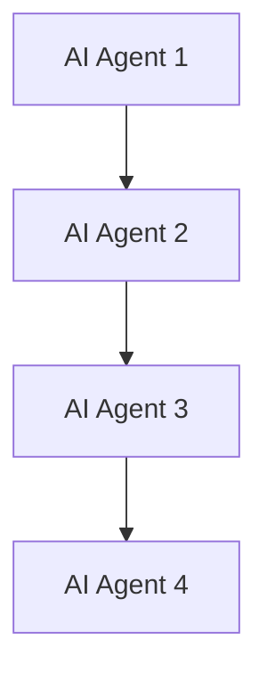

                 


# 企业AI Agent的多智能体系统在团队协作中的应用

## 关键词：
- AI Agent
- 多智能体系统
- 团队协作
- 企业应用
- 算法原理

## 摘要：
本文探讨了企业AI Agent的多智能体系统在团队协作中的应用，分析了AI Agent的核心原理、多智能体系统的协作机制，并通过具体案例展示了其在企业环境中的实际应用。文章详细介绍了系统的架构设计、算法实现以及项目实战，为读者提供了全面的技术视角和实践指南。

---

# 第一章：AI Agent与多智能体系统概述

## 1.1 AI Agent的基本概念

### 1.1.1 AI Agent的定义
AI Agent（人工智能代理）是指能够感知环境、自主决策并执行任务的智能实体。AI Agent可以是软件程序或物理设备，具备以下核心特征：
- **自主性**：无需外部干预，自主完成任务。
- **反应性**：能够实时感知环境并做出反应。
- **目标导向**：基于明确的目标执行操作。

### 1.1.2 多智能体系统的核心概念
多智能体系统（Multi-Agent System, MAS）由多个AI Agent组成，通过协作完成复杂任务。MAS的特点包括：
- **分布性**：各Agent独立运行，协同完成任务。
- **交互性**：Agent之间通过通信协议进行信息交换。
- **社会性**：Agent之间形成类似社会结构的协作关系。

### 1.1.3 企业协作中的AI Agent应用背景
在企业环境中，AI Agent可以应用于项目管理、客户服务、供应链优化等领域。通过多智能体系统的协作，企业能够提高效率、降低成本并增强竞争力。

## 1.2 多智能体系统的特点

### 1.2.1 多智能体系统的定义
多智能体系统由多个智能体组成，通过协作完成复杂任务。系统中的每个Agent都具有独立性，能够自主决策。

### 1.2.2 多智能体系统的主要特点
- **分布性**：各Agent独立运行，协同完成任务。
- **动态性**：环境和任务需求可能随时变化。
- **协作性**：Agent之间通过通信协议协作完成任务。

### 1.2.3 多智能体系统与传统单智能体系统的区别
| 特性         | 多智能体系统                  | 单智能体系统                  |
|--------------|------------------------------|-------------------------------|
| 独立性       | 各Agent独立运行              | 单个智能体运行                |
| 协作性       | Agent之间协作完成任务      | 单个智能体独立完成任务        |
| 适应性       | 系统适应性强，能够应对复杂任务 | 系统适应性较弱               |

## 1.3 企业协作中的AI Agent应用前景

### 1.3.1 AI Agent在企业协作中的潜在应用领域
- **项目管理**：协调团队成员的任务分配和进度跟踪。
- **客户服务**：智能客服系统中多个Agent协作处理客户请求。
- **供应链优化**：优化供应链中的物流和库存管理。

### 1.3.2 企业采用AI Agent的优势
- **提高效率**：通过自动化流程减少人工干预。
- **增强决策能力**：利用数据驱动的决策提高准确性。
- **灵活性**：系统能够快速适应环境变化。

### 1.3.3 AI Agent应用的挑战与机遇
- **挑战**：通信延迟、数据隐私、协作复杂性。
- **机遇**：技术创新、成本降低、效率提升。

---

# 第二章：AI Agent的核心原理

## 2.1 AI Agent的感知机制

### 2.1.1 感知的定义与作用
感知是AI Agent获取环境信息的过程，通过传感器或API接口获取数据。

### 2.1.2 常见的感知方法
- **基于规则的感知**：根据预设规则判断环境状态。
- **基于机器学习的感知**：利用深度学习模型识别环境特征。

### 2.1.3 感知在企业协作中的应用
在项目管理中，AI Agent通过感知团队成员的状态和任务进度，动态调整任务分配。

## 2.2 AI Agent的决策机制

### 2.2.1 决策的定义与作用
决策是AI Agent基于感知信息做出的选择，用于指导后续行动。

### 2.2.2 常见的决策算法
- **基于规则的决策**：根据预设规则做出决策。
- **基于强化学习的决策**：通过奖励机制优化决策策略。

### 2.2.3 决策在企业协作中的应用
在供应链优化中，AI Agent通过决策算法优化库存管理和物流调度。

## 2.3 AI Agent的执行机制

### 2.3.1 执行的定义与作用
执行是AI Agent将决策转化为具体操作的过程。

### 2.3.2 常见的执行方法
- **直接执行**：AI Agent直接执行任务。
- **通过API调用**：AI Agent通过API调用其他系统执行任务。

### 2.3.3 执行在企业协作中的应用
在客户服务中，AI Agent通过执行机制自动响应客户请求。

---

# 第三章：多智能体系统的协作机制

## 3.1 多智能体系统中的通信协议

### 3.1.1 通信协议的定义与作用
通信协议是Agent之间进行信息交换的规则，确保信息传递的准确性和可靠性。

### 3.1.2 常见的通信协议
- **基于消息队列的通信**：如Kafka、RabbitMQ。
- **基于HTTP的通信**：通过REST API进行信息交换。

### 3.1.3 通信协议在企业协作中的应用
在智能客服系统中，多个AI Agent通过通信协议协作处理客户请求。

## 3.2 多智能体系统中的任务分配

### 3.2.1 任务分配的定义与作用
任务分配是将任务分配给合适的Agent，确保任务高效完成。

### 3.2.2 常见的任务分配算法
- **轮询分配**：按顺序分配任务。
- **基于负载的分配**：根据Agent当前负载分配任务。

### 3.2.3 任务分配在企业协作中的应用
在项目管理中，AI Agent通过任务分配算法动态调整任务分配。

## 3.3 多智能体系统中的冲突解决

### 3.3.1 冲突解决的定义与作用
冲突解决是指在多智能体系统中，解决Agent之间的冲突，确保协作顺利进行。

### 3.3.2 常见的冲突解决方法
- **协商解决**：Agent之间通过协商达成一致。
- **仲裁解决**：由仲裁者介入解决冲突。

### 3.3.3 冲突解决在企业协作中的应用
在供应链优化中，AI Agent通过冲突解决方法协调资源分配。

---

# 第四章：多智能体系统的算法原理

## 4.1 多智能体系统的算法概述

### 4.1.1 算法原理
多智能体系统的算法主要涉及任务分配、通信协议和冲突解决。

## 4.2 多智能体系统的通信协议设计

### 4.2.1 通信协议设计的步骤
1. 确定通信需求。
2. 设计消息格式。
3. 实现消息传递机制。

### 4.2.2 通信协议设计的数学模型
$$
\text{通信协议设计} = \{ \text{消息类型}, \text{消息格式}, \text{传输方式} \}
$$

## 4.3 多智能体系统的任务分配算法

### 4.3.1 任务分配算法的步骤
1. 收集各Agent的负载信息。
2. 根据负载信息分配任务。

### 4.3.2 任务分配算法的数学模型
$$
\text{任务分配} = \argmin_{i} (\text{Agent}_i.\text{负载})
$$

---

# 第五章：系统分析与架构设计

## 5.1 系统功能设计

### 5.1.1 系统功能模块
- **感知模块**：环境感知。
- **决策模块**：任务决策。
- **执行模块**：任务执行。

### 5.1.2 系统功能流程
1. 感知环境。
2. 制定决策。
3. 执行任务。

## 5.2 系统架构设计

### 5.2.1 系统架构图


## 5.3 系统接口设计

### 5.3.1 系统接口
- **输入接口**：接收环境数据。
- **输出接口**：发送执行指令。

---

# 第六章：项目实战

## 6.1 环境安装

### 6.1.1 安装依赖
- Python 3.8+
- Kafka、RabbitMQ

## 6.2 核心实现源代码

### 6.2.1 AI Agent代码
```python
class Agent:
    def __init__(self, id):
        self.id = id
        self.load = 0

    def感知环境(self, 环境数据):
        pass

    def 决策(self):
        pass

    def 执行(self, 指令):
        pass
```

## 6.3 应用解读与分析
通过AI Agent的协作，企业能够实现高效的团队协作和任务管理。

---

# 第七章：最佳实践与总结

## 7.1 最佳实践 tips

### 7.1.1 系统设计
确保系统架构清晰，便于扩展和维护。

### 7.1.2 算法优化
持续优化算法，提高系统效率和准确性。

## 7.2 小结
企业AI Agent的多智能体系统在团队协作中的应用前景广阔，通过合理设计和优化，能够为企业带来显著的效益。

---

# 结语

本文全面探讨了企业AI Agent的多智能体系统在团队协作中的应用，从基本概念到算法实现，再到项目实战，为读者提供了系统的知识和实践指导。希望本文能够为企业的智能化转型提供有价值的参考。

--- 

以上是文章的详细目录和部分内容，您可以根据实际需求进一步扩展每章的具体内容。

