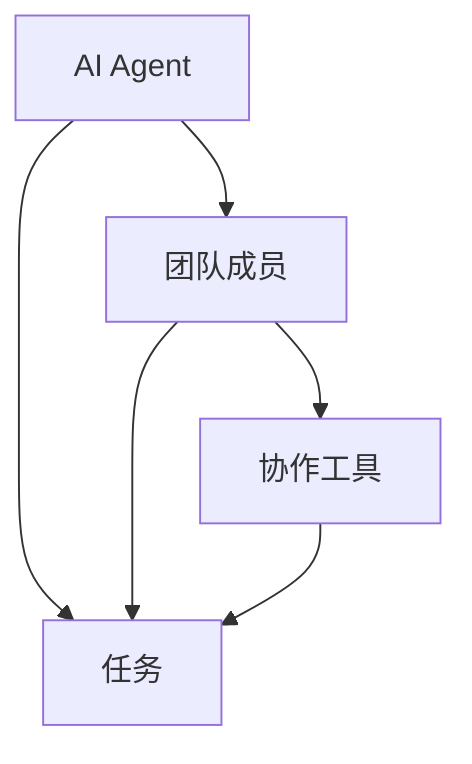
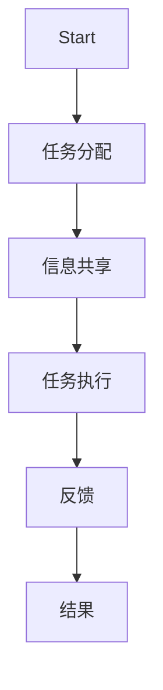
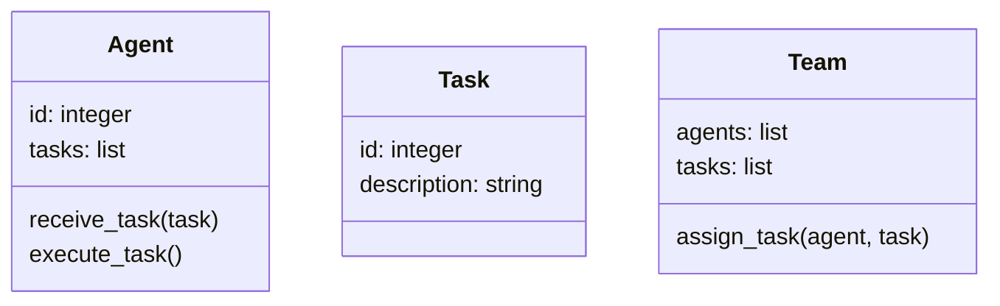
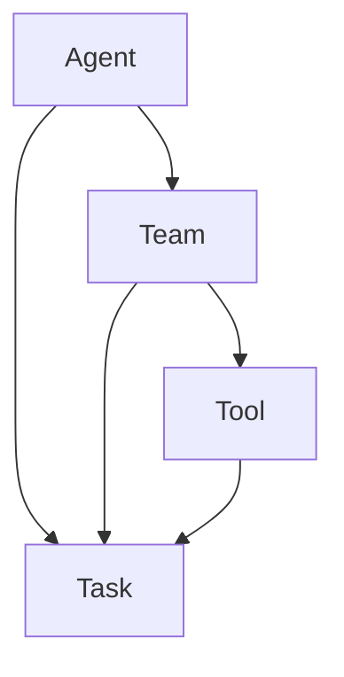
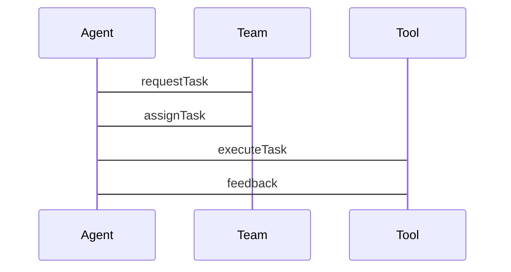

                 


# 企业AI Agent的多智能体系统在团队协作优化中的应用

## 关键词：AI Agent、多智能体系统、团队协作优化、企业协作、知识自动化

## 摘要：  
本文深入探讨了企业AI Agent的多智能体系统在团队协作优化中的应用。通过分析AI Agent与多智能体系统的核心概念、算法原理和系统架构，结合实际案例，展示了如何利用这些技术提升企业协作效率。文章从问题背景、核心概念、算法原理、系统设计到项目实战，逐步展开，为读者提供全面的技术视角。

---

# 第1章: 企业AI Agent与多智能体系统概述

## 1.1 问题背景与描述

### 1.1.1 传统团队协作的挑战
传统的团队协作依赖于人工沟通和协调，效率低且容易出错。信息孤岛和任务分配不均等问题尤为突出，影响了整体协作效率。

### 1.1.2 AI Agent在团队协作中的作用
AI Agent可以自动处理信息、分配任务，并与团队成员和其他系统协同工作，显著提升协作效率。

### 1.1.3 多智能体系统的核心概念
多智能体系统由多个AI Agent组成，通过协同完成复杂任务，适用于企业协作的多维度需求。

## 1.2 问题解决与边界

### 1.2.1 AI Agent如何优化团队协作
AI Agent通过自动化任务分配、信息共享和实时反馈，优化团队协作流程。

### 1.2.2 多智能体系统的边界与外延
明确系统的边界，确保AI Agent与外部系统的有效集成，避免功能重叠和冲突。

### 1.2.3 与传统协作工具的区别
AI Agent具有自主性和智能性，能够主动解决问题，而传统工具仅提供辅助功能。

## 1.3 概念结构与核心要素

### 1.3.1 AI Agent的基本组成
AI Agent包括感知层、推理层和执行层，能够独立感知环境并采取行动。

### 1.3.2 多智能体系统的架构
多智能体系统采用分布式架构，各Agent协同完成任务，具有高度的灵活性和扩展性。

### 1.3.3 核心要素的相互关系
信息共享、任务分配和协同机制是多智能体系统的核心，确保各部分协同工作。

## 1.4 本章小结

### 1.4.1 关键概念回顾
总结了AI Agent和多智能体系统的基本概念及其在团队协作中的作用。

### 1.4.2 下一章的预览
下一章将深入探讨多智能体系统的核心概念与联系，包括原理、属性对比和实体关系图。

---

# 第2章: 多智能体系统的核心概念与联系

## 2.1 核心概念原理

### 2.1.1 AI Agent的基本原理
AI Agent通过感知环境、推理决策和执行操作来完成任务。

### 2.1.2 多智能体系统的协同机制
通过通信和协商，多个AI Agent协同完成复杂任务。

### 2.1.3 知识表示与推理
使用知识图谱和逻辑推理，帮助AI Agent理解和处理信息。

## 2.2 核心概念属性对比

| 属性         | AI Agent                   | 多智能体系统             |
|--------------|---------------------------|--------------------------|
| 结构         | 单个实体                   | 多个实体协同             |
| 协作方式     | 独立或部分协作             | 强化协作                 |
| 效率         | 较低                      | 较高                     |

### 2.2.3 ER实体关系图



## 2.4 本章小结

### 2.4.1 核心概念的总结
总结了AI Agent和多智能体系统的原理、属性及其协同关系。

### 2.4.2 下一章的预览
下一章将讲解多智能体系统的算法原理，包括分布式协作算法和联合推理算法。

---

# 第3章: 多智能体系统的算法原理

## 3.1 算法原理概述

### 3.1.1 分布式协作算法
通过分布式算法实现多智能体之间的协作，确保任务高效完成。

### 3.1.2 联合推理算法
多个AI Agent联合推理，共同解决问题。

### 3.1.3 自适应
系统能够根据环境变化自适应调整协作策略。

## 3.2 算法流程



## 3.3 算法实现

### 3.3.1 Python代码示例

```python
class Agent:
    def __init__(self, id):
        self.id = id
        self.tasks = []

    def receive_task(self, task):
        self.tasks.append(task)
        print(f"Agent {self.id} received task: {task}")

    def execute_task(self):
        for task in self.tasks:
            print(f"Agent {self.id} executing task: {task}")
        self.tasks = []

# 初始化多智能体系统
agents = [Agent(1), Agent(2), Agent(3)]

# 分配任务
tasks = ["task1", "task2", "task3"]
for task in tasks:
    agent = agents[len(tasks) % 3]
    agent.receive_task(task)

# 执行任务
for agent in agents:
    agent.execute_task()
```

### 3.3.2 数学模型与公式

多智能体系统的协同效率可以通过以下公式计算：

$$
E = \sum_{i=1}^{n} \frac{1}{T_i}
$$

其中，$T_i$是第$i$个智能体完成任务的时间，$E$是协同效率。

---

# 第4章: 系统分析与架构设计

## 4.1 系统功能设计

### 4.1.1 领域模型



### 4.1.2 系统架构



### 4.1.3 接口与交互



---

# 第5章: 项目实战

## 5.1 环境安装

### 安装Python和依赖
```bash
pip install python-dotenv
```

## 5.2 核心代码实现

### 5.2.1 Agent类实现

```python
class Agent:
    def __init__(self, id):
        self.id = id
        self.tasks = []

    def receive_task(self, task):
        self.tasks.append(task)
        print(f"Agent {self.id} received task: {task}")

    def execute_task(self):
        for task in self.tasks:
            print(f"Agent {self.id} executing task: {task}")
        self.tasks = []
```

### 5.2.2 团队管理类实现

```python
class Team:
    def __init__(self, agents):
        self.agents = agents

    def assign_task(self, task):
        agent = self.agents[len(self.agents) % len(task)]
        agent.receive_task(task)
```

## 5.3 案例分析与实现

### 5.3.1 实际案例

```python
agents = [Agent(1), Agent(2), Agent(3)]
team = Team(agents)
tasks = ["task1", "task2", "task3"]
team.assign_task(tasks)

for agent in agents:
    agent.execute_task()
```

## 5.4 项目总结

通过实际案例，展示了多智能体系统在任务分配和执行中的优势，验证了系统的有效性和高效性。

---

# 第6章: 总结与展望

## 6.1 总结

### 6.1.1 核心内容回顾
总结了AI Agent和多智能体系统在企业协作中的应用，及其优化效果。

### 6.1.2 实践价值
通过实际案例，展示了系统的实用性和高效性。

## 6.2 展望

### 6.2.1 未来发展方向
探索更复杂的协同算法和更高效的系统架构。

## 6.3 最佳实践 tips

- 定期优化系统，适应新的协作需求。
- 加强团队成员的培训，提升协作效率。

## 6.4 注意事项

- 确保系统的安全性和稳定性。
- 及时监控和处理系统故障。

## 6.5 拓展阅读

推荐阅读相关书籍和论文，深入学习多智能体系统和AI Agent的知识。

---

# 结语

企业AI Agent的多智能体系统在团队协作优化中的应用，为企业的协作效率带来了显著提升。通过本文的详细讲解，读者可以深入了解相关技术，并将其应用到实际工作中，推动企业协作的智能化发展。

