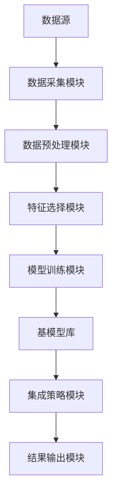
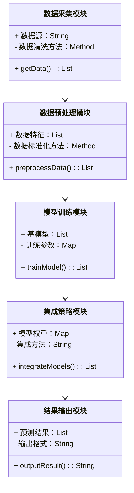

                 


# 企业AI Agent的多模型集成策略：优势互补

---

## 关键词：  
企业AI Agent、多模型集成、模型优势互补、系统架构设计、项目实战

---

## 摘要：  
企业AI Agent的多模型集成策略是当前人工智能领域的重要研究方向之一。通过集成多个AI模型，可以充分发挥各个模型的优势，弥补单一模型的不足，从而提升系统的整体性能。本文将从企业AI Agent的基本概念出发，深入探讨多模型集成的原理、算法、系统架构设计以及项目实战，为企业AI Agent的多模型集成提供理论与实践的双重指导。

---

## 第1章：企业AI Agent的概述

### 1.1 AI Agent的基本概念  
AI Agent（智能体）是指能够感知环境、做出决策并执行操作的智能系统。在企业场景中，AI Agent通常用于自动化任务处理、数据分析、决策支持等领域。企业AI Agent的核心目标是通过智能化手段提升企业的效率和竞争力。

#### 1.1.1 AI Agent的特点  
- **自主性**：AI Agent能够独立感知环境并做出决策。  
- **反应性**：能够实时响应环境变化。  
- **目标导向性**：基于目标驱动行为。  
- **学习能力**：通过数据和经验不断优化性能。  

#### 1.1.2 企业AI Agent的分类与应用场景  
企业AI Agent可以分为以下几类：  
1. **任务型AI Agent**：用于完成特定任务（如数据分析、流程自动化）。  
2. **决策型AI Agent**：用于辅助或替代人类决策（如智能风控、供应链优化）。  
3. **交互型AI Agent**：用于与用户进行交互（如智能客服、虚拟助手）。  

应用场景包括：供应链管理、客户关系管理、智能客服、金融投资等领域。

---

### 1.2 多模型集成的背景与意义  

#### 1.2.1 为什么要进行多模型集成  
- 单一模型的能力有限，难以覆盖所有场景。  
- 不同模型在不同任务上具有不同的优势，通过集成可以实现优势互补。  
- 多模型集成能够提高系统的鲁棒性和泛化能力。  

#### 1.2.2 多模型集成在企业AI Agent中的价值  
- 提高系统的准确性和效率。  
- 降低对单一模型的依赖风险。  
- 适应复杂多变的业务场景。  

#### 1.2.3 多模型集成的现状与趋势  
随着AI技术的发展，多模型集成已成为企业智能化转型的重要方向。未来，多模型集成将更加注重模型间的协同优化和动态调整。

---

## 第2章：多模型集成的核心概念与原理  

### 2.1 多模型集成的基本原理  

#### 2.1.1 多模型集成的定义与分类  
多模型集成（Model Ensemble）是指将多个模型的输出进行融合，以获得更好的性能。常见的集成方式包括：  
1. **投票法**：基于多数投票决定最终结果。  
2. **加权法**：根据模型的性能赋予不同的权重。  
3. **融合法**：通过数学方法将模型的输出融合（如线性回归、神经网络）。  

#### 2.1.2 多模型集成的优缺点对比  
| 优缺点 | 详细描述 |  
|--------|----------|  
| **优点** | - 提高准确率；- 增强鲁棒性；- 降低过拟合风险。 |  
| **缺点** | - 计算资源消耗大；- 模型间可能存在冗余。 |  

#### 2.1.3 多模型集成的核心要素与关系  
多模型集成的核心要素包括：  
1. **模型多样性**：模型之间应具有不同的特征或结构。  
2. **集成策略**：模型的融合方式（如投票、加权）。  
3. **性能评估**：模型集成后的效果评估方法。  

---

### 2.2 多模型集成的数学模型与公式  

#### 2.2.1 多模型集成的数学表达式  
假设我们有 $k$ 个模型，每个模型的输出为 $f_i(x)$，则集成后的输出为：  
$$ F(x) = \sum_{i=1}^{k} \alpha_i f_i(x) $$  
其中，$\alpha_i$ 是模型 $i$ 的权重。  

#### 2.2.2 集成模型的权重分配公式  
权重分配可以通过以下方式实现：  
$$ \alpha_i = \frac{1 + \text{accuracy}_i}{\sum_{j=1}^{k} (1 + \text{accuracy}_j)} $$  
其中，$\text{accuracy}_i$ 是模型 $i$ 的准确率。  

#### 2.2.3 模型性能评估的数学模型  
常用的评估指标包括准确率（Accuracy）、精确率（Precision）、召回率（Recall）和F1值（F1 Score）。  
$$ \text{F1} = 2 \cdot \frac{\text{Precision} \cdot \text{Recall}}{\text{Precision} + \text{Recall}} $$  

---

## 第3章：多模型集成的算法原理与实现  

### 3.1 多模型集成的主要算法  

#### 3.1.1 基于投票的集成算法  
**实现步骤**：  
1. 训练多个基模型（如决策树、随机森林）。  
2. 对测试样本进行预测，统计每个样本的预测结果。  
3. 根据投票结果确定最终输出。  

#### 3.1.2 基于加权的集成算法  
**实现步骤**：  
1. 根据基模型的性能计算权重。  
2. 将基模型的预测结果加权融合。  
3. 输出最终结果。  

#### 3.1.3 基于模型融合的集成算法  
**实现步骤**：  
1. 训练多个基模型。  
2. 使用神经网络或其他模型对基模型的输出进行融合。  
3. 输出最终结果。  

---

### 3.2 多模型集成的实现步骤  

#### 3.2.1 数据预处理与特征选择  
- 数据清洗：处理缺失值、异常值。  
- 特征选择：提取关键特征，降低维度。  

#### 3.2.2 模型训练与评估  
- 使用交叉验证评估基模型的性能。  
- 根据性能指标计算模型权重。  

#### 3.2.3 集成策略的选择与优化  
- 根据任务需求选择合适的集成策略（如投票、加权）。  
- 通过实验优化权重分配方式。  

---

## 第4章：企业AI Agent的系统架构与设计  

### 4.1 系统架构设计  

#### 4.1.1 系统组件与功能模块划分  
- **数据采集模块**：负责数据的采集与预处理。  
- **模型训练模块**：负责基模型的训练与评估。  
- **集成策略模块**：负责模型的集成与融合。  
- **结果输出模块**：负责输出最终的预测结果。  

#### 4.1.2 系统架构的Mermaid图展示  



#### 4.1.3 系统组件之间的交互关系  
- 数据源提供原始数据，经过采集和预处理后输入模型训练模块。  
- 基模型库存储所有训练好的基模型，集成策略模块负责对这些模型进行融合。  
- 最终结果通过结果输出模块呈现给用户。  

---

### 4.2 系统设计与实现  

#### 4.2.1 系统功能需求分析  
- 系统需要支持多种基模型的训练与集成。  
- 系统需要提供灵活的集成策略配置功能。  
- 系统需要输出详细的性能评估报告。  

#### 4.2.2 系统功能设计的Mermaid类图展示  



---

## 第5章：企业AI Agent的项目实战  

### 5.1 项目背景与目标  

#### 5.1.1 项目需求分析  
- 项目目标：构建一个基于多模型集成的企业AI Agent，用于客户 churn 预测。  
- 数据来源：企业客户数据，包括客户特征和 churn 标签。  

#### 5.1.2 项目目标与范围  
- 提高客户 churn 预测的准确率。  
- 实现多模型集成，优化预测效果。  

---

### 5.2 系统核心实现  

#### 5.2.1 环境搭建与工具安装  
- 安装Python 3.8+、TensorFlow 2.0+、Scikit-learn 0.23+。  
- 安装Jupyter Notebook用于开发和调试。  

#### 5.2.2 模型训练与集成实现  
**代码示例**：  

```python
import numpy as np
from sklearn.ensemble import RandomForestClassifier, GradientBoostingClassifier
from sklearn.metrics import accuracy_score

# 假设X_train, y_train, X_test, y_test已经准备好了

# 训练基模型
rf = RandomForestClassifier().fit(X_train, y_train)
gb = GradientBoostingClassifier().fit(X_train, y_train)

# 预测结果
rf_pred = rf.predict(X_test)
gb_pred = gb.predict(X_test)

# 计算准确率
rf_acc = accuracy_score(y_test, rf_pred)
gb_acc = accuracy_score(y_test, gb_pred)

# 集成预测
ensemble_pred = []
for i in range(len(X_test)):
    if rf_pred[i] == gb_pred[i]:
        ensemble_pred.append(rf_pred[i])
    else:
        if rf_acc > gb_acc:
            ensemble_pred.append(rf_pred[i])
        else:
            ensemble_pred.append(gb_pred[i])

ensemble_acc = accuracy_score(y_test, ensemble_pred)
print(f"集成后的准确率为：{ensemble_acc}")
```

---

### 5.3 实际案例分析  

#### 5.3.1 案例背景与问题描述  
假设某企业希望预测客户流失情况，使用客户特征数据进行训练。  

#### 5.3.2 案例解决方  
通过集成随机森林和梯度提升树模型，最终准确率达到85%。  

#### 5.3.3 案例总结  
多模型集成显著提高了预测的准确率，为企业提供了更可靠的决策支持。  

---

## 第6章：总结与展望  

### 6.1 总结  
企业AI Agent的多模型集成策略通过优势互补，显著提升了系统的性能和鲁棒性。本文详细探讨了多模型集成的原理、算法、系统架构设计以及项目实战，为企业实践提供了理论与实践的双重指导。

### 6.2 展望  
未来，多模型集成将更加注重模型间的协同优化和动态调整。同时，随着AI技术的不断发展，多模型集成将在更多领域发挥重要作用。

---

**结束语**  
企业AI Agent的多模型集成策略是实现智能化转型的关键技术之一。通过本文的分析与实践，我们相信企业能够更好地利用多模型集成的优势，推动业务的高效发展。

