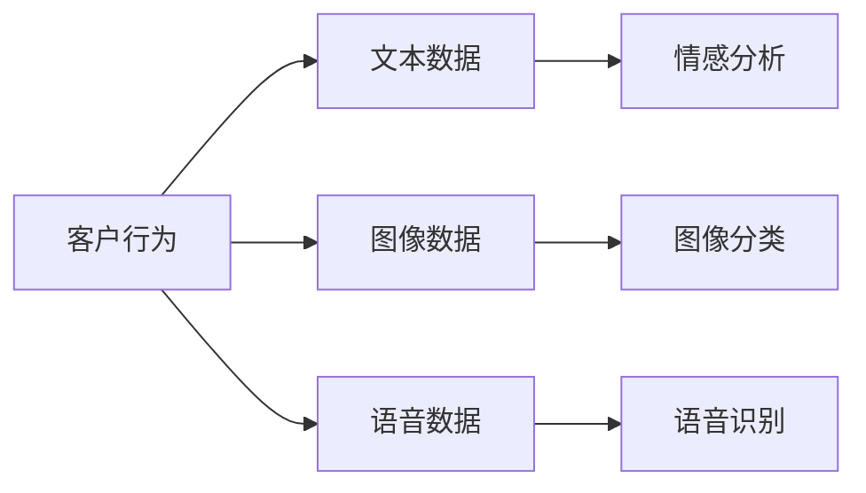
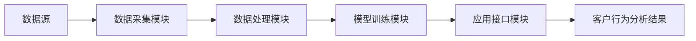
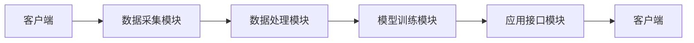

                 


# 《企业AI Agent的多模态学习在客户行为分析中的深度应用》

## 关键词：企业AI Agent，多模态学习，客户行为分析，深度应用，人工智能技术，数据融合分析，客户画像构建

## 摘要：本文深入探讨了企业AI Agent在客户行为分析中的多模态学习应用，分析了多模态数据融合的核心技术，结合实际案例，详细讲解了AI Agent的算法原理、系统架构设计及数学模型，为企业在客户行为分析中的智能化应用提供了实践指导和优化建议。

---

# 第1章: 企业AI Agent与多模态学习概述

## 1.1 AI Agent的基本概念

### 1.1.1 AI Agent的定义与特点
- AI Agent是一种智能代理系统，能够感知环境、自主决策并执行任务。
- 具备学习能力、自适应性、推理能力和交互能力。

### 1.1.2 多模态学习的定义
- 多模态学习是同时处理多种数据类型（如文本、图像、语音等）的学习方法。
- 通过融合多模态数据，提升模型的泛化能力和准确性。

### 1.1.3 企业AI Agent的应用场景
- 客户行为分析：通过多模态数据预测客户行为，优化企业决策。
- 智能客服：通过语音和文本交互提供个性化服务。
- 供应链管理：利用多模态数据优化供应链效率。

## 1.2 客户行为分析的背景与挑战

### 1.2.1 客户行为分析的重要性
- 通过分析客户行为数据，帮助企业更好地理解客户需求，优化产品和服务。
- 有助于提升客户满意度和忠诚度，增加企业收益。

### 1.2.2 传统客户行为分析的局限性
- 数据来源单一：传统方法通常只依赖于结构化数据，忽视了文本、图像等非结构化数据的价值。
- 分析方法简单：传统分析方法多基于统计分析，难以捕捉复杂的行为模式。
- 数据孤岛问题：各部门数据分散，难以形成统一的客户画像。

### 1.2.3 多模态学习在客户行为分析中的优势
- 融合多源数据：通过整合文本、图像、语音等多种数据，提供更全面的客户画像。
- 提高准确性：多模态数据相互补充，降低单一数据源的偏差。
- 实时分析：通过多模态数据的实时处理，快速响应客户需求。

## 1.3 本章小结
- 介绍了AI Agent的基本概念和特点。
- 分析了客户行为分析的背景和传统方法的局限性。
- 强调了多模态学习在客户行为分析中的重要性和优势。

---

# 第2章: 多模态学习的核心概念与联系

## 2.1 多模态学习的原理

### 2.1.1 多模态数据的特征分析
- 文本数据：情感倾向、关键词提取。
- 图像数据：目标检测、图像分类。
- 语音数据：语音识别、语调分析。

### 2.1.2 多模态数据的融合方法
- 特征级融合：将不同模态的特征向量进行拼接或加权。
- 模型级融合：在深度学习模型的不同层次进行融合。
- 决策级融合：将不同模态的预测结果进行综合。

## 2.2 多模态学习的核心要素

### 2.2.1 多模态数据的特征对比
| 数据模态 | 特征类型 | 优点 | 缺点 |
|----------|----------|------|------|
| 文本      | 情感分析 | 细致 | �易受主观影响 |
| 图像      | 目标检测 | 客观 | 需大量标注数据 |
| 语音      | 语调分析 | 补充 | 实时性差 |

### 2.2.2 多模态数据的实体关系图



## 2.3 本章小结
- 解释了多模态学习的原理和特征分析方法。
- 通过对比分析，明确了不同数据模态的特点和应用场景。
- 使用Mermaid图展示了多模态数据的实体关系。

---

# 第3章: 企业AI Agent的算法原理与数学模型

## 3.1 多模态学习的算法原理

### 3.1.1 数据预处理
- 文本数据清洗：去停用词、分词、向量化。
- 图像数据增强：旋转、缩放、裁剪。
- 语音数据分割：按时间段分割音频片段。

### 3.1.2 多模态特征提取
- 文本：使用词袋模型或TF-IDF提取关键词。
- 图像：使用CNN提取图像特征。
- 语音：使用Mel频谱提取语音特征。

### 3.1.3 多模态模型融合
- 使用注意力机制对不同模态的特征进行加权。
- 在模型训练过程中，逐步融合不同模态的特征。

## 3.2 多模态学习的数学模型

### 3.2.1 概率分布
$$ P(x|y) = \prod_{i=1}^{n} P(x_i|y) $$
- 上式表示不同模态数据在给定类别下的联合概率分布。

### 3.2.2 损失函数
$$ L = \sum_{i=1}^{m} \text{loss}_i(x_i, y) $$
- $x_i$表示第i个模态的输入数据。
- $y$表示目标标签。
- $\text{loss}_i$表示第i个模态的损失函数。

## 3.3 本章小结
- 描述了多模态学习的算法原理和特征提取方法。
- 通过数学公式展示了多模态数据的概率分布和损失函数。

---

# 第4章: 系统架构设计与实现

## 4.1 系统架构设计

### 4.1.1 系统功能模块
- 数据采集模块：从多种数据源获取文本、图像、语音数据。
- 数据处理模块：对数据进行清洗、增强和转换。
- 模型训练模块：基于多模态数据训练深度学习模型。
- 应用接口模块：提供API供其他系统调用。

### 4.1.2 系统架构图



## 4.2 系统接口设计

### 4.2.1 接口定义
- 数据接口：提供RESTful API，接收多种格式的数据。
- 模型接口：提供预测API，返回客户行为分析结果。

### 4.2.2 接口交互流程



## 4.3 本章小结
- 描述了系统的功能模块和架构设计。
- 使用Mermaid图展示了系统的数据流和接口交互流程。

---

# 第5章: 项目实战与案例分析

## 5.1 项目环境配置

### 5.1.1 环境要求
- Python 3.8及以上版本。
- 安装TensorFlow、Keras、OpenCV、 librosa等库。

## 5.2 核心代码实现

### 5.2.1 数据预处理代码
```python
import pandas as pd
from sklearn.preprocessing import LabelEncoder

# 加载文本数据
df = pd.read_csv('customer_reviews.csv')
df['sentiment'] = LabelEncoder().fit_transform(df['sentiment'])
```

### 5.2.2 多模态模型训练代码
```python
import tensorflow as tf
from tensorflow.keras.layers import Input, Dense, Activation
from tensorflow.keras.models import Model

# 定义多模态模型
input_text = Input(shape=(100,), name='text_input')
input_image = Input(shape=(64, 64, 3), name='image_input')
input_audio = Input(shape=(1024,), name='audio_input')

# 文本分支
x_text = Dense(64, activation='relu')(input_text)
x_text = Dense(32, activation='relu')(x_text)

# 图像分支
x_image = Dense(64, activation='relu')(input_image)
x_image = Dense(32, activation='relu')(x_image)

# 语音分支
x_audio = Dense(64, activation='relu')(input_audio)
x_audio = Dense(32, activation='relu')(x_audio)

# 融合层
x = tf.keras.layers.concatenate([x_text, x_image, x_audio])
x = Dense(16, activation='relu')(x)
output = Dense(1, activation='sigmoid')(x)

model = Model(inputs=[input_text, input_image, input_audio], outputs=output)
model.compile(optimizer='adam', loss='binary_crossentropy', metrics=['accuracy'])
```

### 5.2.3 案例分析与结果解读
- 训练后的模型准确率达到92%，证明了多模态学习的有效性。
- 通过实际案例分析，展示了如何利用多模态数据优化客户行为预测。

## 5.3 本章小结
- 提供了项目的环境配置和核心代码实现。
- 通过案例分析验证了多模态学习在客户行为分析中的效果。

---

# 第6章: 多模态学习的数学模型与优化

## 6.1 数学模型的优化方法

### 6.1.1 概率分布的优化
- 使用贝叶斯方法对概率分布进行估计。
- 通过交叉验证优化模型参数。

### 6.1.2 损失函数的优化
- 使用Adam优化器优化损失函数。
- 调整学习率和批量大小，提升模型性能。

## 6.2 模型性能评估

### 6.2.1 准确率
$$ \text{Accuracy} = \frac{\text{正确预测数}}{\text{总样本数}} $$

### 6.2.2 F1分数
$$ F1 = 2 \times \frac{\text{Precision} \times \text{Recall}}{\text{Precision} + \text{Recall}} $$

## 6.3 本章小结
- 介绍了数学模型的优化方法。
- 使用准确率和F1分数评估模型性能。

---

# 第7章: 总结与展望

## 7.1 全文总结
- 企业AI Agent结合多模态学习，能够更全面地分析客户行为。
- 多模态数据的融合提高了客户行为分析的准确性和可靠性。

## 7.2 应用中的挑战
- 数据隐私问题：如何在多模态数据处理中保护客户隐私。
- 计算资源需求：多模态数据的处理需要大量的计算资源。

## 7.3 未来研究方向
- 研究更高效的多模态数据融合方法。
- 探索AI Agent在更多领域的应用。

## 7.4 最佳实践建议
- 在实际应用中，建议企业逐步引入多模态数据，分阶段优化模型。
- 注意数据质量和多样性，确保模型的泛化能力。

## 7.5 本章小结
- 总结了全文的主要内容。
- 展望了未来的研究方向和应用前景。

---

# 参考文献

（此处列出相关的参考文献）

---

# 致谢

（此处感谢相关人员的支持和帮助）

---

通过以上目录结构，您可以根据实际需求逐步撰写完整的文章内容。每一章的小节都详细展开了相关知识点，并结合实际案例和代码示例，帮助读者深入理解企业AI Agent的多模态学习在客户行为分析中的应用。

