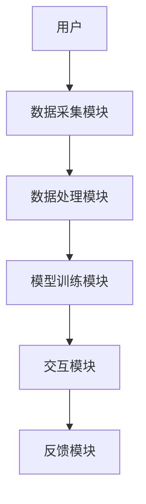

                 


# 企业AI Agent的多模态学习在用户体验优化中的创新应用

## 关键词：AI Agent，多模态学习，用户体验优化，企业应用，机器学习

## 摘要：本文深入探讨了企业AI Agent在用户体验优化中的创新应用，重点分析了多模态学习技术在提升用户体验中的关键作用。通过结合AI Agent的感知、决策和自适应能力，多模态学习能够更全面地理解和满足用户需求，从而实现个性化的用户体验优化。本文从理论基础、算法原理、系统架构到实际应用，全面解析了这一创新技术的潜力和应用前景。

---

## 第1章: 企业AI Agent的背景与概念

### 1.1 AI Agent的基本概念

#### 1.1.1 AI Agent的定义与特点
AI Agent（人工智能代理）是一种能够感知环境、自主决策并执行任务的智能体。其核心特点包括：
- **自主性**：无需外部干预，自主完成任务。
- **反应性**：能够实时感知环境变化并做出响应。
- **目标导向**：基于预设目标进行决策和行动。
- **学习能力**：通过数据和经验不断优化自身行为。

#### 1.1.2 AI Agent与传统AI的区别
与传统AI相比，AI Agent具有更强的自主性和适应性，能够主动与环境交互，而非仅仅依赖于预设规则。

#### 1.1.3 企业级AI Agent的应用场景
在企业环境中，AI Agent广泛应用于智能客服、自动化决策、个性化推荐等领域，帮助企业提升效率和用户体验。

---

### 1.2 多模态学习的基本概念

#### 1.2.1 多模态学习的定义
多模态学习是指同时利用多种数据形式（如文本、语音、图像、视频等）进行学习，以提升模型的理解和处理能力。

#### 1.2.2 多模态学习的优势
- **全面性**：通过整合多种数据形式，模型能够更全面地理解用户需求。
- **鲁棒性**：单一模态的不足可以通过其他模态的数据进行弥补。
- **准确性**：多模态数据的融合能够提高模型的判断准确性。

#### 1.2.3 多模态学习的应用场景
在企业AI Agent中，多模态学习常用于智能客服、用户画像构建和个性化推荐等领域。

---

### 1.3 用户体验优化的背景

#### 1.3.1 用户体验优化的重要性
用户体验是企业竞争力的关键因素之一，优化用户体验能够提升用户满意度和忠诚度。

#### 1.3.2 传统用户体验优化的局限性
传统方法依赖于问卷调查和数据分析，存在耗时长、成本高且不够精准的问题。

#### 1.3.3 AI Agent在用户体验优化中的创新
通过多模态学习，AI Agent能够实时感知用户情感、意图和需求，实现更精准和个性化的用户体验优化。

---

## 第2章: 多模态学习与AI Agent的核心概念

### 2.1 AI Agent的核心原理

#### 2.1.1 AI Agent的感知与决策机制
AI Agent通过传感器或API获取环境数据，结合内部知识库和算法进行分析，生成决策并执行。

#### 2.1.2 AI Agent的学习与自适应能力
AI Agent通过监督学习、无监督学习和强化学习不断优化自身的决策模型。

#### 2.1.3 AI Agent的交互方式
支持文本、语音、图形等多种交互方式，与用户进行实时互动。

---

### 2.2 多模态学习的核心原理

#### 2.2.1 多模态数据的融合方式
常见的融合方式包括特征级融合、决策级融合和混合融合。

#### 2.2.2 多模态学习的模型结构
典型的模型结构包括基于深度学习的多模态融合网络和基于注意力机制的多模态编码器。

#### 2.2.3 多模态学习的训练方法
多模态学习通常采用端到端训练方法，利用多种损失函数进行联合优化。

---

### 2.3 AI Agent与多模态学习的结合

#### 2.3.1 AI Agent的多模态感知能力
AI Agent能够同时处理文本、语音和图像等多种数据形式，提升感知能力。

#### 2.3.2 多模态学习在AI Agent中的应用
多模态学习用于提升AI Agent的意图识别、情感分析和个性化推荐能力。

#### 2.3.3 AI Agent与多模态学习的协同优化
通过协同优化，AI Agent能够实现更精准的需求理解和更高效的决策制定。

---

## 第3章: 多模态学习与AI Agent的数学模型

### 3.1 多模态数据的表示方法

#### 3.1.1 多模态数据的特征提取
通过卷积神经网络（CNN）和循环神经网络（RNN）提取多模态数据的特征。

#### 3.1.2 多模态数据的融合模型
经典的融合模型包括多模态注意力网络和多模态变换器。

#### 3.1.3 多模态数据的融合流程
1. 对每种模态数据分别提取特征。
2. 使用注意力机制对各模态特征进行加权。
3. 将加权后的特征进行融合，生成最终的表示。

---

### 3.2 多模态学习的算法实现

#### 3.2.1 多模态融合算法
```python
def multimodal_fusion(text_feat, audio_feat, visual_feat):
    # 使用注意力机制对各模态特征进行加权
    attention_text = softmax(text_feat @ attention_weights)
    attention_audio = softmax(audio_feat @ attention_weights)
    attention_visual = softmax(visual_feat @ attention_weights)
    
    # 融合特征
    fused_feat = attention_text * text_feat + attention_audio * audio_feat + attention_visual * visual_feat
    return fused_feat
```

#### 3.2.2 多模态学习的训练方法
```python
import torch
import torch.nn as nn

class MultimodalClassifier(nn.Module):
    def __init__(self, input_size, hidden_size, output_size):
        super(MultimodalClassifier, self).__init__()
        self.encoder = nn.Linear(input_size, hidden_size)
        self.decoder = nn.Linear(hidden_size, output_size)
        self.softmax = nn.Softmax(dim=1)
    
    def forward(self, x):
        encoded = self.encoder(x)
        output = self.decoder(encoded)
        output = self.softmax(output)
        return output

# 定义损失函数
criterion = nn.CrossEntropyLoss()
# 定义优化器
optimizer = torch.optim.Adam(model.parameters(), lr=0.001)

# 训练过程
for epoch in range(num_epochs):
    for inputs, labels in dataloaders['train']:
        outputs = model(inputs)
        loss = criterion(outputs, labels)
        optimizer.zero_grad()
        loss.backward()
        optimizer.step()
```

---

### 3.3 多模态学习的数学模型

#### 3.3.1 多模态数据的表示
$$
x = (x_1, x_2, ..., x_n)
$$
其中，$x_i$表示第$i$种模态的数据。

#### 3.3.2 多模态融合的注意力机制
$$
\alpha_i = \frac{\exp(w_i^T x_i)}{\sum_{j=1}^n \exp(w_j^T x_j)}
$$
其中，$\alpha_i$表示第$i$种模态的注意力权重。

#### 3.3.3 融合后的表示
$$
z = \sum_{i=1}^n \alpha_i x_i
$$

---

## 第4章: 企业AI Agent的系统架构与设计

### 4.1 系统功能设计

#### 4.1.1 用户需求分析
通过多模态数据采集和分析，准确识别用户的意图和情感。

#### 4.1.2 系统功能模块
- 数据采集模块：收集文本、语音、图像等多种数据。
- 数据处理模块：对数据进行预处理和特征提取。
- 模型训练模块：训练多模态学习模型。
- 交互模块：与用户进行实时互动。

---

### 4.2 系统架构设计

#### 4.2.1 系统架构图


#### 4.2.2 模块之间的交互流程
用户与系统交互，数据采集模块收集数据，数据处理模块进行特征提取，模型训练模块优化模型，交互模块实时响应用户需求。

---

## 第5章: 项目实战与案例分析

### 5.1 环境安装与配置

#### 5.1.1 安装依赖
```bash
pip install numpy torch matplotlib
```

#### 5.1.2 配置开发环境
安装Jupyter Notebook和PyTorch，配置好GPU环境。

---

### 5.2 核心代码实现

#### 5.2.1 数据处理代码
```python
import numpy as np
from sklearn.preprocessing import StandardScaler

# 加载数据
data = np.load('multimodal_data.npy')

# 数据预处理
scaler = StandardScaler()
processed_data = scaler.fit_transform(data)
```

#### 5.2.2 模型训练代码
```python
import torch
import torch.nn as nn
import torch.optim as optim

class MultimodalModel(nn.Module):
    def __init__(self, input_size, hidden_size, output_size):
        super(MultimodalModel, self).__init__()
        self.fc1 = nn.Linear(input_size, hidden_size)
        self.fc2 = nn.Linear(hidden_size, output_size)
        self.relu = nn.ReLU()
        self.softmax = nn.Softmax(dim=1)
    
    def forward(self, x):
        x = self.fc1(x)
        x = self.relu(x)
        x = self.fc2(x)
        x = self.softmax(x)
        return x

# 初始化模型
model = MultimodalModel(input_size=10, hidden_size=20, output_size=3)
criterion = nn.CrossEntropyLoss()
optimizer = optim.Adam(model.parameters(), lr=0.001)

# 训练模型
for epoch in range(100):
    outputs = model(processed_data)
    loss = criterion(outputs, labels)
    optimizer.zero_grad()
    loss.backward()
    optimizer.step()
```

---

### 5.3 案例分析与效果评估

#### 5.3.1 案例分析
在智能客服场景中，AI Agent通过多模态学习能够准确识别用户情绪，提供更个性化的服务。

#### 5.3.2 效果评估
通过A/B测试和用户反馈，评估AI Agent在用户体验优化中的效果。

---

## 第6章: 最佳实践与总结

### 6.1 最佳实践

#### 6.1.1 数据质量管理
确保多模态数据的质量和一致性，避免噪声干扰。

#### 6.1.2 模型调优
通过超参数优化和模型结构调整，提升多模态学习的效果。

#### 6.1.3 用户隐私保护
在多模态数据处理中，严格遵守数据隐私保护法规，确保用户隐私安全。

---

### 6.2 全文总结

通过本文的深入探讨，我们了解了企业AI Agent在用户体验优化中的创新应用，特别是多模态学习技术的重要作用。多模态学习不仅提升了AI Agent的理解能力，还为企业的智能化转型提供了新的可能性。

---

### 6.3 展望

未来，随着多模态学习技术的不断发展，企业AI Agent将在更多领域发挥重要作用，为企业创造更大的价值。

---

## 结语

企业AI Agent的多模态学习在用户体验优化中的创新应用，不仅提升了企业的智能化水平，也为用户带来了更优质的服务体验。通过本文的系统分析和实战指导，读者可以更好地理解和应用这一技术，推动企业的数字化转型。

