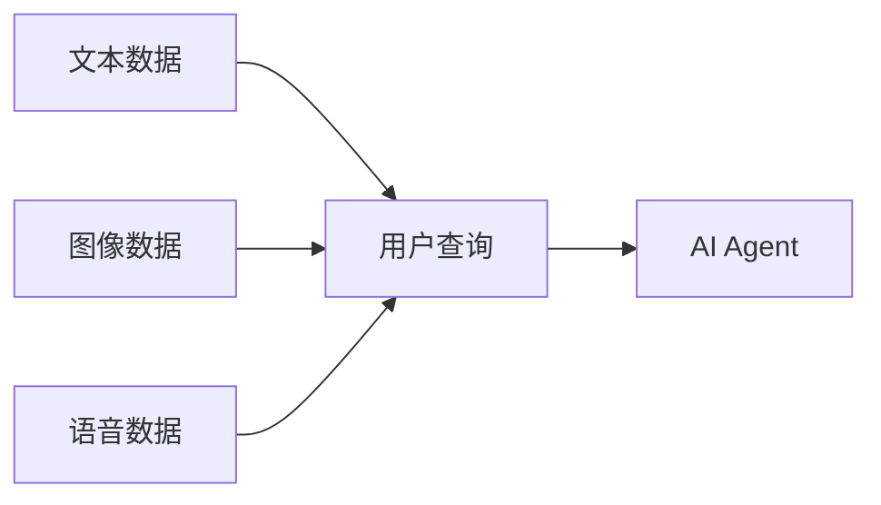
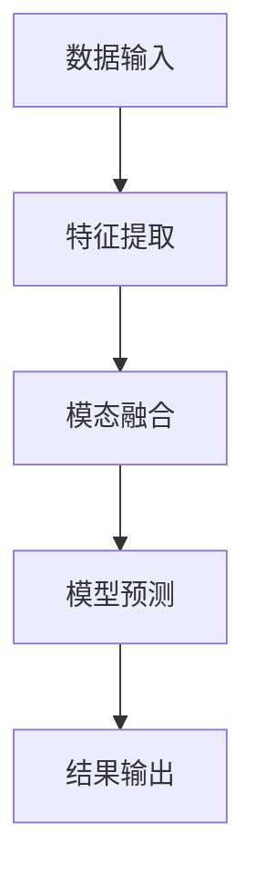

                 


# 企业AI Agent的多模态学习：整合文本、图像与语音数据

---

## 关键词：
企业AI Agent，多模态学习，文本数据，图像数据，语音数据，深度学习，数据融合

---

## 摘要：
本文深入探讨企业AI Agent在多模态学习中的应用，重点分析如何整合文本、图像与语音数据。通过详细讲解多模态学习的核心概念、算法原理、系统架构以及实战案例，本文旨在为企业技术决策者和开发者提供清晰的指导，帮助他们理解并实现高效的数据融合策略，以提升AI Agent的性能和商业价值。

---

## 目录
1. 企业AI Agent的背景与重要性
2. 多模态学习的核心概念与联系
3. 多模态学习的算法原理
4. 多模态学习的数学模型与公式
5. 企业AI Agent的系统分析与架构设计
6. 多模态学习的项目实战
7. 最佳实践与总结

---

### 第1章：企业AI Agent的背景与重要性

#### 1.1 问题背景与定义
- **问题背景**：企业AI Agent需处理多样化的数据源，包括文本、图像和语音。单一模态数据难以满足复杂场景需求。
- **定义**：企业AI Agent是能够理解并整合多种数据类型的智能系统，通过多模态学习提升决策能力。

#### 1.2 多模态学习的重要性
- **提升准确性**：整合多模态数据可减少信息偏差。
- **增强用户体验**：通过多渠道交互提供更自然的服务。
- **商业价值**：数据融合可挖掘潜在商业机会，优化企业流程。

#### 1.3 企业中的多模态应用
- **客户服务**：整合文本和语音数据，提供更精准的客户支持。
- **数据分析**：融合文本、图像和语音，深入理解数据关系。

#### 1.4 本章小结
多模态学习是企业AI Agent的关键技术，整合多种数据类型可显著提升性能和商业价值。

---

### 第2章：多模态学习的核心概念与联系

#### 2.1 多模态学习的原理
- **模态间交互**：通过注意力机制等方法，促进不同模态间的协同学习。
- **特征表示**：将多模态数据映射到统一特征空间，便于信息融合。

#### 2.2 模态特征对比
| 特征维度 | 文本数据 | 图像数据 | 语音数据 |
|----------|----------|----------|----------|
| 优势     | 高精度，可结构化 | 丰富细节，视觉信息 | 自然交互，情感分析 |
| 劣势     | 信息量有限 | 计算复杂 | 易受环境影响 |

#### 2.3 实体关系分析
使用ER图展示各模态的关系：


#### 2.4 本章小结
理解各模态特征及其关系是多模态学习的基础，为后续的数据融合奠定基础。

---

### 第3章：多模态学习的算法原理

#### 3.1 多模态数据融合算法
- **表示学习**：将文本、图像和语音数据转换为统一表示。
- **注意力机制**：动态分配各模态的重要性。

#### 3.2 算法实现流程
1. 数据预处理：清洗和标准化。
2. 特征提取：使用预训练模型提取特征。
3. 模型构建：设计多模态融合网络。
4. 模型训练：优化损失函数，调整参数。

#### 3.3 算法流程图


#### 3.4 本章小结
多模态学习算法通过有效融合数据，提升模型的准确性和鲁棒性。

---

### 第4章：多模态学习的数学模型与公式

#### 4.1 多模态表示模型
- **公式推导**：统一特征表示$z = f(x_{text}, x_{image}, x_{audio})$。
- **融合机制**：注意力权重$\alpha_i$计算：
  $$ \alpha_i = \frac{\exp(s_i)}{\sum_j \exp(s_j)} $$

#### 4.2 损失函数
- **多任务损失**：$L = \lambda_1 L_{text} + \lambda_2 L_{image} + \lambda_3 L_{audio}$
- **权重系数**：$\lambda_i$根据任务重要性调整。

#### 4.3 优化方法
- **梯度下降**：更新参数$\theta$，最小化损失$L$。
- **Adam优化器**：结合动量和自适应学习率。

#### 4.4 本章小结
数学模型为多模态学习提供理论基础，指导算法设计与优化。

---

### 第5章：企业AI Agent的系统分析与架构设计

#### 5.1 系统架构设计


#### 5.2 功能模块设计
- **数据处理模块**：负责数据预处理和特征提取。
- **模型服务模块**：执行多模态融合和预测。
- **用户交互模块**：处理来自客户端的请求。

#### 5.3 接口设计
- **REST API**：提供标准化接口，便于调用。
- **数据格式**：统一JSON格式，确保兼容性。

#### 5.4 本章小结
系统架构设计确保各模块协同工作，支持高效的数据处理和模型推理。

---

### 第6章：多模态学习的项目实战

#### 6.1 项目概述
- **项目目标**：构建企业级AI Agent，整合多模态数据。
- **技术栈**：使用Python、TensorFlow和Keras框架。

#### 6.2 核心代码实现
```python
import tensorflow as tf
from tensorflow.keras import layers

def build_model():
    text_input = layers.Input(shape=(max_length,))
    image_input = layers.Input(shape=(224,224,3,))
    audio_input = layers.Input(shape=(16000,))
    
    text_features = layers.Embedding(...)(text_input)
    image_features = layers.Conv2D(...)(image_input)
    audio_features = layers.Reshape(...)(audio_input)
    
    features = layers.Concatenate()([text_features, image_features, audio_features])
    output = layers.Dense(1, activation='sigmoid')(features)
    
    model = tf.keras.Model(inputs=[text_input, image_input, audio_input], outputs=output)
    return model
```

#### 6.3 实际案例分析
- **案例背景**：客户咨询处理。
- **数据整合**：融合文本、图像和语音信息，提高识别准确性。

#### 6.4 本章小结
项目实战验证了多模态学习的有效性，展示了其在实际应用中的潜力。

---

### 第7章：最佳实践与总结

#### 7.1 最佳实践
- **数据质量**：确保数据准确性和完整性。
- **模型选择**：根据需求选择合适的算法和模型。
- **性能优化**：通过并行计算和模型压缩提升效率。

#### 7.2 总结
多模态学习是企业AI Agent的核心技术，整合多种数据类型可显著提升性能。本文为开发者提供了系统的指导和实践案例。

#### 7.3 展望
未来，多模态学习将在更多领域得到应用，推动企业智能化发展。

---

## 附录：参考文献
- TensorFlow官方文档
- PyTorch官方文档
- 相关学术论文推荐

---

通过本文的系统分析和详细讲解，读者可以全面理解企业AI Agent的多模态学习技术，并在实际项目中有效应用。

