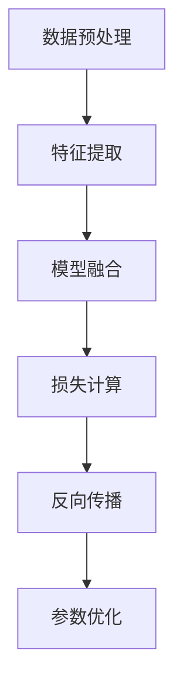
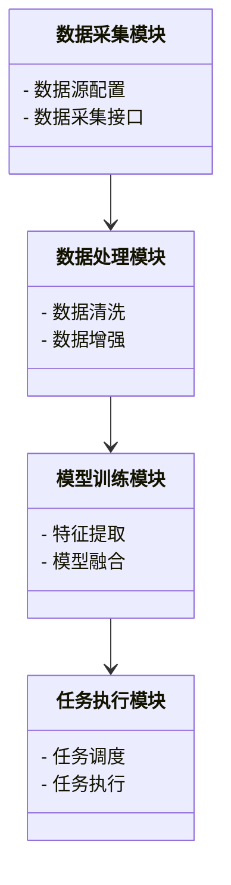
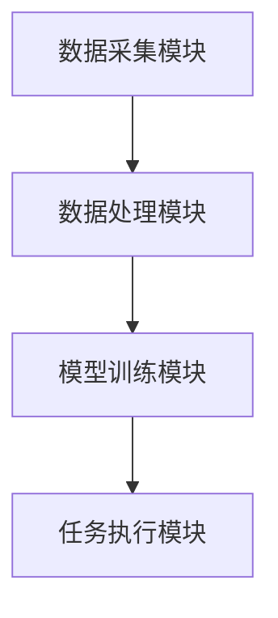

                 


# 企业AI Agent的多模态学习：整合结构化与非结构化数据

---

## 关键词：  
企业AI Agent、多模态学习、结构化数据、非结构化数据、数据整合、深度学习、系统架构  

---

## 摘要：  
在企业智能化转型的背景下，AI Agent（人工智能代理）作为连接人与机器的桥梁，正逐渐成为企业数字化转型的核心技术之一。然而，企业数据的复杂性使得AI Agent的能力受限，尤其是如何有效整合结构化数据（如数据库中的表格数据）与非结构化数据（如文本、图像、语音等）成为了关键挑战。本文将深入探讨企业AI Agent的多模态学习方法，分析如何通过整合结构化与非结构化数据来提升AI Agent的理解能力与决策能力。文章将从多模态数据的整合方法、学习模型的构建、算法原理、系统架构设计以及实际项目案例等方面展开，为企业技术架构师、数据科学家以及AI开发人员提供理论支持与实践指导。

---

## 第一章：AI Agent与多模态学习概述  

### 1.1 AI Agent的基本概念  
AI Agent是一种能够感知环境、自主决策并执行任务的智能实体。它具备以下特点：  
- **自主性**：能够在没有外部干预的情况下执行任务。  
- **反应性**：能够实时感知环境并做出响应。  
- **目标导向**：通过优化目标函数来实现特定任务。  

AI Agent的应用场景广泛，例如智能客服、推荐系统、自动驾驶等。  

### 1.2 多模态学习的定义与特点  
多模态学习是指同时利用多种类型数据（如文本、图像、语音、视频等）进行学习的方法。其特点包括：  
- **信息丰富性**：多模态数据能够提供更全面的信息。  
- **互补性**：不同模态的数据可以相互补充，提升模型的鲁棒性。  
- **复杂性**：多模态数据的整合与处理需要复杂的算法支持。  

### 1.3 企业AI Agent的应用背景  
在企业环境中，数据呈现出结构化与非结构化的混合特点。例如，企业可能拥有数据库中的结构化数据（如订单、客户信息）以及大量的非结构化数据（如文档、邮件、社交媒体内容）。如何有效整合这两种数据类型，成为提升企业AI Agent能力的关键。  

---

## 第二章：多模态数据的整合方法  

### 2.1 数据预处理与清洗  
多模态数据的整合需要对数据进行预处理，包括：  
- **数据清洗**：去除噪声数据，处理缺失值。  
- **数据标准化**：将不同模态的数据统一到一个标准范围内。  
- **数据增强**：通过技术手段增强数据的质量与多样性。  

#### 2.1.1 数据清洗的基本方法  
- **去除重复数据**：通过哈希或唯一标识符去重。  
- **处理缺失值**：使用均值、中位数或插值法填充。  

#### 2.1.2 数据标准化与归一化  
- **标准化**：将数据缩放到固定范围内（如0-1）。  
- **归一化**：对数据进行正态化处理。  

#### 2.1.3 数据增强技术  
- **图像增强**：旋转、翻转、裁剪等操作。  
- **文本增强**：同义词替换、数据扰动等。  

### 2.2 多模态数据的融合策略  
多模态数据的融合策略包括：  
- **基于特征融合的方法**：将不同模态的特征向量进行线性或非线性组合。  
- **基于模型融合的方法**：通过多个模型的输出结果进行加权融合。  
- **基于注意力机制的融合**：通过自注意力机制捕捉不同模态之间的关联性。  

#### 2.2.1 基于特征融合的方法  
- **线性融合**：$y = w_1x_1 + w_2x_2 + ... + w_nx_n$，其中$w_i$为权重系数。  
- **非线性融合**：通过神经网络对特征进行非线性变换。  

#### 2.2.2 基于模型融合的方法  
- **投票法**：多个模型的输出结果进行投票决定最终结果。  
- **加权融合**：根据模型的性能，赋予不同权重。  

#### 2.2.3 基于注意力机制的融合  
- **自注意力机制**：通过计算不同模态之间的注意力权重，进行特征融合。  

### 2.3 数据整合的优化方法  
数据整合的优化方法包括：  
- **基于深度学习的优化**：通过端到端的神经网络模型提升数据融合效果。  
- **基于图神经网络的优化**：将多模态数据建模为图结构，利用图神经网络进行学习。  
- **基于强化学习的优化**：通过强化学习算法优化数据融合策略。  

---

## 第三章：多模态学习模型的构建  

### 3.1 模型设计的基本原则  
多模态学习模型的设计需要考虑以下原则：  
- **可解释性**：模型的决策过程应当可解释。  
- **泛化能力**：模型应当能够泛化到新的数据集。  
- **计算效率**：模型应当具备较高的计算效率。  

### 3.2 多模态模型的训练策略  
多模态模型的训练策略包括：  
- **多任务学习策略**：通过同时学习多个任务来提升模型的泛化能力。  
- **对抗训练策略**：通过生成对抗网络（GAN）提升数据的多样性。  
- **联合学习策略**：将不同模态的数据联合建模，提升模型的表达能力。  

#### 3.2.1 多任务学习策略  
- **任务分解**：将复杂任务分解为多个子任务。  
- **共享与独立部分**：共享部分参数，独立部分分别优化。  

#### 3.2.2 对抗训练策略  
- **生成器与判别器**：生成器生成数据，判别器判断数据的真伪。  

#### 3.2.3 联合学习策略  
- **联合优化**：通过联合损失函数优化多个任务的参数。  

### 3.3 模型的评估与优化  
多模态模型的评估与优化包括：  
- **基于准确率的评估**：通过准确率、召回率等指标评估模型性能。  
- **基于鲁棒性的优化**：通过数据增强、模型集成等方法提升模型的鲁棒性。  

---

## 第四章：多模态学习算法的原理  

### 4.1 多模态模型的训练流程  
多模态模型的训练流程包括：  
1. 数据预处理：对结构化与非结构化数据进行清洗与标准化。  
2. 特征提取：通过卷积神经网络（CNN）或循环神经网络（RNN）提取特征。  
3. 模型融合：将不同模态的特征进行融合，生成最终的输出。  

#### 4.1.1 多模态模型的训练流程图  



### 4.2 模型的数学基础  

#### 4.2.1 多模态融合的数学模型  
- **线性融合模型**：  
  $$ y = w_1x_1 + w_2x_2 + ... + w_nx_n $$  
  其中，$w_i$为权重系数，$x_i$为不同模态的输入特征，$y$为输出。  

- **非线性融合模型**：  
  $$ y = \sigma(w_1x_1 + w_2x_2 + ... + w_nx_n) $$  
  其中，$\sigma$为激活函数（如sigmoid函数）。  

#### 4.2.2 损失函数与优化器  
- **损失函数**：  
  $$ L = -\frac{1}{m}\sum_{i=1}^{m} y_i \log(p_i) + (1 - y_i)\log(1 - p_i) $$  
  其中，$y_i$为真实标签，$p_i$为模型预测概率。  

- **优化器**：使用Adam优化器进行参数更新，其更新规则如下：  
  $$ \theta_{t+1} = \theta_t - \eta \frac{\partial L}{\partial \theta_t} $$  

---

## 第五章：系统架构设计  

### 5.1 系统功能设计  
企业AI Agent的系统功能设计包括：  
- **数据采集**：从多种数据源采集结构化与非结构化数据。  
- **数据处理**：对数据进行清洗、转换与增强。  
- **模型训练**：基于多模态数据训练AI Agent模型。  
- **任务执行**：通过AI Agent执行企业级任务。  

#### 5.1.1 系统功能类图  



### 5.2 系统架构图  



---

## 第六章：项目实战  

### 6.1 环境安装  
- **Python**：3.8+  
- **深度学习框架**：TensorFlow或PyTorch  
- **依赖库**：numpy、pandas、scikit-learn  

### 6.2 核心代码实现  

#### 6.2.1 数据预处理代码  

```python
import pandas as pd
import numpy as np

def preprocess_data(structured_data, unstructured_data):
    # 处理结构化数据
    structured_data = structured_data.dropna().reset_index(drop=True)
    # 处理非结构化数据
    unstructured_data = unstructured_data.apply(lambda x: x.lower())
    return structured_data, unstructured_data
```

#### 6.2.2 多模态融合模型  

```python
import tensorflow as tf
from tensorflow import keras

def build_model(input_shape1, input_shape2):
    input1 = keras.Input(shape=input_shape1)
    input2 = keras.Input(shape=input_shape2)
    
    # 特征提取
    x1 = keras.layers.Dense(64, activation='relu')(input1)
    x2 = keras.layers.Dense(64, activation='relu')(input2)
    
    # 特征融合
    x = keras.layers.concatenate([x1, x2])
    x = keras.layers.Dense(32, activation='relu')(x)
    x = keras.layers.Dense(1, activation='sigmoid')(x)
    
    model = keras.Model(inputs=[input1, input2], outputs=x)
    return model
```

### 6.3 代码解读与分析  
- **数据预处理代码**：对结构化数据和非结构化数据进行清洗与标准化处理。  
- **多模态融合模型**：通过深度神经网络提取特征，并将不同模态的特征进行融合，最终输出预测结果。  

---

## 第七章：总结与展望  

### 7.1 总结  
本文详细探讨了企业AI Agent的多模态学习方法，分析了如何通过整合结构化与非结构化数据来提升AI Agent的能力。通过理论分析与实践案例，展示了多模态数据整合的实现方法与实际应用。  

### 7.2 未来展望  
随着AI技术的不断发展，企业AI Agent的多模态学习将朝着以下几个方向发展：  
1. **更复杂的多模态融合方法**：例如，结合图神经网络与知识图谱进行更深层次的融合。  
2. **实时性优化**：通过轻量化设计提升模型的实时性。  
3. **可解释性增强**：通过可视化技术提升模型的可解释性。  

---

通过本文的探讨，我们希望能够为企业技术架构师、数据科学家以及AI开发人员提供有价值的参考，帮助企业更好地实现智能化转型。

