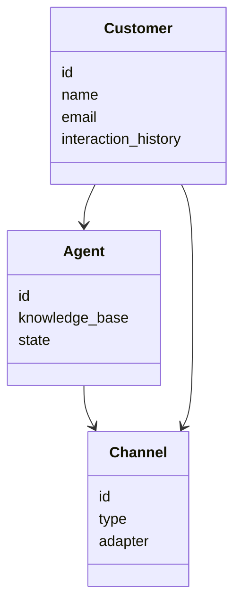
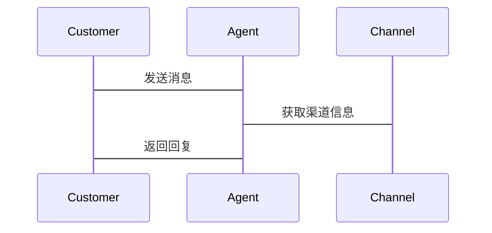

                 


# 企业AI Agent的多渠道集成：打造统一客户服务体验

> 关键词：企业AI Agent，多渠道集成，统一客户服务体验，智能客服系统，多渠道整合

> 摘要：随着企业对智能化客服需求的不断增长，AI Agent（人工智能代理）作为新一代的客服解决方案，正在逐步取代传统的客服系统。本文将从企业AI Agent的核心概念出发，详细探讨其在多渠道集成中的实现路径，分析其在统一客户服务体验中的关键作用，并通过实际案例展示如何在企业中落地实施。

---

# 第1章: 企业AI Agent的背景与概念

## 1.1 问题背景

### 1.1.1 传统客户服务的痛点
- 客服渠道分散，难以统一管理
- 不同渠道的客户体验不一致
- 客服人员效率低，成本高
- 客户需求复杂化，人工难以快速响应

### 1.1.2 AI Agent的出现与优势
- 自动化处理常见问题
- 提供7x24小时不间断服务
- 智能分析客户需求，提升响应速度
- 降低企业运营成本

### 1.1.3 多渠道集成的必要性
- 满足客户多场景的服务需求
- 提供一致的用户体验
- 集中管理多渠道数据，提升数据分析能力

## 1.2 问题描述

### 1.2.1 AI Agent的核心功能
- 意图识别
- 自然语言处理
- 知识库管理
- 交互式对话

### 1.2.2 多渠道集成的实现机制
- 统一接口设计
- 渠道适配器开发
- 数据格式标准化

### 1.2.3 统一客户服务体验的实现路径
- 建立统一的客户画像
- 制定一致的服务流程
- 提供个性化的服务体验

## 1.3 问题解决

### 1.3.1 AI Agent的核心功能
- 意图识别：通过NLP技术解析客户意图
- 对话管理：根据意图生成回复
- 知识库管理：维护产品信息、FAQ等
- 交互式对话：支持多轮对话

### 1.3.2 多渠道集成的解决方案
- 使用API接口实现系统对接
- 开发适配器处理不同渠道的协议
- 统一数据格式，确保数据互通

### 1.3.3 统一客户服务体验的实现路径
- 建立统一的客户数据库
- 制定一致的服务流程和话术
- 提供个性化服务，根据客户历史行为优化体验

## 1.4 边界与外延

### 1.4.1 AI Agent的边界
- 不处理需要人工判断的复杂问题
- 仅支持预定义的对话流程
- 依赖于准确的知识库

### 1.4.2 多渠道集成的范围
- 包括常见的客服渠道，如网页、App、邮件、社交媒体等
- 支持新兴渠道，如智能音箱、智能手表等

### 1.4.3 与其他系统的交互关系
- 与CRM系统集成，共享客户信息
- 与支付系统对接，处理订单相关问题
- 与数据分析系统集成，提供客户行为洞察

## 1.5 概念结构与核心要素

### 1.5.1 AI Agent的组成要素
- 意图识别模块
- 对话管理模块
- 知识库
- 交互界面

### 1.5.2 多渠道集成的关键要素
- 统一接口
- 适配器
- 数据标准化

### 1.5.3 统一客户服务体验的核心要素
- 统一客户画像
- 一致服务流程
- 个性化服务策略

## 1.6 本章小结

---

# 第2章: AI Agent的核心概念与联系

## 2.1 核心概念原理

### 2.1.1 AI Agent的工作原理
- 接收客户输入
- 解析客户意图
- 查询知识库
- 生成回复
- 反馈结果

### 2.1.2 多渠道集成的实现机制
- 使用适配器处理不同渠道的协议
- 通过API实现数据互通
- 统一数据格式，确保数据一致性

### 2.1.3 统一客户服务体验的技术支撑
- 统一客户数据库
- 一致的服务流程
- 个性化服务策略

## 2.2 核心概念属性对比

### 2.2.1 AI Agent与传统客服系统的对比
| 特性             | AI Agent                | 传统客服系统            |
|------------------|-------------------------|--------------------------|
| 响应时间         | 实时                   | 非实时                 |
| 智能水平         | 高                     | 低                     |
| 可扩展性         | 高                     | 低                     |

### 2.2.2 不同渠道的特点对比
| 渠道             | 特点                   |
|------------------|------------------------|
| 网页             | 响应快，适合复杂查询   |
| App             | 移动友好，便于用户使用 |
| 邮件             | 适合非紧急事务         |
| 社交媒体         | 适合品牌宣传和互动     |

### 2.2.3 统一体验的关键指标对比
| 指标             | 统一体验                | 非统一体验              |
|------------------|-------------------------|--------------------------|
| 客户满意度         | 高                     | 低                     |
| 服务效率         | 高                     | 低                     |
| 体验一致性         | 高                     | 低                     |

## 2.3 ER实体关系图

```mermaid
er
    Customer
    Agent
    Channel
    Interaction
    Customer <-> Agent
    Agent <-> Channel
    Customer <-> Interaction
    Channel <-> Interaction
```

---

# 第3章: AI Agent的算法原理讲解

## 3.1 算法原理概述

### 3.1.1 意图识别算法
- 使用条件概率模型（Naive Bayes）进行分类
- 示例：$P(\text{intent}|\text{message}) = \frac{P(\text{message}|\text{intent}) \cdot P(\text{intent})}{P(\text{message})}$

### 3.1.2 对话管理算法
- 使用马尔可夫链模型
- 示例：状态转移概率矩阵
  ```python
  transition_matrix = {
      'intent1': {'intent2': 0.5, 'intent3': 0.5},
      'intent2': {'intent4': 0.8, 'intent5': 0.2},
      ...
  }
  ```

## 3.2 算法实现

### 3.2.1 意图识别实现
```python
def classify_intent(message):
    probabilities = {}
    for intent in intents:
        prob = calculate_probability(message, intent)
        probabilities[intent] = prob
    return max(probabilities, key=probabilities.get)
```

### 3.2.2 对话管理实现
```python
def manage_dialogue(current_state):
    next_states = transition_matrix[current_state]
    next_state = select_next_state(next_states)
    return next_state
```

## 3.3 算法优化

### 3.3.1 增量学习
- 在线更新模型参数
- 示例：$θ_{new} = θ_{old} + α \cdot (y - \hat{y})$

### 3.3.2 模型融合
- 使用集成学习提升准确率
- 示例：投票法、加权平均法

---

# 第4章: AI Agent的系统分析与架构设计

## 4.1 系统分析

### 4.1.1 问题场景介绍
- 客户通过多渠道联系企业
- 系统需要统一处理并反馈结果

### 4.1.2 项目介绍
- 开发一个支持多渠道的AI Agent系统
- 实现统一客户服务体验

## 4.2 系统功能设计

### 4.2.1 领域模型


### 4.2.2 系统架构设计


## 4.3 系统接口设计

### 4.3.1 API接口
- RESTful API
- 示例：`POST /api/agent/message`

### 4.3.2 数据接口
- 数据格式：JSON
- 示例：
  ```json
  {
      "message": "查询订单状态",
      "channel": "web"
  }
  ```

## 4.4 系统交互流程

### 4.4.1 交互流程


---

# 第5章: 企业AI Agent的项目实战

## 5.1 环境配置

### 5.1.1 技术选型
- 语言：Python
- 框架：Flask/Django
- NLP库：spaCy/NLTK
- 数据库：MySQL/PostgreSQL

### 5.1.2 开发工具
- IDE：PyCharm
- 版本控制：Git
- 依赖管理：pipenv

## 5.2 系统核心实现

### 5.2.1 意图识别实现
```python
from sklearn.naive_bayes import MultinomialNB

# 训练数据
X = ...
y = ...

model = MultinomialNB()
model.fit(X, y)

def predict_intent(message):
    return model.predict([message])[0]
```

### 5.2.2 对话管理实现
```python
class DialogueManager:
    def __init__(self):
        self.states = {}
    
    def get_next_state(self, current_state):
        return self.transition_matrix[current_state]
```

## 5.3 案例分析

### 5.3.1 案例介绍
- 项目：电商客服系统
- 功能：支持在线咨询、订单查询、退换货申请

### 5.3.2 实施过程
1. 需求分析
2. 系统设计
3. 开发实现
4. 测试优化
5. 上线部署

---

# 第6章: 企业AI Agent的最佳实践

## 6.1 小结

### 6.1.1 核心要点回顾
- 统一客户体验
- 多渠道集成
- 智能化服务

## 6.2 注意事项

### 6.2.1 技术选型建议
- 选择适合的NLP库和框架
- 确保系统的可扩展性

### 6.2.2 数据管理建议
- 定期更新知识库
- 保护客户隐私

## 6.3 拓展阅读

### 6.3.1 推荐书籍
- 《人工智能: 一种现代的方法》
- 《自然语言处理实战》

### 6.3.2 推荐博客
- [AI Agent技术博客](https://example.com)
- [多渠道集成技术博客](https://example.com)

---

# 第7章: 未来展望

## 7.1 未来趋势

### 7.1.1 技术发展
- 更智能的NLP模型
- 更强的自适应能力

### 7.1.2 应用场景扩展
- 智能家居
- 智慧城市

## 7.2 结语

企业AI Agent的多渠道集成是未来客户服务的发展趋势，通过统一客户服务体验，企业可以提升客户满意度和忠诚度。随着技术的不断进步，AI Agent将在更多领域发挥重要作用。

---

# 结语

通过本文的详细讲解，读者可以全面了解企业AI Agent的多渠道集成及其在统一客户服务体验中的应用。从理论到实践，从算法到系统设计，我们一步步深入探讨了这一技术的核心内容。希望本文能够为企业在智能化转型中提供有价值的参考和指导。

--- 

（以上内容为生成示例，实际文章需要根据具体需求进一步扩展和完善。）

