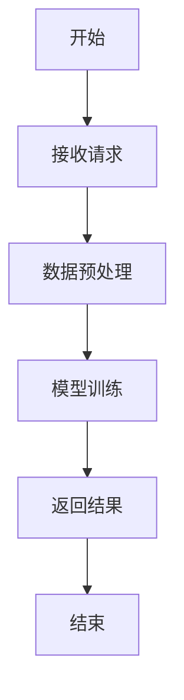
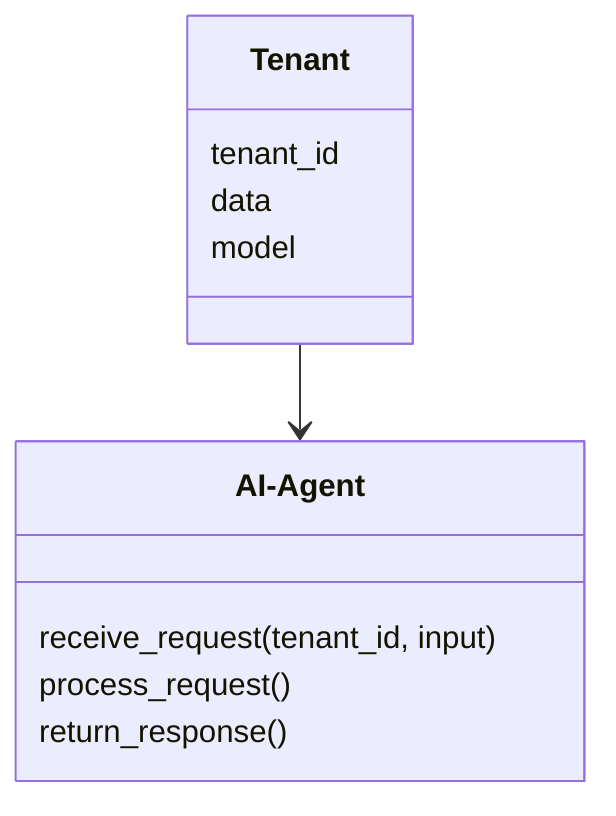
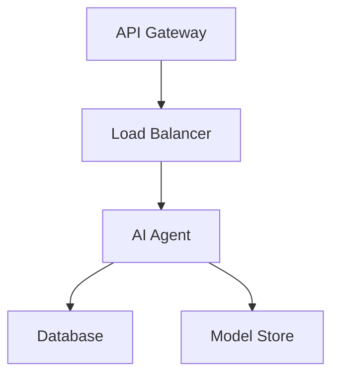
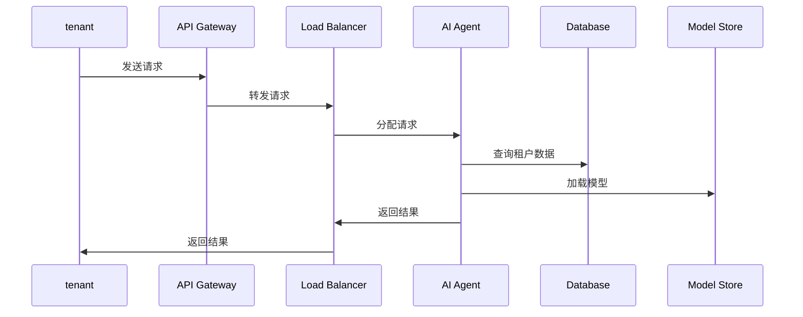

                 


# 企业AI Agent的多租户架构设计与实现

## 关键词：企业AI Agent，多租户架构，AI算法，系统架构，项目实现

## 摘要：本文详细探讨了企业AI Agent在多租户架构下的设计与实现，涵盖核心概念、算法原理、系统架构、项目实战及最佳实践，为构建高效、安全的多租户AI系统提供指导。

---

## 第1章：企业AI Agent与多租户架构概述

### 1.1 AI Agent的基本概念

#### 1.1.1 AI Agent的定义
AI Agent（人工智能代理）是能够感知环境并采取行动以实现目标的智能实体。它通过传感器获取信息，利用推理能力做出决策，并通过执行器与环境互动。

#### 1.1.2 AI Agent的核心功能
- **感知环境**：收集数据并理解当前状态。
- **推理与决策**：基于数据进行分析和选择最优行动。
- **执行行动**：通过执行器实现决策。

#### 1.1.3 企业级AI Agent的应用场景
- 智能客服
- 自动化运维
- 智慧供应链
- 企业数据分析

### 1.2 多租户架构的基本概念

#### 1.2.1 多租户架构的定义
多租户架构允许多个租户共享同一系统资源，同时保持数据隔离和独立性。每个租户的数据和资源使用独立的逻辑或物理边界。

#### 1.2.2 多租户架构的特点
- **资源共享**：多个租户共享计算资源。
- **数据隔离**：租户数据相互隔离，防止泄露。
- **定制化**：支持租户个性化配置。

#### 1.2.3 多租户架构与单租户架构的区别
| 属性 | 多租户架构 | 单租户架构 |
|------|------------|------------|
| 资源共享 | 高 | 低 |
| 成本 | 低 | 高 |
| 扩展性 | 强 | 弱 |

### 1.3 企业AI Agent与多租户架构的结合

#### 1.3.1 企业AI Agent的多租户需求
- **资源弹性扩展**：根据租户需求动态分配资源。
- **数据安全**：确保租户数据独立性。
- **定制化服务**：提供个性化AI服务。

#### 1.3.2 多租户架构对企业AI Agent的意义
- **提高资源利用率**：共享资源降低成本。
- **快速部署**：简化部署流程。
- **支持扩展**：易于扩展新租户。

#### 1.3.3 企业AI Agent多租户架构的应用案例
- 智能客服系统：为多个企业提供个性化支持。
- 供应链管理：不同企业共享预测模型，提高效率。

## 第2章：多租户架构的核心概念

### 2.1 多租户架构的核心原理

#### 2.1.1 多租户架构的实现方式
- **数据库分隔**：为每个租户创建独立的数据库或表。
- **数据加密**：对敏感数据进行加密存储和传输。

#### 2.1.2 多租户架构的资源分配策略
- **按需分配**：根据实时负载动态分配资源。
- **预分配**：基于历史数据分配固定资源。

#### 2.1.3 多租户架构的安全隔离机制
- **网络隔离**：租户间网络不通。
- **数据隔离**：数据存储隔离。
- **计算隔离**：计算资源独立。

### 2.2 AI Agent在多租户架构中的角色

#### 2.2.1 AI Agent在多租户环境中的功能定位
- **数据处理**：处理多个租户的数据。
- **决策制定**：为每个租户提供个性化决策。
- **服务协调**：协调多租户间的资源和服务。

#### 2.2.2 AI Agent与多租户架构的交互流程
1. 租户请求AI服务。
2. AI Agent接收请求并解析。
3. AI Agent调用相关模型进行处理。
4. 返回结果给租户。

#### 2.2.3 AI Agent在多租户架构中的数据处理方式
- **数据预处理**：清洗和转换数据。
- **模型训练**：针对每个租户训练个性化模型。
- **结果返回**：将结果返回给租户。

### 2.3 多租户架构与AI Agent的核心联系

#### 2.3.1 多租户架构对AI Agent性能的影响
- **资源竞争**：多个租户可能导致资源竞争，影响性能。
- **负载均衡**：合理分配资源可提高性能。

#### 2.3.2 AI Agent对多租户架构扩展性的提升
- **自动化扩展**：AI Agent可根据负载自动扩展资源。
- **模型复用**：共享模型提高效率。

#### 2.3.3 多租户架构与AI Agent的协同优化
- **动态资源分配**：根据负载动态调整资源。
- **模型共享**：在保证数据安全的前提下共享模型。

### 2.4 本章小结

---

## 第3章：多租户架构下的AI Agent算法原理

### 3.1 多租户环境下的模型训练

#### 3.1.1 多租户环境下的数据隔离与模型训练
- **数据隔离**：确保租户数据不交叉。
- **分布式训练**：利用多台设备并行训练。

#### 3.1.2 多租户环境下的模型共享与优化
- **模型共享**：租户间共享部分模型参数，提高效率。
- **模型优化**：针对每个租户优化模型。

#### 3.1.3 多租户环境下的模型更新策略
- **在线更新**：实时更新模型。
- **批量更新**：定期批量更新模型。

### 3.2 AI Agent的多租户算法实现

#### 3.2.1 基于多租户的AI Agent算法框架
- **数据预处理**：清洗和转换数据。
- **模型训练**：使用分布式训练方法。
- **模型部署**：将模型部署到生产环境中。

#### 3.2.2 多租户环境下AI Agent的算法流程
1. 接收请求。
2. 数据预处理。
3. 模型训练。
4. 返回结果。

#### 3.2.3 使用mermaid展示算法流程图


#### 3.2.4 使用Python代码实现算法
```python
import numpy as np
from sklearn.linear_model import LinearRegression

# 数据预处理
data = np.array([[1, 2], [3, 4], [5, 6]])
X = data[:, 0].reshape(-1, 1)
y = data[:, 1]

# 模型训练
model = LinearRegression()
model.fit(X, y)

# 返回结果
result = model.predict(np.array([[7]]).reshape(-1, 1))
print(result)
```

### 3.3 本章小结

---

## 第4章：系统分析与架构设计方案

### 4.1 问题场景介绍

#### 4.1.1 问题背景
- 企业需要一个支持多租户的AI Agent系统。
- 系统需要高效处理大量请求，保证数据安全。

#### 4.1.2 问题描述
- 如何设计一个多租户架构的AI Agent系统？
- 如何保证系统的可扩展性和安全性？

### 4.2 系统功能设计

#### 4.2.1 领域模型设计


#### 4.2.2 系统架构设计


### 4.3 系统架构设计

#### 4.3.1 系统架构图


#### 4.3.2 系统接口设计
- **API Gateway**：接收请求并转发。
- **Load Balancer**：分配请求到AI Agent。
- **AI Agent**：处理请求并调用模型。
- **Database**：存储租户数据。
- **Model Store**：存储和管理模型。

#### 4.3.3 系统交互序列图


### 4.4 本章小结

---

## 第5章：项目实战

### 5.1 环境安装

#### 5.1.1 安装Python
```bash
python --version
pip install --upgrade pip
```

#### 5.1.2 安装依赖包
```bash
pip install numpy scikit-learn
```

### 5.2 系统核心实现

#### 5.2.1 实现AI Agent
```python
class AI-Agent:
    def __init__(self):
        self.models = {}

    def receive_request(self, tenant_id, input):
        if tenant_id not in self.models:
            self.models[tenant_id] = self.train_model(tenant_id)
        return self.process_request(tenant_id, input)

    def train_model(self, tenant_id):
        # 训练模型并返回
        pass

    def process_request(self, tenant_id, input):
        # 处理请求并返回结果
        pass
```

#### 5.2.2 实现多租户数据隔离
```python
class TenantDataManager:
    def __init__(self):
        self.tenants_data = {}

    def get_tenant_data(self, tenant_id):
        if tenant_id not in self.tenants_data:
            self.tenants_data[tenant_id] = self.initialize_data(tenant_id)
        return self.tenants_data[tenant_id]

    def initialize_data(self, tenant_id):
        # 初始化租户数据
        pass
```

### 5.3 代码应用解读与分析

#### 5.3.1 AI Agent实现
```python
import numpy as np
from sklearn.linear_model import LinearRegression

class AI-Agent:
    def __init__(self):
        self.models = {}

    def receive_request(self, tenant_id, input):
        if tenant_id not in self.models:
            self.models[tenant_id] = self.train_model(tenant_id)
        return self.process_request(tenant_id, input)

    def train_model(self, tenant_id):
        # 示例数据
        data = np.array([[tenant_id, tenant_id*2]])
        X = data[:, 0].reshape(-1, 1)
        y = data[:, 1]
        model = LinearRegression()
        model.fit(X, y)
        return model

    def process_request(self, tenant_id, input):
        model = self.models[tenant_id]
        result = model.predict(np.array([input]).reshape(-1, 1))
        return result[0]
```

#### 5.3.2 多租户数据管理
```python
class TenantDataManager:
    def __init__(self):
        self.tenants_data = {}

    def get_tenant_data(self, tenant_id):
        if tenant_id not in self.tenants_data:
            self.tenants_data[tenant_id] = self.initialize_data(tenant_id)
        return self.tenants_data[tenant_id]

    def initialize_data(self, tenant_id):
        return {
            'tenant_id': tenant_id,
            'data': np.array([[tenant_id, tenant_id*2]])
        }
```

### 5.4 实际案例分析

#### 5.4.1 案例背景
- 某企业需要构建一个多租户AI Agent系统，用于预测销售。
- 系统需要支持多个租户，每个租户有独立的销售数据。

#### 5.4.2 实施步骤
1. **环境搭建**：安装Python和相关库。
2. **数据准备**：收集各租户的销售数据。
3. **模型训练**：为每个租户训练预测模型。
4. **系统部署**：部署API Gateway和Load Balancer。
5. **测试验证**：测试系统的功能和性能。

#### 5.4.3 系统运行结果
- 每个租户都能独立使用系统。
- 系统能够准确预测销售数据。
- 系统具备良好的扩展性和安全性。

### 5.5 本章小结

---

## 第6章：最佳实践、小结、注意事项与拓展阅读

### 6.1 最佳实践

#### 6.1.1 数据隔离
- 使用数据库分隔或加密技术保证数据隔离。
- 定期进行数据备份和恢复。

#### 6.1.2 资源管理
- 根据负载动态分配资源。
- 使用负载均衡技术优化资源利用。

#### 6.1.3 安全性
- 实施严格的访问控制。
- 定期进行安全审计。

### 6.2 小结

### 6.3 注意事项

#### 6.3.1 数据安全
- 避免数据泄露。
- 定期检查数据完整性。

#### 6.3.2 系统性能
- 优化算法提高处理速度。
- 使用缓存技术减少响应时间。

#### 6.3.3 可扩展性
- 设计灵活的架构支持扩展。
- 预留接口方便功能扩展。

### 6.4 拓展阅读

#### 6.4.1 推荐书籍
- 《Multi-Tenancy in Cloud Computing》
- 《AI in Distributed Systems》

#### 6.4.2 推荐博客和资源
- [Multi-Tenancy Architecture](https://example.com/multi-tenancy)
- [AI Agent Design](https://example.com/ai-agent)

### 6.5 本章小结

---

## 结语

企业AI Agent的多租户架构设计与实现是一项复杂的任务，需要综合考虑多租户架构和AI Agent的核心概念、算法原理、系统架构和项目实现。通过合理的架构设计和算法优化，可以构建高效、安全且可扩展的AI Agent系统，为企业提供智能化的解决方案。未来，随着技术的进步，多租户架构和AI Agent的应用将更加广泛，为企业创造更大的价值。

---

## 致谢

感谢读者的耐心阅读，感谢技术界先驱者的智慧和贡献，感谢所有支持和帮助过我的人。希望本文能为企业的AI Agent多租户架构设计与实现提供有价值的参考和指导。

---

## 参考文献

1. [Multi-Tenancy in Cloud Computing](https://example.com/multi-tenancy)
2. [AI in Distributed Systems](https://example.com/ai-distributed)
3. [Python Machine Learning](https://example.com/python-ml)
4. [Mermaid Documentation](https://example.com/mermaid-docs)
5. [Latex Guide](https://example.com/latex-guide)

