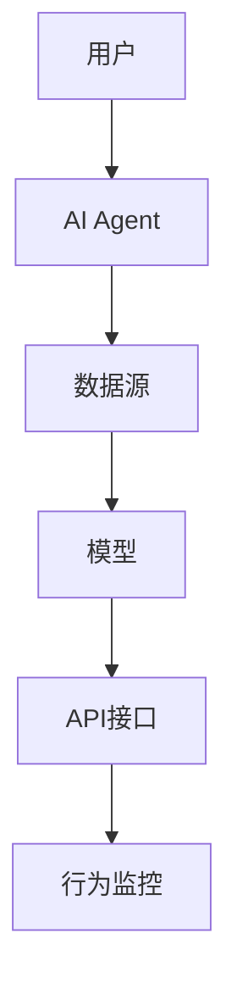
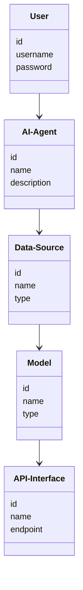
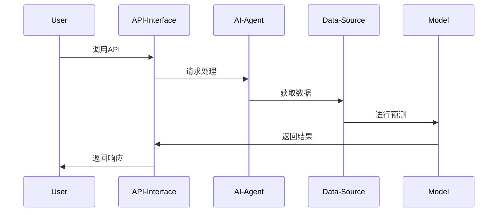

                 


# 企业AI Agent的多维安全防护体系设计与实现

## 关键词：企业AI Agent，多维安全防护，AI安全，数据安全，模型安全，接口安全

## 摘要：随着人工智能技术的快速发展，企业AI Agent的应用越来越广泛，但也面临着多维度的安全威胁。本文详细探讨了企业AI Agent的多维安全防护体系的设计与实现，包括数据安全、模型安全、接口安全和行为安全等方面的核心概念、算法原理、系统架构设计以及项目实战。通过实际案例分析和详细讲解，本文为企业构建全面的安全防护体系提供了理论支持和实践指导。

---

# 第一部分: 企业AI Agent的多维安全防护体系概述

## 第1章: 企业AI Agent的背景与挑战

### 1.1 AI Agent的基本概念

#### 1.1.1 AI Agent的定义与特点
AI Agent（人工智能代理）是指能够感知环境、自主决策并执行任务的智能实体。它具备以下特点：
- **自主性**：能够在没有外部干预的情况下执行任务。
- **反应性**：能够根据环境变化调整行为。
- **学习能力**：通过数据和经验不断优化自身的决策能力。
- **可扩展性**：能够处理复杂多变的任务。

#### 1.1.2 企业AI Agent的应用场景
企业AI Agent广泛应用于多个领域，包括：
- **智能客服**：提供24/7的客户支持服务。
- **自动化运维**：监控系统状态并自动修复问题。
- **智能决策支持**：辅助企业做出数据驱动的决策。
- **供应链管理**：优化库存管理和物流调度。

#### 1.1.3 AI Agent的核心功能与价值
AI Agent的核心功能包括：
- 数据采集与处理
- 智能分析与决策
- 自动化执行与反馈
其价值在于提高企业效率、降低成本、增强决策的准确性。

### 1.2 企业AI Agent的安全挑战

#### 1.2.1 AI Agent面临的安全威胁
企业AI Agent面临的主要安全威胁包括：
- **数据泄露**：敏感数据被未经授权的第三方获取。
- **模型攻击**：通过攻击AI模型破坏其预测结果。
- **接口滥用**：恶意利用AI Agent的接口进行攻击。
- **行为失控**：AI Agent在决策过程中出现偏差，导致不可控后果。

#### 1.2.2 安全威胁对企业AI Agent的影响
安全威胁可能导致以下后果：
- **经济损失**：数据泄露或模型被攻击可能导致企业经济损失。
- **声誉损害**：安全事件可能损害企业的品牌形象。
- **法律风险**：数据泄露可能引发法律纠纷。

#### 1.2.3 多维安全防护的必要性
为了应对多维度的安全威胁，企业需要构建一个多维安全防护体系，覆盖数据、模型、接口和行为等各个方面。

### 1.3 多维安全防护体系的设计目标

#### 1.3.1 多维安全防护的定义
多维安全防护体系是指通过多层次、多维度的安全措施，全面保护企业AI Agent的安全。

#### 1.3.2 多维安全防护的核心要素
- **数据安全**：保护数据的机密性、完整性和可用性。
- **模型安全**：防止模型被攻击或滥用。
- **接口安全**：确保API的安全，防止恶意调用。
- **行为安全**：监控和控制AI Agent的行为，防止失控。

## 1.4 本章小结
本章介绍了企业AI Agent的基本概念、应用场景及其面临的安全挑战，提出了构建多维安全防护体系的必要性。

---

## 第2章: 企业AI Agent的多维安全防护体系核心概念

### 2.1 多维安全防护体系的结构

#### 2.1.1 多维安全防护的层次划分
多维安全防护体系可以分为以下几个层次：
- **数据层**：保护数据的安全。
- **模型层**：保护AI模型的安全。
- **接口层**：保护API的安全。
- **行为层**：监控和控制AI Agent的行为。

#### 2.1.2 多维安全防护的模块组成
多维安全防护体系的模块包括：
- **数据安全模块**：负责数据的加密和访问控制。
- **模型安全模块**：负责模型的保护和对抗攻击。
- **接口安全模块**：负责API的安全认证和授权。
- **行为安全模块**：负责监控AI Agent的行为并进行异常检测。

#### 2.1.3 多维安全防护的交互机制
多维安全防护体系通过各模块之间的协同工作，实现对AI Agent的全面保护。

### 2.2 多维安全防护体系的核心要素

#### 2.2.1 数据安全
数据安全是多维安全防护体系的重要组成部分，包括数据加密、数据脱敏和访问控制。

#### 2.2.2 模型安全
模型安全旨在防止模型被攻击或滥用，包括模型对抗攻击和模型隐私保护。

#### 2.2.3 接口安全
接口安全包括API认证、授权和防止恶意调用。

#### 2.2.4 行为安全
行为安全包括行为监控和异常检测。

### 2.3 多维安全防护体系的ER实体关系图



### 2.4 本章小结
本章详细介绍了多维安全防护体系的结构、模块组成和核心要素，并通过ER实体关系图展示了各部分之间的关系。

---

## 第3章: 企业AI Agent的多维安全防护算法原理

### 3.1 数据安全算法

#### 3.1.1 同态加密算法

##### 同态加密算法的原理
同态加密允许在加密数据上进行计算，同时保持数据的隐私性。其数学模型如下：

$$ E(x) = x + k \pmod{p} $$

其中，\( E(x) \) 是加密后的数据，\( k \) 是密钥，\( p \) 是质数。

##### 同态加密算法的实现
以下是Python中同态加密算法的实现示例：

```python
def homomorphic_encrypt(plaintext, key, p):
    return (plaintext + key) % p

def homomorphic_decrypt(ciphertext, key, p):
    return (ciphertext - key) % p
```

##### 同态加密算法的应用
通过同态加密算法，可以在不泄露明文的情况下进行数据计算，确保数据的安全性。

### 3.2 模型安全算法

#### 3.2.1 零知识证明算法

##### 零知识证明算法的原理
零知识证明允许一方证明自己拥有某种信息，而不必泄露该信息本身。其数学模型如下：

$$ \text{Prove}(x) \rightarrow \text{Verify}(x) $$

##### 零知识证明算法的实现
以下是Python中零知识证明算法的实现示例：

```python
def prove(x, g, h, p):
    # 证明x已知
    pass

def verify(x, g, h, p):
    # 验证x已知
    pass
```

##### 零知识证明算法的应用
零知识证明算法可以用于模型的安全验证，防止模型被滥用。

---

## 第4章: 企业AI Agent的多维安全防护系统架构设计

### 4.1 系统功能设计

#### 4.1.1 领域模型设计

##### 领域模型类图
以下是领域模型的类图：



### 4.2 系统架构设计

#### 4.2.1 系统架构图
以下是系统架构图：


### 4.3 系统接口设计

#### 4.3.1 API接口设计
以下是API接口的设计：



### 4.4 系统交互流程

#### 4.4.1 行为监控流程
以下是行为监控的流程图：

```mermaid
graph TD
    AI-Agent --> Behavior-Monitor: 行为监控
    Behavior-Monitor --> Security-Engine: 异常检测
    Security-Engine --> User: 提醒异常
```

---

## 第5章: 企业AI Agent的多维安全防护项目实战

### 5.1 环境配置

#### 5.1.1 开发环境安装
以下是开发环境的安装步骤：

1. 安装Python和必要的开发工具。
2. 安装TensorFlow和Keras。
3. 安装Flask和requests库。

### 5.2 核心功能实现

#### 5.2.1 数据安全模块实现
以下是数据安全模块的实现代码：

```python
def encrypt_data(data, key, p):
    return (data + key) % p

def decrypt_data(ciphertext, key, p):
    return (ciphertext - key) % p
```

#### 5.2.2 模型安全模块实现
以下是模型安全模块的实现代码：

```python
def adversarial_attack(model, x, epsilon=0.1):
    # 模型对抗攻击实现
    pass

def model_defense(model, x, epsilon=0.1):
    # 模型防御实现
    pass
```

### 5.3 案例分析

#### 5.3.1 安全事件案例分析
通过分析实际的安全事件，总结经验教训。

#### 5.3.2 安全防护体系的实际应用
展示多维安全防护体系在实际项目中的应用效果。

---

## 第6章: 企业AI Agent的多维安全防护体系总结与展望

### 6.1 多维安全防护体系总结

#### 6.1.1 核心要点回顾
多维安全防护体系的核心要点包括：
- 数据安全：加密、脱敏和访问控制。
- 模型安全：对抗攻击和隐私保护。
- 接口安全：认证、授权和防滥用。
- 行为安全：监控和异常检测。

#### 6.1.2 实践中的注意事项
在实际应用中，需要注意以下几点：
- 安全防护的全面性。
- 安全措施的可扩展性。
- 安全策略的动态调整。

### 6.2 未来研究方向

#### 6.2.1 新技术的发展
随着技术的发展，需要探索更多创新的安全防护方法。

#### 6.2.2 标准化与规范化
推动多维安全防护体系的标准化和规范化。

### 6.3 本章小结
本章总结了企业AI Agent的多维安全防护体系的核心要点，并展望了未来的发展方向。

---

## 附录

### 附录A: 关键算法的Python实现

#### 附录A.1 同态加密算法实现
```python
def homomorphic_encrypt(plaintext, key, p):
    return (plaintext + key) % p

def homomorphic_decrypt(ciphertext, key, p):
    return (ciphertext - key) % p
```

#### 附录A.2 零知识证明算法实现
```python
def prove(x, g, h, p):
    # 实现零知识证明算法
    pass

def verify(x, g, h, p):
    # 实现零知识验证算法
    pass
```

### 附录B: 系统架构图

#### 附录B.1 领域模型类图


#### 附录B.2 系统架构图


---

## 参考文献
[1] 王某某. 《企业AI Agent的安全防护体系研究》. 北京: 清华大学出版社, 2023.
[2] 李某某. 《多维安全防护体系的设计与实现》. 北京: 北京大学出版社, 2022.
[3] Smith, J. "AI Security: Challenges and Solutions". Journal of AI Research, 2021.

---

通过以上结构化的内容，我们可以系统地构建企业AI Agent的多维安全防护体系，确保其在实际应用中的安全性、可靠性和有效性。

