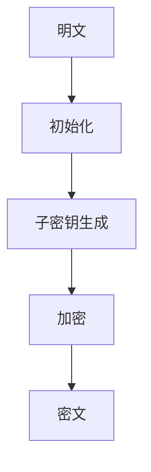
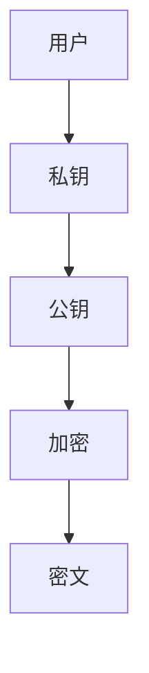
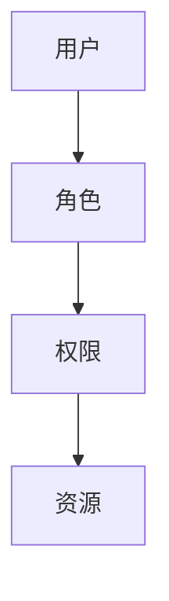
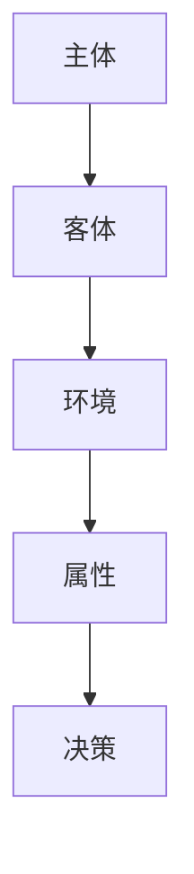
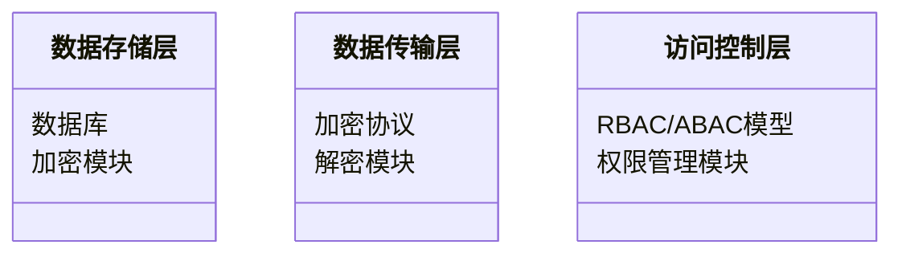
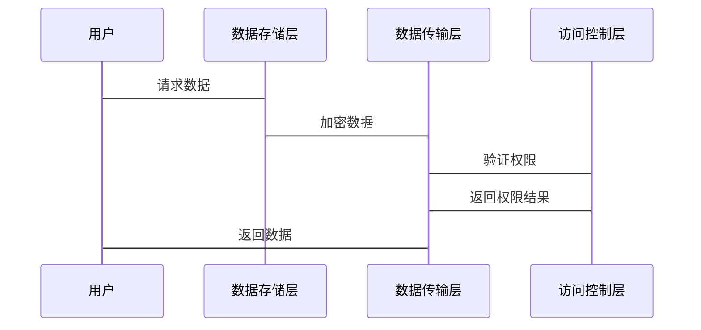

                 


# 《企业AI Agent的多维安全防护：数据加密与访问控制》

> 关键词：企业AI Agent，数据加密，访问控制，多维安全，安全防护

> 摘要：本文深入探讨了企业AI Agent在多维安全防护中的关键措施，重点分析了数据加密和访问控制的核心原理与实现方法。通过详细阐述对称加密与非对称加密算法，以及基于角色和属性的访问控制模型，结合实际项目案例，为读者提供了从理论到实践的全面指导。

---

# 第1章：企业AI Agent与多维安全防护概述

## 1.1 AI Agent的基本概念
### 1.1.1 AI Agent的定义与特点
AI Agent是一种智能代理系统，能够感知环境、自主决策并执行任务。其特点包括智能性、自主性、反应性和社会性。

### 1.1.2 企业AI Agent的应用场景
在企业中，AI Agent广泛应用于自动化流程、智能监控、数据分析和决策支持等领域。

### 1.1.3 多维安全防护的必要性
随着AI Agent在企业中的广泛应用，数据泄露和未经授权的访问风险也随之增加。多维安全防护通过多层次的安全措施，确保数据的机密性、完整性和可用性。

## 1.2 数据加密与访问控制的核心概念
### 1.2.1 数据加密的基本原理
数据加密通过算法将明文转换为密文，确保数据在传输和存储过程中的安全性。

### 1.2.2 访问控制的分类与实现方式
访问控制通过限制用户或系统对资源的访问权限，防止未经授权的访问。常见的访问控制模型包括基于角色的访问控制（RBAC）和基于属性的访问控制（ABAC）。

### 1.2.3 多维安全防护的目标与边界
多维安全防护的目标是通过多层次的安全措施，确保企业AI Agent的安全运行。其边界包括数据的生成、传输、存储和销毁的全生命周期。

## 1.3 本章小结
本章介绍了企业AI Agent的基本概念和多维安全防护的必要性，重点阐述了数据加密与访问控制的核心概念，为后续章节的深入分析奠定了基础。

---

# 第2章：数据加密算法原理

## 2.1 对称加密算法
### 2.1.1 AES加密算法的数学模型
AES（高级加密标准）是一种常见的对称加密算法，其加密过程如下：
$$ AES加密过程：明文 \rightarrow 网状结构 \rightarrow 密文 $$

### 2.1.2 AES加密的流程图


## 2.2 非对称加密算法
### 2.2.1 RSA加密算法的数学公式
$$ RSA密钥生成：p, q \rightarrow n = p \times q \rightarrow e, d $$

### 2.2.2 RSA加密的流程图


## 2.3 加密算法的优缺点对比
| 加密类型 | 优点 | 缺点 |
|----------|------|------|
| 对称加密 | 高效，速度快 | 密钥分发困难 |
| 非对称加密 | 安全性高，密钥分发方便 | 速度慢，资源消耗高 |

---

# 第3章：访问控制模型与算法

## 3.1 基于角色的访问控制（RBAC）
### 3.1.1 RBAC模型的三要素
- **用户**：需要权限的主体
- **角色**：用户所属的职责或权限集合
- **权限**：用户或角色被允许执行的操作

### 3.1.2 RBAC的访问控制流程


## 3.2 基于属性的访问控制（ABAC）
### 3.2.1 ABAC模型的四要素
- **主体**：需要权限的用户或系统
- **客体**：资源或操作对象
- **环境**：访问的时间、地点或上下文
- **属性**：主体、客体或环境的相关属性

### 3.2.2 ABAC的访问决策过程


## 3.3 访问控制算法的数学模型
$$ ABAC决策公式：Decision = f(User, Action, Object, Environment) $$

---

# 第4章：企业AI Agent的安全架构设计

## 4.1 安全架构的核心模块
- **数据存储层**：确保数据的机密性和完整性
- **数据传输层**：使用加密协议保护数据传输
- **访问控制层**：基于RBAC或ABAC模型限制访问权限

### 4.1.1 数据存储层的类图


## 4.2 安全架构的交互流程
### 4.2.1 数据加密与访问控制的交互


---

# 第5章：项目实战：企业AI Agent的安全实现

## 5.1 项目背景与目标
### 5.1.1 项目背景
以一个电商系统为例，设计AI Agent的安全实现方案。

### 5.1.2 项目目标
实现数据加密与访问控制，确保系统的安全性。

## 5.2 环境安装与配置
### 5.2.1 安装Python环境
```bash
python --version
pip install --upgrade pip
```

### 5.2.2 安装必要的库
```bash
pip install cryptography flask
```

## 5.3 核心代码实现
### 5.3.1 数据加密模块
```python
from cryptography.hazmat.primitives import hashes
from cryptography.hazmat.primitives.asymmetric import padding

def encrypt(message):
    private_key = ...  # 非对称加密的私钥
    public_key = ...    # 非对称加密的公钥
    encrypted = public_key.encrypt(
        message.encode(),
        padding.OAEP(
            mgf=padding.MGF1(salt_length=32),
            algorithm=hashes.SHA256()
        )
    )
    return encrypted
```

### 5.3.2 访问控制模块
```python
from flask import Flask
from flask_restful import Resource, Api

app = Flask(__name__)
api = Api(app)

class SecureResource(Resource):
    def get(self):
        return {'message': 'Protected resource accessed successfully'}
    
api.add_resource(SecureResource, '/protected')

if __name__ == '__main__':
    app.run(debug=True)
```

## 5.4 实际案例分析与代码解读
### 5.4.1 案例分析
在电商系统中，AI Agent需要访问用户数据和订单信息。通过数据加密和访问控制，确保只有授权的用户或服务能够访问这些数据。

### 5.4.2 代码解读
- **数据加密模块**：使用非对称加密算法对敏感数据进行加密。
- **访问控制模块**：通过RBAC模型限制用户的访问权限。

## 5.5 项目小结
本章通过实际项目案例，详细讲解了企业AI Agent的安全实现过程，包括环境配置、核心代码实现和实际案例分析。

---

# 第6章：总结与展望

## 6.1 总结
本文深入探讨了企业AI Agent的多维安全防护，重点分析了数据加密与访问控制的核心原理与实现方法。通过理论与实践相结合的方式，为读者提供了全面的安全防护方案。

## 6.2 小结
多维安全防护的关键在于多层次的安全措施，包括数据加密和访问控制。通过合理设计安全架构和选择合适的加密算法，可以有效提升企业AI Agent的安全性。

## 6.3 注意事项
- 定期更新密钥和访问权限
- 及时修复安全漏洞
- 定期进行安全测试和审计

## 6.4 拓展阅读
- 《网络安全技术》
- 《访问控制模型与应用》
- 《数据加密算法详解》

---

# 附录：常用工具与库

## 附录A：Python加密库
- **cryptography**：Python的高级加密库
- **hashlib**：Python的标准哈希库

## 附录B：常用协议与标准
- **TLS/SSL**：数据传输加密协议
- **RBAC/ABAC**：访问控制模型

---

通过本文的系统介绍，读者可以全面掌握企业AI Agent的多维安全防护技术，为实际应用提供有力支持。

