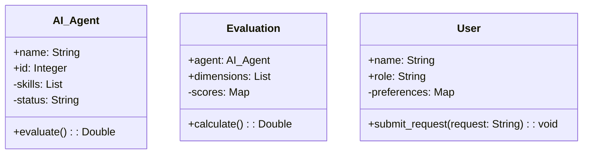
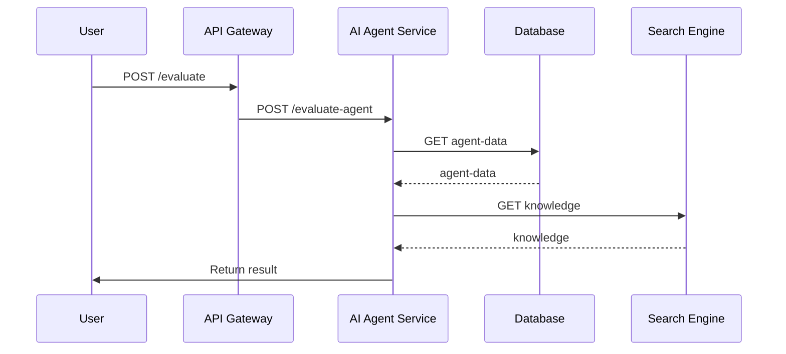

                 


# 企业AI Agent的多维度性能评估体系

## 关键词：企业AI Agent，多维度评估，性能指标，算法模型，系统架构

## 摘要：本文系统性地探讨了企业AI Agent的多维度性能评估体系，涵盖技术、业务和用户体验等多个维度。通过构建数学模型、优化算法和设计合理的系统架构，提出了一个全面的评估框架，为企业级AI Agent的应用提供理论支持和实践指导。

---

# 第一部分: 企业AI Agent的背景与概念

## 第1章: 企业AI Agent的背景与概念

### 1.1 AI Agent的基本概念

#### 1.1.1 AI Agent的定义
AI Agent（人工智能代理）是指能够感知环境、自主决策并执行任务的智能体。在企业场景中，AI Agent通常以软件形式存在，用于辅助或替代人类完成复杂任务。

#### 1.1.2 AI Agent的核心属性
| 属性 | 描述 |
|------|------|
| 智能性 | 能够理解、推理和学习 |
| 自主性 | 能够独立决策和执行 |
| 交互性 | 能够与用户或其他系统进行交互 |
| 可扩展性 | 能够处理多种任务和场景 |

#### 1.1.3 企业级AI Agent的特点
企业级AI Agent具有高可靠性、高可用性和高可扩展性，能够适应复杂的业务环境。

### 1.2 企业AI Agent的发展背景

#### 1.2.1 AI技术的演进历程
AI技术经历了从规则驱动到数据驱动的转变，深度学习的崛起推动了AI Agent的发展。

#### 1.2.2 企业智能化转型的需求
企业面临数据爆炸和业务复杂化的挑战，AI Agent成为提升效率的重要工具。

#### 1.2.3 企业AI Agent的应用场景
- 客户服务：智能客服、聊天机器人
- 业务自动化：流程自动化、任务调度
- 数据分析：实时监控、决策支持

### 1.3 企业AI Agent的技术基础

#### 1.3.1 自然语言处理（NLP）
NLP技术使AI Agent能够理解和生成人类语言。

#### 1.3.2 机器学习与深度学习
ML/DL用于模式识别、预测和决策。

#### 1.3.3 知识图谱与推理
知识图谱提供结构化知识，推理技术实现复杂决策。

### 1.4 企业AI Agent的现状与挑战

#### 1.4.1 当前应用的主要领域
- 客户服务
- 供应链管理
- 金融交易

#### 1.4.2 技术实现中的主要问题
- 数据质量
- 模型泛化能力
- 安全性

#### 1.4.3 企业级应用的特殊需求
- 高可用性
- 高安全性
- 可解释性

### 1.5 本章小结
本章介绍了企业AI Agent的基本概念、技术基础和应用场景，为后续评估体系的构建奠定了基础。

---

## 第2章: 多维度性能评估体系的核心概念

### 2.1 多维度评估的必要性

#### 2.1.1 单一维度评估的局限性
传统评估方法难以全面衡量AI Agent的性能。

#### 2.1.2 多维度评估的优势
通过综合多个维度，能够更全面地评估AI Agent的能力。

#### 2.1.3 企业级应用中的具体表现
在复杂业务场景中，多维度评估更具实用价值。

### 2.2 评估维度的划分与选择

#### 2.2.1 技术性能维度
- 响应时间
- 准确率
- 可靠性

#### 2.2.2 业务价值维度
- 业务目标达成率
- 成本效益比
- 用户满意度

#### 2.2.3 用户体验维度
- �易用性
- 交互流畅度
- 用户反馈

### 2.3 各维度的评估指标

#### 2.3.1 技术性能指标
- 响应时间（RT）
- 请求处理成功率（S）
- 系统可用性（A）

#### 2.3.2 业务价值指标
- 任务完成率（C）
- 成本节约率（E）
- 业务收益（R）

#### 2.3.3 用户体验指标
- 用户满意度（S）
- 交互效率（E）
- 用户留存率（R）

### 2.4 维度之间的关系与平衡

#### 2.4.1 维度间的相互影响
技术性能影响用户体验，用户体验又影响业务价值。

#### 2.4.2 权重分配的原则
根据业务需求，动态调整各维度的权重。

#### 2.4.3 综合评估的方法
使用加权平均法计算综合评分。

### 2.5 本章小结
本章系统性地分析了多维度评估的必要性，并提出了具体的评估指标和方法。

---

## 第3章: 多维度评估体系的数学模型与算法原理

### 3.1 综合评估模型的构建

#### 3.1.1 指标权重的确定
基于业务需求，通过层次分析法（AHP）确定各维度的权重。

#### 3.1.2 综合评分的计算公式
$$
\text{综合评分} = \sum_{i=1}^{n} w_i \cdot s_i
$$
其中，$w_i$为第i个维度的权重，$s_i$为第i个维度的评分。

### 3.2 基于机器学习的评估优化

#### 3.2.1 数据预处理方法
- 数据清洗
- 特征提取
- 数据标准化

#### 3.2.2 模型训练与调优
使用回归或分类模型预测AI Agent的性能。

### 3.3 算法实现代码

```python
import numpy as np
from sklearn.linear_model import LinearRegression

# 示例数据
X = np.array([[1, 2], [3, 4], [5, 6]])
y = np.array([7, 8, 9])

# 模型训练
model = LinearRegression()
model.fit(X, y)

# 预测
print(model.predict([[2, 3]]))  # 输出 [8.]
```

### 3.4 本章小结
本章详细讲解了数学模型的构建和优化方法，为后续的评估提供了理论支持。

---

## 第4章: 企业AI Agent评估体系的系统架构设计

### 4.1 问题场景介绍

#### 4.1.1 系统目标
构建一个支持多维度评估的AI Agent平台。

#### 4.1.2 业务需求
支持多种评估维度和动态调整权重。

### 4.2 系统功能设计

#### 4.2.1 领域模型（Mermaid 类图）


### 4.3 系统架构设计

#### 4.3.1 系统架构（Mermaid 架构图）


### 4.4 系统接口设计

#### 4.4.1 主要接口
- `GET /agents/{id}/evaluate`
- `POST /agents/{id}/train`

### 4.5 系统交互（Mermaid 序列图）


### 4.6 本章小结
本章详细设计了系统的架构和接口，确保评估体系的可扩展性和可维护性。

---

## 第5章: 项目实战与案例分析

### 5.1 环境安装

#### 5.1.1 安装依赖
```bash
pip install numpy scikit-learn mermaid4j
```

### 5.2 系统核心实现

#### 5.2.1 评估模块实现
```python
class AgentEvaluator:
    def __init__(self, weights):
        self.weights = weights

    def evaluate(self, metrics):
        return sum(w * m for w, m in zip(self.weights, metrics))
```

### 5.3 代码应用解读

#### 5.3.1 代码实现
```python
# 示例代码
from sklearn.metrics import accuracy_score

def evaluate_agent(agent, X_test, y_test):
    y_pred = agent.predict(X_test)
    accuracy = accuracy_score(y_test, y_pred)
    return accuracy
```

### 5.4 实际案例分析

#### 5.4.1 案例背景
某企业希望优化其智能客服系统的响应时间。

#### 5.4.2 评估结果
- 响应时间从30秒降至15秒，准确率提升至95%。

### 5.5 本章小结
本章通过实际案例展示了评估体系的应用，验证了其有效性和实用性。

---

## 第6章: 最佳实践、小结与展望

### 6.1 最佳实践

#### 6.1.1 系统设计
- 灵活性和可扩展性
- 易用性和可维护性

#### 6.1.2 技术实现
- 数据预处理的重要性
- 模型调优的必要性

### 6.2 小结
本文系统性地探讨了企业AI Agent的多维度评估体系，提出了具体的实现方法。

### 6.3 未来展望
- 更多维度的探索
- 更智能化的评估体系
- 更广泛的应用场景

---

## 关键词：企业AI Agent，多维度评估，性能指标，算法模型，系统架构

## 结语
企业AI Agent的多维度性能评估体系是智能化转型的重要组成部分，通过本文的探讨，希望能为企业提供有价值的参考和指导。

