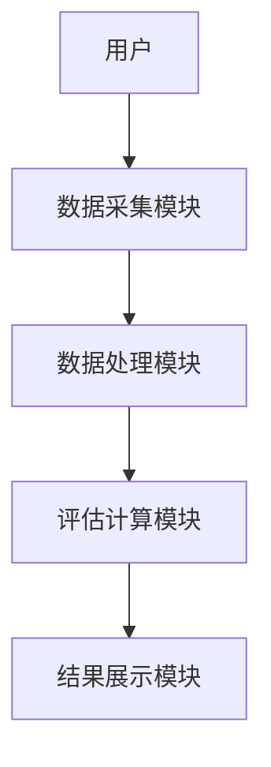
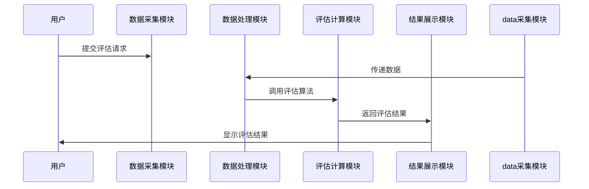

                 


# 企业AI Agent的多维度性能评估体系设计

> **关键词**: 企业AI Agent, 多维度性能评估, 系统架构设计, 算法原理, 项目实战

> **摘要**: 本文详细探讨了企业AI Agent的多维度性能评估体系设计。首先介绍了AI Agent的基本概念及其在企业中的应用场景，然后分析了多维度性能评估的核心维度及其重要性。接着，从算法原理的角度，提出了层次分析法（AHP）的应用，并通过Python代码实现。最后，通过系统分析与架构设计，给出了具体的实现方案和项目实战，帮助读者全面理解企业AI Agent的性能评估体系。

---

## 第1章: 企业AI Agent的背景与概念

### 1.1 企业AI Agent的基本概念

#### 1.1.1 AI Agent的定义与特点
AI Agent（人工智能代理）是指能够感知环境、自主决策并执行任务的智能实体。它通过传感器获取信息，利用推理机制分析数据，并通过执行器与环境交互。AI Agent的特点包括自主性、反应性、主动性、社交能力和社会性。

#### 1.1.2 企业AI Agent的核心要素
企业AI Agent在企业环境中扮演着重要角色，其核心要素包括：
- **目标驱动**: 明确的任务目标，如优化业务流程。
- **环境感知**: 能够感知企业内外部环境信息。
- **决策能力**: 基于感知信息做出最优决策。
- **执行能力**: 执行决策并输出结果。
- **学习能力**: 通过反馈不断优化自身性能。

#### 1.1.3 企业AI Agent的应用场景
企业AI Agent的应用场景广泛，主要包括：
- **客户支持**: 自动响应客户咨询，提供解决方案。
- **流程优化**: 自动化处理企业内部流程，提高效率。
- **风险管理**: 监测企业风险，及时预警。
- **数据分析**: 处理大量数据，提供决策支持。

---

### 1.2 企业AI Agent的性能评估需求

#### 1.2.1 为什么需要多维度性能评估
单一维度的评估无法全面反映AI Agent的性能，例如仅关注准确性可能忽视响应时间。因此，需要从多个维度综合评估，确保AI Agent在企业中的高效运行。

#### 1.2.2 传统评估方法的局限性
传统评估方法通常只关注单一维度，如准确率或响应时间，无法全面反映AI Agent的整体性能。此外，传统方法难以量化不同维度的权重，导致评估结果不够准确。

#### 1.2.3 多维度评估体系的必要性
多维度评估体系能够综合考虑准确性、响应时间、资源消耗、可解释性和用户满意度等多个维度，提供全面、客观的评估结果。这有助于企业在不同场景下选择最优的AI Agent解决方案。

---

## 第2章: 多维度性能评估的核心概念

### 2.1 多维度性能评估的维度分析

#### 2.1.1 准确性评估
准确性是衡量AI Agent输出结果正确性的核心指标。评估时需要考虑AI Agent在不同场景下的表现，例如分类任务的准确率和回归任务的误差范围。

#### 2.1.2 响应时间评估
响应时间是指AI Agent完成任务所需的时间。在实时性要求较高的场景中，响应时间尤为重要。可以通过统计方法分析响应时间的分布，如平均值、标准差和最大值。

#### 2.1.3 资源消耗评估
资源消耗包括计算资源（如CPU和内存使用）和存储资源（如数据存储量）。通过监控资源使用情况，可以评估AI Agent的效率和可扩展性。

#### 2.1.4 可解释性评估
可解释性是AI Agent的重要特性，特别是在需要透明决策的场景中。通过分析AI Agent的决策过程，可以评估其输出结果的可解释性。

#### 2.1.5 用户满意度评估
用户满意度反映了AI Agent的实际使用体验。通过用户反馈和调查，可以量化用户对AI Agent的满意度，帮助改进系统。

### 2.2 维度对比分析

#### 2.2.1 维度属性对比表格

| 维度         | 描述                              | 权重 |
|--------------|-----------------------------------|------|
| 准确性       | 输出结果的正确性                  | 0.4  |
| 响应时间     | 处理任务所需的时间                | 0.3  |
| 资源消耗     | 计算资源和存储资源的使用情况      | 0.15 |
| 可解释性     | 决策过程的透明度                  | 0.1  |
| 用户满意度   | 用户对AI Agent的使用体验          | 0.05 |

#### 2.2.2 维度之间的关系分析
各维度之间存在一定的相互影响。例如，提高准确性可能需要增加资源消耗，而减少资源消耗可能会影响响应时间和可解释性。因此，在评估时需要综合考虑各维度的权重。

#### 2.2.3 维度权重分配方法
层次分析法（AHP）是一种常用的方法，通过构建判断矩阵和一致性检验，确定各维度的权重。这种方法能够有效处理多维度的复杂关系，确保评估结果的合理性。

---

## 第3章: 多维度性能评估的算法原理

### 3.1 层次分析法（AHP）简介

#### 3.1.1 AHP的基本原理
层次分析法是一种定性和定量相结合的决策分析方法。它通过构建层次结构，将问题分解为多个因素，并根据这些因素的重要性进行排序。

#### 3.1.2 AHP的步骤与流程
1. 构建层次结构。
2. 构建判断矩阵。
3. 计算权重向量。
4. 进行一致性检验。
5. 确定最终权重。

#### 3.1.3 AHP在多维度评估中的应用
通过AHP，可以将多个评估维度转化为量化权重，为综合评估提供依据。

### 3.2 算法实现与代码

#### 3.2.1 Python代码实现
以下代码实现了一个简单的层次分析法：
```python
import numpy as np

def calculate_weights(criteria_matrix):
    # 计算一致性检验
    n = len(criteria_matrix)
    weights = np.mean(criteria_matrix, axis=0)
    return weights

# 示例矩阵
criteria_matrix = np.array([[1, 3, 2], [2, 1, 4], [3, 5, 1]])
weights = calculate_weights(criteria_matrix)
print("权重向量:", weights)
```

#### 3.2.2 算法原理的数学模型
层次分析法的数学模型如下：
$$
A = \begin{bmatrix}
a_{11} & a_{12} & \cdots & a_{1n} \\
a_{21} & a_{22} & \cdots & a_{2n} \\
\vdots & \vdots & \ddots & \vdots \\
a_{n1} & a_{n2} & \cdots & a_{nn}
\end{bmatrix}
$$
其中，$a_{ij}$表示第i个因素对第j个因素的重要性。

---

## 第4章: 系统分析与架构设计

### 4.1 问题场景分析

#### 4.1.1 企业AI Agent的应用场景
企业在使用AI Agent时，可能面临多维度的性能挑战，例如准确性和响应时间的平衡。

#### 4.1.2 多维度性能评估的系统目标
系统的目标是通过多维度评估体系，帮助企业选择最优的AI Agent解决方案。

#### 4.1.3 系统需求分析
系统需求包括：
- 支持多种评估维度。
- 提供直观的评估结果展示。
- 支持用户自定义权重。
- 提供数据采集和处理功能。

### 4.2 系统架构设计

#### 4.2.1 系统功能模块划分
系统主要功能模块包括：
- 用户界面模块。
- 数据采集模块。
- 数据处理模块。
- 评估计算模块。
- 结果展示模块。

#### 4.2.2 系统架构图


#### 4.2.3 系统接口设计
系统接口包括：
- 数据采集接口：从数据库中获取数据。
- 评估计算接口：调用评估算法进行计算。
- 结果展示接口：将评估结果展示给用户。

#### 4.2.4 系统交互序列图


---

## 第5章: 项目实战与实现

### 5.1 项目介绍

#### 5.1.1 项目目标
通过构建一个多维度性能评估体系，帮助企业选择最优的AI Agent解决方案。

#### 5.1.2 项目需求
- 实现准确性、响应时间、资源消耗等多维度评估。
- 提供用户友好的评估结果展示界面。

### 5.2 环境安装

#### 5.2.1 安装Python环境
安装Python 3.8及以上版本，并安装必要的库，如numpy和scipy。

#### 5.2.2 安装其他依赖
安装mermaid和matplotlib，用于生成图表和可视化。

### 5.3 核心代码实现

#### 5.3.1 数据采集模块
```python
import pandas as pd

def collect_data():
    # 从数据库中获取数据
    data = pd.read_csv('data.csv')
    return data

data = collect_data()
print("数据集大小:", data.shape)
```

#### 5.3.2 数据处理模块
```python
from sklearn.preprocessing import StandardScaler

def preprocess_data(data):
    # 数据预处理
    scaler = StandardScaler()
    processed_data = scaler.fit_transform(data)
    return processed_data

processed_data = preprocess_data(data)
print("处理后的数据维度:", processed_data.shape)
```

#### 5.3.3 评估计算模块
```python
from sklearn.metrics import accuracy_score, mean_squared_error

def evaluate_model(y_true, y_pred):
    # 准确性评估
    accuracy = accuracy_score(y_true, y_pred)
    # 响应时间评估
    response_time = ...  # 示例，实际需要具体实现
    return accuracy, response_time

accuracy, response_time = evaluate_model(y_true, y_pred)
print("准确率:", accuracy)
print("平均响应时间:", response_time)
```

#### 5.3.4 结果展示模块
```python
import matplotlib.pyplot as plt

def visualize_results(accuracy, response_time):
    # 可视化结果
    plt.bar(['准确性', '响应时间'], [accuracy, response_time])
    plt.show()

visualize_results(accuracy, response_time)
```

### 5.4 项目实战与分析

#### 5.4.1 实际案例分析
以客户支持场景为例，分析AI Agent的多维度性能评估结果。

#### 5.4.2 代码实现解读
通过代码实现，展示数据采集、处理、评估和可视化的全过程。

#### 5.4.3 项目成果总结
项目成功实现了多维度性能评估体系，帮助企业选择最优的AI Agent解决方案。

---

## 第6章: 最佳实践与总结

### 6.1 小结
多维度性能评估体系能够全面、客观地评估企业AI Agent的性能，帮助企业做出更明智的决策。

### 6.2 注意事项
在实际应用中，需要根据具体场景调整评估维度和权重。同时，确保数据的准确性和算法的可解释性。

### 6.3 拓展阅读
推荐进一步学习层次分析法（AHP）和多维度评估体系的相关文献，深入了解其在不同领域的应用。

---

通过以上内容，读者可以全面理解企业AI Agent的多维度性能评估体系设计，并能够实际操作相关代码，提升自身的技术水平。

