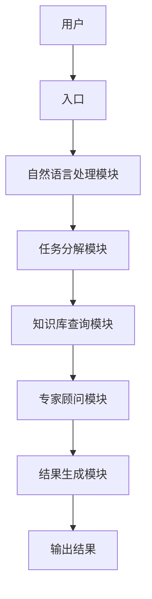
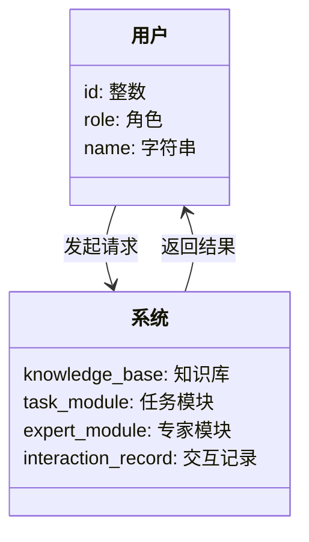
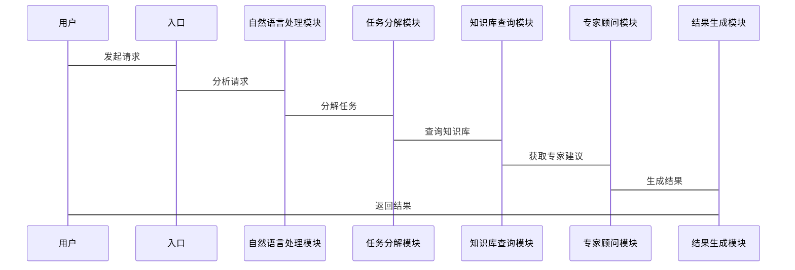

                 


# 企业AI Agent的多角色设计：从助手到专家顾问

> 关键词：AI Agent, 多角色设计, 专家顾问, 知识库, 多智能体协作

> 摘要：本文深入探讨了企业AI Agent的多角色设计，从助手到专家顾问的角色演变，分析了AI Agent的核心概念、算法原理、系统架构设计以及实际项目应用，为企业构建智能化决策支持系统提供了理论依据和实践指导。

---

# 第1章: AI Agent的核心概念与背景

## 1.1 AI Agent的基本定义

### 1.1.1 什么是AI Agent

AI Agent（人工智能代理）是一种能够感知环境、自主决策并执行任务的智能实体。它通过自然语言处理、机器学习和知识图谱等技术，为用户提供智能化服务。

AI Agent的基本特征包括：  
1. **自主性**：能够在没有外部干预的情况下执行任务。  
2. **反应性**：能够实时感知环境并做出响应。  
3. **学习能力**：通过数据和经验不断优化性能。  
4. **多角色性**：能够根据需求切换或组合不同的角色功能。

### 1.1.2 AI Agent的核心特征

AI Agent的核心特征可以归纳为以下几点：  
1. **知识表示**：通过知识图谱和语义理解技术，构建领域知识体系。  
2. **任务分解**：将复杂问题分解为多个子任务，逐步解决。  
3. **对话生成**：基于上下文信息生成自然流畅的对话内容。  
4. **决策推理**：通过逻辑推理和概率模型，做出最优决策。

### 1.1.3 AI Agent与传统软件的区别

与传统软件相比，AI Agent具有以下显著特点：  
1. **智能性**：能够理解用户需求并提供个性化服务。  
2. **自主性**：能够自主决策并执行任务，无需人工干预。  
3. **适应性**：能够根据环境变化动态调整行为策略。  
4. **学习能力**：通过数据和经验不断优化性能。

---

## 1.2 AI Agent的多角色设计

### 1.2.1 助手角色的定义与功能

助手角色是AI Agent的基础功能之一，主要负责以下任务：  
1. **信息检索**：根据用户需求快速检索知识库。  
2. **任务执行**：执行简单的任务，如日程安排、信息查询等。  
3. **对话支持**：提供即时对话支持，解答用户问题。  
4. **反馈收集**：收集用户反馈，优化服务体验。

### 1.2.2 专家顾问角色的定义与功能

专家顾问角色是AI Agent的高级功能之一，主要负责以下任务：  
1. **专业分析**：基于专业知识对问题进行深入分析。  
2. **决策支持**：提供基于数据和模型的决策支持。  
3. **策略制定**：根据企业目标制定优化策略。  
4. **风险评估**：评估潜在风险并提供应对建议。

### 1.2.3 多角色协作的必要性

多角色协作是AI Agent实现复杂任务的关键。通过协作，AI Agent能够充分发挥不同角色的优势，提升整体性能。例如：  
1. 助手角色负责初步信息收集和任务分解。  
2. 专家顾问角色负责深度分析和决策支持。  
3. 通过协作，AI Agent能够高效完成复杂任务，提升用户体验。

---

## 1.3 企业AI Agent的应用场景

### 1.3.1 企业内部助手的应用

在企业内部，AI Agent可以作为助手，帮助员工完成以下任务：  
1. **信息检索**：快速查找企业内部知识库中的信息。  
2. **任务分配**：根据员工能力自动分配任务。  
3. **日程管理**：协助员工管理会议和日程安排。  
4. **沟通协调**：协助团队内部沟通和协作。

### 1.3.2 专家顾问在企业决策中的作用

专家顾问角色在企业决策中扮演着重要角色：  
1. **战略规划**：协助企业制定长期发展战略。  
2. **风险评估**：评估潜在风险并提供应对建议。  
3. **市场分析**：分析市场趋势并提供决策支持。  
4. **资源优化**：优化企业资源配置，提升运营效率。

### 1.3.3 多角色协作的实际案例

一个典型的多角色协作案例是企业销售预测系统：  
1. 助手角色负责收集市场数据和客户反馈。  
2. 专家顾问角色负责分析数据并预测销售趋势。  
3. 通过协作，系统能够为企业提供准确的销售预测，帮助企业做出科学决策。

---

## 1.4 本章小结

本章介绍了AI Agent的核心概念、多角色设计及其在企业中的应用场景。AI Agent通过多角色协作，能够高效完成复杂任务，为企业提供智能化支持。

---

# 第2章: AI Agent的核心原理

## 2.1 AI Agent的实体关系图

### 使用 Mermaid 绘制的 ER 实体关系图

```mermaid
er
  actor: 用户
  agent: AI Agent
  task: 任务
  knowledge: 知识库
  interaction: 交互记录
  relation: 关系
  actor -[发起请求]-> agent
  agent -[查询知识库]-> knowledge
  agent -[执行任务]-> task
  interaction -[记录交互]-> actor
```

---

## 2.2 AI Agent的系统架构图

### 使用 Mermaid 绘制的系统架构图



---

## 2.3 AI Agent的算法原理

### 2.3.1 任务分解算法

任务分解是AI Agent实现多角色协作的关键步骤。任务分解算法如下：  
1. **输入分析**：解析用户需求，提取关键信息。  
2. **任务分解**：将复杂任务分解为多个子任务。  
3. **优先级排序**：根据任务重要性进行优先级排序。  
4. **子任务分配**：将子任务分配给不同的角色模块。

### 2.3.2 知识表示与推理算法

知识表示与推理是AI Agent的核心技术之一。知识表示算法如下：  
1. **知识建模**：将领域知识建模为知识图谱。  
2. **语义理解**：通过自然语言处理技术理解用户需求。  
3. **逻辑推理**：基于知识图谱进行逻辑推理，生成推理结果。

### 2.3.3 对话生成算法

对话生成是AI Agent实现人机交互的关键技术。对话生成算法如下：  
1. **上下文分析**：分析对话上下文，理解用户意图。  
2. **内容生成**：基于知识库生成对话内容。  
3. **语言优化**：优化生成内容，使其更符合自然语言表达习惯。

---

## 2.4 本章小结

本章详细介绍了AI Agent的核心原理，包括实体关系图、系统架构图以及任务分解、知识表示与推理、对话生成等关键算法。这些算法共同构成了AI Agent的智能基础。

---

# 第3章: AI Agent的系统分析与架构设计

## 3.1 问题场景介绍

本章以企业销售预测系统为例，介绍AI Agent的系统分析与架构设计。

---

## 3.2 系统功能设计

### 3.2.1 领域模型设计

领域模型是系统功能设计的核心。领域模型设计如下：  
1. **用户角色**：包括普通用户和专家用户。  
2. **功能模块**：包括信息查询、任务执行、决策支持等模块。  
3. **数据流**：用户发起请求 → 系统处理 → 返回结果。

### 3.2.2 领域模型类图



---

## 3.3 系统架构设计

### 3.3.1 系统架构图


---

## 3.4 系统接口设计

### 3.4.1 API接口设计

系统设计了以下API接口：  
1. `POST /api/init`：系统初始化接口。  
2. `POST /api/execute_task`：任务执行接口。  
3. `POST /api/expert_advice`：专家建议接口。  
4. `GET /api/status`：系统状态查询接口。

### 3.4.2 接口交互序列图



---

## 3.5 本章小结

本章以企业销售预测系统为例，详细介绍了AI Agent的系统分析与架构设计，包括领域模型设计、系统架构图、接口设计以及交互序列图。

---

# 第4章: 项目实战

## 4.1 环境安装

### 4.1.1 安装Python

```bash
# 安装Python 3.8及以上版本
sudo apt-get update
sudo apt-get install python3 python3-pip
```

### 4.1.2 安装依赖库

```bash
pip install numpy pandas scikit-learn transformers
```

---

## 4.2 系统核心实现

### 4.2.1 知识库构建

知识库构建代码如下：

```python
from typing import Dict, Any

def build_knowledge_base():
    knowledge_base = {
        'product_info': {
            'product1': {'name': 'Product 1', 'description': 'Description of Product 1'},
            'product2': {'name': 'Product 2', 'description': 'Description of Product 2'}
        },
        'market_data': {
            '2023-01': 100,
            '2023-02': 120,
            '2023-03': 90
        }
    }
    return knowledge_base
```

### 4.2.2 任务分解模块

任务分解模块代码如下：

```python
from typing import List, Dict

def decompose_task(task: str) -> List[Dict[str, Any]]:
    tasks = [
        {'role': 'assistant', 'action': 'search', 'params': {'keyword': 'product_info'}},
        {'role': 'expert', 'action': 'analyze', 'params': {'data': 'market_data'}}
    ]
    return tasks
```

---

## 4.3 代码应用解读与分析

### 4.3.1 知识库构建解读

知识库构建代码通过字典结构存储知识信息，支持快速查询和更新。知识库构建完成后，可以通过键值对形式访问数据。

### 4.3.2 任务分解模块解读

任务分解模块将用户请求分解为多个子任务，并为每个子任务分配不同的角色模块。通过这种方式，AI Agent能够高效完成复杂任务。

---

## 4.4 实际案例分析

以企业销售预测系统为例，AI Agent能够通过多角色协作，帮助企业预测销售趋势并制定优化策略。

---

## 4.5 本章小结

本章通过实际案例分析，详细介绍了AI Agent的项目实战，包括环境安装、知识库构建、任务分解模块实现以及代码应用解读。

---

# 第5章: 总结与展望

## 5.1 本章小结

本文深入探讨了企业AI Agent的多角色设计，从助手到专家顾问的角色演变，分析了AI Agent的核心概念、算法原理、系统架构设计以及实际项目应用，为企业构建智能化决策支持系统提供了理论依据和实践指导。

---

## 5.2 注意事项

1. **数据隐私**：在设计AI Agent时，需要注意数据隐私保护。  
2. **模型优化**：需要不断优化模型性能，提升用户体验。  
3. **多模态支持**：未来可以考虑支持多模态输入，如图像、语音等。

---

## 5.3 拓展阅读

1. **推荐书籍**：《人工智能：一种现代的方法》  
2. **推荐论文**：《Multi-Agent Systems for Business Applications》  
3. **推荐工具**：Mermaid、Python、TensorFlow

---

## 5.4 未来展望

随着人工智能技术的不断发展，企业AI Agent的多角色设计将更加智能化和个性化。未来的研究方向包括：  
1. **强化学习**：通过强化学习优化AI Agent的决策能力。  
2. **多智能体协作**：研究多智能体协作的优化方法。  
3. **人机交互**：提升人机交互的自然性和智能性。

---

# 结语

企业AI Agent的多角色设计是一项复杂的系统工程，需要结合人工智能、自然语言处理、知识图谱等多种技术。通过多角色协作，AI Agent能够为企业提供智能化支持，助力企业实现高效决策和优化运营。

---

# 附录

## 附录A: 项目代码示例

```python
import pandas as pd
from transformers import AutoTokenizer, AutoModelForSeq2Seq

def generate_response(user_input: str, model_name: str) -> str:
    tokenizer = AutoTokenizer.from_pretrained(model_name)
    model = AutoModelForSeq2Seq.from_pretrained(model_name)
    inputs = tokenizer(user_input, return_tensors='np')
    outputs = model.generate(inputs.input_ids)
    response = tokenizer.decode(outputs[0], skip_special_tokens=True)
    return response
```

## 附录B: 参考文献

1. Russell, S., & Norvig, P. (2010). Artificial Intelligence: A Modern Approach.  
2. Yang, L., & Liu, Y. (2019). Multi-Agent Systems for Business Applications.  
3. Smith, R. (2020). Deep Learning for NLP: A Comprehensive Guide.  

---

# END

