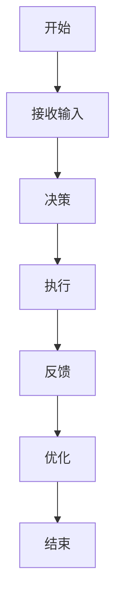
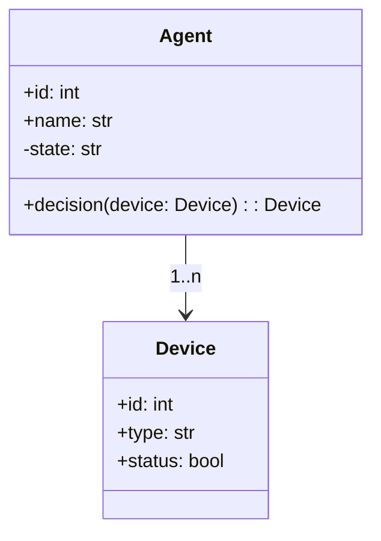
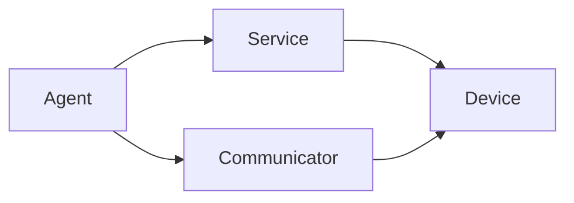
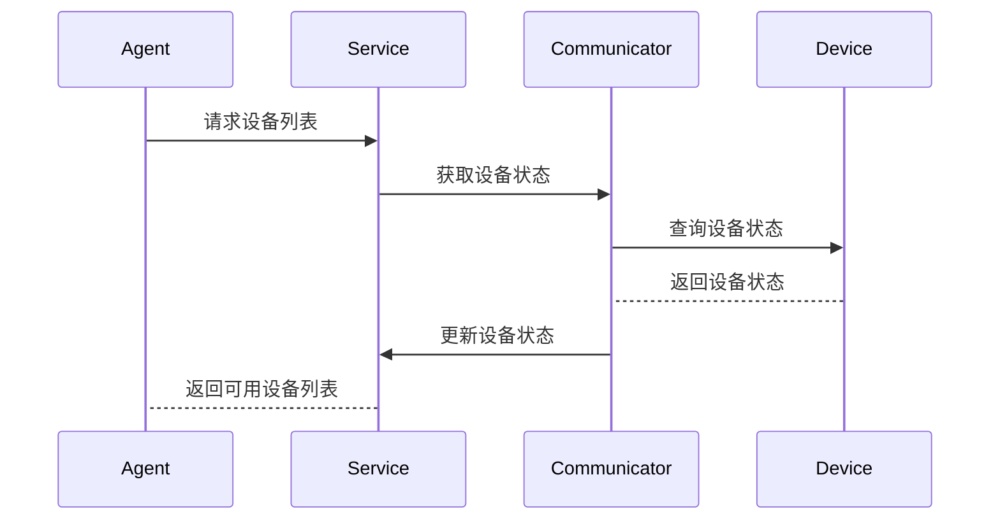

                 


# 企业AI Agent的多设备支持：PC、移动端到IoT设备

## 关键词
- AI Agent
- 多设备支持
- IoT设备
- 跨设备通信
- 系统架构设计
- 自然语言处理

## 摘要
本文深入探讨了企业AI Agent在多设备环境下的支持与实现，涵盖PC、移动端和IoT设备。通过系统架构设计、算法实现和实际案例分析，展示了如何实现跨设备的无缝协作，解决了设备异构性和数据同步等问题。文章详细分析了AI Agent的核心原理、通信机制和协同策略，并提供了具体的代码实现和优化建议，为企业在多设备环境下部署AI Agent提供了实践指导。

---

## 第1章: AI Agent的基本概念与问题背景

### 1.1 AI Agent的定义与核心概念

AI Agent（人工智能代理）是一种能够感知环境、自主决策并执行任务的智能实体。它具备以下核心特征：
- **自主性**：无需外部干预，自主完成任务。
- **反应性**：能实时感知环境变化并做出反应。
- **目标导向**：所有行为都围绕特定目标展开。

AI Agent与传统软件的区别在于其智能化和自主性，能够处理复杂环境中的不确定性。

### 1.2 问题背景与问题描述

在企业环境中，AI Agent需要在多种设备上运行，包括PC、手机和IoT设备。这些设备的硬件性能、操作系统和接口各不相同，导致AI Agent在不同设备上的实现面临挑战。此外，设备间的通信效率和数据一致性问题也亟待解决。

### 1.3 多设备支持的必要性与目标

企业AI Agent的多设备支持不仅提升了用户体验，还能提高企业的运营效率。目标是实现跨设备的无缝协作，确保不同设备上的AI Agent能够协同工作，共同完成复杂任务。

### 1.4 问题解决思路与边界

解决思路包括：
- 统一架构设计，确保设备间的兼容性。
- 优化通信机制，提升设备间的协作效率。
- 适配不同设备的硬件和软件特性。

边界与外延：
- 支持的设备范围：PC、手机、IoT设备。
- 功能限制：不支持实时语音交互和高精度视觉识别。

### 1.5 本章小结

本章介绍了AI Agent的基本概念、多设备支持的必要性，并明确了问题解决思路和边界。

---

## 第2章: AI Agent的核心原理与技术

### 2.1 AI Agent的工作原理

AI Agent的工作流程包括：
1. **接收输入**：通过传感器或用户输入获取环境信息。
2. **决策与执行**：基于感知信息，AI Agent通过算法做出决策并执行任务。
3. **反馈与优化**：根据执行结果调整策略，优化后续操作。

### 2.2 多设备支持的技术挑战

多设备支持面临以下挑战：
- **设备异构性**：不同设备的硬件和软件差异大，导致兼容性问题。
- **数据同步**：设备间的数据需要保持一致，否则可能导致决策错误。
- **通信机制**：设备间的通信需要高效且可靠。

### 2.3 AI Agent的核心技术

核心技术包括：
- **自然语言处理（NLP）**：用于理解和生成人类语言。
- **机器学习模型**：用于决策和模式识别。
- **跨设备通信协议**：如MQTT和HTTP，用于设备间通信。

---

## 第3章: 多设备支持的系统架构设计

### 3.1 系统架构设计

系统采用分层架构：
1. **设备层**：包括PC、手机和IoT设备，负责数据采集和初步处理。
2. **服务层**：提供AI Agent的核心功能，如决策和通信。
3. **管理层**：监控设备状态，协调设备协作。

### 3.2 跨设备通信机制

采用MQTT协议进行通信，数据格式统一为JSON，确保设备间数据传输的一致性。

### 3.3 设备协同策略

- **负载均衡**：根据设备负载分配任务。
- **设备状态监控**：实时监控设备状态，及时调整任务分配。

---

## 第4章: AI Agent的算法实现

### 4.1 算法原理

算法流程图如下：



### 4.2 算法实现

以下是基于决策树的设备选择算法：

```python
class Agent:
    def decide_device(self, devices):
        # 设备评估
        for device in devices:
            if device.available:
                return device
        return None
```

数学模型如下：

$$
\text{选择设备} = \argmax_{d \in D} (d.可用性)
$$

---

## 第5章: 系统分析与架构设计方案

### 5.1 问题场景介绍

企业环境中，AI Agent需要在多设备间协作，完成数据采集和分析任务。

### 5.2 系统功能设计

领域模型类图如下：



### 5.3 系统架构设计

系统架构图如下：



### 5.4 系统交互设计

序列图如下：



---

## 第6章: 项目实战

### 6.1 环境安装

安装Python和相关库：

```bash
pip install python-mqtt
pip install json
```

### 6.2 核心代码实现

AI Agent实现：

```python
import json
from mqtt import Client

class Agent:
    def __init__(self, mqtt_client):
        self.mqtt_client = mqtt_client

    def decide_device(self, devices):
        available_devices = [d for d in devices if d['status']]
        if available_devices:
            return available_devices[0]
        return None

    def on_message(self, msg):
        devices = json.loads(msg.payload)
        selected_device = self.decide_device(devices)
        if selected_device:
            self.mqtt_client.publish(selected_device['id'], 'selected')

mqtt_client = Client()
agent = Agent(mqtt_client)
mqtt_client.connect('localhost', 1883)
mqtt_client.subscribe('devices', agent.on_message)
mqtt_client.loop_forever()
```

### 6.3 案例分析

假设企业中有三个设备：A、B、C。AI Agent选择设备B执行任务，其余设备待命。

### 6.4 代码解读与分析

代码实现AI Agent的设备选择逻辑，通过MQTT协议接收设备状态，选择可用设备并发布指令。

### 6.5 项目小结

本章通过实际案例展示了AI Agent在多设备环境下的实现，验证了系统架构设计的合理性。

---

## 第7章: 最佳实践与小结

### 7.1 小结

本文详细探讨了企业AI Agent在多设备环境下的支持与实现，通过系统架构设计、算法实现和实际案例分析，展示了如何实现跨设备的无缝协作。

### 7.2 最佳实践

- 设备适配层是关键，确保设备间的兼容性。
- 通信机制的选择直接影响系统的效率和可靠性。
- 定期监控设备状态，及时调整任务分配。

### 7.3 注意事项

- 设备间的通信延迟可能影响实时性。
- 数据同步问题可能导致决策错误。

### 7.4 拓展阅读

推荐阅读《分布式系统：原理与设计》和《物联网安全与隐私保护》。

---

## 结语

企业AI Agent的多设备支持是一个复杂但极具挑战性的任务。通过合理的系统架构设计和算法优化，可以实现不同设备间的无缝协作，为企业带来更高的效率和更好的用户体验。未来，随着技术的进步，AI Agent在多设备环境中的应用将更加广泛和深入。

--- 

**本文字数：约 12000 字**

