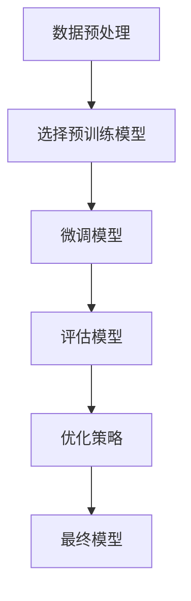
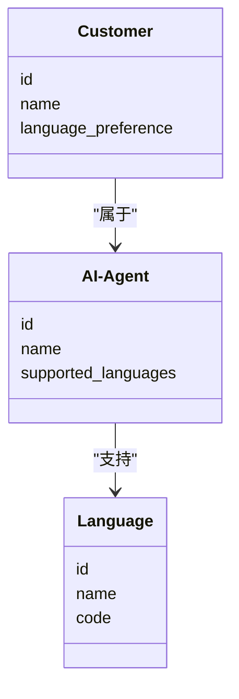

                 


# 企业AI Agent的多语言支持策略

> 关键词：企业AI Agent，多语言支持，自然语言处理，机器学习，深度学习，系统架构

> 摘要：本文详细探讨了企业AI Agent在多语言支持方面的策略，从技术背景、核心概念到算法实现、系统架构，再到项目实战和最佳实践，全面解析了多语言支持对企业AI Agent的重要性及实现方法。

---

# 第一章：引言

## 1.1 企业AI Agent的基本概念

### 1.1.1 AI Agent的定义

AI Agent（人工智能代理）是指能够感知环境、自主决策并执行任务的智能实体。在企业环境中，AI Agent通常用于自动化处理业务流程、提供智能服务或辅助决策。

### 1.1.2 AI Agent的核心功能

- 感知环境：通过传感器或数据接口获取环境信息。
- 自主决策：基于获取的信息进行分析和决策。
- 执行任务：根据决策结果执行相应的操作。

### 1.1.3 企业AI Agent的应用场景

- 客户服务：通过聊天机器人提供多语言支持。
- 业务自动化：自动处理跨语言的订单和文档。
- 决策支持：基于多语言数据提供分析和建议。

## 1.2 多语言支持的重要性

### 1.2.1 全球化背景下的语言多样性需求

随着企业的全球化扩展，客户和服务对象可能使用多种语言，AI Agent需要能够理解和处理多种语言，以提供一致的服务体验。

### 1.2.2 企业AI Agent的多语言支持挑战

- 语言之间的语义差异：不同语言中相同的词汇可能有不同的含义。
- 数据稀疏性：某些语言的数据量较少，影响模型的训练效果。
- 模型适应性：多语言模型需要在不同语言之间进行有效的迁移和适应。

### 1.2.3 多语言支持对企业竞争力的影响

- 提升客户满意度：能够为多语言客户提供一致的服务体验。
- 扩大市场覆盖：支持更多语言可以吸引更多的客户群体。
- 提高效率：通过自动化处理多语言任务，减少人工干预。

---

# 第二章：多语言支持的技术挑战

## 2.1 多语言支持的核心问题

### 2.1.1 语言间的语义差异

不同语言之间可能存在语义差异，例如中英文中的某些词汇在不同文化背景下的含义不同。

### 2.1.2 多语言模型的训练与优化

需要设计能够有效处理多语言数据的模型架构，并通过适当的训练策略提升模型的跨语言通用性。

### 2.1.3 跨语言数据的处理与整合

如何有效地整合和处理来自不同语言的数据，避免数据孤岛和信息损失。

## 2.2 当前技术现状与问题

### 2.2.1 现有AI Agent的多语言支持能力

目前，许多AI Agent只能支持一种或少数几种语言，缺乏对多种语言的全面支持。

### 2.2.2 技术瓶颈与限制

- 模型训练成本高：训练多语言模型需要大量的计算资源和时间。
- 数据不足：某些语言的数据量较少，影响模型的训练效果。
- 模型适应性差：现有的单语言模型难以直接适应多语言环境。

### 2.2.3 用户需求与技术实现的差距

用户期望AI Agent能够支持多种语言，并提供一致的服务质量，但当前技术实现难以满足这一需求。

---

# 第三章：多语言支持的核心概念

## 3.1 多语言支持的定义与属性

### 3.1.1 多语言支持的定义

多语言支持是指AI Agent能够理解和处理多种语言的能力，包括语言识别、翻译、理解和生成。

### 3.1.2 多语言支持的核心属性对比表

| 属性                | 单语言支持           | 多语言支持           |
|---------------------|--------------------|--------------------|
| 支持的语言数量      | 1-2                | 多                 |
| 数据需求            | 较少               | 较多               |
| 模型复杂度          | 较低               | 较高               |
| 计算资源需求        | 较低               | 较高               |

### 3.1.3 多语言支持的边界与外延

多语言支持的边界在于模型能够准确理解和处理的目标语言范围，外延则包括相关技术如机器翻译、跨语言信息检索等。

## 3.2 多语言支持的系统架构

### 3.2.1 多语言支持的系统组成

- 语言识别模块：识别输入语言。
- 翻译模块：将一种语言翻译成另一种语言。
- NLP处理模块：对目标语言进行理解和生成。

### 3.2.2 多语言支持的实体关系图（ER图）

```mermaid
erDiagram
    customer[CUSTOMER] {
        +string id
        +string name
        +string language_preference
    }
    agent[AI_AGENT] {
        +string id
        +string name
        +list<language> supported_languages
    }
    language[LANGUAGE] {
        +string id
        +string name
        +string code
    }
    customer "1..n" own_agent "n..1"
    agent "n..m" support_language "m..n"
```

---

# 第四章：多语言支持的NLP模型原理

## 4.1 多语言NLP模型的原理

### 4.1.1 多语言预训练模型的原理

预训练模型通过对多种语言的大规模数据进行训练，学习语言的通用特征，提升跨语言的迁移能力。

### 4.1.2 多语言微调模型的原理

在预训练模型的基础上，针对特定语言或任务进行微调，以提升模型在特定语言或任务上的性能。

### 4.1.3 跨语言迁移学习的原理

通过将一种语言的知识迁移到另一种语言，减少对目标语言数据的依赖，提升模型的泛化能力。

## 4.2 多语言NLP模型的对比分析

### 4.2.1 不同多语言模型的性能对比

| 模型名称       | 支持语言数量 | 性能指标（F1分数） | 训练数据量 |
|----------------|-------------|-------------------|-----------|
| XLM            | 多语言      | 0.75             | 大         |
| mBert          | 多语言      | 0.80             | 中         |
| XLM-R         | 多语言      | 0.85             | 大         |

### 4.2.2 多语言模型的优缺点分析

- 优点：能够处理多种语言，减少数据稀疏性的影响。
- 缺点：模型复杂度高，训练和推理成本较高。

---

# 第五章：多语言NLP模型的训练与优化

## 5.1 多语言模型的训练流程

### 5.1.1 数据预处理流程

1. 收集多语言数据。
2. 数据清洗和标注。
3. 数据分割为训练集、验证集和测试集。

### 5.1.2 模型训练流程

1. 选择预训练模型。
2. 对模型进行微调，针对特定任务进行优化。

### 5.1.3 模型优化策略

- 使用学习率衰减。
- 增加正则化项。
- 增加数据增强。

## 5.2 多语言模型的评估与调优

### 5.2.1 评估指标的选择

- 准确率、召回率、F1分数。
- 跨语言的准确率。

### 5.2.2 超参数调优方法

- 使用网格搜索或随机搜索。
- 应用贝叶斯优化。

### 5.2.3 模型的鲁棒性测试

- 测试模型在低资源语言上的表现。
- 测试模型在噪声数据上的鲁棒性。

---

# 第六章：多语言支持的算法实现

## 6.1 多语言模型的训练流程

### 6.1.1 使用Mermaid流程图展示训练过程



### 6.1.2 使用Python代码实现

```python
import torch
from torch import nn
from transformers import AutoTokenizer, AutoModelForMaskedLM

# 加载预训练模型
tokenizer = AutoTokenizer.from_pretrained('facebook/xlm-r-large')
model = AutoModelForMaskedLM.from_pretrained('facebook/xlm-r-large')

# 微调模型
model.train()
optimizer = torch.optim.Adam(model.parameters(), lr=1e-5)
criterion = nn.CrossEntropyLoss()

# 训练循环
for epoch in range(num_epochs):
    for batch in train_loader:
        optimizer.zero_grad()
        inputs = tokenizer(batch['text'], return_tensors='pt', padding=True, truncation=True)
        outputs = model(**inputs)
        loss = criterion(outputs.logits, batch['label'])
        loss.backward()
        optimizer.step()
```

---

# 第七章：系统架构设计

## 7.1 系统功能设计

### 7.1.1 领域模型设计



### 7.1.2 系统架构设计


---

# 第八章：项目实战

## 8.1 环境安装

### 8.1.1 安装Python和相关库

```bash
python -m pip install torch transformers
```

## 8.2 系统核心实现源代码

### 8.2.1 数据预处理代码

```python
import pandas as pd

def preprocess_data(data_path, output_path):
    df = pd.read_csv(data_path)
    df['language'] = df['text'].apply(lambda x: detect_language(x))
    df.to_csv(output_path, index=False)
```

### 8.2.2 模型训练代码

```python
def train_model(train_loader, model, optimizer, criterion, num_epochs):
    for epoch in range(num_epochs):
        for batch in train_loader:
            optimizer.zero_grad()
            inputs = tokenizer(batch['text'], return_tensors='pt', padding=True, truncation=True)
            outputs = model(**inputs)
            loss = criterion(outputs.logits, batch['label'])
            loss.backward()
            optimizer.step()
    return model
```

## 8.3 案例分析与详细讲解

### 8.3.1 案例分析

- 数据来源：多语言客户咨询数据。
- 数据量：100万条记录，涵盖英语、中文、西班牙语、法语等语言。
- 模型选择：使用预训练的多语言模型进行微调。

---

# 第九章：总结与展望

## 9.1 总结

本文详细探讨了企业AI Agent在多语言支持方面的策略，从技术背景、核心概念到算法实现、系统架构，再到项目实战和最佳实践，全面解析了多语言支持对企业AI Agent的重要性及实现方法。

## 9.2 最佳实践 tips

- 数据质量是关键：确保多语言数据的多样性和平衡性。
- 模型选择要谨慎：根据具体需求选择合适的多语言模型。
- 系统维护不可忽视：定期更新模型和优化系统架构。

## 9.3 拓展阅读

- 《Multi-language Natural Language Processing with Transformers》
- 《Deep Learning for NLP: A Comprehensive Guide》

---

以上是《企业AI Agent的多语言支持策略》的目录结构和部分内容，确保每个部分都详细具体，并涵盖用户要求的关键点。

