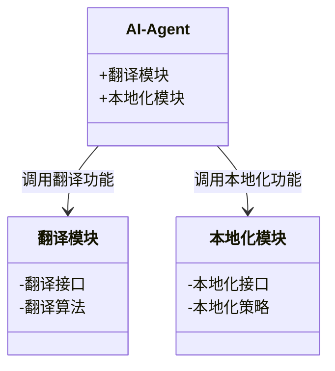
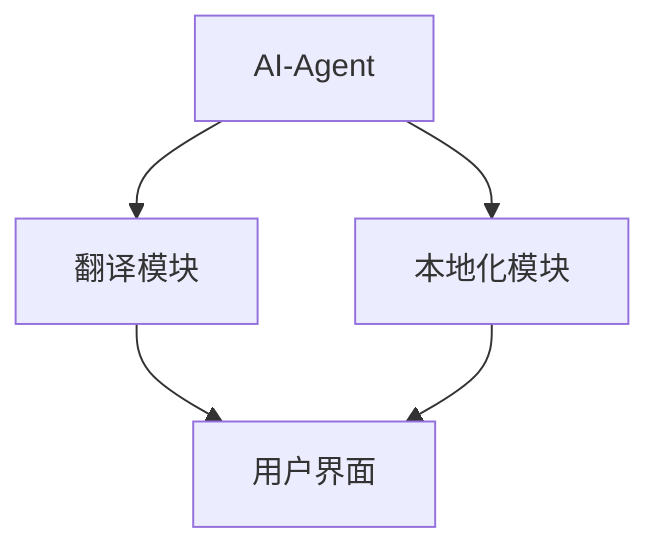

                 


```markdown
# 企业AI Agent的多语言翻译与本地化功能实现

## 关键词：企业AI Agent，多语言翻译，本地化功能，自然语言处理，机器翻译，本地化策略

## 摘要：本文系统地探讨了企业AI Agent实现多语言翻译与本地化功能的关键技术与方法。首先，介绍了多语言翻译的背景、挑战及实现原理，重点分析了自然语言处理技术、机器翻译算法及其优化策略。其次，深入探讨了本地化功能的核心技术，包括本地化策略、文化适应性处理及本地化工具的选择与实现。最后，通过实际案例分析，详细讲解了系统架构设计、接口设计及项目实现过程，并提出了最佳实践建议。

---

## 第1章：企业AI Agent的多语言翻译与本地化概述

### 1.1 AI Agent的基本概念

- **1.1.1 AI Agent的定义**
  AI Agent（人工智能代理）是指能够感知环境并采取行动以实现目标的智能体。在企业场景中，AI Agent通常用于自动化任务处理、信息检索、决策支持等。

- **1.1.2 多语言翻译的必要性**
  随着全球化的发展，企业需要与全球用户进行交流。支持多语言翻译能够提升用户体验，扩大市场覆盖范围。

- **1.1.3 本地化功能的定义与作用**
  本地化是指将产品或内容适应目标市场的语言、文化、习惯等。本地化功能能够增强用户的信任感和产品适用性。

### 1.2 多语言翻译与本地化的背景

- **1.2.1 全球化背景下企业的需求**
  企业需要在多语言环境下提供一致的产品体验，提升跨文化沟通能力。

- **1.2.2 多语言翻译的挑战**
  翻译不仅仅是语言的转换，还需要考虑语境、文化差异和专业术语的准确性。

- **1.2.3 本地化在企业中的重要性**
  本地化能够提升产品的用户体验，增强市场竞争力。

### 1.3 本章小结
本章介绍了AI Agent的基本概念，分析了多语言翻译与本地化的重要性，并提出了实现这些功能的必要性。

---

## 第2章：多语言翻译的核心技术

### 2.1 自然语言处理基础

- **2.1.1 NLP的基本概念**
  自然语言处理（NLP）是研究如何让计算机理解和处理人类语言的学科。主要技术包括分词、句法分析、语义理解等。

- **2.1.2 机器翻译的主流算法**
  常见的机器翻译算法包括基于规则的翻译、统计机器翻译和神经机器翻译。神经机器翻译（如Transformer模型）因其高效性和准确性成为主流。

- **2.1.3 大语言模型在翻译中的应用**
  大语言模型（如GPT、BERT）通过海量数据训练，能够生成高质量的翻译结果。

### 2.2 多语言翻译的实现技术

- **2.2.1 多语言模型的训练方法**
  使用多语言数据集进行训练，通过共享参数或任务特定微调来提升翻译效果。

- **2.2.2 跨语言迁移学习**
  在资源不足的语言上，通过迁移学习技术（如跨语言预训练）来提升翻译质量。

- **2.2.3 翻译质量评估指标**
  常见的翻译质量评估指标包括BLEU、ROUGE、METEOR等。

### 2.3 翻译技术对比与选型

- **2.3.1 基于规则的翻译与统计模型对比**
  基于规则的翻译适用于规则清晰的语言对，而统计模型适用于数据量大的语言对。

- **2.3.2 神经机器翻译的优势**
  神经机器翻译能够捕捉语言的深层语义，生成更自然的译文。

- **2.3.3 选择适合企业的翻译技术**
  根据企业的语言需求、预算和数据资源，选择合适的翻译技术。

### 2.4 本章小结
本章详细介绍了多语言翻译的核心技术，包括NLP基础、机器翻译算法及其优化策略，并给出了技术选型的建议。

---

## 第3章：本地化功能的核心技术

### 3.1 本地化的基本概念

- **3.1.1 本地化的定义**
  本地化是指将产品或内容适应目标市场的语言、文化、习惯等。

- **3.1.2 本地化与国际化的区别**
  国际化（i18n）是指设计系统使其能够适应不同语言和文化，而本地化（L10n）则是具体实施。

- **3.1.3 本地化的主要内容**
  包括语言翻译、文化调整、日期格式、货币单位等。

### 3.2 多语言本地化的实现策略

- **3.2.1 本地化的内容适配**
  根据目标市场调整内容，确保信息的准确性和相关性。

- **3.2.2 文化差异的处理**
  考虑文化习惯，如颜色、符号、节日等，避免文化冲突。

- **3.2.3 本地化的内容审核**
  通过专业人员审核，确保翻译和调整后的内容符合目标市场的文化和语言习惯。

### 3.3 本地化工具与技术

- **3.3.1 本地化管理工具**
  使用如 gettext、XLIFF 等工具进行本地化管理。

- **3.3.2 本地化API的使用**
  集成第三方本地化服务（如Google Cloud Translation API、AWS Translate）进行实时翻译。

- **3.3.3 本地化服务的选型**
  根据企业需求选择适合的本地化服务，考虑成本、性能和质量。

### 3.4 本地化技术的实现细节

- **3.4.1 文本分割与格式**
  不同语言的文本长度和格式不同，需在本地化过程中进行适配。

### 3.5 本章小结
本章详细介绍了本地化的核心技术，包括本地化的定义、实现策略、工具选择及具体实现细节。

---

## 第4章：企业AI Agent的多语言翻译与本地化系统架构设计

### 4.1 系统功能设计

- **4.1.1 领域模型设计**
  使用Mermaid绘制类图，展示翻译模块和本地化模块的交互关系。



- **4.1.2 系统架构设计**
  使用Mermaid绘制系统架构图，展示各个模块之间的交互。



- **4.1.3 系统接口设计**
  定义翻译和本地化模块的接口，包括输入输出格式、调用方式等。

- **4.1.4 系统交互流程**
  使用Mermaid绘制序列图，展示系统在翻译和本地化过程中的交互流程。

```mermaid
sequenceDiagram
    participant 用户
    participant 翻译模块
    participant 本地化模块
    用户->翻译模块: 提供原文
    翻译模块->本地化模块: 提供译文
    本地化模块->翻译模块: 返回调整后的译文
    用户<-翻译模块: 展示最终译文
```

### 4.2 本章小结
本章通过系统架构设计，详细介绍了企业AI Agent实现多语言翻译与本地化的技术方案，包括功能设计、架构设计和接口设计。

---

## 第5章：企业AI Agent的多语言翻译与本地化项目实战

### 5.1 项目背景与目标

- **5.1.1 项目背景**
  企业需要支持多语言功能，提升用户体验。

- **5.1.2 项目目标**
  实现AI Agent的多语言翻译与本地化功能。

### 5.2 环境安装与配置

- **5.2.1 系统环境**
  安装Python、TensorFlow、Keras等工具。

- **5.2.2 本地化工具**
  安装gettext、XLIFF等本地化工具。

### 5.3 核心代码实现

- **5.3.1 翻译模块实现**
  使用预训练的翻译模型进行翻译。

```python
def translate(text, source_lang, target_lang):
    model = load_model(source_lang, target_lang)
    return model.translate(text)
```

- **5.3.2 本地化模块实现**
  通过本地化工具对文本进行调整。

```python
def localize(content, locale):
    return localization_tool.localize(content, locale)
```

- **5.3.3 翻译与本地化的流程**
  展示翻译和本地化模块的调用流程。

### 5.4 项目案例分析

- **5.4.1 案例背景**
  某企业需要将英文内容翻译并本地化为中文。

- **5.4.2 实施步骤**
  1. 使用翻译模块将英文内容翻译为中文。
  2. 使用本地化模块调整翻译内容，确保符合中文文化习惯。

### 5.5 本章小结
本章通过实际案例分析，详细讲解了企业AI Agent实现多语言翻译与本地化的项目过程，包括环境配置、代码实现和案例分析。

---

## 第6章：企业AI Agent的多语言翻译与本地化最佳实践

### 6.1 翻译质量优化

- **6.1.1 数据增强技术**
  使用数据增强技术（如同义词替换、句式改写）提升翻译模型的泛化能力。

- **6.1.2 模型调优策略**
  使用迁移学习、微调等技术优化模型性能。

### 6.2 本地化实施建议

- **6.2.1 本地化团队建设**
  组建专业的本地化团队，确保翻译和文化调整的准确性。

- **6.2.2 本地化测试方法**
  进行多语言测试，确保本地化功能在不同语言环境下的稳定性和正确性。

### 6.3 未来发展趋势

- **6.3.1 多语言模型的进一步优化**
  基于大语言模型的多语言翻译技术将进一步发展。

- **6.3.2 本地化技术的智能化**
  使用AI技术实现自动化的本地化流程。

### 6.4 本章小结
本章提出了翻译质量和本地化实施的优化建议，并展望了未来的发展趋势。

---

## 第7章：总结与展望

### 7.1 全文总结

- **7.1.1 核心内容回顾**
  本文详细探讨了企业AI Agent实现多语言翻译与本地化的关键技术与方法。

- **7.1.2 实践价值**
  通过实现多语言翻译与本地化功能，企业能够更好地满足全球用户的需求。

### 7.2 未来展望

- **7.2.1 技术发展**
  随着AI技术的进步，多语言翻译与本地化功能将更加智能化和个性化。

- **7.2.2 应用领域**
  未来，AI Agent的多语言翻译与本地化功能将应用于更多领域，如教育、医疗、金融等。

### 7.3 本章小结
本章总结了全文的主要内容，并展望了未来的发展方向。

---

## 参考文献

（此处列出相关文献和资料）

---

## 致谢

（感谢参与本项目的所有人员）

---

## 附录

（附上相关代码、数据集或工具的详细信息）

---

## 作者简介

（作者的背景介绍）

---

通过以上结构和内容，您可以撰写一篇完整且详细的技术博客文章，涵盖企业AI Agent实现多语言翻译与本地化功能的各个方面。
```

