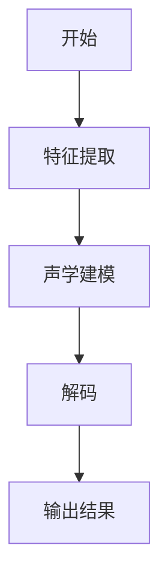
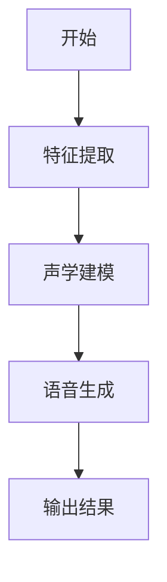
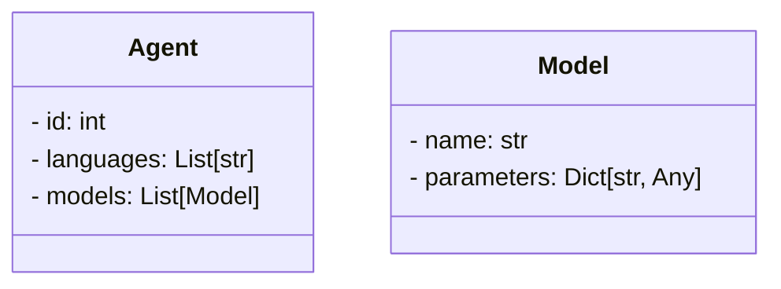
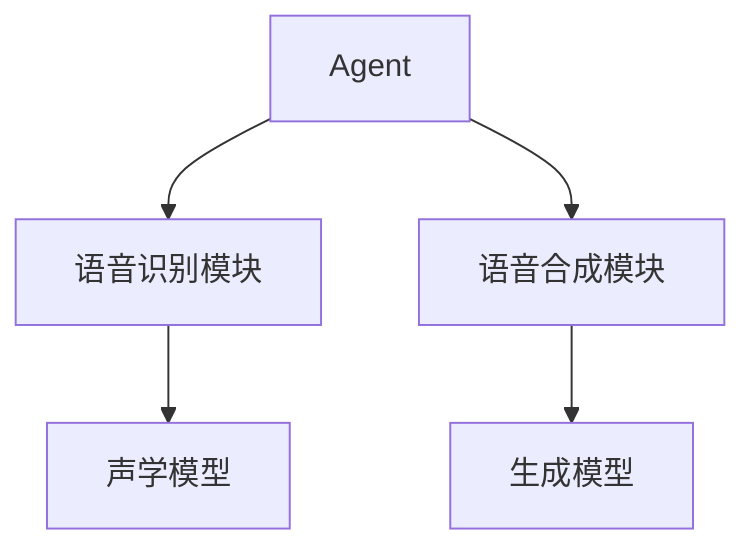
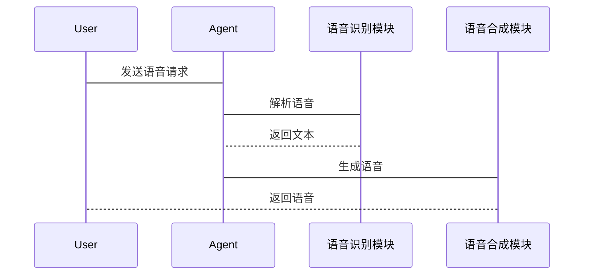

                 


# 企业AI Agent的多语言语音识别与合成技术

> 关键词：AI Agent，多语言语音识别，语音合成，企业应用，技术实现

> 摘要：本文详细探讨了企业AI Agent在多语言语音识别与合成技术中的应用，分析了技术原理、实现方法、系统架构设计以及实际应用案例。通过本文，读者可以全面了解如何在企业环境中实现高效的多语言语音交互系统。

---

# 第1章: 背景介绍

## 1.1 问题背景与描述

### 1.1.1 企业AI Agent的定义与核心概念
企业AI Agent是一种能够理解、处理和执行多种任务的智能实体，通常集成在企业系统中，以提供自动化服务。其核心功能包括信息检索、任务执行、用户交互等。在多语言环境下，AI Agent需要能够理解并生成多种语言的语音，以满足国际化企业的需求。

### 1.1.2 多语言语音识别与合成技术的必要性
随着全球化的发展，企业需要与来自不同语言背景的用户进行交互。传统的单语言语音识别与合成技术已无法满足需求，因此多语言支持成为必要。通过多语言语音技术，企业可以提升用户体验，扩大市场覆盖范围。

### 1.1.3 当前技术发展现状与挑战
目前，多语言语音识别与合成技术在深度学习的推动下取得了显著进展。然而，不同语言之间的发音、语法差异给技术实现带来了挑战。此外，小语种数据的稀缺性也影响了模型的训练效果。

## 1.2 核心概念与问题解决

### 1.2.1 AI Agent在企业中的角色与功能
AI Agent在企业中充当智能助手的角色，能够处理用户请求、执行任务、提供信息等。其核心功能包括语音交互、意图识别、信息检索等。

### 1.2.2 多语言语音识别与合成技术的实现目标
通过多语言语音识别与合成技术，AI Agent可以实现以下目标：
- 支持多种语言的语音输入识别。
- 支持多种语言的语音输出合成。
- 提供高精度的语音识别和合成效果。

### 1.2.3 技术边界与外延分析
多语言语音识别与合成技术的边界主要在于语言的多样性支持和模型的泛化能力。技术的外延则涉及自然语言处理、语音信号处理等多个领域。

## 1.3 核心要素与概念结构

### 1.3.1 语音识别与合成的核心要素
语音识别的核心要素包括语音信号、声学模型和语言模型。语音合成的核心要素包括文本、声学特征和语音生成模型。

### 1.3.2 AI Agent与多语言技术的结合方式
AI Agent通过集成多语言语音识别与合成模块，实现对多种语言的交互支持。具体结合方式包括模块化设计、多模型管理等。

### 1.3.3 技术架构与实现流程
技术架构通常包括前端语音采集、后端模型处理和结果反馈三个部分。实现流程包括数据预处理、模型训练、系统集成等。

## 1.4 本章小结

### 1.4.1 核心概念回顾
- AI Agent的定义与核心功能。
- 多语言语音识别与合成技术的必要性。

### 1.4.2 问题解决思路总结
- 通过多语言技术支持国际化需求。
- 通过模块化设计提升系统灵活性。

### 1.4.3 下文展开方向
- 深入探讨语音识别与合成的技术原理。
- 分析系统架构与实现方法。

---

# 第2章: 核心概念与联系

## 2.1 语音识别与合成技术原理

### 2.1.1 语音识别的基本原理
语音识别通过将语音信号转换为文本或命令，实现人机交互。其基本原理包括特征提取、声学建模和解码。

### 2.1.2 语音合成的基本原理
语音合成通过将文本转换为语音信号，实现语音输出。其基本原理包括特征提取、声学建模和语音生成。

### 2.1.3 两种技术的异同对比

| 技术方面 | 语音识别 | 语音合成 |
|----------|----------|----------|
| 输入     | 语音信号 | 文本      |
| 输出     | 文本/命令 | 语音信号 |
| 关键技术 | 声学建模  | 语音生成 |

## 2.2 AI Agent与多语言技术的结合

### 2.2.1 AI Agent的多语言能力需求
AI Agent需要支持多种语言的语音输入和输出，以满足不同用户的需求。

### 2.2.2 多语言语音识别与合成的技术挑战
- 多语言模型的训练需要大量多语言数据。
- 不同语言之间的发音和语法差异影响模型效果。

### 2.2.3 技术实现的可行性分析
通过预训练模型和跨语言迁移学习，可以提升多语言语音技术的可行性。

## 2.3 技术特点与对比分析

### 2.3.1 语音识别技术特点
- 基于深度学习的模型具有较高的准确率。
- 需要大量标注数据进行训练。

### 2.3.2 语音合成技术特点
- 基于生成模型可以实现高质量语音合成。
- 对计算资源需求较高。

### 2.3.3 两种技术的对比分析
语音识别注重准确性，语音合成注重自然度。两者在模型设计和优化目标上有所不同。

## 2.4 核心概念ER实体关系图

```mermaid
er
actor(Agent, [多语言语音识别与合成技术])
```

## 2.5 本章小结

### 2.5.1 核心概念总结
- 语音识别与合成的技术原理。
- AI Agent与多语言技术的结合方式。

### 2.5.2 技术特点与对比总结
- 语音识别注重准确性。
- 语音合成注重自然度。

---

# 第3章: 算法原理讲解

## 3.1 语音识别算法原理

### 3.1.1 基于深度学习的语音识别流程


### 3.1.2 声学模型与语言模型的作用
声学模型负责将语音信号转换为概率分布，语言模型负责生成合理的文本序列。

### 3.1.3 解码过程的详细步骤
解码过程包括特征提取、声学建模和解码输出。

## 3.2 语音合成算法原理

### 3.2.1 基于深度学习的语音合成流程


### 3.2.2 声音特征提取与生成
特征提取包括梅尔频率倒谱（MFCC）提取，语音生成基于生成对抗网络（GAN）或变自编码器（VAE）。

### 3.2.3 合成过程的优化方法
通过端到端训练和损失函数优化，提升语音合成的质量。

## 3.3 算法流程图

### 语音识别流程图


### 语音合成流程图


## 3.4 核心算法实现代码

### 语音识别代码示例
```python
def feature_extraction(audio_signal):
    # 特征提取代码
    pass

def acoustic_model(features):
    # 声学建模代码
    pass

def decoding(model_output):
    # 解码代码
    pass
```

### 语音合成代码示例
```python
def text_to_speech(text):
    # 文本转语音代码
    pass
```

## 3.5 数学模型与公式

### 声学模型的概率公式
$$ P(x|θ) = \text{声学模型的概率分布} $$

### 语言模型的N-gram公式
$$ P(w|previous\ words) = \prod_{i=1}^{n} P(w_i|previous\ words) $$

---

# 第4章: 系统分析与架构设计

## 4.1 问题场景介绍

### 4.1.1 企业AI Agent的应用场景
AI Agent在企业中的应用场景包括客服系统、内部助手、用户支持等。

### 4.1.2 多语言语音技术的需求场景
多语言语音技术在国际化企业中用于支持多语言用户交互。

## 4.2 系统功能设计

### 4.2.1 领域模型设计


### 4.2.2 系统架构设计


### 4.2.3 接口设计与交互流程


## 4.3 本章小结

### 4.3.1 系统架构总结
- Agent作为核心实体，集成语音识别与合成模块。
- 模块化设计提升系统的灵活性和可维护性。

### 4.3.2 交互流程总结
- 用户发起语音请求。
- Agent解析并生成响应。
- 通过语音合成模块返回结果。

---

# 第5章: 项目实战

## 5.1 环境安装与配置

### 5.1.1 开发环境搭建
- 安装Python、深度学习框架（如TensorFlow、PyTorch）。
- 安装语音处理库（如Librosa、Soundfile）。

### 5.1.2 数据集准备
- 收集多语言语音数据。
- 数据预处理与标注。

## 5.2 系统核心实现

### 5.2.1 语音识别模块实现
```python
import librosa

def feature_extraction(audio_path):
    audio, sr = librosa.load(audio_path, sr=None)
    mfccs = librosa.feature.mfcc(y=audio, sr=sr)
    return mfccs
```

### 5.2.2 语音合成模块实现
```python
import tensorflow as tf
from tensorflow import keras

def build_model():
    model = keras.Sequential([
        keras.layers.Dense(128, activation='relu'),
        keras.layers.Dense(1, activation='sigmoid')
    ])
    return model
```

## 5.3 案例分析与优化

### 5.3.1 案例分析
- 企业客服系统中的多语言交互。
- 优化语音识别与合成的准确率和自然度。

### 5.3.2 模型优化
- 使用迁移学习提升小语种模型性能。
- 通过数据增强技术增加训练数据。

## 5.4 项目小结

### 5.4.1 实践总结
- 系统实现的关键步骤。
- 遇到的技术难点与解决方案。

### 5.4.2 经验分享
- 数据预处理的重要性。
- 模型优化的具体方法。

---

# 第6章: 总结与扩展

## 6.1 最佳实践 tips

### 6.1.1 技术实现 tips
- 优先选择预训练模型。
- 通过数据增强和迁移学习提升模型性能。

### 6.1.2 系统设计 tips
- 模块化设计提升系统的灵活性。
- 通过日志和监控工具优化系统性能。

## 6.2 小结

### 6.2.1 核心内容回顾
- 企业AI Agent的定义与作用。
- 多语言语音识别与合成技术的实现方法。

### 6.2.2 实践价值总结
- 提升企业智能化水平。
- 支持国际化业务发展。

## 6.3 注意事项

### 6.3.1 技术实现注意事项
- 确保数据质量和多样性。
- 注意模型的泛化能力和适应性。

### 6.3.2 系统维护注意事项
- 定期更新模型和优化算法。
- 及时处理系统异常和错误。

## 6.4 拓展阅读

### 6.4.1 推荐技术书籍
- 《深度学习》
- 《语音信号处理》

### 6.4.2 推荐工具与库
- TensorFlow、PyTorch
- Librosa、Soundfile

---

# 附录

## 附录A: 术语解释

### 术语1: AI Agent
AI Agent是一种能够感知环境、执行任务的智能实体。

### 术语2: 多语言语音识别
多语言语音识别是指支持多种语言的语音识别技术。

## 附录B: 参考文献

1. 书籍：《深度学习》
2. 论文：《基于深度学习的语音识别研究》
3. 网站：官方文档和开发者指南

---

# 结束语

通过本文的详细讲解，读者可以全面了解企业AI Agent的多语言语音识别与合成技术的实现方法和应用价值。未来，随着技术的不断发展，多语言语音技术将在企业智能化转型中发挥越来越重要的作用。

